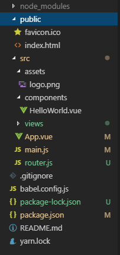
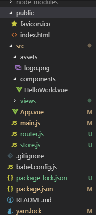
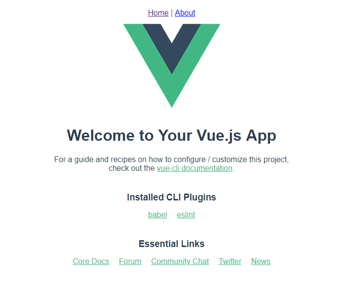
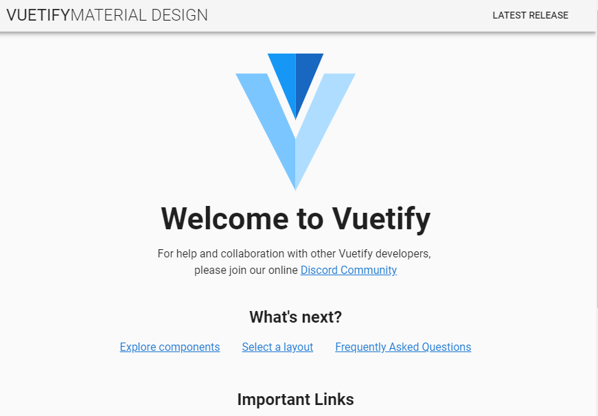
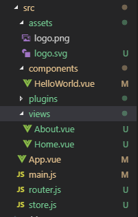
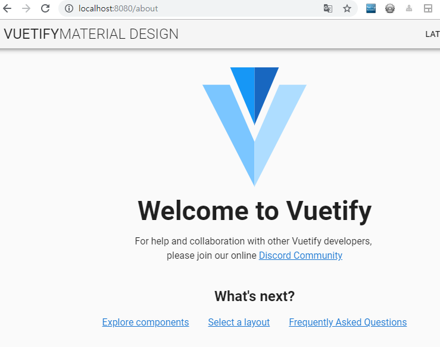
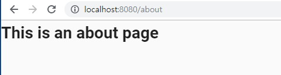

> 이 포스트에서는 Vue CLI을 이용한 개발 환경 구축을 목표로 한다.

> Vue CLI는 기본적으로 vue만 포함한다. vue를 더욱 잘 이용하기 위해 vue router와 vuex, vue계의 부트스트랩과 같은 vuetify를 사용해본다.

> 만약, vue cli로 프로젝트 만들기를 하지 않았다면, [이전 글](<https://sweetlog.netlify.com/Vue/vue-cli/>)을 참고할 수 있다.


# Vue Router

[Vue Router 홈페이지](<https://router.vuejs.org/kr/installation.html>)


## Vue Router 란? 

Vue.js의 공식 라우터.

Vue.js를 사용한 싱글 페이지 앱을 쉽게 만들 수 있도록 Vue.js의 코어와 긴밀히 통합.

> 장고로 따지자면 urls.py의 역할을 하는 부분이라고 생각된다.


## Vue Router설치

vue router의 설치는 비교적 간단하다.

```bash
vue add router
```

cmd에 입력한 후, y 한번만 입력하면 설치가 완료된다.




# Vuex

[Vuex 홈페이지](<https://vuex.vuejs.org/kr/>)


## Vuex 란? 

Vue.js 애플리케이션에 대한 **상태 관리 패턴 + 라이브러리**. 애플리케이션의 모든 컴포넌트에 대한 중앙 집중식 저장소 역할을 하며, 예측 가능한 방식으로 상태를 변경할 수 있다.


## Vuex 설치

```bash
vue add vuex
```

cmd에 입력만 하면 설치가 완료된다.




위의 두 플러그인을 설치한 후, `npm run serve` 명령어로 서버를 켜면 다음과 같은 화면이 나타난다.




# Vuetify

[Vuetify 홈페이지](<https://vuetifyjs.com/ko/>)


## Vuetify 란?

Vue 생태계에서 가장 활동적이며 다양한, 완벽한 기능을 갖춘 개발 프레임 워크이다. 쉽게 말해 **vue에서 사용할 수 있는 용이한 UI toolkit**이라고 할 수 있다.

> css에서 사용할 수 있는 부트스트랩과 비슷하다고 생각한다.


## Vuetify 설치

```bash
vue add vuetify
```

cmd에 입력하면 설치 패키지가 진행되며, 

```bash
$ ? Choose a preset: (Use arrow keys)
$ > Default (recommended)
$   Prototype (rapid development)
$   Configure (advanced)
```

다음과 같은 선택지가 주어졌을 때 사용자의 취향에 따라 선택해주면 된다. 여기서는 default 값을 이용하기로 했다.


설치가 끝난 후 서버를 켜면 다음과 같은 화면으로 변하게 된다.




사용을 용이하게 하기 위해 `main.js`에 import를 해준다.

```js
import Vue from 'vue'
import Vuetify from 'vuetify'

Vue.use(Vuetify)
new Vue({
  router,
  store,
  render: h => h(App)
}).$mount('#app')

```

두번째 줄과 네번째 줄을 자리에 각각 위와 아래에 무엇이 들어갔는지 확인하며 잘 넣어준다.<br>2번째 줄은 `import Vue from 'vue'` 아랫줄에, 4번째 즐은 `new Vue({...})` 윗줄에 넣어준다.


# 기본 골격 확인하기



`main.js`

```js
import Vue from 'vue'
import Vuetify from 'vuetify'

import './plugins/vuetify'
import App from './App.vue'
import router from './router'
import store from './store'

Vue.config.productionTip = false

Vue.use(Vuetify)

new Vue({
  router,
  store,
  render: h => h(App)
}).$mount('#app')

```

우리가 사용할 app은 App.vue 파일을 가져와서 사용한다. 하지만 vuetify를 설치하며 `App.vue` 파일에 변경이 있기 때문에 필요 없는 부분을 삭제해주어야 한다. 

왜?<br>=>

`/about` 페이지로 이동했음에도 불구하고 vuetify로 만들어진 한 페이지만 반복해서 보인다. 


`App.vue`

```js
<template>
  <v-app>
    <router-view></router-view>
  </v-app>
</template>

<script>
export default {
  name: 'App',
  data () {
    return {
      //
    }
  }
}
</script>

```

다음과 같이 수정한 후, 다시 `/about` 페이지로 이동하면 다시 about 페이지를 잘 볼 수 있다.




`src/router.js`

```js
import Vue from 'vue'
import Router from 'vue-router'
import Home from './views/Home.vue'

Vue.use(Router)

export default new Router({
  mode: 'history',
  base: process.env.BASE_URL,
  routes: [
    {
      path: '/',
      name: 'home',
      component: Home
    },
    {
      path: '/about',
      name: 'about',
      // route level code-splitting
      // this generates a separate chunk (about.[hash].js) for this route
      // which is lazy-loaded when the route is visited.
      component: () => import(/* webpackChunkName: "about" */ './views/About.vue')
    }
  ]
})

```

router를 보면 하나의 app eliment에 동작될 수 있는 주소와 각각의 view가 component로 적혀있는것을 볼 수 있다. <br>여기에선 root 주소에 Home이라는 component가 view로 사용되는것을 볼 수 있다.


`Home.vue`

```js
<template>
  <HelloWorld />
</template>

<script>
  import HelloWorld from '../components/HelloWorld'

  export default {
    components: {
      HelloWorld
    }
  }
</script>

```

+ template 태그 안에는 하나의 태그밖에 들어가지 못한다.<br>=> div나 v-container와 같은 태그로 묶어서 담아야 한다.
+ 특정 위치에 components를 넣기 위해서는 `components/`아래에 원하는 요소를 넣어 태그형식으로 사용한다.


> 다음과 같은 방법으로 기초를 코드를 만든다면, 얼마든지 다양하게 꾸밀 수 있을것이라고 생각된다.


### Ref

[Vue CLI 3 사용법](<https://www.daleseo.com/vue-cli3/>)