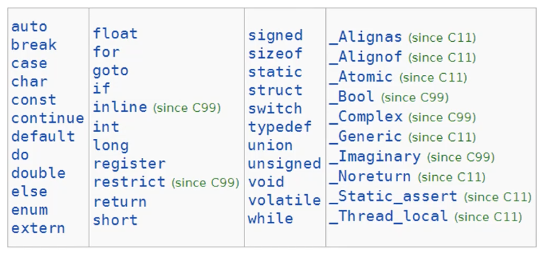
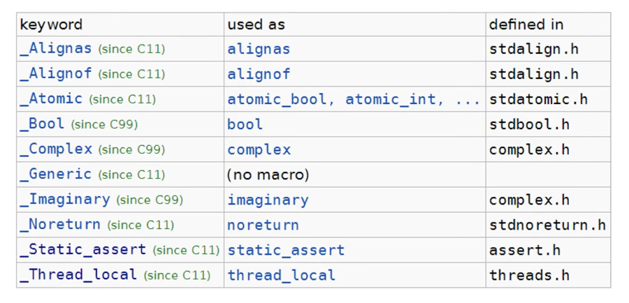

# 따배씨 - 따라하며 배우는 C언어

### 2강 C언어를 소개합니다

##### 2.1 C의 해부학

* C언의 기본 구성요소는 함수

  * Input -> Function -> Output

* 예시

  ```c
  #include <stdio.h>
  
  int main(void){
    int a;
    int b;
    int c;
    
    a = 1;
    b = 2;
    c = a+b;
    
    printf("Result is %i", c);
    
    return 0;
  }
  ```

  * 입력: void
  * 함수: main
  * 출력: int


##### 2.2 C 프로그램 훑어보기

* #include <stdio.h> - 전처리기 (Preprocessor instruction)
  * Compile 하기 전에 처리 되는 부분
* int main(void)
  * main 함수 정의 시작
* {}
  * 영역(Scope)의 시작과 끝
* int a;
  * 변수 선언(variable declaration)
* a = 1;
  * 변수 값 대입 (assignment)
* c = a+b;
  * 변수에 연산 대입
* printf()
  * 함수 호출 (call or invoke)
* return 0;
  * 결과 값을 반환 (value return)


##### 2.3 변수 variable 가 편리한 이유

* 값 value
  * 1+2 = 3
* 변수 variable
  * x + y = z
* CPU / Memory
  * CPU - 연산
  * Memory - 주소에 값을 저장
* 프로그램 작성 시, 메모리 주소를 직접 사용하는것 대신 변수를 이용


##### 2.4 자료형이 필요한 이유

* CPU가 연산을 위해 메모리로부터 데이터를 가져 올 때, 2진수로 이루어진 덩어리를 받아옴
  * 데이터에 형태에 대해 CPU에 알려주는 것이 필요
* 자료형의 크기/저장할 범위에 따라 메모리 공간의 크기를 다르게 할당
  * int
  * short
  * char
  * double
  * float
  * etc...


##### 2.5 변수를 선언 declaration 하는 방법

* 자료형+변수이름+;
  * int x; - 선언(declaration)
* x = 1;
  * "1 이라는 값을 x 가 사용하고 있는 메모리에 값으로 대입한다"
  * 대입(assignment)


##### 2.6 printf() 함수의 기본적인 사용법

* 입력 -> printf(...) -> 출력

```c
int main(){
  printf("The truth is ... I am Iroman.");
  
  return 0;
}
```

* Error 발생
  * Implicitly declaring library function 'printf' with type 'int (const char *, ...)'
  * 전처리기 가 필요


```c
#include <stdio.h>

int main(){
  printf("The truth is ... I am Iroman.");
  
  return 0;
}
```

* 출력
  * The truth is ... I am Iroman.


* printf: print formatted
  * printf("...", ...)
  * 줄바꿈: \ n
  * 따움표(""): \ "
  * 알람소리: \ a


```c
#include <stdio.h>

int main(){
  int x, y, z;
  
  x = 1;
  y = 4;
  
  z = x + y;
  
  printf("The answer is 1+4");
  // 1+4는 컴퓨터 입장에서 문자
  
  printf("The answer is %i", 7);
 	printf("The answer is %i", 1+4);
  // printf 함수의 인트형의 출력 format 은 %i와 그 값으로 이루어짐
  
  
  return 0;
}
```


##### 2.7 주석 다는 방법

* ```c
  /*
  여러줄 주석 / 블럭 주석
  */
  ```

* ```c
    // 한 줄 주석
  ```


##### 2.8 키워드와 예약어

* C keyword: C 언어에서 사용하는 단어들

  
  * 변수나 함수 이름에 예약어를 사용하면 안됨
  * since C99 / C11: C99 / C11 등의 표준 이후로 정의
  * 예약어: _(언더바) 로 시작하는 단어


* 예약어

  
  * 해당하는 Header include 후 예약어로 사용 가능
    * include 하지 않으면 사용 가능 하나, 대부분의 경우 사용하지 않는것을 권장


##### 2.9 함수 만들기

```c
#include <stdio.h>
// stdio.h - 표준 입출력 Head

int main(){
    printf("Hello, world!\n");
    printf("Hello, world!\n");
    printf("Hello, world!\n");
    printf("Hello, world!\n");
    printf("Hello, world!\n");
    
    return 0;
}
```

* 반복되는 동작을 함수로 호출하여 간단히 나타냄


```c
void say_hello(void){
    printf("Hello, world!\n");
    
    //return;
}
```

* say_hello 함수
* return 타입이 void 인 함수는 return을 생략 할 수 있음


```c
#include <stdio.h>
// stdio.h - 표준 입출력 Head

void say_hello(void){
    printf("Hello, world!\n");
    
    return;
}

int main(){
    say_hello();
    say_hello();
    say_hello();
    say_hello();
    say_hello();
    say_hello();
    
    return 0;
}
```

* say_hello 를 호출하여 같은 결과를 만듬

* 변수나 함수를 호출 하기 전에 함수가 선언이 되어있어야 함

  * 변수

    * int i; 선언
    * i = 0; 초기화
    * int j = 1; 선언+초기화

  * 함수

    * void say_hello(void); 선언

    * void say_hello(void){ ... } 정의

    * 함수 정의를 함수를 사용하기 전에 작성

      ```c
      #include <stdio.h>
      void say_hello(void){
          printf("Hello, world!\n");
      }
      
      int main(){
        say_hello();
        
        return 0;
      }
      ```

    * 함수 선언을 먼저 한 뒤 정의 작성

      ```c
      #include <stdio.h>
      
      void say_hello(void); // prototyping, function declaration
      
      int main(){
        say_hello();
        
        return 0;
      }
      
      void say_hello(void) // function definition
      {
          printf("Hello, world!\n");
      }
      ```

      * 선언만 되어 있어도 함수 호출 가능
      * compile 이 끝난 뒤 linking 과정에서 호출된 함수를 사용 가능하도록 연결


##### 2.10 디버거 사용법

##### 2.11 문법 오류와 문맥 오류

* 문법 오류 - Syntax Error
  * 개발환경이나 컴파일러에서 알려주기 때문에 비교적 바로 잡을 수 있음
* 문맥 오류 - Semantic Error
  * 논리적 오류이기 때문에, 오류를 잡는게 쉽지 않음


##### 2.12 읽기 좋은 코드를 만드는 요령

* 좋은 프로그래머가 된다는 것은 다른사람이 봤을때에도 읽기 좋은 코드를 작성 하는것
  * 가독성


```c
#include <stdio.h>

void my_func(){ // do something
  																}

int main(){ int x = 0; y = 1;
          
int z = 0;
z = x + y;return 0;
}
```

* 가독성이 떨어지는 코드


```c
#include <stdio.h>

void my_func(){
  // do something
}

int main(){
  int x = 0, y = 1;
  int z = 0;
  
	z = x + y;
  
  return 0;
}
```

* 가독성을 고려해 수정

