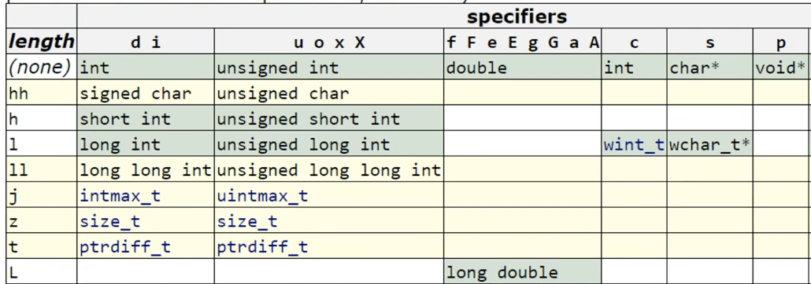

# 따배씨 - 따라하며 배우는 C언어

### 4강 문자열과 형식 맞춘 입출력

##### 4.1 문자열 입출력 하기

```c
#include <stdio.h>

int main(){
    char fruit_name; // stores only one character.
    
    printf("What is your favorite fruit?\n");
    scanf("%c", &fruit_name); // apple
    
    printf("You like %c!\n", fruit_name);
  // You like a!
    
    return 0;
}
```

* 출력결과 한 글자만 나옴
  * char 형은 한글자만 저장되는 메모리가 할당되기 때문
  * 배열을 이용하여 저장공간을 확보


```c
#include <stdio.h>

int main(){
    char fruit_name[40]; // stores only one character.
    
    printf("What is your favorite fruit?\n");
    scanf("%s", fruit_name);
    
    printf("You like %c!\n", fruit_name);
    
    return 0;
}
```

* char fruit_name[40];
  * char type의 저장공간 40개를 확보
  *  40개의 메모리 공간을 대표하는 주소값 한가지만 할당되는 형식
    * fruit_name[40] 자체가 배열을 대표하는 주소값이 됨
* scanf("%s", fruit_name);
  * string 의 출력 형식자는 %s
  * fruit_name 변수 자체가 주소값이 되기 때문에 & 를 사용하지 않아도 됨


##### 4.2 sizeof 연산자

```c
#include <stdio.h>

int main(){
    /* 1. sizeof basic types */
    
    int a = 0;
    unsigned int int_size1 = sizeof a;
    unsigned int int_size2 = sizeof(int);
    unsigned int int_size3 = sizeof(a);
//    함수의 형태로 사용되나 연산자
    
    size_t int_size4 = sizeof(a);
    size_t float_size = sizeof(float);
    
    printf("Size of int type is %u bytes.\n", int_size1);
    printf("Size of int type is %zu bytes.\n", int_size4);
    printf("Size of int type is %zu bytes.\n", float_size);
//    %zu: size_t 에 대응하는 형식 지정자
    
    
    return 0;
}
```

* sizeof 의 표기
  * sizeof a == sizeof(int) == sizeof(a);
* size_t
  * unsigned int 이지만, 운영체제 상에서 가능한 오브젝트의 최대 크기를 저장하도록 할당
    * 32bit 운영체제에서는 32bit unsigned integer, 64bit 에서는 64bit unsigned integer
    * unsigned int 의 경우에는 64bit 운영체제라도 32bit unsigned integer 일 수도 있다는점이 차이
  * %zu: size_t 에 대응하는 형식 지정자


```c
#include <stdio.h>
#include <stdlib.h> // malloc() - memory allocation

int main(){
    /* 2. sizeof arrays */
    
    int int_arr[30];
    
    int* int_ptr = NULL; 
    int_ptr = (int*)malloc(sizeof(int)*30);
    
    printf("Size of array = %zu bytes\n", sizeof(int_arr));

    printf("Size of pointer = %zu bytes\n", sizeof(int_ptr));
 
    
    return 0;
}
```

* ```c
  int* int_ptr = NULL
  ```

  * 포인터를 사용하여 주소값을 저장할수 있는 공간 생성

* ```c
  int_ptr = (int*)malloc(sizeof(int) * 30);
  ```

  * 30개의 정수를 저장 할 수 있는 배열 (메모리 공간) 을 요청
  * 대표하는 메모리 주소(첫번째 주소)를 int_ptr 에 저장

* ```c
  printf("Size of array = %zu bytes\n", sizeof(int_arr));
  ```

  * 정수 30개가 저장될 배열의 메모리 크기인 120 bytes 가 출력됨
    * int_arr[30]의 경우 실제 120byte의 공간을 할당 받음
    * int_arr 이 변수로 사용될 때에만 주소값 형태로 바뀌어 사용된다고 해석 됨
    * 복잡하게 생각할 것 없이 주소값이라고 생각하면 편함

* ```c
  printf("Size of pointer = %zu bytes\n", sizeof(int_ptr));
  ```

  * 배열의 대표 주소값(정수) 이 저장될 공간인 8byte 출력

* int int_arr[30] 선언과 malloc()의 차이

  * int int_arr[30]: 컴파일 되는 120byte를 할당
  * malloc(): 런타임에서 결정됨


```c
#include <stdio.h>

int main(){
    /* 3. sizeof character array */
  
    char c = 'a';
    char string[10];
    
    size_t char_size = sizeof(char);
    size_t str_size = sizeof(string);
    
    printf("Size of char = %zu bytes\n", char_size);	// 1 byte
  
    printf("Size of string = %zu bytes\n", str_size);	// 10 byte
    
    return 0;
}

```

* ```c
  char string[10];
  ```

  * maximally 9 character + '/0' (null character)
  * 저장공간의 마지막에 null character 하나를 저장하여야 하기 때문에 공간 하나를 사용하지 못함


```c
#include <stdio.h>

struct Mystruct
{
    int i;
    float f;
};

int main(){
    /* 4. sizeof structure */
    
    printf("Size of structure = %zu bytes\n", sizeof(struct Mystruct));
    
    return 0;
}
```

* struct(구조체) 의 경우 사용한 자료형의 메모리 합으로 할당 됨


##### 4.3 문자열이 메모리에 저장되는 구조

* 문자의 마지막을 표현하기 위해 문자열의 마지막에 '\0' - ASCII Code NULL 이 저장됨


```c
#include <stdio.h>

int main()
{
    int a = 1;
    int int_arr[10] = {0, 1, 2, 3, 4, 5, 6, 7, 8, 9};
    
    printf("%i %i %i\n", int_arr[0], int_arr[1], int_arr[9]);
    printf("%i\n", int_arr[10]);
  
//    printf("%i\n", int_arr[10000]);
  
    return 0;
}
```

* ```c
  printf("%i\n", int_arr[10]);
  // 1164378127
  ```

  * 배열의 범위 (0~9) 를 넘어간 위치이기 때문에, 임의의 숫자가 할당 되어 있음을 확인

* ```c
  printf("%i\n", int_arr[10000]);
  // Error 발생: EXC_BAD_ACCESS
  ```

  * 배열의 범위를 크게 벗어났기 때문에 에러 발생


```c
#include <stdio.h>

int main()
{
    char c = 'a';
    char str1[10] = "Hello";
    char str2[10] = {'H','i'};
    
    printf("%c\n", c);
    printf("%s\n", str1);
    printf("%s\n", str2);
    
    printf("%hhi %hhi %hhi %hhi %hhi\n", str2[0], str2[1], str2[2], str2[3], str2[4]);
    
//    char str3[10] = "Hello, World"; // array size is not enough
    char str3[20] = "Hello, \0World";
    printf("%s\n", str3);
//    NULL을 만나서, Hello 까지만 printf가 동작
    return 0;
}
```

* ```c
  printf("%hhi %hhi %hhi %hhi %hhi\n", str2[0], str2[1], str2[2], str2[3], str2[4]);
  // 72 105 0 0 0
  ```

  * ASCII 코드 숫자를 출력하였을때, 문자열의 빈 공간에 0이 할당되어 있는것을 확인 할 수 있음.

* ```c
  char str3[10] = "Hello, World";
  printf("%s\n", str3);
  // Hello, Wor\240
  ```

  * array size is not enough
  * NULL character 까지 합쳐 13 글자를 10칸의 메모리에 할당 하게 되어, 10개의 글자 까지만 배열에 저장
  * 배열에 NULL이 없기 때문에 printf 함수는 계속 동작하여 NULL 을 만날때까지 메모리에 임의 저장된 값들을 출력

* ```c
  char str3[20] = "Hello, \0World";
  printf("%s\n", str3);
  // Hello,
  ```

  * NULL을 만나면 pirntf 함수가 정지되어 이전까지만 출력 됨


##### 4.4srlen() 함수

```c
#include <stdio.h>
#include <string.h> // strlen and more

int main()
{
    char str1[100] = "Hello";   // [H, e, l,l ,o ,\0, ~~~~, ]
    char str2[] = "Hello";      // [H, e, l, l, o, \0]
    char str3[100] = "\0";      // [\0, ~~~~, ]
    char str4[100] = "\n";      // [\m, ~~~~, ]
    
    printf("%zu %zu\n", sizeof(str1), strlen(str1));
    //100 5
    
    printf("%zu %zu\n", sizeof(str2), strlen(str2));
    // 6 5
    printf("%zu %zu\n", sizeof(str3), strlen(str3));
    // 100 0
    
    printf("%zu %zu\n", sizeof(str4), strlen(str4));
    // 100 1
    
    return 0;
}
```

* sizeof - String에 할당된 공간 Count
* strlen - Null character를 제외한 글자수를 Count
  * 빈칸은 Count


```c
#include <stdio.h>
#include <string.h> // strlen and more
#include <stdlib.h> // malloc

int main()
{
    char *str5 = (char*)malloc(sizeof(char) * 100);
    
    str5[0] = 'H';
    str5[1] = 'e';
    str5[2] = 'l';
    str5[3] = 'l';
    str5[4] = 'o';
    
    str5[5] = '\0';
    
    printf("%zu %zu\n", sizeof(str5), strlen(str5));
    // 8 5 - x64 bit 컴퓨터의 pointer size, 글자 수
    // 4 5 - x86 bit 컴퓨터의 pointer size, 글자 수
    
    return 0;
}
```

*  pointer 변수의 size
  * 86x(32bit) -> 4byte
  * 64x(64bit) -> 8byte


##### 4.5 기호적 상수와 전처리기

* 반복해서 상수를 기호적 상수로 처리하여 실수를 줄일수 있음

  * ```c
    #define PI 3.141592f
    ```


```c
#include <stdio.h>
#define PI 3.141592f    // 기호적 상수로 사용, 전처리기

int main()
{
    float radius, area, circum;
    
    printf("Input radius\n");
    
    scanf("%f", &radius);
    
//    area = 3.1415892f * radius * radius;    // area = pi * r * r
    area = PI * radius * radius;
    
//    circum = 2.0 * 3.141592f * radius;      // circum = 2.0 * pi * r
    circum = 2.0 * PI * radius;
    
    printf("Area is %f\n", area);
    printf("Circumfrerence is %f\n", circum);
    return 0;
}
```

* 전처리기는 Compiler 입장에서는 변화없음

  * 사용자의 편의를 위한 기능

* 입력한 상태 그대로 입력이 되기 때문에 주의해야함

  * ```c
    #define PI = 3.141592f
    ```

    * PI 에 "= 3.141592f" 로 대체됨

* 관습적으로 define 으로 선언하는 변수명은 대문자 표기

* 기호적 상수로 사용학 위해 "const" 를 이용 해도 됨

  * ```c
    const float PI = 3.141592f;
    ```

  * 최근에는 "define" 보다는 "const" 사용하는 것을 권장

  * C++은 확실하게 권장


##### 4.6 명백한 상수들 Manifest Constants

 ```c
#include <stdio.h>
#include <limits.h>     // INT_MAX, ..., etc
#include <float.h>      // FLT_MAX< ..., etc

#define PI 3.141592f    // manifest constants, symbolic constatnt

int main()
{
    printf("PI is %f\n", PI);
    // PI is 3.141592
    printf("Biggest in: %d\n", INT_MAX);
    // Biggest in: 2147483647
    printf("One byte in this system is %d bits\n", CHAR_BIT);
    // One byte in this system is 8 bits
    printf("Smallest normal float %e\n", FLT_MIN);
    // Smallest normal float 1.175494e-38
    return 0;
}

 ```

* Manifest Constants 는 변수의 개념이 아닌, 전처리기에서 내용을 가져다 사용하는 것


##### 4.7 pritnf() 함수의 변환 지정자 Conversion Specifiers


* 기본 사용법

  * ```c
    printf(제어-문자열, 아이템1, 아이템2)
    ```

    * 아이템: 변수, 상수, 표현식 등

* 형식 지정자

  * ```c
    // %[flags][width][.precision][length]specifier
    pritnf("%+10.5hi", 256)
    ```


```c
#include <stdio.h>
#include <limits.h>
#include <float.h>

int main()
{
    double d = 3.14159265358979323846264338327950288419716939937510;
    
    printf("%c\n", 'A');
    printf("%s", "I love you\n");
    printf("Even if there's a small chance, \
we owe this to everyone who's not in this room to try.\n");
    
    printf("\n");
    printf("%d %i %i %i\n", 1004, 1234, INT_MAX, UINT_MAX); // Note overflow
    printf("%u %u %u\n", 1024, -1, UINT_MAX);               // Note overflow
    
    printf("\n");
    printf("%f %f %lf\n", 3.141592f, d, d); // l in %f is ignored
    printf("%a %A\n", d, d);
    printf("%e %E\n", d, d);
    
    printf("\n");
    printf("%g %g\n", 123456.789, 1234567.89);
    printf("%G %G\n", 123456.789, 1234567.89);
    printf("%g %g\n", 0.00012345, 0.000012345);
    printf("%G %G\n", 0.00012345, 0.000012345);
    
    printf("\n");
    printf("%o\n", 9);
    printf("%o\n", 9);
    printf("%p\n", &d); // pointer-of perator
    
    printf("n");
    printf("%x %X\n", 11, 11);
    printf("%%\n", d);  // Note the warning. d is ignored.
    
    printf("\n");
    printf("%9d\n", 12345);
    printf("%09d\n", 12345);
    printf("%.2f\n", 3.141592);
    printf("%.20f %.20lf\n", d, d);
    
    printf("\n");
    int n_printed = printf("Counting!");
    printf("%u\n", n_printed);
    return 0;
}
```

* ```c
  printf("%f %f %lf\n", 3.141592f, d, d); // l in %f is ignored
  ```

  * double 을 출력할때 %f 가 float이 아닌 double을 출력하는 것으로 자동으로 바뀜

* ```c
  printf("%p\n", &d); // pointer-of perator
  ```

  * d 변수의 주소값 출력

* 자리수 맞춰 출력

  * ```c
    printf("%9d\n", 12345);
    //     12345
    printf("%09d\n", 12345);
    // 000012345 
    printf("%.2f\n", 3.141592);
    // 3.14 
    printf("%.20f %.20lf\n", d, d);
    // 3.14159265358979311600 3.14159265358979311600
    ```

    * %숫자 - 오른쪽 정렬 자리수 맞추기, 모자란 자리수는 빈칸 처리
    * %0숫자 - 오른쪽 정렬 자리수 맞추기, 모자란 자리수는 0으로 처리
    * %.숫자f, %.숫자lf - 소숫점 이하자리 자리수 출력수 정하기

* printf 의 리턴 값이 존재, 출력하는 글자 수를 리턴

  ```c
  int n_printed = printf("Counting!");
  printf("%u\n", n_printed);
  // 9
  ```


##### 4.8 변환 지정자의 수식어들

* 형식지정자

  * ```c
    // %[flags][width][.precision][length]specifier
    pritnf("%+10.5hi", 256)
    ```

    * 출력 옵션 수식어: flag, width, .precison, length

* flag

  

  * ' - ': 출력 시 왼쪽 정렬 (기본값은 오른쪽 정렬), width와 함께 사용
  * '+' : 양수 일 때도 '+' 기호를 출력 (기본값은 양수 일 때 '+' 출력 안함)
  * '#' : 0진수, 16진수 출력 시, 0, 0x 를 출력
  * '0' : width 를 출력할때, 0으로 빈칸을 채움

* width

  

  * 표기한 숫자 만큼 빈칸을 포함하여 출력
  * ' * ' : * 에 해당하는 숫자를 입력받아 처리

* .precision

  
  * '.number' : 숫자만큼의 자리수를 출력하여 정밀도를 보장, 부족한 자리수는 0으로 출력
  * ' .* ' : * 에 해당하는 숫자를 입력받아 처리

* length

  
  * 정수(float) 출력시 내부적으로 double로 처리 됨
    * long double의 경우 L 을 사용하여 출력하지만, 대부분 double과 logn double의 사이즈가 같게 처리 하기 때문에 명확한 표현이 필요한 경우 외에는 의미가 없음


```c
#include <stdio.h>
#include <limits.h>

int main()
{
    printf("%10i\n", 1234567);
  	//    1234567
    printf("%-10i\n", 1234567);
  	// 1234567
    printf("%+i %+i\n", 123, -123);
    // +123 -123
    printf("% i \n% i\n", 123, -123);
    //  123
    // -123
    printf("%X\n", 17);
    // 11
    printf("%#X\n", 17);
    // 0X11
    printf("%05i\n", 123);
  	// 00123
    printf("%*i\n", 7, 456);    // %7i 와 같은 표현
  	//     456
    
    printf("\nPrecision\n");
    printf("%.3d\n", 1024);
  	// 1024
    printf("%.5d\n", 1024);
  	// 01024
    printf("%.3f\n", 123456.1234567);
    // 123456.123
    printf("%.3f\n", 123456.1235);
  	//    123.457
    printf("%10.3f\n", 123.45678);
  	// 000123.457
    printf("%010.3f\n", 123.45678);
  	// 000123.457
    printf("%.5s\n", "ABCDEFGHIJKLNM");
  	// ABCDE
    printf("%.s\n", "ABCDEFGHIJKLNM");  // %0.s 와 같은 표현
  	// 
    
    printf("\nLength\n");
    printf("%hhd %hd %d\n", 257, 257, 257);
  	// 1 257 257
    printf("%d %lld %lld\n", INT_MAX + 1, INT_MAX + 1, 124783648LL);
  	// -2147483648 2147483648 124783648
    return 0;
}
```


##### 4.9 printf() 함수가 인자들을 해석하는 과정

```c
#include <stdio.h>

int main()
{
    float   n1 = 3.14;  // 4 bytes
    double  n2 = 1.234; // 8 bytes
    int     n3 = 1024;  // 4 bytes
    
    printf("%f %f %d\n\n", n1, n2, n3);
  	// 3.140000 1.234000 1024

    return 0;
}
```

* 정상 출력

```c
printf("%d %d %d\n\n", n1, n2, n3);	// 4, 4, 4 (N, N, N)
// 16106123736 1074339512 -922712936
```

* 4 4 4 로 할당한 공간에 8 8 4 가 입력되어 메모리 공간에 밀려 저장되어서 정상 출력 X

```c
printf("%lld %lld %d\n\n", n1, n2, n3);	// 8, 8, 4 (N, N, Y)
// 4614253070451212288 4608236261112822104 1024
```

* 메모리 크기는 맞지만 float/double 형태로 저장되있는 data 를 강제로 int 형으로 출력하여 정상 출력 X

```c
printf("%f %d %d\n\n", n1, n2, n3); // 8, 4, 4 (Y, N, N)
// 3.140000 -927712936 1072938614
```

* 8 4 4 로 할당한 공간에 4 8 4 가 입력됨, type이 맞지 않아 정상 출력 X

```c
printf("%f %lld %d\n\n", n1, n2, n3); // 8, 8, 4 (Y, N, Y)
// 3.140000 4608236261112822104 1024
```

* double type을 long long integer type으로 출력하여 정상출력 X
* 메모리 size는 맞기 때문에 data가 밀려 쓰여지지 않음


##### 4.10 scanf() 함수의 사용법

* 변환 지정자 Conversion Specifiers

  

* 변환 지정자 앞 수식어 Conversion Specifier Modifier

  


```c
/* multiple inputs with blank separators */
#include <stdio.h>

int main()
{
		int i;
    float f;
    char str[30];
    scanf("%d %f %s", &i, &f, str); // Note % is asent in fron of str
  	// 123 456 hello hi

    printf("%d %f %s\n", i, f, str);
  	// 123 456.000000 hello
    
    return 0;
}
```

* 빈칸을 기준으로 read, 한 단어씩 입력 가능
* over 된 입력에 대한 처리  X


```c
/* character */
#include <stdio.h>

int main()
{
    char c;
    scanf("%c", &c);
    printf("%i\n", c);
    // 32
    
    return 0;
}
```

* 공백도 문자로 처리
  * 빈칸 하나의 SACII code = 32


```c
/* Unsigned as signed */
#include <stdio.h>

int main()
{
    unsigned i;
    scanf("%i", &i);
	  // -123
  
    printf("%i\n", i);
  	// -123
  
    return 0;
}
```

* unsigned로 선언된 변수를 signed로 입력받을 시 signed로 저장됨
  * unsinged로 선언하여도 scanf를 통해 저장할때는 signed로 저장하기 때문에 가능
    * 사용하지는 말자!


```c
/* Unsigned as unsigned */
#include <stdio.h>

int main()
{
    unsigned i;
    scanf("%u", &i);
  	// -1024
  
    printf("%u\n", i);
  	// 4294966272
    
    return 0;
}
```

* unsinged로 선언된 변수를 unsigned 형태로  입력 받았기 때문에 정상출력  X


```c
/* floating point numbers */
#include <stdio.h>

int main()
{
    double d1 = 0.0;
    double d2 = 0.0;
    float d3 = 0.0;
  
    scanf("%lf", &d1);
    scanf("%f", &d2);
  	scanf("%f", &d3);
    printf("%f %f %f\n", d1, d2, d3);
  	// 3.140000 0.000000 3.140000
    
    return 0;
}
```

* 8byte double 형을 4byte float으로 입력받았기 때문에 size가 맞지 않아 정상입력 X


```c
/* Width */
#include <stdio.h>

int main()
{
    char str[30];
    scanf("%5s", str);
  	// abcde
    printf("%s\n", str);
  	// abcd
    return 0;
}
```

* %5s : 5글자 까지만 입력받음


```c
/* h modifier */
#include <stdio.h>

int main()
{
    char i1, i2;
    scanf("%hhd %hhd", &i1, &i2);
  	// 1 246
    printf("%i %i\n", i1, i2);
  	// 1 0
    
    return 0;
}
```

* ??


```c
/* integer with characters */
#include <stdio.h>

int main(){
    int i;
    scanf("%i", &i);
    // 123ab456
  
  	printf("%i\n", i);
  	// 123
  
	  return 0;
}
```

* int형 입력 중 문자를 만나면 scanf 함수가 중지
  * 입력받은 숫자만 저장


```c
/* j modifier */
#include <stdio.h>

int main(){
	  intmax_t i;	// long long type
  
  	scanf("%ji", &i);
  	printf("%ji", i);
  
	  return 0;
}
```

* intmax_t
  * 가장 큰 정수형 타입
  * int 형과 동일하게 사용
  * %ji - intmax_t 의 type


```c
/* Regular Character */
#include <stdio.h>

int main(){
	  int a, b;
  	scanf("%d ,%d", &a, &b);
  	// 입력시 ' ,'를 표기하여 입력, 다른 기호도 사용 가능
  	// 123, 456
  
  	printf("%d %d", &a, &b);
  	// 123 456
  
	  return 0;
}
```

* 입력시 scanf에 설정 해 둔 입력 form에 유의


```c
/* return value of scanf() */
#include <stdio.h>

int main(){
  	int a, b;
	  int i = scanf("%d %d", &a, &b);
  	// 123 45
  	
	  printf("%d", i);
  	// 2
	  return 0;
}
```

* scanf의 return 입력 받은 값의 갯수


```c
/* *modifier for scanf() */
#include <stdio.h>

int main(){
    int i;
    
    scanf("%*d%*d%d", &i);
  	// 123 456 789
  	printf("Your third input = %d\n", i);
  	// 789
  
      return 0;
}
```

* ```c
  scanf("%*d%*d%d", &i);
  ```

  * %*d - 입력을 받지만 저장하지 않고 무시하고 지나감

