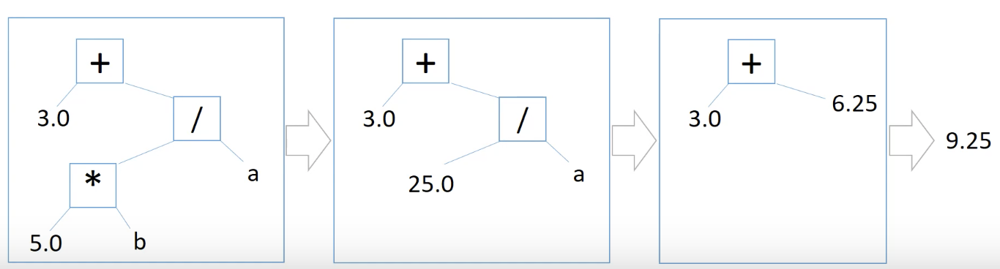
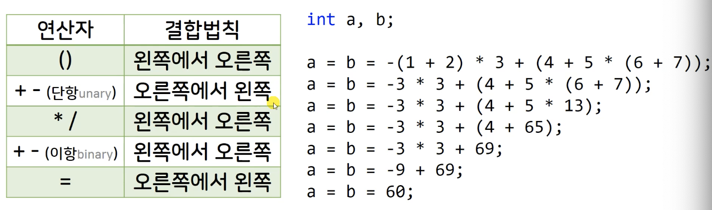

# 따배씨 - 따라하며 배우는 C언어

### 5강 연산자, 표현식, 문장

##### 5.1 반복 루프와의 첫 만남 Loop

```c
#include <stdio.h>

int main(){
    int n = 1;
label:
    printf("%d\n", n);
    n = n + 1;
    
    if(n==10) goto out;
    
    goto label;
    
out:
    
    return 0;
}

```

* goto 문을 사용하여 1~9 까지 출력
  * 옛날 방식 - 복잡하여 사용하지 않음, 내부적으로는 goto 처럼 동작


```c
#include <stdio.h>

int main()
{
    int n = 1;
    
    while(n < 10)
    {
        printf("%d\n", n);
        n = n + 1;
    }
    return 0;
}

```

* while 문을 사용하여 1~9 까지 출력


##### 5.2 대입 연산자와 몇 가지 용어들 Object, L-value, R-value, 피연산자

* 기본 연산자
  * =, +, -, *, /
* 연산자 operator
* 피연산자 operand

* Data Object (object) : 데이터가 메모리안에 존재
* L-value (object locator value) : 메모리를 차지하고 있는 트겅 데이터 객체(개체)
  * i = 1024 의 " i " 값
  * i = i + 1 의 " i " 값
* R-value (value of an expression) : 수정 가능한 L-value에게 대입될 수는 있지만 자기 자신은 L-value 가 될 수 없는 것들
  * i = 1024 의 1024 값
  * i = i + 1 의 " i + 1 " 값


##### 5.3 더하기 Addition, 빼기 Subtraction, 부호 Sign 연산자들

```c
#include <stdio.h>

int main(){
    printf("%d\n", 1 + 2);
    
    int income, salary, bonus;
    
    income = salary = bonus = 100; // triple asignment
    
    salary = 100;
    bonus = 30;
    
    income = salary + bonus; // l-value vs r-value
    
    int takehome, tax;
    
    tax = 20;
    takehome = income - tax;
    
    int a, b;
    a = -7;
    b = -a;
    b = +a; // + does nothing
    
    1.0f + 2; // 두개의 자료형이 다름, float에 저장됨
    
    return 0;
}
```

* 이항 연산자 Binary operator
  * 3 - 2 = 1 (value)
  * 피 연산자가 2개
* 단항 연산자 Unary operator
  * -16 = -16(value)
  * 피 연산자가 1개
* 복합
  * -(12-11) = -1 (value)


##### 5.4 곱하기 연산자

```c
#include <stdio.h>

int main(){
    double seed_money, target_money, annual_interest;
    printf("Input seed money :");
    scanf("%lf", &seed_money);
    printf("Input target money :");
    scanf("%lf", &target_money);
    printf("Input annual interest (%%) :");
    scanf("%lf", &annual_interest);
    
    double fund = seed_money;
    int year_count = 0;
    
    while (fund < target_money){
        fund += fund * annual_interest /100;
        year_count++;
        printf("%f\n", fund);
    }
    printf("It takes %d years\n", year_count);
    return 0;
}
```

* 곱하기 연산자 예제


##### 5.5 나누기 연산자

```c
#include <stdio.h>

int main(){
    printf("Integer divisions\n");
    printf("%d\n", 14/7);
  	// 2
    printf("%d\n", 7/2);    // 3.5 in floating divison
    // 3
    printf("%d\n", 7/3);    // 2.333 in floating division
  	// 2
    printf("%d\n", 7/4);    // 1.75 in floating divison
  	// 1
    printf("%d\n", 8/4);    // 2
    // 2
  
    printf("Truncating toward zero (C99)\n");
    printf("%d\n", -7/2);   // -3.5 in floating division
  	// -3
    printf("%d\n", -7/3);   // -2.33 in floating division
  	// -2
    printf("%d\n", -7/4);   // -1.75 in floating division
  	// -1
    printf("%d\n", -8/4);   // -2
  	// -2  
    printf("\nFloating divisons\n");
  
    printf("%f\n", 9.0/4.0);
  	// 2.250000
    printf("%f\n", 9.0/4);  // Note:  4 is integer
  	// 2.250000
    return 0;
}
```

* 정수를 정수로 나눌 때, 실수를 저장할 공간이 없기때문에 소수부분을 버림
  * 0에 가까운 쪽으로 버림
* 실수를 정수로 나눌 때,  내부 동작상 불가능 하나 컴파일러가 int 형을 double로 변환하여 계산


##### 5.6 연산자 우선순위 Operator Precedence 와 표현식 트리 Expression Tree

* 표현식 트리 Expression Tree

  

  * 컴퓨터 내부적으로 컴파일러가 수식을 그래프 구조로 만들어 우선순위를 파악하여 계산

* 연산자의 우선순위 Operator precedence

  
  * C표준 문서에서 괄호부분의 수식을 Operator 가 아닌 Primary Expression 이라고 함
  * 괄호의 우선순위가 매우 높음


##### 5.7 나머지 연산 Modulus Operator

* 나머지 연산 기호: ' % '

```c
#include <stdio.h>

int main(){
    int seconds = 0, minutes = 0, hours = 0;
    
    printf("Input seconds: ");
    scanf("%d", &seconds);
    
    while (seconds >= 0){
        
        minutes = seconds / 60;
        seconds %= 60;
        
        hours = minutes / 60;
        minutes %= 60;
        
        printf("%d hours, %d minutes, %d seconds\n", hours, minutes, seconds);
        
        
        printf("Input seconds:");
        scanf("%d", &seconds);
    }
    
    return 0;
}
```

* 나머지 연산 예제


##### 5.8 증가 ++, 감소 -- 연산자

```c
#include <stdio.h>

int main(){
    int a = 0;
    a++;    // a = a + 1 or a += 1;
    printf("%d\n",a);
    
    ++a; // a = a + 1 or a += 1;
    printf("%d\n", a);
    
    double b = 0;
    b++;    // b = b + 1 or b += 1;
    printf("%f\n",b);
    
    ++b;    // b = b + 1 or b += 1;
    printf("%f\n", b);
    
    return 0;
}
```

* 전위 연산자
  * ++a
  * 연산이 먼저 수행 됨
* 후위 연산자
  * a++
  * 연산이 나중에 수행


```c
#include <stdio.h>

int main(){
    int i = 1, j = 1;
    int i_post, pre_j;
    
    i_post = i++;
    pre_j = ++j;
    
    printf("%d %d\n", i, j);
  	// 2 2
    printf("%d %d\n", i_post, pre_j);
  	// 1 2
    
    return 0;
}
```

* i_post = i++;
  * pritnf 함수에 대입 된 후, 연산 수행
* pre_j = ++j;
  * 연산 수행 후, printf 함수 대입


```c
#include <stdio.h>

int main(){
    int i = 3;
    int l = 2 * --i;
    printf("%d %d\n", i, l);
  	// 2 4
    
    i = 1;
    l = 2 * i--;
    printf("%d %d\n", i, l);
  	// 0 2
    
    return 0;
}
```

* 증가/감소 연산자는 곱셈 나눗셈보다 우선순위가 높음


##### 5.9 표현식 Expressions 과 문장 Statements

* 표현식의 중요한 특징: 값을 계산해 냄, 값을 대입


```c
/* Statements */
int x, y, apples;	// declaration statement
apples = 3;				// assignment statement
;								  // null statement
x = 1 + (y = 5); // y = 5 is subexpression

while (x++ < 10) // while statement (strucutred statements)
  y = x + y;

printf("%d\n", y); // function statement

return 0;						// return statement
```

* Statement


```c
/* Side Effects and Sequence Points */
x = 4;	// main intent is evaluating expressions
y = 1 + x++;

while (x++ < 10)	// (x++ < 10) is a full expression.
  printf("%d\n", x);

y = (4 + x++) + (6 + x++); // Not (4 + x++) nor (6 + x++) is a full expression.
```

* " ; " : Sequence Point, 표현식에 대한 계산 시작

* ```c
  y = (4 + x++) + (6 + x++);
  ```

  * 괄호안의 계산이 끝날때, x++ 연산이 동작할지, 전체 표현식의 계산이 끝나고 난 뒤 " ; " 에서 x++ 연산이 동작할지 애매함
  * 애매하다는 표현은, 컴파일러마다 다른 판단을 내릴 가능성이 있다는 의미


##### 5.10 순서도 Flowcharts

##### 5.11 자료형 변환 Type conversions

```c
#include <stdio.h>

int main(){
    /* promotions in assignments */
    short s = 64;
    int i = s;
    
    float f = 3.14f;
    double d = f;
    
    
    return 0;
}
```

* 작은 자료형을 큰 자료형에 대입


```c
#include <stdio.h>

int main(){
    /* demotion in assignments */
    float f = 3.14f;
    double d = f;
  
  	d = 1.25;
  	f = 1.25;
  	f = 1.123;
      
    return 0;
}
```

* 큰 자료형을 작은 자료형에 대입, Warning 발생
  * 정확도(유효숫자)에 문제가 발생 할 수 있음


```c
#include <stdio.h>

int main(){
    /* ranking of types in operations */
    // long double > double > float
    // unsigned long long, long long
    // unsinged long, long
    // unsigned, int
    // shor int, unsinged short int
    // signed char, char unsinged char
    // _Bool
    
    double d = 1.2;
    float f = 1.123f;
    
    d = f + 1.234;
    f = f + 1.234;
    
    printf("%f\n", d);
    printf("%f\n", f);
    
    return 0;
}
```


```c
/* automatic promotion of function arguments */
// 1. Functions without prototypes
// 2. Variadic functions (ellipsis)
```


```c
#include <stdio.h>

int main(){
  	/* casting operators */
    double d = 1.2;
    int i = 0;
    
    d = (double)3.14f;
    i = 1.6 + 1.7;
    printf("%d\n", i);
    // 3
    i = (int)1.6 + (int)1.7;
    printf("%d\n", i);
    // 2
    return 0;
}
```

* Casting operators: 자료형을 명시


```c
#include <stdio.h>

int main(){
    char c;
    int i;
    float f;
    
    f = i = c = 'A';
    printf("%c %d %f\n", c, i, f);
  	// A 65 65.000000
    
    c = c + 2;
    i = f + 2 * c;
    printf("%c %d %f\n", c, i, f);
  	// C 199 65.000000
    
    c = 1106; // demolitions, 1106 = 0b10001010010, 0b01010010 = 1106 % 256 = 82 = 'R'
    printf("%c\n", c);
  	// R
    c = 83.99;
    printf("%c\n", c);
  	// S
    
    return 0;
}
```


##### 5.12 함수의 인수 Arguments 와 매개변수 Parameters

```c
#include <stdio.h>

void draw(int n);   // ANSI function prototype declaration

int main(){
    int i = 5;
    char c = '#';   // 35
    float f = 7.1f;
    
    draw(i);
  	// *****

    draw((int)c);
  	// ***********************************

    draw((int)f);
	  // *******
    
    return 0;
}

void draw(int n)
{
    while(n-->0){
        printf("*");
    }
    printf("\n");
}
```

* Arguments vs. Parameters
  * actual argument, actual parameter -> argument (values)
  * formal argument, formal parameter -> parameter (variables)