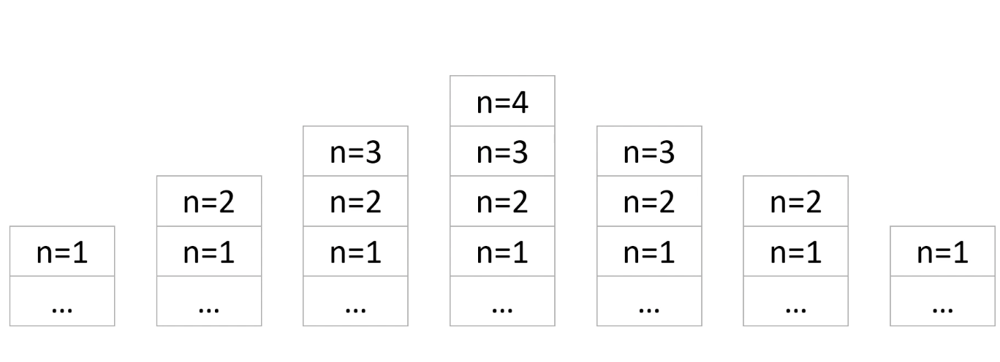
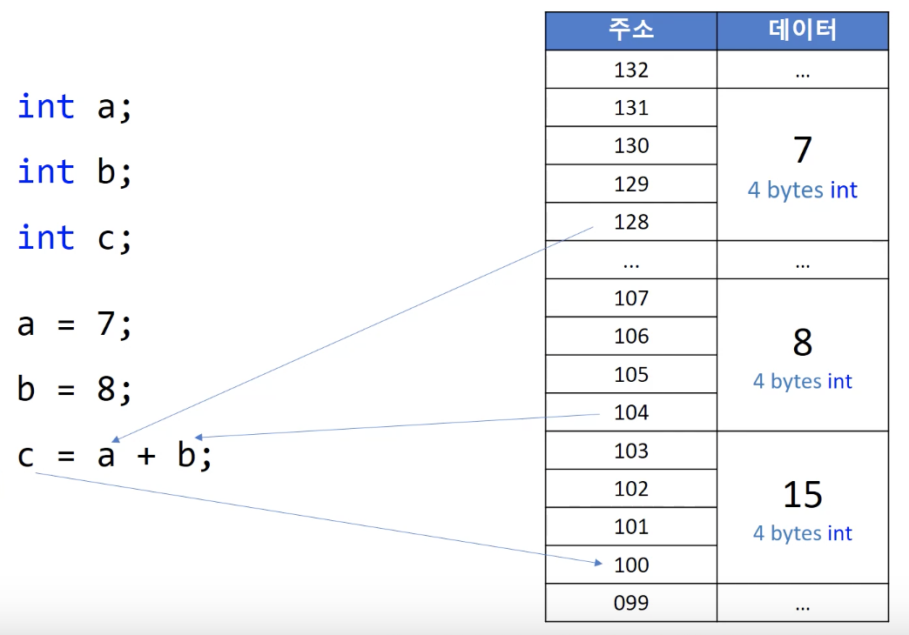
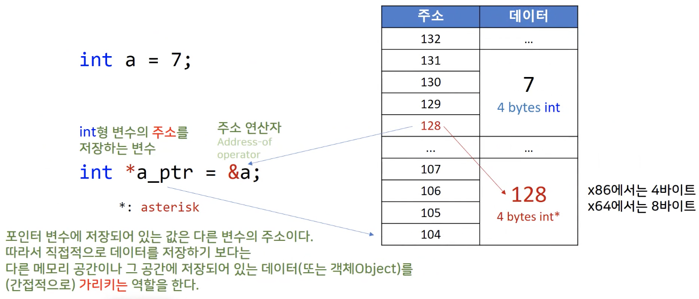
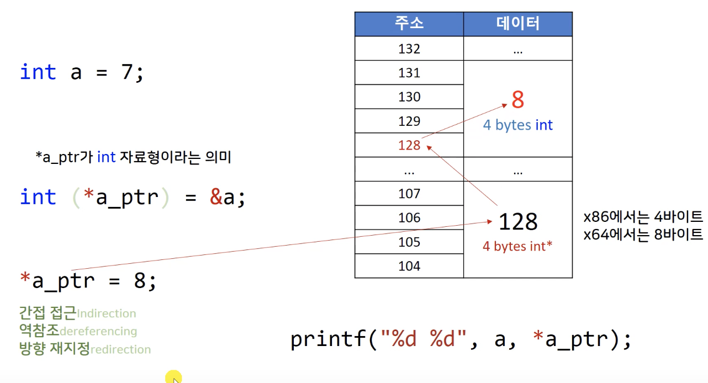

# 따배씨 - 따라하며 배우는 C언어

# 9강 함수

##### 9.1 함수가 필요할 때

```c
#include <stdio.h>

int main(){
    printf("********************\n");
    printf("        LEE\n");
    printf("    Seoul, Korea\n");
    printf("********************\n");
  
  	return 0;
}
```


```c
#include <stdio.h>
#include <string.h>
#include <stdbool.h>

#define WIDTH 20
#define NAME "LEE"
#define ADDRESS "Seoul, Korea"

void print_multiple_chars(char c, int n_stars, bool print_newline);
void print_centered_string(char str[]);

int main(){

    print_multiple_chars('*', WIDTH, true);
    print_centered_string(NAME);
    print_centered_string(ADDRESS);
    print_multiple_chars('*', WIDTH, true);
    
    
    return 0;
}

void print_multiple_chars(char c, int n, bool print_newline){
    
    for (int i = 0; i < n; ++i){
        printf("%c", c);
    }
    
    if (endl)
        printf("\n");
}

void print_centered_string(char str[])
{
    int n_blanks = 0;
    n_blanks = (int)(WIDTH - strlen(str)) / 2;
    print_multiple_chars(' ', n_blanks, false);
    printf("%s\n", str);
}
```


##### 9.2 함수의 프로토 타입

* 모든 함수의 내부동작을 외울수 없음
  * 블랙박스로서의 함수, 입력과 출력만 생각하고 전체 구조를 작성

* 컴퓨터가 Compile 을 할 때, 블랙박스로서 동작만 알면 됨
  * prototype 형태만 있으면 Compile이 진행 됨
  * Compile 만 진행되고, 실행파일을 만드는 Linking은 진행되지 않음
    * Linking 단계에서 함수의 실행 내용이 없기 때문


* ```c
  void print_multiple_chars(char c, int n_stars, bool print_newline);
  ```

  * 함수의 prototype 선언
  * void: 함수의 실행 결과 값의 자료형
  * print_multiple_chars: 함수 명
  * (char c, int n_stars, bool print_newline) : 매개변수, Parameter

* ```c
  print_multiple_chars('*', WIDTH, true);
  ```

  * 함수 호출
  * ('*', WIDTH, true): argument, 함수의 입력값

* ```c
  void print_multiple_chars(char c, int n, bool print_newline){
      
      for (int i = 0; i < n; ++i){
          printf("%c", c);
      }
      
      if (endl)
          printf("\n");
  }
  ```

  * 함수의 선언문
  * 함수의 형이 void 이기 때문에, return 이 생략

* ```c
  void print_multiple_chars(char, int, bool);
  ...
  void print_multiple_chars(char c, int n, bool print_newline){
      
      for (int i = 0; i < n; ++i){
          printf("%c", c);
      }
      
      if (endl)
          printf("\n");
  }
  ```

  * prototype 선언에서는 매개변수 형 까지만 입력하고 함수 선언부에서 매개변수 명까지 입력해도 complie이 된다
    * 블랙박스 모델에서 프로토타입 선언은 데이터 타입의 입력/출력만 중요하기 때문
    * 그래도 작성하는것이 좋다


##### 9.3 함수의 자료형과 반환값

```c
#include <stdio.h>

int int_min(int, int);

int main(){
    int i1, i2;
    
    while(1)
    {
        printf("Input two integers: ");
        
        if (scanf("%d %d", &i1, &i2) != 2)break;
        
        int lesser = int_min(i1, i2);
        // int lesser = min
        
        printf("The lesser of %d and %d is %d\n", i1, i2, lesser);
    }
    
    printf("End.\n");
}

int int_min(int i1, int i2)
{
    return (i1 < i2)? i1: i2;
}
```

* ```c
  int int_min(int i1, int i2)
  {
      return (float)i1
  }
  ```

  * float 을 int 로 형 변환하는 과정에서 Error 가 발생한다고 알려줌
    * 함수의 return 타입이 int 이기 때문에 (int)(float)i1 이 되기때문에, Error가 발생하는것


##### 9.4 변수의 영역 Scope 와 지역 변수 Local Variable

* 변수는 변수를 사용 할수 있는, 유효한 영역이 존재
  * 변수의 유효한 범위는 { } 안의 영역임, 지역 변수

* 더 큰 영역의 변수를, 그 안의 더 작은 영역에서 새로 선언 하게 된다면 새로운 변수가 됨
* 작은영역의 변수는 더 큰 영역에서 사용 불가, 볼 수 없음
  * invisible


```c
#include <stdio.h>

int int_max(int i, int j);

int main(){
    int a;
    
    a = int_max(1, 2);
    
    printf("%d\n", a);
    printf("%p\n", &a);
    
    {
        a = int_max(4, 5);
        
        printf("%d\n", a);
        printf("%p\n", &a);
    }
}

int int_max(int i, int j)
{
    int m;
    m = (i > j) ? i : j;
    return m;
}
```

* ```c
  printf("%p\n", &a);
  ```

  * 주소값 직접 출력

* 출력되는 모든 주소값이 똑같은것을 확인 할수 있음

  * 같은 주소 == 같은 변수


```c
#include <stdio.h>

int int_max(int i, int j);

int main(){
    int a;
    
    a = int_max(1, 2);
    
    printf("%d\n", a);
    printf("%p\n", &a);
    
    {
        int a;
        a = int_max(4, 5);
        
        printf("%d\n", a);
        printf("%p\n", &a);
    }
    
    printf("%d\n", a);
    printf("%p\n", &a);
}

int int_max(int i, int j)
{
    int m;
    m = (i > j) ? i : j;
    return m;
}

```

* 출력되는 주소값 중, 새로운 영역 { } 안의 주소값만 다른것을 확인
  * 새로운 영역안에서 지역 변수로 선언한 변수는 새 메모리 주소가 할당 되는 새로운 변수


##### 9.5 지역 변수와 스택 Stack

* 최신 컴파일러는 여러가지 최적화 기술을 사용하기 때문에, 변수의 메모리 주소가 고정 되기도 함


* 프로그램이 진행됨에 따른 stack의 변화
* stack 메모리에 존재하는 변수는 어디서든 직접 접근해서 사용 가능


##### 9.6 재귀 호출 Recursion

* 함수가 자기 자신을 호출하는 함수

```c
#include <stdio.h>

void my_func(int);

int main(){
    my_func(1);
    
    return 0;
}

void my_func(int n){
    printf("Level %d, address of variable n = %p\n", n, &n);
    
    my_func(n + 1);
}
```

* 출력 결과

  ```*ㅊ
  Level 1, address of variable n = 0x7ffeefbff46c
  Level 2, address of variable n = 0x7ffeefbff44c
  Level 3, address of variable n = 0x7ffeefbff42c
  Level 4, address of variable n = 0x7ffeefbff40c
  Level 5, address of variable n = 0x7ffeefbff3ec
  .....
  무한 호출
  ```

  * 메모리 주소의 차이가 크게 남
    * 프로그램이 호출 될 때 마다, stack 메모리에 변수 뿐만 아니라 프로그램도 쌓이게 됨
    * 재귀호출로 stack 에 큰 부담이 갈 수 있음
    * stack 메모리가 가득 차면, stack overflow error 발생


* 재귀호출은 무한루프 구현을 위해 사용하지 않음
  * 재귀 호출의 조건을 걸어주어서 구현해야함

```c
#include <stdio.h>

void my_func(int);

int main(){
    my_func(1);
    
    return 0;
}

void my_func(int n){
    
    printf("Level %d, address of variable n = %p\n", n, &n);
    
    if (n < 4)
        my_func(n + 1);
}
```

* 4번 호출되고 종료


##### 9.7 재귀호출 Recursion 과 스택 Stack

 ```c
#include <stdio.h>

void my_func(int);


int main(){
    my_func(1);
    
    return 0;
}

void my_func(int n){
    
    printf("Level %d, address of variable n = %p\n", n, &n);
    
    if (n < 4)
        my_func(n + 1);
    
    printf("Level %d, address of variable n = %p\n", n, &n);
}
 ```

* 출력 결과

  ```c
  Level 1, address of variable n = 0x7ffeefbff46c
  Level 2, address of variable n = 0x7ffeefbff44c
  Level 3, address of variable n = 0x7ffeefbff42c
  Level 4, address of variable n = 0x7ffeefbff40c
  Level 4, address of variable n = 0x7ffeefbff40c
  Level 3, address of variable n = 0x7ffeefbff42c
  Level 2, address of variable n = 0x7ffeefbff44c
  Level 1, address of variable n = 0x7ffeefbff46c
  ```

  * level 이 같을 때, n 의 주소값은 같음




* 재귀함수의 호출에서의 stack
* 재귀함수의 호출 시 변수 메모리 공간 뿐만 아니라, 함수가 동작하기 위한 공간도 같이 stack 에 쌓임
  * stack frame


##### 9.8 팩토리얼 Factorial 예제

```c
#include <stdio.h>

long loop_factorial(int n);
long recursive_factorial(int n);

int main(){
    int num = 5;
    
    printf("%ld\n", loop_factorial(num));
    printf("%ld\n", recursive_factorial(num));
    
    return 0;
}

long loop_factorial(int n){
    long result;
    
    for (result = 1; n > 1; n--){
        result *= n;
    }

    return result;
}

long recursive_factorial(int n){
    if (n <= 0){
        return 1;
    }
    
    return n * recursive_factorial(n-1);
}
```

* ```c
  return n * recursive_factorial(n-1);
  ```

  * tail(end) recursion: return 에서 재귀 호출 하는 구조


##### 9.9 이진수 변환 예제

```c
#include <stdio.h>

void print_binary(unsigned long n);
void pirnt_binary_loop(unsigned long n);

int main(){
    unsigned long num  = 10;
    
    pirnt_binary_loop(num);
    print_binary(num);
    
    printf("\n");
    
    return 0;
}

void pirnt_binary_loop(unsigned long num){
    
    while(1){
        unsigned long quotient = num / 2;
        unsigned long remainder = num % 2;
        
        printf("%ld", remainder);
        
        num = quotient;
        
        if (num == 0) break;
    }
    printf("\n");
}

void print_binary(unsigned long num){
    int remainder = num % 2;
    
    if (num >= 2)
        print_binary(num / 2);
    
    printf("%d", remainder);
    
    return;
}
```


##### 9.10 피보나치 Fibonacci 예제와 재귀 호출의 장단점

```c
#include <stdio.h>

int fibonacci(int number);

int main(){
    for (int count = 1; count < 10; ++count){
        printf("%d ", fibonacci(count));
    }
    
    printf("\n");
    return 0;
}

int fibonacci(int number){
    if (number < 3){
        return 1;
    }
    
    return fibonacci(number-1) + fibonacci(number-2);
}
```

* ```c
  return fibonacci(number-1) + fibonacci(number-2);
  ```

  * Double recursion: return으로 재귀 함수 2개 호출 

* 피보나치를 계산 할때 재귀를 사용하면 중복되는 호출이 많이 발생
  * 메모리와 cpu가 비효율적으로 많이 사용됨
  * 계산한 값들을 저장하는 방법을 이용하여 해결 가능


##### 9.11 헤더 파일 Header Files 만들기

* 헤더 파일을 만들어서 코드를 여러개의 파일로 분리하여 반복사용하는 것이 효율적

```c
#include <stdio.h>

void print_hello(){
    printf("Hello\n");
}

void print_hi(){
    printf("Hi\n");
}

void print_str(char* str){
    printf("%s\n", str);
}

int main(){
    print_hello();
    print_hi();
    print_hello();
    print_hi();
    print_str("No one lives forever.");
    print_str("Valar morghulis");
    
    return 0;
}
```


```c
#include <stdio.h>
#include "my_print_functions.h"

int main(){
    print_hello();
    print_hi();
    print_hello();
    print_hi();
    print_str("No one lives forever.");
    print_str("Valar morghulis");
    
  	printf("Hello");
  	
    return 0;
}
```

* main.c
* include 된 header 파일에 stdio.h 가 include 되었지만, main.c 에서 printf 함수를 사용 하려면 stdio.h 헤더를 다시 include 해주어야함
  * header 파일에 include 한것은 파일 범위에서만 유효

```c
#fndef my_print_functions_h
#define my_print_functions_h

void print_hello(void);
void print_hi(void);
void print_str(char* str);

#endif /* my_print_functions_h */

```

* my_print_functions.h
  * prototype 선언

```c
#include "my_print_functions.h"
#include <stdio.h>

void print_hello(){
    printf("Hello\n");
}

void print_hi(){
    printf("Hi\n");
}

void print_str(char* str){
    printf("%s\n", str);
}
```

* my_print_function.c
  * header 파일에 prototype을 선언한 함수를 작성


##### 9.12 포인터 Pointer 의 작동 원리



* 변수의 메모리 사용




* 메모리와 포인터

* ```c
  int *a_ptr = &a;
  ```

  * *이 붙은 변수명은, 주소값을 저장하는 변수명으로 선언한다는 의미
  * int 와 같이 해당 주소값에 저장된 변수의 type으로 형을 선언


* pointer 를 사용 하였을때, 효율적으로 처리 가능한 부분이 있음




```c
#include <stdio.h>

int main(){
    int a = 7;
    
    int *a_ptr = &a;
    
    *a_ptr = 8;
    
    printf("%d %d %p\n",a, *a_ptr, a_ptr );
		// 8 8, 0x7ffeefbff488
    return 0;
}

```


* 포인터 변수의 사용 예시


##### 9.13 포인터 Pointer 의 기본적인 사용 방법

```c
#include <stdio.h>

int main(){
    int a, b;
    
    a = 123;
    
    int *a_ptr; // * : asterisk
    
    a_ptr = &a; // & : address-of operator
    
    printf("%d %d %p\n", a, *a_ptr, a_ptr);
    // 123 123 0x7ffeefbff488
    
    *a_ptr = 456;
    
    printf("%d %d %p\n", a, *a_ptr, a_ptr);
    // 456 456 0x7ffeefbff488
    return 0;
}

```


```c

#include <stdio.h>

int main(){
    int a, b, c;
    
    a = 123;
    
    int *a_ptr; // * : asterisk
    
    a_ptr = &a; // & : address-of operator
  
    *a_ptr = 456;
    
    b = a_ptr;
    c = *a_ptr;
    
    printf("%d %d\n", b, c);
    // -272632696 456
    
    return 0;
}

```

* ```c
  b = a_ptr;
  ```

  * 주소값을 정수형에 저장하는 경우는 거의 사용하지 않음, 주의


```c

#include <stdio.h>

int main(){
    int a, b;
    
    a = 123;
    
    int *a_ptr; // * : asterisk
    
    a_ptr = &a; // & : address-of operator
  
    *a_ptr = 456;
    
    b = *a_ptr;
    
    printf("%d\n", b);
    // 456
  
  	*a_ptr = 789;
  
    printf("%d\n", b);
    // 456
    printf("%d %d %p\n", a, *a_ptr, a_ptr);
  	// 789 789 0x7ffeefbff488
    
    return 0;
}
```

* ```c
  b = *a_ptr;
  ```

  * *a_ptr 은 a 에 저장된 값 자체를 의미
  *  b 의 메모리에 a 변수의 메모리 위치에 저장된 값을 직접 받아와서 값 자체를 저장
  * *a_ptr 의 값이 변경되더라도, 값이 저장된 위치와 아무런 관계가 없으므로 영향을 받지 않음

* ```c
  *a_ptr = 789;
  ```

  * a 변수의 메모리주소에 저장된 값을 789로 직접 변경, a 의 값이 변경됨


```c

#include <stdio.h>

int main(){
    int a;
    
    a = 123;
    
    int *a_ptr; // * : asterisk
    
    a_ptr = &a; // & : address-of operator
  
    *a_ptr = 456;
    printf("%d %d %p\n", a, *a_ptr, a_ptr);
    // 456 456 0x7ffeefbff488
  
    a = 789;
    printf("%d %d %p\n", a, *a_ptr, a_ptr);
    // 789 789 0x7ffeefbff488
    
    return 0;
}
```

* ```c
  int a;
  int *a_ptr = &a;
  
  *a_ptr = 10;
  // a = 10
  ```

  * *a_ptr = 10 과 a = 10 은 같은 결과


##### 9.14 포인터 Pointer 와 코딩 스타일

```c
#include <stdio.h>

int main(){
    
    int* a, b;
    // a 만 포인터, b는 정수
    
    int* c, * d;
    // c 와 d 둘다 포인터
    
    int* e;
    int* f;
    // 분리하는 표현법이 추천됨
    return 0;
}
```


##### 9.15 NULL 포인터와 런타임 에러

```c
#include <stdio.h>

int main(){
    int a;
    printf("%p\n", &a);
    // 0x7ffeefbff488
    
    printf("%d\n", a);
    // 86053
    
    return 0;
}
```

* 일반 변수를 선언 후 값을 대입하지 않으면, 쓰레기 값이 저장되어 있음


```c
#include <stdio.h>

int main(){
    int *ptr;
    printf("%p\n", ptr);
    // 0x7ffeefbff4a8
    
    printf("%d\n", *ptr);
    // 0
    
    return 0;
}


```

* 포인터 변수 선언 후 값을 대입하지 않으면, 0이 기본으로 저장되어 있음

```c
#include <stdio.h>

int main(){
    int *ptr = 123;
  
    printf("%p\n", ptr);
    printf("%d\n", *ptr);
    
    return 0;
}
```

* Runtime Error 발생
  * 123 이라는 주소에 접근하였기 때문에 문제 발생


```c
#include <stdio.h>

int main(){
    int* safer_ptr = NULL;
    // 포인터를 선언 하자 마자 NULL로 초기화
    
    int a = 123;
    
    int b;
    scanf("%d", &b);
    
    if (b % 2 == 0)
        safer_ptr = &a;
    
    if (safer_ptr != NULL)
        printf("%p\n", safer_ptr);
    
    return 0;
}
```

* 포인터의 사용에 NULL 로 초기화해서 사용하는것이 일반적


##### 9.16 디버거로 메모리 들여다 보기

* Visual Studio


##### 9.17 포인터 변수의 크기

```c
#include <stdio.h>

int main(){
    char a;
    float b;
    double c;
    
    char* ptr_a = &a;
    float* ptr_b = &b;
    double* ptr_c = &c;
    
    printf("%zd %zd %zd\n", sizeof(a), sizeof(b), sizeof(c));
  	// 1 4 8
    printf("%zd %zd %zd\n", sizeof(ptr_a), sizeof(ptr_b), sizeof(ptr_c));
  	// 8 8 8
    printf("%zd %zd %zd\n", sizeof(&a), sizeof(&b), sizeof(&c));
  	// 8 8 8
    printf("%zd %zd %zd\n", sizeof(char*), sizeof(float*), sizeof(double*));
  	// 8 8 8
  
    return 0;
}
```

* 주소 값을 저장하는 메모리 크기는 8 byte - 64bit 운영체제
  * 32bit 운영체제 - 4byte


##### 9.18 포인터 Pointer 형 매개변수

```c
#include <stdio.h>

void swap1 (int a, int b);
void swap2 (int* a_ptr, int* b_ptr);

int main(){
    int a = 123;
    int b = 456;
    
    printf("%p %p\n", &a, &b);
  	// 0x7ffeefbff488 0x7ffeefbff484
    
    swap1(a, b);
	  // 0x7ffeefbff44c 0x7ffeefbff448
  
    swap2(&a, &b);
    // 0x7ffeefbff488 0x7ffeefbff484
    
    return 0;
}

void swap1(int a, int b){
    printf("%p %p\n", &a, &b);
}

void swap2(int *a_ptr, int *b_ptr){
    printf("%p %p\n", a_ptr, b_ptr);
}
```

* 변수를 받아 처리하면, 호출된 함수 영역에서 새로운 변수가 생성됨
  * 다른 메모리 주소를 가진, 새로운 값


```c
#include <stdio.h>

void swap (int* a_ptr, int* b_ptr);

int main(){
    int a = 123;
    int b = 456;
    
      printf("%d %d\n", a, b);
      // 123 456
  
    swap(&a, &b);
    
    printf("%d %d\n", a, b);
      // 456 123
  
    return 0;
}

void swap(int *a_ptr, int *b_ptr){
    int temp = *a_ptr;
    *a_ptr = *b_ptr;
    *b_ptr = temp;
}

```

* 새로운 함수에서 main 함수 영역의 변수에 포인터를 이용하여 직접 접근


* 변수명으로 호출 :  call by value
* 포인터 주소로 호출 : call by pointer