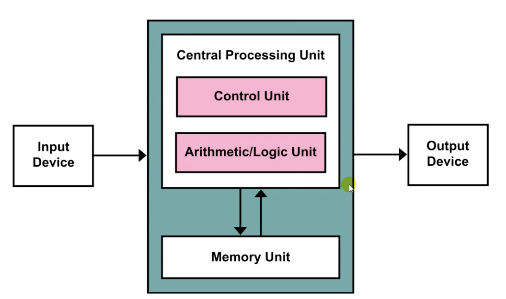

# 따배씨 - 따라하며 배우는 C언어

### 0강. 초보 프로그래머를 위한 컴퓨터의 작동원리

##### 0.1 컴퓨터의 구성요소들

* User - 입력장치 - Computer - 출력장치 - User
* Computer
  * 메인보드
  * 중앙처리 장치 - CPU
  * 주 기억장치 - RAM
  * 보조 기억장치 - HDD
  * 전원 공급장치
  * 입출력 장치
  * 그래픽스 카드
  * 디스플레이
* 중앙처리 장치 - CPU
* 주 기억장치 - 메모리 - RAM
  * Random-Access Memory
  * 전원을 끄면 데이터가 사라짐; Volatile type memory
    * but 속도가 빠름
* 그래픽스 카드 - GPU
* 보조기억 장치
  * HDD: Hard Disk Drive
  * SDD: Solid-State Drive
  * FDD: Floppy Disk Drive
  * Magnetic Tape

##### 0.2 컴퓨터를 켤 때 일어나는 일들

* 부팅절차
  1. 전원 공급 -> 메인보드
  2. ROM(Read Only Memory)에 저장 된 부트 프로그램 실행
  3. 하드웨어 검사
  4. 보조기억장치에 저장 된 운영 체제 로드(복사) -> 주기억장치
  5. 운영 체제 실행 <- CPU

##### 0.3 운영체제가 해주는 일들

* 사용자
* 시스템 프로그램, 응용 프로그램
* 운영체제
* 커널
* 하드웨어
* CPU, 메모리, 보조기억장치, 입출력장치, ....

* 과거의 프로그래머들은 하드웨어 조작하는 프로그램을 각각 개발함

  -> 공통적으로 개발하여 사용하자: 운영체제의 시작

* 커널(Kernel): 하드웨어를 담당(조작)하는 부분, 응용 프로그램과 하드웨어를 중계

* 응용 프로그램이 사용하는 하드웨어의 자원(Resource)을 중재

* Interface: 프로그램을 개발 할 때 하드웨어등을 간단히 사용할수 있는 도구

##### 0.4 컴퓨터는 왜 2진수를 사용할까?

##### 0.5 현대적 컴퓨터의 기본 구조

* 과거의 컴퓨터
  * Punched Card
  * Plugboard
  * Enigma
  * ENIAC

* 앨런 튜링
  
  * Universal Turing Machine(UTM)
  
* 폰 노이만
  * 현대 컴퓨터의 구조를 제안
  * 폰 노이만 구조
    * ENIAC 을 폰 노이만 구조로 변형
    * Stored-program Computer; 내장형 프로그램 방식의 컴퓨터
  * CPU 와 메모리의 분리: 연산장치와 기억장치의 분리
    
    
    
  
*  현대 컴퓨터 구조

  
  
  * 운영체제의 도움으로 입출력장치에 대해 신경을 덜 쓰게 됨
  * Single System Computer Bus: Data를 주고받는 통로가 하나
    * Data: 2진수
    * Control bus
    * Address bus
    * Data bus

##### 0.6 컴퓨터 메모리의 기본구조

* CPU <-> Cash Memory <-> Memory(주기억장치)

* 메모리 접근 방식

  * 순차접근 - Sequential Access
  * 임의접근 - Random Access

* 메모리 구조

  

  * 트랜지스터와 캐패시터로 하나의 저장공간인 Cell 을 이룸
    * 1 Bit 씩 저장 - 2진수 숫자 하나, Binary Digit
  * 속도를 빠르게 하기 위해 임의 접근이 가능하도록 구성되어 있음
    * 임의접근이 가능하도록 만들어진 구조 상 CPU와 메모리의 통신에서 주소값과 데이터값을 주고받는 통로(bus)가 나뉘어져 있음
    * Address Bus
    * Data Bus
  * Random Access 를 하기위해서 "Address"가 필요
    * "Address"에 직접 접근하여 데이터를 처리가능 하도록 하는것이 C/C++ 의 Pointer 임
    * 속도, 하드웨어 제어에 유리

##### 0.7 CPU의 기본 구조

* 프로그램이 시작되는 과정
  * 보조기억장치 -> 주기억 장치 <-> CPU
    1. 보조기억장치에 저장된 프로그램을 주기억장치로 복사
    2. 주기억장치에 저장된 프로그램에서 CPU에 명령 전달
    3. CPU 동작
* CPU의 언어
  * 고수준 프로그래밍 언어
  * 어셈블리 언어(Assembly Language); Mnemonic(니모닉) - 기계어가 사람이 이해할 수 있는 언어로 대치
  * 기계어(Machine code)  ✓
* CPU 명령어 집합(Assembluy Language) - 최소단위의 작업
  * ADD - 숫자 두개를 더한다
  * COMPARE - 숫자들끼리 비교
  * IN - 키보드 같은 입력장치로부터 정보를 입력받음
  * JUMP - 지정된 메모리 주소로 점프
  * JUMP IF - 조건에 따라 점프
  * LOAD - 메모리에서 CPU로 정보를 가져옴
  * OUT - 출력 장치로 정보를 출력
  * STORE - 메로리에 정보를 저장
  * etc...
* CPU의 구성요소들
  * ALU (산술 논리 장치)
  * 제어장치(Control Unit)
  * Registers
    * 주소 레지스터 - 읽거나 쓸 메모리 주소 저장
    * 프로그램 카운터 - 다음 명령어의 메모리 주소 저장
    * 데이터 레지스터 - 메모리에서 읽어온 데이터 저장
    * 명령어 레지스터 - 메모리에서 읽어온 명령어 저장
    * 어큐뮬레이터 - 연산에 사용되는 데이터 저장

##### 0.8 CPU가 일하는 방법

##### 0.9 정보의 단위

* 데이터 -> 처리과정 -> 정보(Information)
  * 디지털 정보의 단위는 디지털 데이터의 단위이기도 함
* bit(binary digit) : 0 or 1, 정보의 기본 단위
* 1 byte =  8bit : 메모리 주소의 기본 단위
* word -> 16 bit word / 32 bit word : CPU가 데이터를 다루는 기본 단위 = 레지스터의 크기
  * System에 따라 word의 단위가 달라짐

##### 0.10 이진수

* bit 수 = 2진수 자리수

* 부호가 있는 (Signed) 8bit 정수

  * 2의 보수 방법 - Two's Complement

    * 자연수를 2진수로 변환
    * 변환된 2진수의 보수를 취함
    * 보수 + 1

    

    * 2의 보수 표현법에서 0과 -0은 같은 수

* 8비트 정수의 범위 (256 가지의 정수)

  * Signed
    * 10000000(2) ~ 01111111(2)
    * -128(10) ~ 127(10)
  * Unsigned
    * 00000000(2) ~ 11111111(2)
    * 0(10) ~ 255(10)