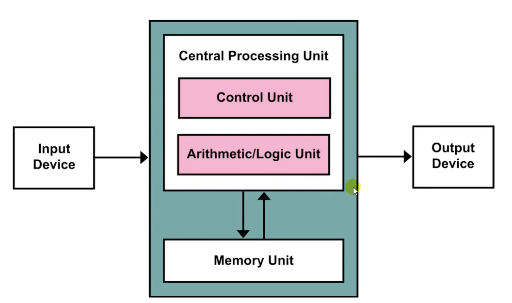
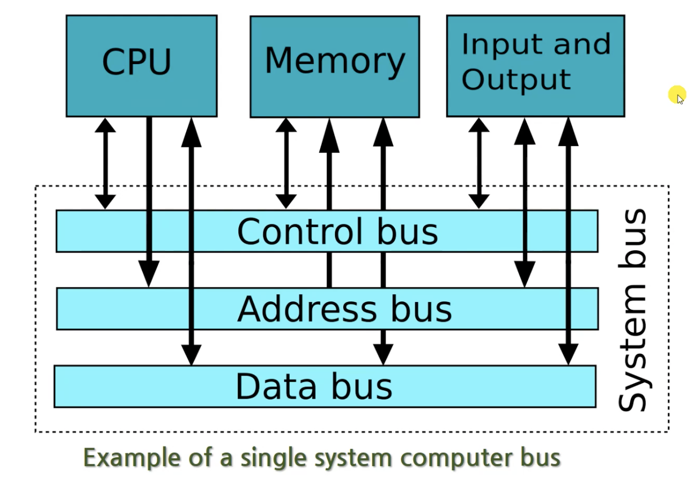

# 따배씨

### 0강. 초보 프로그래머를 위한 컴퓨터의 작동원리

##### 0.1 컴퓨터의 구성요소들

* User - 입력장치 - Computer - 출력장치 - User
* Computer
  * 메인보드
  * 중앙처리 장치 - CPU
  * 주 기억장치 - RAM
  * 보조 기억장치 - HDD
  * 전원 공급장치
  * 입출력 장치
  * 그래픽스 카드
  * 디스플레이
* 중앙처리 장치 - CPU
* 주 기억장치 - 메모리 - RAM
  * Random-Access Memory
  * 전원을 끄면 데이터가 사라짐; Volatile type memory
    * but 속도가 빠름
* 그래픽스 카드 - GPU
* 보조기억 장치
  * HDD: Hard Disk Drive
  * SDD: Solid-State Drive
  * FDD: Floppy Disk Drive
  * Magnetic Tape

##### 0.2 컴퓨터를 켤 때 일어나는 일들

* 부팅절차
  1. 전원 공급 -> 메인보드
  2. ROM(Read Only Memory)에 저장 된 부트 프로그램 실행
  3. 하드웨어 검사
  4. 보조기억장치에 저장 된 운영 체제 로드(복사) -> 주기억장치
  5. 운영 체제 실행 <- CPU

##### 0.3 운영체제가 해주는 일들

* 사용자
* 시스템 프로그램, 응용 프로그램
* 운영체제
* 커널
* 하드웨어
* CPU, 메모리, 보조기억장치, 입출력장치, ....

* 과거의 프로그래머들은 하드웨어 조작하는 프로그램을 각각 개발함

  -> 공통적으로 개발하여 사용하자: 운영체제의 시작

* 커널(Kernel): 하드웨어를 담당(조작)하는 부분, 응용 프로그램과 하드웨어를 중계

* 응용 프로그램이 사용하는 하드웨어의 자원(Resource)을 중재

* Interface: 프로그램을 개발 할 때 하드웨어등을 간단히 사용할수 있는 도구

##### 0.4 컴퓨터는 왜 2진수를 사용할까?

##### 0.5 현대적 컴퓨터의 기본 구조

* 과거의 컴퓨터
  * Punched Card
  * Plugboard
  * Enigma
  * ENIAC

* 앨런 튜링
  
  * Universal Turing Machine(UTM)
  
* 폰 노이만
  * 현대 컴퓨터의 구조를 제안
  * 폰 노이만 구조
    * ENIAC 을 폰 노이만 구조로 변형
    * Stored-program Computer; 내장형 프로그램 방식의 컴퓨터
  * CPU 와 메모리의 분리: 연산장치와 기억장치의 분리
    
    
    
  
*  현대 컴퓨터 구조

  
  
  * 운영체제의 도움으로 입출력장치에 대해 신경을 덜 쓰게 됨
  * Single System Computer Bus: Data를 주고받는 통로가 하나
    * Data: 2진수
    * Control bus
    * Address bus
    * Data bus