# 따배씨 - 따라하며 배우는 C언어

### 12강 Storage Classes, Linkage and Memory Management

##### 12.1 메모리 레이아웃 훑어보기

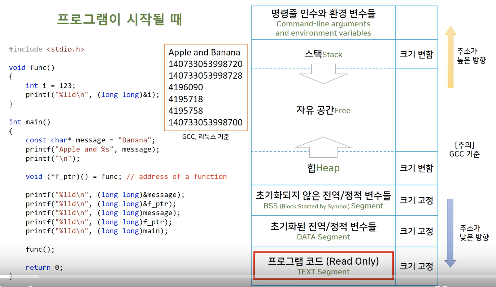

* 프로그램 코드는 변형이 되면 안되기 때문에 TEXT Segment 에 읽기 전용으로 저장됨
  * 프로그램이 실행되면서 코드도 프로그램이 종료 될 때 까지 메모리 계속 존재


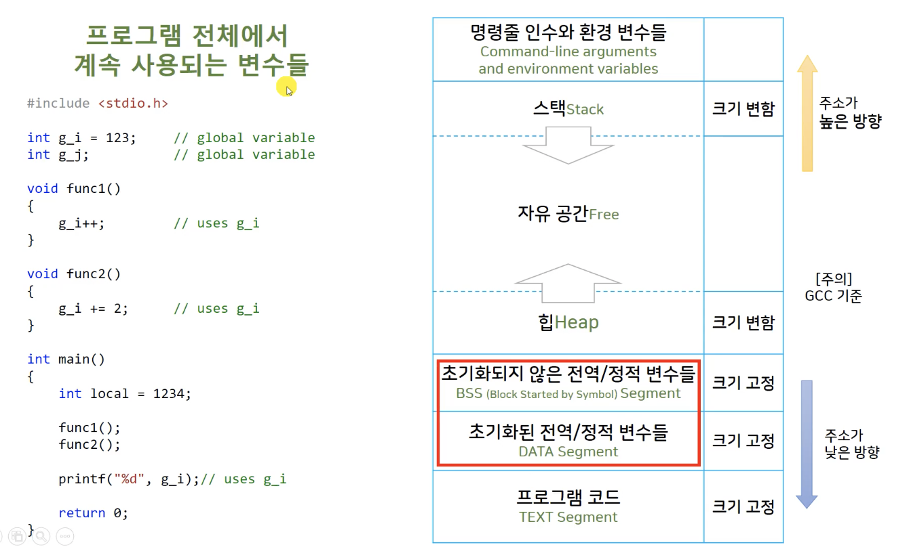

* 전역변수들도 프로그램 코드와 마찬가지로 프로그램이 종료 될 때까지 메모리에 저장되어 있음


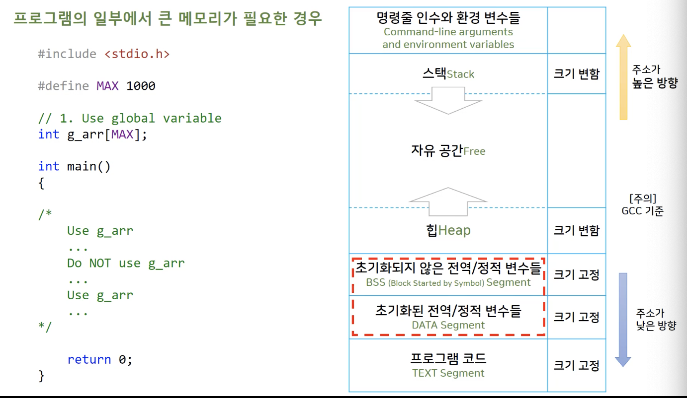

* 전역변수로 메모르를 선언하는것이 가장 편하지만, 프로그램이 끝날 때 까지 메모리가 할당 되어 있는것은 비 효율적임


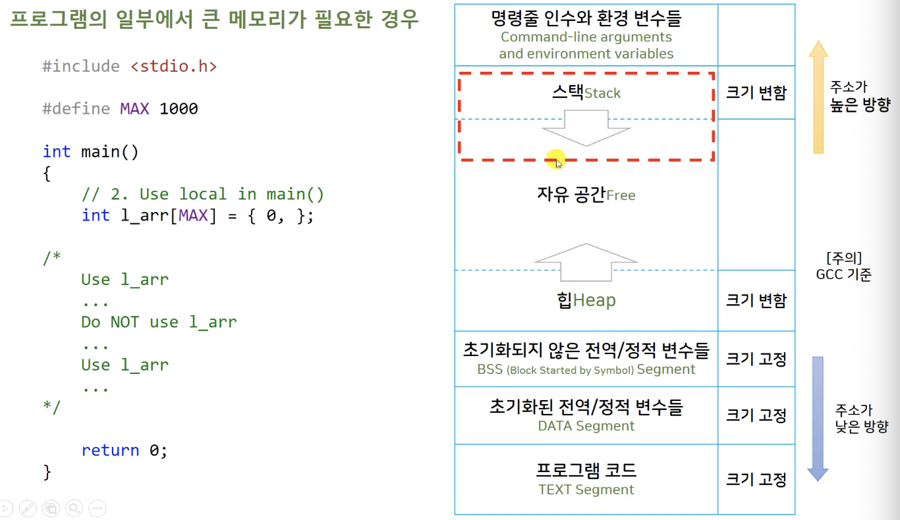

* 블럭 안에서 선언되는 메모리는 stack 에 할당, 그 블럭이 실행되는 동안에만 메모리에 할당되고 블럭의 실행이 종료되면 운영체제에게 메모리 권한을 넘겨줌
  * 효율적인 메모리 사용 가능
  * main() 함수에 선언된 변수의 메모리는, main 함수의 특성상 프로그램이 종료될때 까지 유지되므로 전역변수에서 선언한 것 처럼 할당 됨
    * 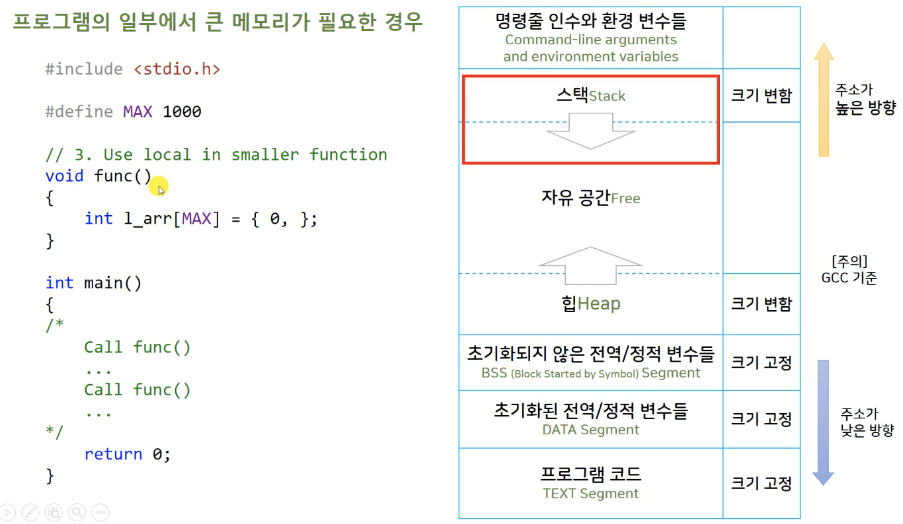
      * 함수를 호출하는 방법으로 큰 메모리를 사용하는것이 더 효율적
* stack 메모리의 관리는 운영체제가 하는것이 원칙이나, 프로그램 실행시 stack 메모리의 크기가 할당되는것 compile 단계에서 결정됨
  * stack 의 메모리가 늘었다 해제되었다 하는 동작이 매우 빠름
  * stack에 선언된 지역 변수들은 속도가 빠름


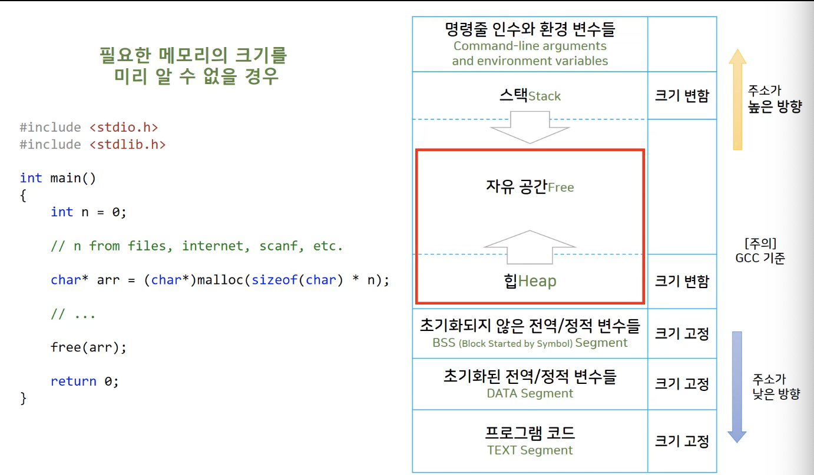

* 프로그램의 대부분의 경우 메모리를 예측하기 힘듬
  * Compile 단계에서 메모리 크기를 미리 할당해 주기가 어려움
* Heap 메모리 공간을 사용하여 필요한 순간마다 공간을 할당받아 사용
  * 자유 공간을 stack 메모리와 함께 사용하면서 메모리 주소가 겹치는 문제가 발생 할수 있는것을 가상 메모리 주소를 사용하는것으로 해결
  * Heap 영역의 메모리는 다 사용한 메모리를 반납해야 함
  * 메모리를 관리하는 운영체제에 직접 호출하여 할당받고 반납하며 사용하기 때문에 느리게 동작
* c 는 unmanaged memory 언어


##### 12.2 객체 Object 와 시별자 Identifier, L-value 와 R-value

```c
#include <stdio.h>

int main(){
    /*
        Object
        - "An Object is simply a block of memory that can sotre a value."
        - Object has more developed meaning in C++ and Object Oriented Programming

        Identifiers
        - Names of variables, function, macros, amd other entities
     */
    
    int var_name = 3;       // creates an object called "var_name".
    
    int* pt = &var_name;    // pt is an identifier.
    *pt = 1;                // *pt is not an identifier. *pt designates an object.
    
    int arr[100];           // arr is an identifer.
    arr[0] = 7;             // arr[0] is an object
  
    
    
    /*
        lvalue is expression "referring" to an object.
        refer : 참조 자,
        referring : 참조,  또 다른 이름처럼 사용
     
        L-value : left side of and assignment
        R-value : right side, variable, constant, expression
     */
    
    var_name = 3;           // modifiable lvalue
    
    pt = &var_name;         // modifiable lvalue
    int* ptr = arr;
    *pt = 7;                // *pt is not an identifier but and modifiable lvalue expression
    
    int *ptr2 = arr + 2 * var_name;     // address rvalue
    *(arr + 2 * var_name) = 456;        // lvalue expression
    
    const char* str = "Constant string";    // str is a modeifiable lavalue
    str = "Second string";                  // "Constant string" = "Second String" // impossible
    // str[0] = 'A'; Error
    
    char str2[] = "String in an array";
	  //str2[] = "Second string"; Error
    str2[0] = 'A';  // OK
    
    return 0;
}

```

* Object - 객체

  * C 언어에서는 값을 저장하는 메모리 공간을 가지고 있으면 Object
  * OOP 언어에서는 C 언어의 Object 개념을 확장

* Identifier - 식별자

  * 이름 - 변수의 이름, 함수의 이름 등

* ```c
  int var_name = 3;
  ```
  * int 형이 저장되도록 할당된 메모리 공간에 3이라는 값을 복사해서 넣어줌
  * 메모리 공간에 접근 시 var_name 라는 이름을 통해서, Object 를 직접 사용하는 것 처럼 작동

* ```c
  *pt = 1; 
  ```

  * *pt 는 표현식으로서, Object 를 가리킴
  * Identifier 가 아님 / pt 는 Identifer

* ```c
  int arr[100]; 
  ```

  * arr 은 배열의 첫번째 주소 이므로, 메모리 공간을 갖는 Object 는 아님

  * ```c
    arr[0] = 7;
    ```

    * arr[0] 는 메모리 공간을 사용할 수 있으므로, Object

* ```c
  *(arr + 2 * var_name) = 456;
  ```

  * '*' (indirection operator) 를 붙여 줌으로써, L-value expression 으로 사용 / 주소값

* ```c
  const char* str = "Constant string";
  ```

  * 포인터로 선언된 str 은 문자열 상수 "Constant string" 의 주소값이 저장됨

  * ```c
    str = "Second string";
    ```

    * str 은 문자열 상수의 주소값이 변경 가능하므로 새로운 문자열 대입 가능

  * ```c
    // str[0] = 'A'; Error
    ```

    * 문자열 상수는 Read-Only 이기 때문에 문자열의 내용을 수정 할 수 없음

* ```c
  char str2[] = "String in an array";
  ```

  * 배열로 선언된 str2 는 문자열 각각의 문자를 저장하는 배열을 만들어 값을 저장

  * ```c
    //str2[] = "Second string"; Error
    ```

    * 배열로 선언 되었기 때문에, 메모리 크기에 대한 변경이 불가능하여 새로운 문자열 대입 불가능

  * ```c
    str2[0] = 'A';  // OK
    ```

    * 배열 내부의 값 변경 가능


##### 12.3 변수의 영역 Scope 과 연결 상태 Linkage, 객체의 지속 기간 Duration

```c
#include <stdio.h>

/*
    Variable scopes (visibility)
    - block, function, function prototype, file.
 */


// file scope
int g_i = 123;  // global variable
int g_j;      // global variable


void func1(){
    g_i++;  // uses g_i
}

void func2(){
    g_i += 2;  // uses g_i
    
    // local = 456; // Error
}

int main(){
    // main function scope
    int local = 1234;
    
    func1();
    func2();
    
    printf("%d\n", g_i);    // uses g_i
  	// 126
    printf("%d\n", g_j);    // Not initialized
  	// 0
    printf("%d\n", local);
  	// 1234
    
    return 0;
}
```

* ```c
  printf("%d\n", g_j);    // Not initialized
  // 0
  ```

  * 초기화 되지 않은 정적 변수는 BSS 메모리 공간에 저장되고, 프로그램이 시작 될 때 모두 0으로 초기화
    * 효율을 위해 일괄 처리


```c
#include <stdio.h>

/*
    Variable scopes (visibility)
    - block, function, function prototype, file.
 */


// function prototype scope
void f1(int hello, double world);   // to the end fo the protoytpe declaraion
// void vla_param(int n, int m, double ar[n][m]);   // gcc only

// functin scope
double func_block(double d){
    double p = 0.0;
    
    int i;
    for (i = 0; i < 10; i++){
        double q = d * i;
        p *= q;
        
        if (i == 5)
            goto hello;
    }
hello:
    printf("Hello, world");
    return p;
}

int main(){
    func_block(1.0);
}

void f1(int hello, double wold){
    
}
```

* ```c
  double func_block(double d){
      double p = 0.0;
      
      int i;
      for (i = 0; i < 10; i++){
          double q = d * i;
          p *= q;
          
          if (i == 5)
              goto hello;
      }
  hello:
      printf("Hello, world");
      return p;
  }
  ```

  * goto 문은 동작을 위해 자동으로 function scope 로 범위가 확장

* block scope 는 function scope와 비슷하나, function 을 선언하지 않아도 block만 지정하면 block scope 가능


```c
// main.c
#include <stdio.h>

/*
    Linkage
 
    Variables with block scope, function scope, or function prototype scope
    - No linkage
 
    File scope variables
    - External or internal linkage
 */

int el;             // file scope with external linkage (global varible)
static int il;      // file scope with inernal inkage

void testLinkage();

int main(){
    el = 1024;
    
    testLinkage();
    
    printf("%d\n", el);
  	// 1025
    
    return 0;
}

/* ------------------------- */
// second.c
#include <stdio.h>

extern int el;      // 다른 파일에 선언한 변수를 사용
// extern in il;

void testLinkage(){
    printf("DoSomething called\n");
  	// DoSomething called

    printf("%d\n", el);
  	// 1024
    
    //printf("%d\n", il);
    //printf("%d\n", dodgers);
    
    el++;
}
```

* ```c
  extern int el;
  ```

  * extern 선언으로 다른 파일에서 선언한 file scope 변수를 호출 가능

* ```c
  static int il;
  ```

  * 현재 file scope 로 scope 제한
    * 다른 file 에서 extrn으로 사용 하려고 할 시, link error 발생


```c
#include <stdio.h>

/*
    Storage duration: // duration : 메모리의 지속기간
    - static storage duration       // 프로그램이 시작될때 부터 끝날때 까지 메모리를 유지
    (Note : 'static' keword indicates the linkage type, not the storage duration)
    - automatic storage duration    // 일반적으로 지역변수, scope 에 따라서 메모리 사용
    - allocated storage duration    // 동적할당
    - thread storage duration       // Multi Threading - 고급프로그래밍 기술
 */

void count()
{
    int ct = 0;
    printf("count = %d\n", ct);
    ct++;
}

void static_count(){
    static int ct = 0;
    printf("static count = %d\n", ct);
    ct++;
}

int main(){
    count();
  	// count = 0
    count();
  	// count = 0
    static_count();
  	// static count = 0
    static_count();
  	// static count = 0
    
    return 0;
}
```

* ```c
  void static_count(){
      static int ct = 0;
      printf("static count = %d\n", ct);
      ct++;
  }
  ```

  * 함수 scope 에서 static 으로 선언한 변수는 static storage duration
    * 프로그램이 시작 될 때 메모리가 할당되고, 프로그램이 끝날 때 까지 메모리가 유지


##### 12.4 저장 공간의 다섯 가지 분류 Five Storage Classes

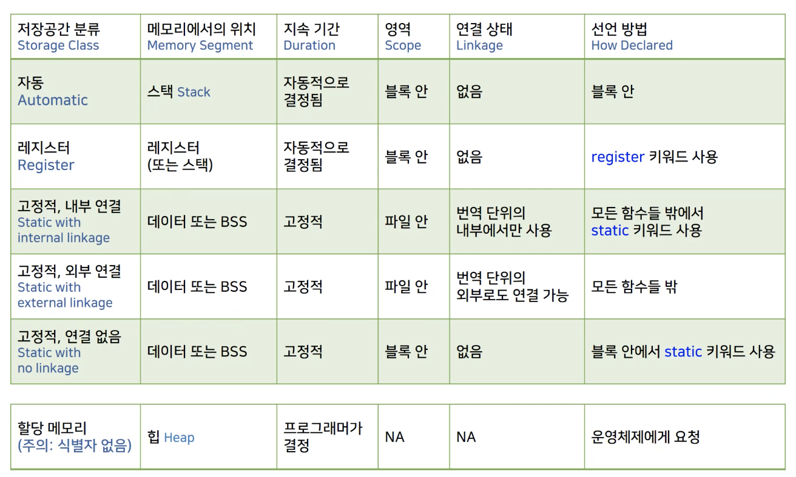

* 저장 공간의 분류는 두가지로도 나눌 수 있다
  * Static이 아닌것
    * Automatic
      * 모든 지역변수
      * 지속기간과 영역을 프로그래머가 지정 해 주는 것이 아니 꼭 필요한 기간에만 지속이 되고 필요한 부분에서만 볼 수 있도록 영역을 지정 해 줌
    * Register
      * CPU 안의 임시 작업 공간인 레지스터에 올라갈 가능성이 높아짐
      * 최신 Compiler 는 Register 선언을 하지 않아도 알아서 Register 를 사용하여 효율을 높여줌
  * Static
    * 프로그램이 시작될 때 부터 끝날 때 까지 메모리 공간에 유지
* Internal / External
  * 파일 단위의 내부 / 외부 사용

* Heap
  * 할당 메모리
  * 식별자 없음 / 주의


##### 12.5 자동 변수 Automatic Variables

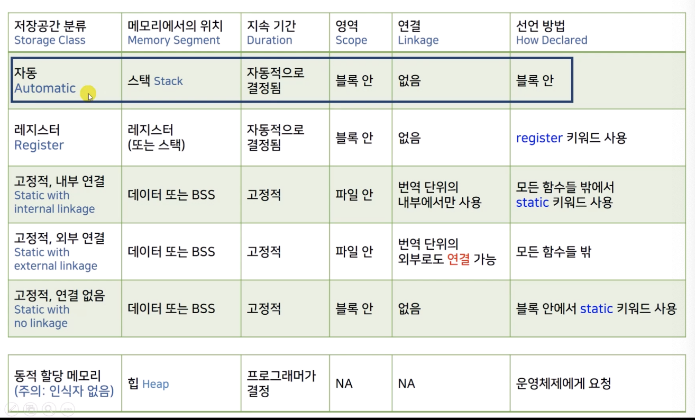


```c
#include <stdio.h>

/*
    Automatic storage class
    - Automatic storage duration, block scope, no linkage
    - Any variable declared in a block or function header
 */

int main(){
    auto int a; // Keyworld auto : a storage-class specifier
    a = 1024;
    //printf("%d\",a);
    //auto int b = a * 3;
    
    return 0;
}
```

* ```c
  auto int a;
  a = 1024;		// 초기화를 꼭 해주어야 함
  ```

  * auto 를 붙이지 않고 선언해도 자동 변수
  * 자동 변수는 stack 메모리 공간에서 빈번하게 사용 되기 때문에, 매번 Compiler 가 0으로 초기화를 해주기에는 비효율적
    * C 언어 표준에서는 초기화를 해주지 않음


```c
#include <stdio.h>

/*
    Automatic storage class
    - Automatic storage duration, block scope, no linkage
    - Any variable declared in a block or function header
 */

void func(int k);

int main(){
    
    int i = 1;
    int j = 2;
    
    printf("i %lld\n", (long long)&i);
    // i 140732920755320
    
    {
        int i = 3;  // name hiding
        printf("i %lld\n", (long long)&i);
        // i 140732920755312
        
        // j is visible here
        printf("j = %d\n", j);
        // j = 2
        
        int ii = 123;
    }
    // ii is not visiable here
    
    printf("i %lld\n", (long long)&i);
    // i 140732920755320
    
    for (int m = 1; m < 2; m++)
        printf("m %lld\n", (long long)&m);
        // m 140732920755304
    
    func(5);
    // i 140732920755256
    
    for (int m = 3; m < 4; m++){
        printf("m %lld\n", (long long)&m);
        // m 140732920755300
    }
    
    return 0;
}

void func(int k){
    int i = k * 2;
    
    printf("i %lld\n", (long long)&i);
}

```

* ```c
  func(5);
  ```

  * function 이 호출 되면 stack frame 이 변경
    * 이전의 변수 호출 불가
    * 함수가 끝나면 사용했던 메모리를 다른곳에서 사용 할 수 있도록 설계


##### 12.6 레지스터  Register 변수

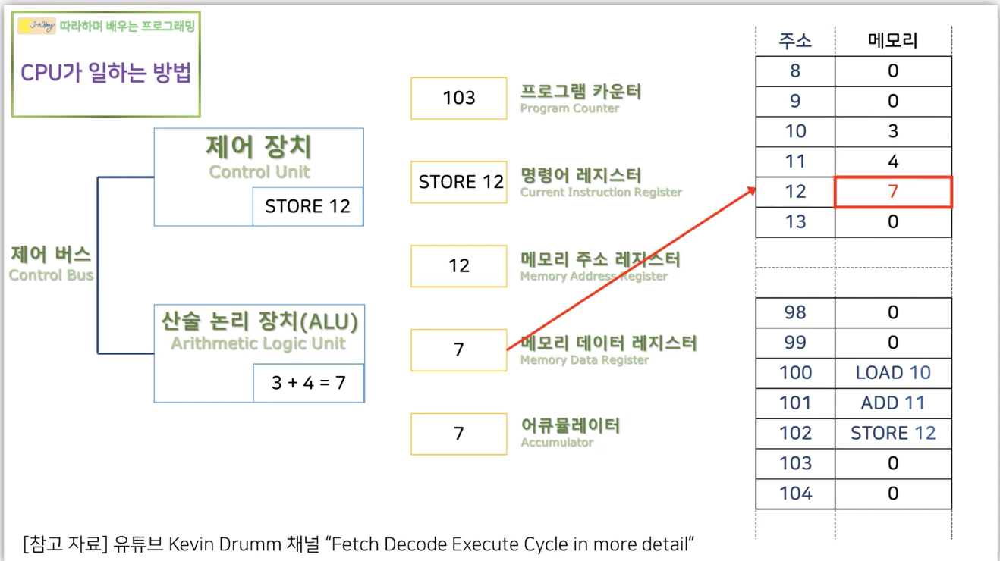

* 빠르게 동작하는 프로그램을 위해 변수를 메모리가 아닌 레지스터에 두고 빠르게 사용 할 수 있다


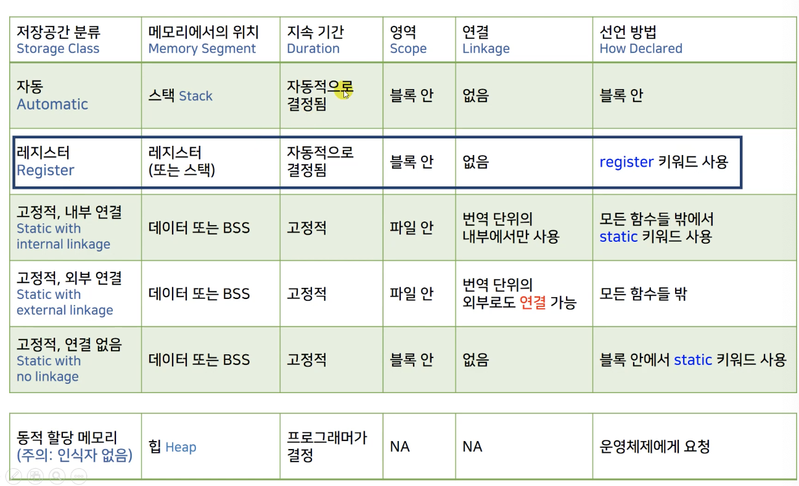

* register 키워드를 사용하여 선언 하여도 complier 가 꼭 받아들이지는 않음


```c
#include <stdio.h>

void temp(register int r){
    
}

int main(){
    register int r;
    r = 123;
    
		//int* ptr = &r;    // Error
    
    return 0;
}
```

* ```c
  //int* ptr = &r;    // Error
  ```

  * 레지스터의 주소값을 가져 올 수 없음


##### 12.7 블록 영역의 정적 변수 Static

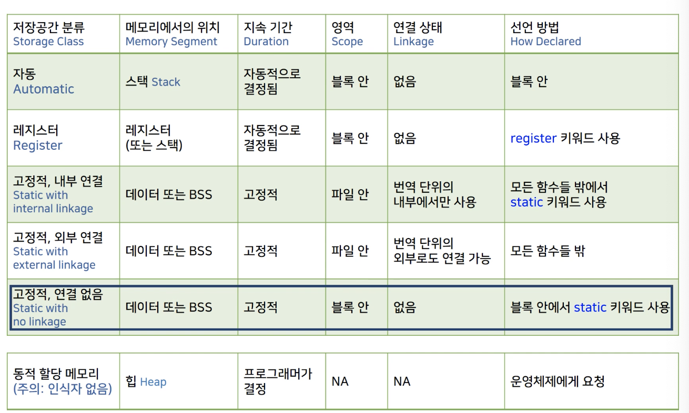

* 블록 밖에서 메모리 주소를 통해 접근이 가능하지만, 추천하지 않음
  * global 변수로 선언하는것이 좋음


```c
#include <stdio.h>

void count(){
    int ct = 0;
    printf("count = %d %lld\n", ct, (long long)&ct);
}

void static_count(){
    static int ct = 0;  // initialized only once!
    printf("static count = %d %lld\n", ct, (long long)&ct);
    ct++;
}

void counter_caller(){
    count();
}

void static_counter_caller(){
    static_count();
}

//int func(static int i); // Error

int main(){
    count();
  	// count = 0 140732920755292
    count();
  	// count = 0 140732920755292
    counter_caller();
  	// count = 0 140732920755276
    
    static_count();
  	// static count = 0 4295000080
    static_count();
  	// static count = 1 4295000080
    static_counter_caller();
  	// static count = 2 4295000080
  
    return 0;
}
```

* 출력

  ```c
  count = 0 140732920755292
  count = 0 140732920755292
  count = 0 140732920755276
  static count = 0 4295000080
  static count = 1 4295000080
  static count = 2 4295000080
  ```

  * 1, 2 번째 줄의 출력이 같은 이유는 변수와 함수의 갯수가 적어 우연히 같은 저장공간을 사용했기 때문
  * count 와 static_count 의 메모리 주소가 멀리 떨어져 있음
    * 자동 변수와 static 변수의 메모리 위치 참조


* ```c
  //int func(static int i); // Error
  ```
  * 함수가 실행 될 때 새로운 stack frame이 배정 되는데, 함수의 파라미터 변수는 함수가 실행이 될 때 메모리를 할당받기 때문에 static 변수가 될 수 없음


```c
int* count(){
    int ct = 0;
    printf("count = %d %lld\n", ct, (long long)&ct);
  	ct++;
  
  	return &ct;	// Error
}
```

* pointer 값을 함수의  return 값으로 받는것이 가능 하지만, function scope 변수인  ct는 함수가 종료되면서 할당받은 메모리가 사라지므로 ct의 주소값을 반환 할 수 없음


```c
int* static_count(){
    static int ct = 0;  // initialized only once!
    printf("static count = %d %lld\n", ct, (long long)&ct);
    ct++;
  
	  return &ct;
}
```

* 함수가 종료되어도 메모리 공간이 유지되는 static 변수이기 때문에 ct의 주소값 반환 가능
  * 하지만, 이렇게 사용하는 것 보다 전역변수로 사용하는 것이 더 권장


##### 12.8 정적 변수의 외부 연결 external linkage

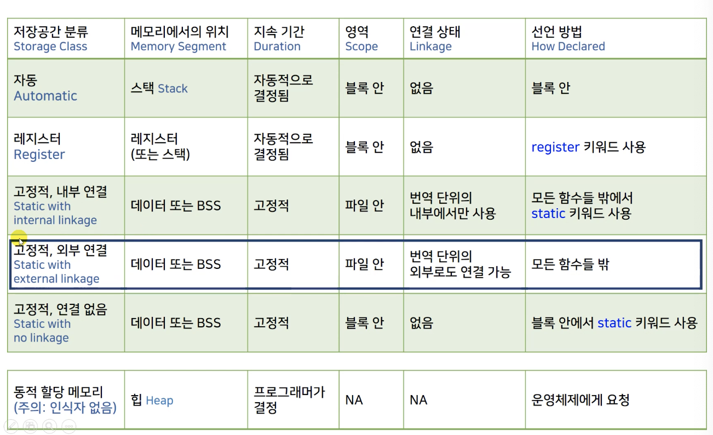

* 여러 파일로 작성된 코드를 각각의 파일을 complier 가 따로따로 complie 하여 obj 파일을 만들고, 실행파일을 만들기 전에 linker 가  연결
  * external linkage 를 갖는 변수들도 연결


```c
// main.c

#include <stdio.h>
#include "second.c"

/*
    Static variable with external linkage
    - File scope, external linkage, static storage duration
    - External storage class
    - External variables
 */

int g_int = 7;                  // static variable 은 complier 가 0으로 알아서 초기화 해줌
double g_arr[1000] = {0, 0, };  // 하지만 초기화 하는것이 권장

/*
    Initializing External Variables
 */
int x = 5;                  // ok, constant expression
int y = 1 + 2;              // ok, constant expression
size_t z = sizeof(int);     // ok, sizeof is a consant expression
//int x2 = 2 * x;           // not ok, x is a variable // 변수가 들어간 값으로 초기화 안됨


void func(){
    printf("g_int in func() %d %p\n", g_int, &g_int);
    g_int += 10;
}

int main(){
    /*
        defining declaration vs referencing declaration
     */
    
    //extern double g_arr[];
    //extern int g_int; // extern 을 사용해 file scope의 변수가 scope 에서 선언되는 것을 방지 가능
    
    //int g_int = 123;  // hiding global g_int, func() 에서는 global g_int 가 사용됨
    
    
    printf("g_int in main() %d %p\n", g_int, &g_int);
    g_int += 1;
    
    func();
    
    fun_sec();
    
    return 0;
}

//////////////////////////
//second.c
//
//  second.c
//  studyC
//
//  Created by 이주호 on 2021/04/05.
//

#include <stdio.h>

//extern int g_int = 777;   // file scope 에서는 초기화 가능, 하지만 각각의 파일에서 모두 초기화 하였을 때 Linkin Error


void temp(){
    //extern int g_int = 777;   // extern 변수는 block scope 초기화 불가
    extern int g_int;
    
    g_int += 1000;
}


void fun_sec(){
    temp();
    extern int g_int;
    
    g_int += 7;
    
    printf("g_int in fun_sec() %d %p\n", g_int, &g_int);
}
```


##### 12.9 정적 변수의 내부 연결 internal linkage


* 여러곳에서 사용하는 전역 변수의 사용을 권장하지 않음

* extern 으로 호출한 곳에서 초기화를 권장하지 않음

  * file scope 에서 선언 시 초기화 권장

* file scope 변수의 범위를 file 내로 고정 하려면 static 으로 선언

  ```c
  static int g_int = 10;
  ```
  * extern 으로 호출 불가능


##### 12.10 변수의 저장 공간 분류 요약 정리

##### 12.11 함수의 저장 공간 분류

```c
// main.c
#include <stdio.h>

/*
    Storage Classes and Functions
    - Functions external (by defualt) or static
    - A function declaration is assumed to be extern
*/

int g_int = 123;    // defining declaration

void fun(void);         // extern void fun(void);
void fun_second(void);  // extern void fun_second(void);

int main(){
    fun();
  	// g_int is fun() 124 0x100008010
    fun_second();
  	// g_int in fun_second() 125 0x100008010
    
    return 0;
}

void fun(){
    extern int g_int;   // optional
    
    g_int += 1;
    printf("g_int is fun() %d %p\n", g_int, &g_int); 
}

// second.c
#include <stdio.h>

extern int g_int;

void fun_second(void){
    g_int += 1;
    printf("g_int in fun_second() %d %p\n", g_int, &g_int);
}
```


```c
#include <stdio.h>

static void tool(void){
		// do something!  
}
void fun_second(void){
    tool();
}
```

* 함수에도  static 선언 가능

  * 외부 함수에서 모듈화된 함수를 사용하지 못하게 막는 용도로 사용
  * 함수의 body가 아닌 prototype 에서만  static 선언을 하여도 static function 으로 선언 됨

  