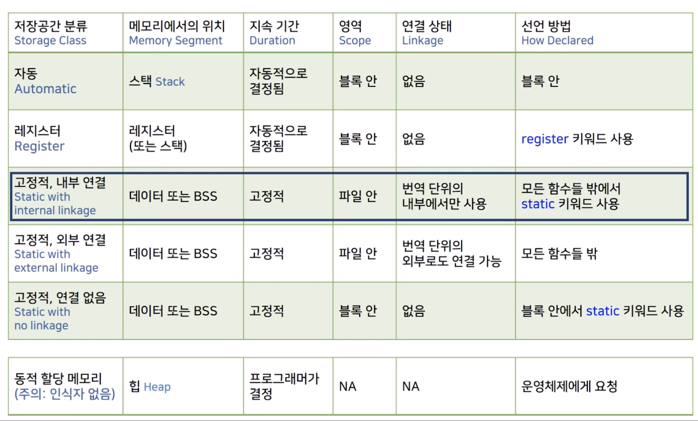
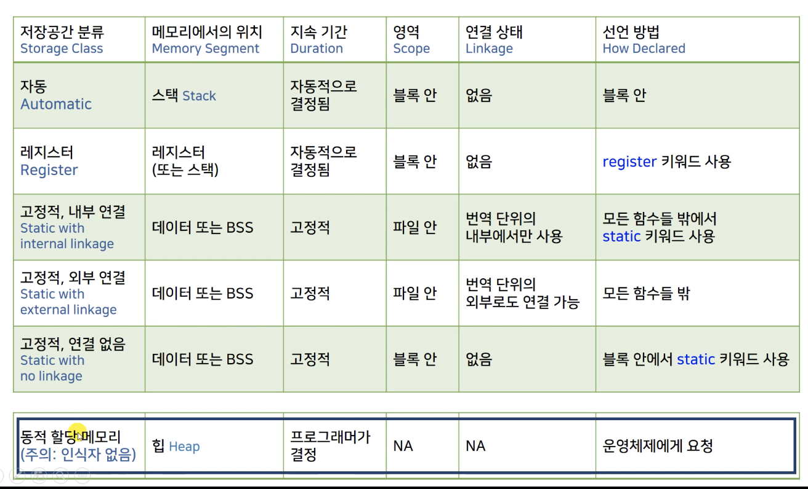
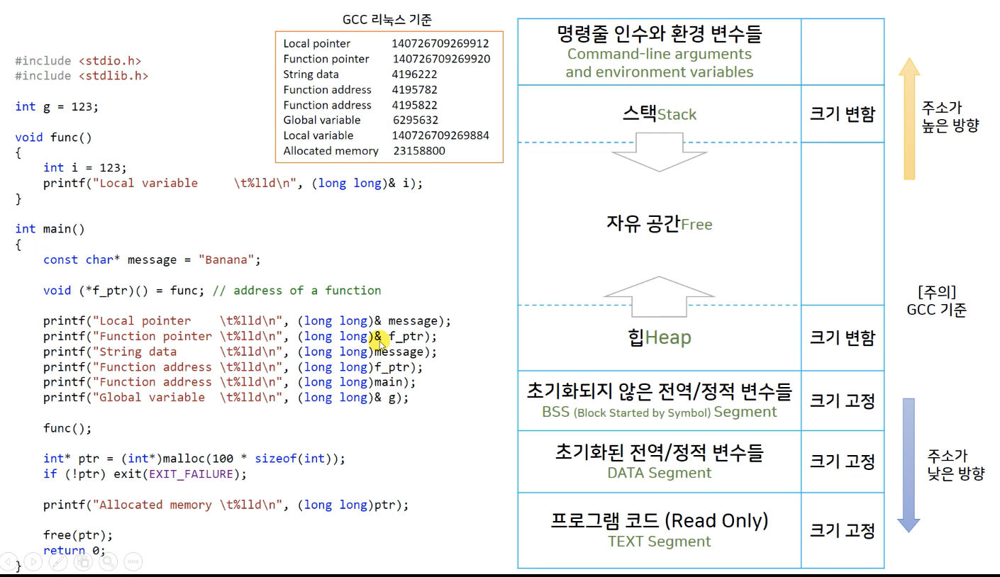
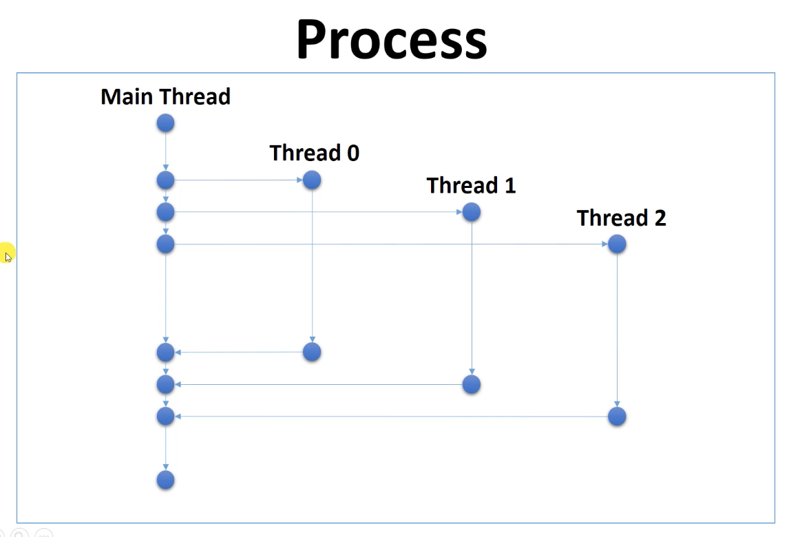

# 따배씨 - 따라하며 배우는 C언어

### 12강 Storage Classes, Linkage and Memory Management

##### 12.1 메모리 레이아웃 훑어보기


* 프로그램 코드는 변형이 되면 안되기 때문에 TEXT Segment 에 읽기 전용으로 저장됨
  * 프로그램이 실행되면서 코드도 프로그램이 종료 될 때 까지 메모리 계속 존재


* 전역변수들도 프로그램 코드와 마찬가지로 프로그램이 종료 될 때까지 메모리에 저장되어 있음


* 전역변수로 메모르를 선언하는것이 가장 편하지만, 프로그램이 끝날 때 까지 메모리가 할당 되어 있는것은 비 효율적임


* 블럭 안에서 선언되는 메모리는 stack 에 할당, 그 블럭이 실행되는 동안에만 메모리에 할당되고 블럭의 실행이 종료되면 운영체제에게 메모리 권한을 넘겨줌
  * 효율적인 메모리 사용 가능
  * main() 함수에 선언된 변수의 메모리는, main 함수의 특성상 프로그램이 종료될때 까지 유지되므로 전역변수에서 선언한 것 처럼 할당 됨
    * 
      * 함수를 호출하는 방법으로 큰 메모리를 사용하는것이 더 효율적
* stack 메모리의 관리는 운영체제가 하는것이 원칙이나, 프로그램 실행시 stack 메모리의 크기가 할당되는것 compile 단계에서 결정됨
  * stack 의 메모리가 늘었다 해제되었다 하는 동작이 매우 빠름
  * stack에 선언된 지역 변수들은 속도가 빠름


* 프로그램의 대부분의 경우 메모리를 예측하기 힘듬
  * Compile 단계에서 메모리 크기를 미리 할당해 주기가 어려움
* Heap 메모리 공간을 사용하여 필요한 순간마다 공간을 할당받아 사용
  * 자유 공간을 stack 메모리와 함께 사용하면서 메모리 주소가 겹치는 문제가 발생 할수 있는것을 가상 메모리 주소를 사용하는것으로 해결
  * Heap 영역의 메모리는 다 사용한 메모리를 반납해야 함
  * 메모리를 관리하는 운영체제에 직접 호출하여 할당받고 반납하며 사용하기 때문에 느리게 동작
* c 는 unmanaged memory 언어


##### 12.2 객체 Object 와 시별자 Identifier, L-value 와 R-value

```c
#include <stdio.h>

int main(){
    /*
        Object
        - "An Object is simply a block of memory that can sotre a value."
        - Object has more developed meaning in C++ and Object Oriented Programming

        Identifiers
        - Names of variables, function, macros, amd other entities
     */
    
    int var_name = 3;       // creates an object called "var_name".
    
    int* pt = &var_name;    // pt is an identifier.
    *pt = 1;                // *pt is not an identifier. *pt designates an object.
    
    int arr[100];           // arr is an identifer.
    arr[0] = 7;             // arr[0] is an object
  
    
    
    /*
        lvalue is expression "referring" to an object.
        refer : 참조 자,
        referring : 참조,  또 다른 이름처럼 사용
     
        L-value : left side of and assignment
        R-value : right side, variable, constant, expression
     */
    
    var_name = 3;           // modifiable lvalue
    
    pt = &var_name;         // modifiable lvalue
    int* ptr = arr;
    *pt = 7;                // *pt is not an identifier but and modifiable lvalue expression
    
    int *ptr2 = arr + 2 * var_name;     // address rvalue
    *(arr + 2 * var_name) = 456;        // lvalue expression
    
    const char* str = "Constant string";    // str is a modeifiable lavalue
    str = "Second string";                  // "Constant string" = "Second String" // impossible
    // str[0] = 'A'; Error
    
    char str2[] = "String in an array";
	  //str2[] = "Second string"; Error
    str2[0] = 'A';  // OK
    
    return 0;
}

```

* Object - 객체

  * C 언어에서는 값을 저장하는 메모리 공간을 가지고 있으면 Object
  * OOP 언어에서는 C 언어의 Object 개념을 확장

* Identifier - 식별자

  * 이름 - 변수의 이름, 함수의 이름 등

* ```c
  int var_name = 3;
  ```

  * int 형이 저장되도록 할당된 메모리 공간에 3이라는 값을 복사해서 넣어줌
  * 메모리 공간에 접근 시 var_name 라는 이름을 통해서, Object 를 직접 사용하는 것 처럼 작동

* ```c
  *pt = 1; 
  ```

  * *pt 는 표현식으로서, Object 를 가리킴
  * Identifier 가 아님 / pt 는 Identifer

* ```c
  int arr[100]; 
  ```

  * arr 은 배열의 첫번째 주소 이므로, 메모리 공간을 갖는 Object 는 아님

  * ```c
    arr[0] = 7;
    ```

    * arr[0] 는 메모리 공간을 사용할 수 있으므로, Object

* ```c
  *(arr + 2 * var_name) = 456;
  ```

  * '*' (indirection operator) 를 붙여 줌으로써, L-value expression 으로 사용 / 주소값

* ```c
  const char* str = "Constant string";
  ```

  * 포인터로 선언된 str 은 문자열 상수 "Constant string" 의 주소값이 저장됨

  * ```c
    str = "Second string";
    ```

    * str 은 문자열 상수의 주소값이 변경 가능하므로 새로운 문자열 대입 가능

  * ```c
    // str[0] = 'A'; Error
    ```

    * 문자열 상수는 Read-Only 이기 때문에 문자열의 내용을 수정 할 수 없음

* ```c
  char str2[] = "String in an array";
  ```

  * 배열로 선언된 str2 는 문자열 각각의 문자를 저장하는 배열을 만들어 값을 저장

  * ```c
    //str2[] = "Second string"; Error
    ```

    * 배열로 선언 되었기 때문에, 메모리 크기에 대한 변경이 불가능하여 새로운 문자열 대입 불가능

  * ```c
    str2[0] = 'A';  // OK
    ```

    * 배열 내부의 값 변경 가능


##### 12.3 변수의 영역 Scope 과 연결 상태 Linkage, 객체의 지속 기간 Duration

```c
#include <stdio.h>

/*
    Variable scopes (visibility)
    - block, function, function prototype, file.
 */


// file scope
int g_i = 123;  // global variable
int g_j;      // global variable


void func1(){
    g_i++;  // uses g_i
}

void func2(){
    g_i += 2;  // uses g_i
    
    // local = 456; // Error
}

int main(){
    // main function scope
    int local = 1234;
    
    func1();
    func2();
    
    printf("%d\n", g_i);    // uses g_i
  	// 126
    printf("%d\n", g_j);    // Not initialized
  	// 0
    printf("%d\n", local);
  	// 1234
    
    return 0;
}
```

* ```c
  printf("%d\n", g_j);    // Not initialized
  // 0
  ```

  * 초기화 되지 않은 정적 변수는 BSS 메모리 공간에 저장되고, 프로그램이 시작 될 때 모두 0으로 초기화
    * 효율을 위해 일괄 처리


```c
#include <stdio.h>

/*
    Variable scopes (visibility)
    - block, function, function prototype, file.
 */


// function prototype scope
void f1(int hello, double world);   // to the end fo the protoytpe declaraion
// void vla_param(int n, int m, double ar[n][m]);   // gcc only

// functin scope
double func_block(double d){
    double p = 0.0;
    
    int i;
    for (i = 0; i < 10; i++){
        double q = d * i;
        p *= q;
        
        if (i == 5)
            goto hello;
    }
hello:
    printf("Hello, world");
    return p;
}

int main(){
    func_block(1.0);
}

void f1(int hello, double wold){
    
}
```

* ```c
  double func_block(double d){
      double p = 0.0;
      
      int i;
      for (i = 0; i < 10; i++){
          double q = d * i;
          p *= q;
          
          if (i == 5)
              goto hello;
      }
  hello:
      printf("Hello, world");
      return p;
  }
  ```

  * goto 문은 동작을 위해 자동으로 function scope 로 범위가 확장

* block scope 는 function scope와 비슷하나, function 을 선언하지 않아도 block만 지정하면 block scope 가능


```c
// main.c
#include <stdio.h>

/*
    Linkage
 
    Variables with block scope, function scope, or function prototype scope
    - No linkage
 
    File scope variables
    - External or internal linkage
 */

int el;             // file scope with external linkage (global varible)
static int il;      // file scope with inernal inkage

void testLinkage();

int main(){
    el = 1024;
    
    testLinkage();
    
    printf("%d\n", el);
  	// 1025
    
    return 0;
}

/* ------------------------- */
// second.c
#include <stdio.h>

extern int el;      // 다른 파일에 선언한 변수를 사용
// extern in il;

void testLinkage(){
    printf("DoSomething called\n");
  	// DoSomething called

    printf("%d\n", el);
  	// 1024
    
    //printf("%d\n", il);
    //printf("%d\n", dodgers);
    
    el++;
}
```

* ```c
  extern int el;
  ```

  * extern 선언으로 다른 파일에서 선언한 file scope 변수를 호출 가능

* ```c
  static int il;
  ```

  * 현재 file scope 로 scope 제한
    * 다른 file 에서 extrn으로 사용 하려고 할 시, link error 발생


```c
#include <stdio.h>

/*
    Storage duration: // duration : 메모리의 지속기간
    - static storage duration       // 프로그램이 시작될때 부터 끝날때 까지 메모리를 유지
    (Note : 'static' keword indicates the linkage type, not the storage duration)
    - automatic storage duration    // 일반적으로 지역변수, scope 에 따라서 메모리 사용
    - allocated storage duration    // 동적할당
    - thread storage duration       // Multi Threading - 고급프로그래밍 기술
 */

void count()
{
    int ct = 0;
    printf("count = %d\n", ct);
    ct++;
}

void static_count(){
    static int ct = 0;
    printf("static count = %d\n", ct);
    ct++;
}

int main(){
    count();
  	// count = 0
    count();
  	// count = 0
    static_count();
  	// static count = 0
    static_count();
  	// static count = 0
    
    return 0;
}
```

* ```c
  void static_count(){
      static int ct = 0;
      printf("static count = %d\n", ct);
      ct++;
  }
  ```

  * 함수 scope 에서 static 으로 선언한 변수는 static storage duration
    * 프로그램이 시작 될 때 메모리가 할당되고, 프로그램이 끝날 때 까지 메모리가 유지


##### 12.4 저장 공간의 다섯 가지 분류 Five Storage Classes


* 저장 공간의 분류는 두가지로도 나눌 수 있다
  * Static이 아닌것
    * Automatic
      * 모든 지역변수
      * 지속기간과 영역을 프로그래머가 지정 해 주는 것이 아니 꼭 필요한 기간에만 지속이 되고 필요한 부분에서만 볼 수 있도록 영역을 지정 해 줌
    * Register
      * CPU 안의 임시 작업 공간인 레지스터에 올라갈 가능성이 높아짐
      * 최신 Compiler 는 Register 선언을 하지 않아도 알아서 Register 를 사용하여 효율을 높여줌
  * Static
    * 프로그램이 시작될 때 부터 끝날 때 까지 메모리 공간에 유지
* Internal / External
  * 파일 단위의 내부 / 외부 사용

* Heap
  * 할당 메모리
  * 식별자 없음 / 주의


##### 12.5 자동 변수 Automatic Variables


```c
#include <stdio.h>

/*
    Automatic storage class
    - Automatic storage duration, block scope, no linkage
    - Any variable declared in a block or function header
 */

int main(){
    auto int a; // Keyworld auto : a storage-class specifier
    a = 1024;
    //printf("%d\",a);
    //auto int b = a * 3;
    
    return 0;
}
```

* ```c
  auto int a;
  a = 1024;		// 초기화를 꼭 해주어야 함
  ```

  * auto 를 붙이지 않고 선언해도 자동 변수
  * 자동 변수는 stack 메모리 공간에서 빈번하게 사용 되기 때문에, 매번 Compiler 가 0으로 초기화를 해주기에는 비효율적
    * C 언어 표준에서는 초기화를 해주지 않음


```c
#include <stdio.h>

/*
    Automatic storage class
    - Automatic storage duration, block scope, no linkage
    - Any variable declared in a block or function header
 */

void func(int k);

int main(){
    
    int i = 1;
    int j = 2;
    
    printf("i %lld\n", (long long)&i);
    // i 140732920755320
    
    {
        int i = 3;  // name hiding
        printf("i %lld\n", (long long)&i);
        // i 140732920755312
        
        // j is visible here
        printf("j = %d\n", j);
        // j = 2
        
        int ii = 123;
    }
    // ii is not visiable here
    
    printf("i %lld\n", (long long)&i);
    // i 140732920755320
    
    for (int m = 1; m < 2; m++)
        printf("m %lld\n", (long long)&m);
        // m 140732920755304
    
    func(5);
    // i 140732920755256
    
    for (int m = 3; m < 4; m++){
        printf("m %lld\n", (long long)&m);
        // m 140732920755300
    }
    
    return 0;
}

void func(int k){
    int i = k * 2;
    
    printf("i %lld\n", (long long)&i);
}

```

* ```c
  func(5);
  ```

  * function 이 호출 되면 stack frame 이 변경
    * 이전의 변수 호출 불가
    * 함수가 끝나면 사용했던 메모리를 다른곳에서 사용 할 수 있도록 설계


##### 12.6 레지스터  Register 변수


* 빠르게 동작하는 프로그램을 위해 변수를 메모리가 아닌 레지스터에 두고 빠르게 사용 할 수 있다


* register 키워드를 사용하여 선언 하여도 complier 가 꼭 받아들이지는 않음


```c
#include <stdio.h>

void temp(register int r){
    
}

int main(){
    register int r;
    r = 123;
    
		//int* ptr = &r;    // Error
    
    return 0;
}
```

* ```c
  //int* ptr = &r;    // Error
  ```

  * 레지스터의 주소값을 가져 올 수 없음


##### 12.7 블록 영역의 정적 변수 Static


* 블록 밖에서 메모리 주소를 통해 접근이 가능하지만, 추천하지 않음
  * global 변수로 선언하는것이 좋음


```c
#include <stdio.h>

void count(){
    int ct = 0;
    printf("count = %d %lld\n", ct, (long long)&ct);
}

void static_count(){
    static int ct = 0;  // initialized only once!
    printf("static count = %d %lld\n", ct, (long long)&ct);
    ct++;
}

void counter_caller(){
    count();
}

void static_counter_caller(){
    static_count();
}

//int func(static int i); // Error

int main(){
    count();
  	// count = 0 140732920755292
    count();
  	// count = 0 140732920755292
    counter_caller();
  	// count = 0 140732920755276
    
    static_count();
  	// static count = 0 4295000080
    static_count();
  	// static count = 1 4295000080
    static_counter_caller();
  	// static count = 2 4295000080
  
    return 0;
}
```

* 출력

  ```c
  count = 0 140732920755292
  count = 0 140732920755292
  count = 0 140732920755276
  static count = 0 4295000080
  static count = 1 4295000080
  static count = 2 4295000080
  ```

  * 1, 2 번째 줄의 출력이 같은 이유는 변수와 함수의 갯수가 적어 우연히 같은 저장공간을 사용했기 때문
  * count 와 static_count 의 메모리 주소가 멀리 떨어져 있음
    * 자동 변수와 static 변수의 메모리 위치 참조


* ```c
  //int func(static int i); // Error
  ```

  * 함수가 실행 될 때 새로운 stack frame이 배정 되는데, 함수의 파라미터 변수는 함수가 실행이 될 때 메모리를 할당받기 때문에 static 변수가 될 수 없음


```c
int* count(){
    int ct = 0;
    printf("count = %d %lld\n", ct, (long long)&ct);
  	ct++;
  
  	return &ct;	// Error
}
```

* pointer 값을 함수의  return 값으로 받는것이 가능 하지만, function scope 변수인  ct는 함수가 종료되면서 할당받은 메모리가 사라지므로 ct의 주소값을 반환 할 수 없음


```c
int* static_count(){
    static int ct = 0;  // initialized only once!
    printf("static count = %d %lld\n", ct, (long long)&ct);
    ct++;
  
	  return &ct;
}
```

* 함수가 종료되어도 메모리 공간이 유지되는 static 변수이기 때문에 ct의 주소값 반환 가능
  * 하지만, 이렇게 사용하는 것 보다 전역변수로 사용하는 것이 더 권장


##### 12.8 정적 변수의 외부 연결 external linkage


* 여러 파일로 작성된 코드를 각각의 파일을 complier 가 따로따로 complie 하여 obj 파일을 만들고, 실행파일을 만들기 전에 linker 가  연결
  * external linkage 를 갖는 변수들도 연결


```c
// main.c

#include <stdio.h>
#include "second.c"

/*
    Static variable with external linkage
    - File scope, external linkage, static storage duration
    - External storage class
    - External variables
 */

int g_int = 7;                  // static variable 은 complier 가 0으로 알아서 초기화 해줌
double g_arr[1000] = {0, 0, };  // 하지만 초기화 하는것이 권장

/*
    Initializing External Variables
 */
int x = 5;                  // ok, constant expression
int y = 1 + 2;              // ok, constant expression
size_t z = sizeof(int);     // ok, sizeof is a consant expression
//int x2 = 2 * x;           // not ok, x is a variable // 변수가 들어간 값으로 초기화 안됨


void func(){
    printf("g_int in func() %d %p\n", g_int, &g_int);
    g_int += 10;
}

int main(){
    /*
        defining declaration vs referencing declaration
     */
    
    //extern double g_arr[];
    //extern int g_int; // extern 을 사용해 file scope의 변수가 scope 에서 선언되는 것을 방지 가능
    
    //int g_int = 123;  // hiding global g_int, func() 에서는 global g_int 가 사용됨
    
    
    printf("g_int in main() %d %p\n", g_int, &g_int);
    g_int += 1;
    
    func();
    
    fun_sec();
    
    return 0;
}

//////////////////////////
//second.c
//
//  second.c
//  studyC
//
//  Created by 이주호 on 2021/04/05.
//

#include <stdio.h>

//extern int g_int = 777;   // file scope 에서는 초기화 가능, 하지만 각각의 파일에서 모두 초기화 하였을 때 Linkin Error


void temp(){
    //extern int g_int = 777;   // extern 변수는 block scope 초기화 불가
    extern int g_int;
    
    g_int += 1000;
}


void fun_sec(){
    temp();
    extern int g_int;
    
    g_int += 7;
    
    printf("g_int in fun_sec() %d %p\n", g_int, &g_int);
}
```


##### 12.9 정적 변수의 내부 연결 internal linkage



* 여러곳에서 사용하는 전역 변수의 사용을 권장하지 않음

* extern 으로 호출한 곳에서 초기화를 권장하지 않음

  * file scope 에서 선언 시 초기화 권장

* file scope 변수의 범위를 file 내로 고정 하려면 static 으로 선언

  ```c
  static int g_int = 10;
  ```

  * extern 으로 호출 불가능


##### 12.10 변수의 저장 공간 분류 요약 정리

##### 12.11 함수의 저장 공간 분류

```c
// main.c
#include <stdio.h>

/*
    Storage Classes and Functions
    - Functions external (by defualt) or static
    - A function declaration is assumed to be extern
*/

int g_int = 123;    // defining declaration

void fun(void);         // extern void fun(void);
void fun_second(void);  // extern void fun_second(void);

int main(){
    fun();
  	// g_int is fun() 124 0x100008010
    fun_second();
  	// g_int in fun_second() 125 0x100008010
    
    return 0;
}

void fun(){
    extern int g_int;   // optional
    
    g_int += 1;
    printf("g_int is fun() %d %p\n", g_int, &g_int); 
}

// second.c
#include <stdio.h>

extern int g_int;

void fun_second(void){
    g_int += 1;
    printf("g_int in fun_second() %d %p\n", g_int, &g_int);
}
```


```c
#include <stdio.h>

static void tool(void){
		// do something!  
}
void fun_second(void){
    tool();
}
```

* 함수에도  static 선언 가능

  * 외부 함수에서 모듈화된 함수를 사용하지 못하게 막는 용도로 사용
  * 함수의 body가 아닌 prototype 에서만  static 선언을 하여도 static function 으로 선언 됨

  

##### 12.12 난수 생성기 모듈 만들기 예제

```c
#include <stdio.h>
#include <stdlib.h>
#include <time.h>

int main(){
    /*
        rand()
        - 0 to RAND_MAX (typically INT_MAX)
        - defined in stdlib.h.
     */
    
//    srand(1); // random seed, seed 값을 바꾸면 다른 랜덤 값이 나옴
    srand((unsigned int)time(0));   // seed 값을 매번 바꾸기 위해, time 함수를 이용
    
    for (int i = 0; i < 10; ++i){
        printf("%d\n", rand());
//        printf("%d\n", rand() % 6 + 1);
    }
    
    return 0;
}
```

* ```c
  srand(num);
  ```

  * rand() 함수의 seed 값을 입력하여, rand 함수의 결과의 양상이 달라지도록 함


```c
#include <stdio.h>

int main(){
    unsigned int next = 1;
    
    for (int  i = 0; i < 10; ++i){
        next = next * 1103515245 + 1234;
        next = (unsigned int) (next / 65536) % 32768;
        printf("%d\n", (int)next);
    }
    return 0;
}
```

* rand() 함수의 내부 알고리즘 중 하나

  * seed 값을 next 값으로 설정

  * ```c
    next = next * 1103515245 + 1234;
    ```

    * over flow 를 이용

  * ```c
    next = (unsigned int) (next / 65536) % 32768;
    ```

    * int 형과 자리수를 맞추는 단계


```c
// main.c
#include <stdio.h>
#include <time.h>
#include "my_rand.h"

int main(){
    my_srand((unsigned int)time(0));
    
    for (int i = 0; i < 10; ++i){
        printf("%d\n", my_rand() % 6 + 1);
    }
    return 0;
}


// my_rand.h

#define my_rand_h

#include <stdio.h>

void my_srand(unsigned int);
int my_rand(void);

#endif /* my_rand_h */

// my_rand.c
#include "my_rand.h"

static unsigned int next = 1;

void my_srand(unsigned int seed){
    next = seed;
}

int my_rand(){
    next = next * 1103515245 + 1234;
    next = (unsigned int) (next / 65536) % 32768;
    
    return (int)next;
}
```


##### 12.13 메모리 동적 할당  Dynamic Storage Allocation



* 동적 할당 메모리는 포인터만 가져오고 인식자가 없음
* Heap 메모리 영역에 저장, 프로그래머가 반납하기 전까지 유지
  * 프로그램이 종료되면 자동 반납
* 필요한 메모리의 크기를 미리 알 수 없을 경우 사용
  * Runtime 에 메모리 크기가 결정되는 경우, VLA 가변 길이 배열 등


```c
#include <stdio.h>
#include <stdlib.h> // malloc(), free()

int main(){
    /*
        malloc() returns a void type pointer.
        void% : generic pointer
     
        free() deallocates the memory
     */
    
    double* ptr = NULL;
    
    ptr = (double*)malloc(30 * sizeof(double));
    
    if (ptr == NULL){
        puts("Memory allocation failed.");
        
        /*
            exit(EXIT_FAILURE) is similar to return 1 IN main().
            exit(EXIT_SUCCESS) is similar to return 0 IN main().
         */
        
        exit(EXIT_FAILURE);
    }
    
    printf("Before free %p\n", ptr);
  	// Before free 0x100611950
    
    free(ptr);
    
    printf("After free %p\n", ptr);
  	// After free 0x100611950
    
    ptr = NULL; // optional
    
    return 0;
}

```

* ```c
  double* ptr = NULL;
  ptr = (double*)malloc(30 * sizeof(double));
  ```

  * 운영체제에게 메모리를 요청할때는 Memory allocation - malloc() 함수 사용

    * ```c
      malloc(필요한 공간 입력, size_t type);
      ```

      * 입력한 공간 만큼 heap 메모리 공간을 할당
      * 할당된 연속된 메모리 공간의 첫번째 주소를 반환
      * 반환 값은 void 형의 pointer - generic pointer

    * ```c
      (double*)malloc(필요한 공간 입력, size_t type);
      ```

      * 반환 된 void 형의 pointer 값을 double 형의 pointer 로 변환

* ```c
  if (ptr == NULL){
    exit(EXIT_FAILURE);
  }
  ```

  * 메모리 공간이 할당되지 않았을 때의 Error 처리

  * ```c
    exit(EXIT_FAILURE);
    ```

    * 어떤 위치에서든 프로그램 강제 종료

* ```c
  free(ptr);    
  ptr = NULL; // optional
  ```

  * 메모리를 반환 하여도 ptr 값은 메모리 주소를 가르키고 있으므로, NULL 처리 하는것이 좋다


```c
#include <stdio.h>
#include <stdlib.h> // malloc(), free()

int main(){
    /*
        Dynamically Allocated Array
     */
    int n = 5;
    double* ptr = (double*)malloc(n * sizeof(double));
    
    if (ptr != NULL){
        for (int i = 0; i < n; ++i)
            printf("%f ", ptr[i]);
        printf("\n");
        
        for (int i = 0; i < n; ++i)
            *(ptr + i) = (double)i;
        
        for (int i = 0; i < n; ++i)
            printf("%f ", ptr[i]);
        printf("\n");
    }
    
    free(ptr);
    ptr = NULL;
    
    return 0;
}
```

* 동적 할당 메모리를 길이가 변할 수 있는 배열처럼 사용 가능, VLA 보다 동적 할당 메모리가 선호됨
  * 동적 할당 메모리를 배열로 사용하면 크기를 변화시키는 것이 가능한 것이 장점
  * VLA 는 stack 영역(컴파일러에 따라 다름), 동적할당 메모리는 Heap 영역
  * Heap 영역의 크기가 stack의 크기보다 큼


##### 12.14 메모리 누수 Leak 와 free() 의 중요성

```c
#include <stdio.h>
#include <stdlib.h>

int main(){
    printf("Dummy Output\n");
    
    {
        // Heap Memory가 할당되는 block
        int  n = 100000000;
        
        // Heap 메모리 공간 요청, 시작 주소값 ptr 에 저장
        int* ptr = (int*)malloc(n * sizeof(int));
        
        if (!ptr)// if(ptr == NULL)
        {
            printf("Malloc() failed\n");
            exit(EXIT_FAILURE);
        }
        
        for (int i = 0; i < n; ++i)
            ptr[i] = i+1;
        
        printf("Dummy Output\n");
    }
    // Heap Memory가 할당되는 block이 끝나도 ptr 에 저장된 주소값은 사라지지만
    // 할당된 Heap Memory는 남아 있고, 접근할 방법도 없어져 버림
    
    printf("Dummy Output\n");
    
    return 0;
}
```

* block이 끝나버려, ptr를 통해 메모리 접근을 할수 없음

* 하지만 free() 선언을 하지 않았기 때문에, 동적 할당 받은 Heap 메모리 공간은 유지가 됨

  * 메모리 누수 발생

* ```c
  free(ptr);
  ptr = NULL
  ```

  * 메모리 반환을 해 주어야함

* block 에서 동적 할당 받은 메모리 주소 값을 backup 을 해 두는 방법도 있다

  * ```c
    int* ptr_backup
    {
    		// 
      	ptr_backup = ptr;
      	//
    }
    //
    free(ptr_free);
    ```


##### 12.15 동적 할당 메모리를 배열처럼 사용하기

```c
#include <stdio.h>
#include <stdlib.h>

int main(){
    /*
        One variable
     */
    
    int* ptr = NULL;
    
    ptr = (int*)malloc(sizeof(int)*1);
    if (!ptr) exit(1);
    
    *ptr = 1024 * 3;
    printf("%d\n", *ptr);
    
    free(ptr);
    ptr = NULL;
    
    return 0;
}
```

* 변수 하나를 동적 할당으로 사용


```c
#include <stdio.h>
#include <stdlib.h>

int main(){
    /*
        1D array
     */
    
    int n = 3;
    int* ptr = (int*)malloc(sizeof(int) * n);
    
    if(!ptr) exit(1);
    
    ptr[0] = 123;
    *(ptr + 1) = 456;
    *(ptr + 2) = 789;
    
    free(ptr);
    ptr = NULL;
    
    return 0;
}
```

* ```c
  *(ptr + 1) = 456;
  ```

  * *(ptr+1) = ptr 주소 값 + int size  = ptr[1]


```c
#include <stdio.h>
#include <stdlib.h>

int main(){
    /*
        2D array
     */
    
    int row = 3, col = 2;
    int(*ptr2d)[2] = (int(*)[2])malloc(sizeof(int) * row * col);
    //int(*ptr2d)[col] = (int(*)[col])malloc(sizeof(int) * row * col); // VLA
    
    if (!ptr2d) exit(1);
    
    for (int r = 0; r < row; r++)
        for (int c = 0; c < col; c++)
            ptr2d[r][c] = c + col * r;
    
    for (int r = 0; r < row; r++){
        for (int c = 0; c <col; c++)
            printf("%d ", ptr2d[r][c]);
        printf("\n");
    }
    
    return 0;
}
```

* ```c
  int(*ptr2d)[2] = (int(*)[2])malloc(sizeof(int) * row * col);
  ```

  * 동적 할당을 이용했지만, col 갯수는 지정되어 있어서 효용성이 떨어짐


```c
#include <stdio.h>
#include <stdlib.h>

int main(){
    /*
        Using 1D arrays as 2D arrays
     
        row = 3, col = 2
     
        (r, c)
     
        2D
        (0, 0), (0, 1)
        (1, 0), (1, 1)
        (2, 0), (2, 1)
     
        1D
        (0, 0) (0, 1) (1, 0) (1, 1) (2, 0) (2, 1)
        0      1      2      3      4      5        = c + col * r
     */
    
    int row = 3, col = 2;
    int* ptr = (int*)malloc(sizeof(int) * row * col);
    
    if (!ptr) exit(1);
    
    for (int r = 0; r < row; r++)
        for (int c = 0; c < col; c++)
            ptr[c + col * r] = c + col * r;
    
    for (int r = 0; r < row ; r++){
        for (int c = 0; c < col; c++)
            printf("%d ", *(ptr + c + col * r));
        printf("\n");
    }
    
    return 0;
}
```

* 동적 할당 1차원 배열을, 2차원 배열로 사용


```c
#include <stdio.h>
#include <stdlib.h>

int main(){
    /*
        Using 1D arrays as 3D arrays
     
        row = 3, col = 2, depth = 2
     
        (r, c, d)
     
        3D
        -------------------
        (0, 0, 0) (0, 1, 0)
        (1, 0, 0) (1, 1, 0)
        (2, 0, 0) (2, 1, 0)
        -------------------
        (0, 0, 1) (0, 1, 1)
        (1, 0, 1) (1, 1, 1)
        (2, 0, 1) (2, 1, 1)
        -------------------
     
        1D
        (0, 0, 0) (0, 1, 0) (1, 0, 0) (1, 1, 0) (2, 0, 0) (2, 1, 0) (0, 0, 1) (0, 1, 1) (1, 0, 1) (1, 1, 1) (2, 0, 1) (2, 1, 1)
        0         1         2         3         4         5         6         7         8         9         10         11
        = c + col * r + (col * row) * d
     
        3D
        rw, col, depth, height
     */
    
    int row = 3, col = 2, depth = 2;
    int* ptr = (int*)malloc(sizeof(int) * row * col * depth);
    
    if (!ptr) exit(1);
    
    for (int d = 0; d < depth; d++)
        for (int r = 0; r < row; r++)
            for (int c = 0; c < col; c++)
                ptr[c + col * r + (row * col) * d] = c + col * r + (row * col) * d;
    
    for (int d = 0; d < depth; d++)
        for (int r = 0; r < row; r++)
            for (int c = 0; c < col; c++)
                printf("%d ", *(ptr + c + col * r + (row * col) * d));
            printf("\n");
        printf("\n");
  
    return 0;
}
```

* 동적 할당 1차원 배열을, 3차원 배열로 사용


##### 12.16 colloc(), realloc()

```c
#include <stdio.h>
#include <stdlib.h>

int main(){
    int n = 10;
    
    int* ptr = NULL;
    
//    ptr = (int*)malloc(sizeof(int)*n);
    ptr = (int*)calloc(n, sizeof(int));
    
    if(!ptr) exit(1);
    
    for(int i = 0; i < n; i++)
        printf("%d ", ptr[i]);
  	// 0 0 0 0 0 0 0 0 0 0 
  
    printf("\n");
    
    return 0;
}
```

* ```c
  (변환할 형*)calloc(크기, 사이즈);
  ```

  * malloc() 과 달리 calloc()은 2개의 인자를 받음
  * 메모리 공간 할당시, 0으로 자동 초기화


```c
#include <stdio.h>
#include <stdlib.h>

int main(){
    /*
        realloc()
        - doesn't initialize the bytes added
        - returns NULL if can;t enlarge the memory block
        - If first argument is NULL, it behaves like malloc()
        - If second arguemnt is 0, it frees the memory block.
     */
    
    int n = 10;
    int* ptr = (int*)calloc(n, sizeof(int));
    
    for (int i = 0; i < n; ++i)
        ptr[i] = i + 1;
    
    n = 20;
    
    int* ptr2 = NULL;
    ptr2 = (int*)realloc(ptr, n * sizeof(int));
    
    printf("%p %p\n", ptr, ptr2);
    
    return 0;
}
```

* ```c
  int* ptr2 = NULL;
  ptr2 = (int*)realloc(ptr, n * sizeof(int));
  ```

  * realloc()은 2개의 인자를 받음

    * 할당받은 메모리 블럭의 pointer, NULL pointer 면 malloc() 으로 동작
    * 새로 할당받을 메모리 사이즈

  * ```c
    ptr = (int*)realloc(ptr, n * sizeof(int));
    ```

    * 기존 할당받은 메모리 블럭의 사이즈를 변겨하는것도 가능
    * 추가된 공간의 초기화는 해주지 않음


##### 12.17 동적 할당 메모리와 저장 공간 분류



* 변수의 메모리 사용과 메모리 주소


##### 12.18 자료형 한정자 Type Qualifiers 들 const, volatile, restrict

```c
#include <stdio.h>
#include <stdlib.h>
#include <string.h>

int main(){
    /*
        Qualified types
        const, volatile, restrict, _Atomic
     */
    
    /*
        const
     */
    
    
    const const const int n = 6;    // const int n = 6;
    
    typedef const int zip;
    const zip q = 8;    // const const in zip
    
    //const int i;  // NOT Initialized!
    //i = 12;   // Error
    //printf("%n", i);  // Error
    
    const int j = 123;
    const int arr[] = {1, 2, 3};
  
  	return 0;
}
```

* ```c
  const const const int n = 6;
  ```

  * const 여러번 사용 가능


```c
#include <stdio.h>
#include <stdlib.h>
#include <string.h>

int main(){
    /*
        Qualified types
        const, volatile, restrict, _Atomic
     */
    
    /*
        const
     */
    
    float f1 = 3.14, f2 = 1.2f;
    
    const float* pf1 = &f1;
    //*pf1 = 5.0f;  // Error
    pf1 = &f2;

    printf("%f %p\n", f1, &f1);
  	// 3.140000 0x7ffeefbff438
    printf("%f %p\n", f2, &f2);
  	// 1.200000 0x7ffeefbff434
    printf("%f %p\n", *pf1, pf1);
  	// 1.200000 0x7ffeefbff434
    
    return 0;
}
```

* ```c
  const float* pf1 = &f1;
  //*pf1 = 5.0f;  // Error, Read-only variable is not assignable
  pf1 = &f2;
  ```

  * pf1 에 대입되는 주소값은 변경 가능하지만, 메모리 주소에 저장되어 있는 값은 변경 불가

* ```c
  float* const pf1 = &f1;
  pf1 = &f2;	// Error, Cannot assign to variable 'pf1' with const-qualified type 'float *const'
  ```

* ```c
  const float* const pf1 = &f1;
  //pf1 = &f2; // Error, Cannot assign to variable 'pf1' with const-qualified type 'const float *const'
  ```


```c
// global constnt file - constants.h

const double gravity = 9.8;
const double PI = 3.141592;

// main.c
#include "constants.h"

int main(){
    /*
        Global constants
     */
    
  	double area_circle = PI * 2.0f * 2.0f;
  
	  return 0;
}
```

* global constant 의 사용은 header 를 만들어 사용하는것이 좋음


```c
#include <stdio.h>
#include <stdlib.h>
#include <string.h>

int main(){
    /*
        volatile
        - Do not optimize
        - (ex: hardward clock)
     */
    
    volatile int vi = 1;    // volatile location
    volatile int* pvi = &vi;    // points to a volatile location
    
    int i1 = vi;
    
    // 무언가 외부에서 vi 값을 변경시키는 코드
    
    int i2 = vi;
    
    return 0;
}
```

* ```c
  int i1 = vi;    
  // 무언가 외부에서 vi 값을 변경시키는 코드
  int i2 = vi;
  ```

  * compiler 가 모르게 값이 변경되면, compiler 의 최적화에 의해 원하지 않은 결과가 발생 할 수 있음
  * compiler 는 자주 사용되는 vi 를 최적화 하려고 하기 때문

* volatile : 컴파일러가 모르는 상황에서 변수의 값이 변경 될 수 있는 것을 선언

  * 컴파일러가 cacing 최적화 하는것을 방지, embadded programing 에서 주로 사용


```c
#include <stdio.h>
#include <stdlib.h>
#include <string.h>

int main(){
    /*
        restirct (_restrict in VS)
        - sole initial means of accessing a data obejct
        - compiler can't check this restriction
     */
    
    int ar[10] = {1, 2, 3, 4, 5, 6, 7, 8, 9, 10};
    int* par = ar;
    
    ar[0] += 3;
    par[0] += 5;
    // par[0] += 8;
  
  	int* restrict restar = (int*)malloc(10 * sizeof(int));
    if (!restar) exit(1);
    
    restar[0] += 3;
    restar[0] += 5;
    //restar[0] += 8;   // Equalivalent
    
    return 0;
}
```

* ```c
  int ar[10] = {1, 2, 3, 4, 5, 6, 7, 8, 9, 10};
  int* par = ar;
  ar[0] += 3;
  par[0] += 5;
  // par[0] += 8;
  ```

  * compiler는 같은 주소값에 대한 연산을 한번에 처리( +3 +5 == +8) 하는것이 효율적이지만 다른 표현으로 연산을하기 때문에 한번에 처리하지 못함

* ```c
  int* restrict restar = (int*)malloc(10 * sizeof(int));
  if (!restar) exit(1);
  restar[0] += 3;
  restar[0] += 5;
  //restar[0] += 8;   // Equalivalent
  ```

  * restrict 로 선언시, 다른 표현으로의 접근을 방지하기 때문에 compiler 가 연산을 한번에 처리하는 최적화를 해 줄수 있음
    * complier 의 최적화를 도와줌
  * 하지만, compiler 는 정말로 한가지 표현만으로 접근하는지는 알 수 없음
    * 프로그래머가 인지해야 함


##### 12.19 멀티 쓰레딩 Multi-Threading



* Process : 실행중에 있는 프로그램
  * Process 내부에는 최소 하나의 Thread 를 가지고 있음, 실제로 Thread 단위로 스케줄링을 함
  * 하드디스크에 있는 프로그램을 실행하면, 실행을 위한 메모리 할당이 이루어지고, 할당된 메모리 공간으로 바이너리 코드가 올가가게 됨. 이 순간부터 Process 라고 불림
* Thread : Process 내에서 실행되는 여러 흐름의 단위
  * Process 의 특정한 수행 경로, 할당 받은 지원을 이용하는 실행 단위
  * Thread 는 Process 내에서 각각 Stack 만 따로 할당받고, Code, Data, Heap 영역은 공유
* Multi Threading : 여러 Thread 로 병렬 작업
  * 현존하는 거의 모든 CPU 는 Multi-Core Processer 로서, 최근에는 Multi-Threading 을 이용한 동시성 프로그래밍/병렬 처리 기술이 보편화 되어 있음
  * 여러개의 Thread 가 하나의 함수를 동시에 실행 시킬 때, 메모리상에는 그 함수들을 실행 시키기 위한 데이터 카피본(사용되는 변수들)이 동시에 생성됨
  * 하나의 전역변수를 여러개의 Thread 가 동시에 접근해서 사용 할 때, Memory 상의 값이 연산 도중에 다른 Thread 에 의해 변경되는 문제가 발생 할 수 있음


```c
#include <stdio.h>
#include <stdlib.h>
#include <unistd.h> // sleep()
#include <pthread.h>
#include <stdatomic.h>  // _Atomic

_Atomic int acnt = 0;   // atomic type qualifer (C11)

// A normal C function that is executed as a thread
// when its name is spectified in pthread_create()

void* myThreadFun(void *vgrap){
    int n = 1;  // thread storage duration
    for (int j = 0; j < 1; ++j){
        sleep(2);
        acnt += 1;
        printf("Printing from Thread %d %llu \n", acnt, (unsigned long long)&n);
    }
    return NULL;
}

int main(){
    pthread_t thread_id1, thread_id2;
    
    printf("Before Thread\n");
  	// Before Thread
    
    pthread_create(&thread_id1, NULL, myThreadFun, NULL);
  	// Printing from Thread 2 123145379876772 

    pthread_create(&thread_id2, NULL, myThreadFun, NULL);
  	// Printing from Thread 1 123145380413348 
    
    pthread_join(thread_id1, NULL);
    pthread_join(thread_id2, NULL);
    
    printf("After Thread\n");
  	// After Thread
    printf("Atomic %d \n", acnt);
	  // Atomic 2 
    
    return 0;
}
```

* ```c
  _Atomic int acnt = 0;   // atomic type qualifer (C11)
  ```

  *  _Atomic 변수로 race conditon을 방지
    * race condition : 여러 Thread 에서 여러 함수들이 실행이 될 때, 각각의 Thread 에서 동일한 변수를 접근 할때 일관성이 깨지는 문제가 발생 할 수 있음
  * Atomic 연산은 일반 연산보다 느림

* ```c
  pthread_t thread_id1, thread_id2;
  ```

  * Thread 의 식별, 내부적으로 Thread 의 변수 처럼 사용

* ```c
  pthread_create(&thread_id1, NULL, myThreadFun, NULL);
  pthread_create(&thread_id2, NULL, myThreadFun, NULL);
  ```

  * 새로운 Thread 에 myThreadFun 을 실행시키고 그 식별자를 thread_id1 으로 지정
  * &thread_id1 - 함수의 매개변수로서 포인터를 사용
  * 내부적으로 Thread 에 myThreadFun 함수 copy 두개가 작동하게 됨

* ```c
  pthread_join(thread_id1, NULL);
  pthread_join(thread_id2, NULL);
  ```

  * main 함수가 끝나면 다른 프로그램이 종료 되기 때문에, main Thread 가 다른 Thread 들이 종료 될 때 까지 기다림

