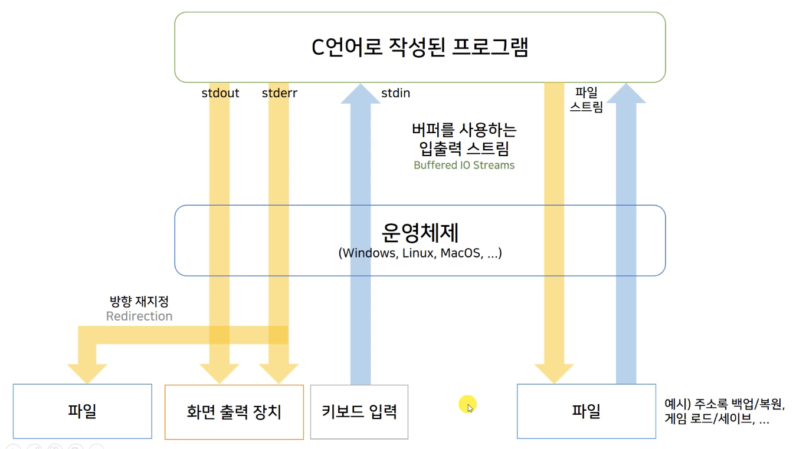
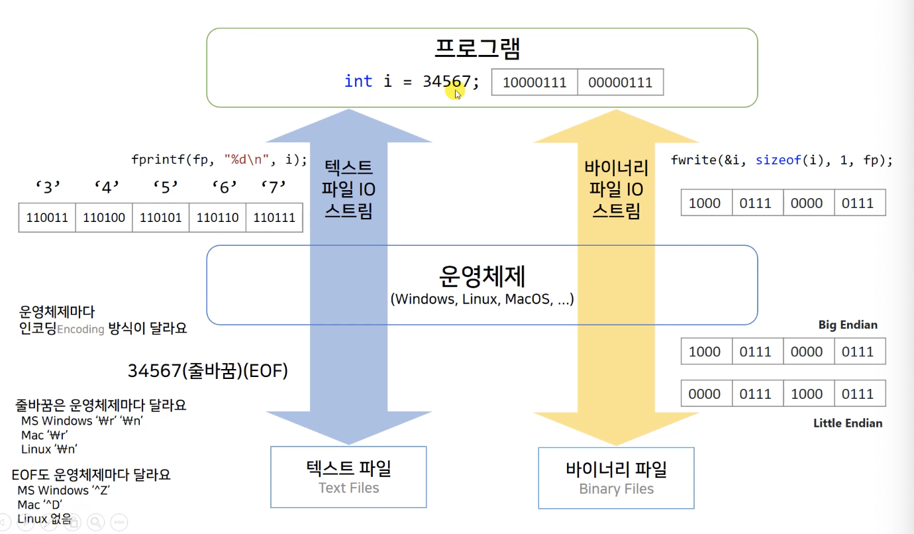

# 따배씨 - 따라하며 배우는 C언어

### 13강 파일 입출력

##### 13.1 파일 입출력의 작동 원리



* 프로그램 실행시, 프로그램과 운영체제 사이의 3가지 stream 이 열림
  * stdout : standard Output
  * stderr : standard Error, 긴급 출력
  * stdin : standard Input
* Buffered IO Stream 버터를 사용하는 입출력 stream
  * 입/출력 시 buffere 에 저장하였다가 한번에 처리하여 속도를 개선
* File Stream
  * C 언어에서 파일 입/출력을 stream 으로 처리




* c 언어로 작성된 프로그램의 파일 스트림은 2가지 mode 를 사용
  * text file IO stream
  * binary file IO stream
* Text Files : 사람이 읽을 수 있는 문자가 저장되어 있는 file
* Binary Files : 2진수가 저장되어 있는 file
* 운영체제가 내부적으로 해결해 주는 것들이 많음


##### 13.2 텍스트 파일 입출력 예제

```c
#include <stdio.h>
#include <stdlib.h>

int main(int argc, char* argv[]){
    int ch;
    FILE* fr;
    
    /*
        typedef struct _iobuf
        {
            char* _ptr;
            int _cnt;
            char* _base;
            int _flag;
            int _file;
            int _charbuf;
            int _bufsiz;
            char* _tmpfname;
        } FILE;
     
     // File 을 처리할 때 필요한 여러가지 데이터들의 묶음을 FILE 이라는 자료형이 있는것 처럼 사용하게 해줌
     */
    
    unsigned long count = 0;
    
    if (argc != 2){
        printf("Usage : %s filename\n", argv[0]);
        exit(EXIT_FAILURE);
    }
    
    if ((fr = fopen(argv[1], "r")) == NULL) // Open a text file for reading.
    {
        printf("Can't open %s\n", argv[1]);
        exit(EXIT_FAILURE);
    }
    
    /*
        fopen mode strings for text files
        - r: reading
        - w: creating-and-writing or over-writing
        - a: appending or creating-and-writing
        - r+: both reading and writing
        - w+: reading and writing, over-writing or creating
        - a+: reading and writing, appending or creating
     */
    
    
    while ((ch = fgetc(fr)) != EOF) // getc(fr)
    {
        //putc(ch, stdout); //same as putchar(ch);
        fputc(ch, stdout);
        
        count++;
    }
    
    fclose(fr);
    
    printf("FILE %s has %lu characters\n", argv[1], count);
    
    return 0;
}
```

* ```c
  FILE* fr;
  ```

  * 파일을 처리할 때 필요한 데이터 묶음에 대한 포인터

* ```c
  if ((fr = fopen(argv[1], "r")) == NULL)
  {
    	printf("Can't open %s\n", argv[1]);
  		exit(EXIT_FAILURE);
  }
  ```

  * fopen() 은 file을 처리하는데 필요한 데이터 묶음에 대한 pointer 를 return


```c
#include <stdio.h>
#include <stdlib.h>

int main(int argc, char* argv[]){
    int ch;
    FILE* fr, *fw;
    
    const char* out_filename = "output.txt";
    
    unsigned long count = 0;
    
    if (argc != 2){
        printf("Usage : %s filename\n", argv[0]);
        exit(EXIT_FAILURE);
    }
    
    if ((fr = fopen(argv[1], "r")) == NULL)
    {
        printf("Can't open %s\n", argv[1]);
        exit(EXIT_FAILURE);
    }
    
    if ((fw = fopen(out_filename, "w")) == NULL) 
    {
        printf("Can't open %s\n", out_filename);
        exit(EXIT_FAILURE);
    }
    
    while ((ch = fgetc(fr)) != EOF) // getc(fr)
    {
        fputc(ch, stdout);
        fputc(ch, fw);
        
        count++;
    }
    
    fclose(fr);
    fclose(fw);
    
    printf("FILE %s has %lu characters\n", argv[1], count);
  	printf("Copied to %s\n", out_filename);
    
    return 0;
}
```

* 입력받은 txt 파일의 내용을 새로운 txt 파일로 출력


##### 13.3 텍스트 인코딩 Encoding 과 코드 페이지 Code Page

* 문자가 text File 에 저장되는 방식은 binary

* Text File 이 저장되는 Endcoding 방식과, console 이 text File 을 읽는 Decoding 방식이 다르면 비 정상적인 문자열로 출력됨

* ```c
  SetConsoleOutputCP(CP_UTF8);
  ```

  * console 창에서 문자열을 출력하는 방식을 UTF8 로 지정


