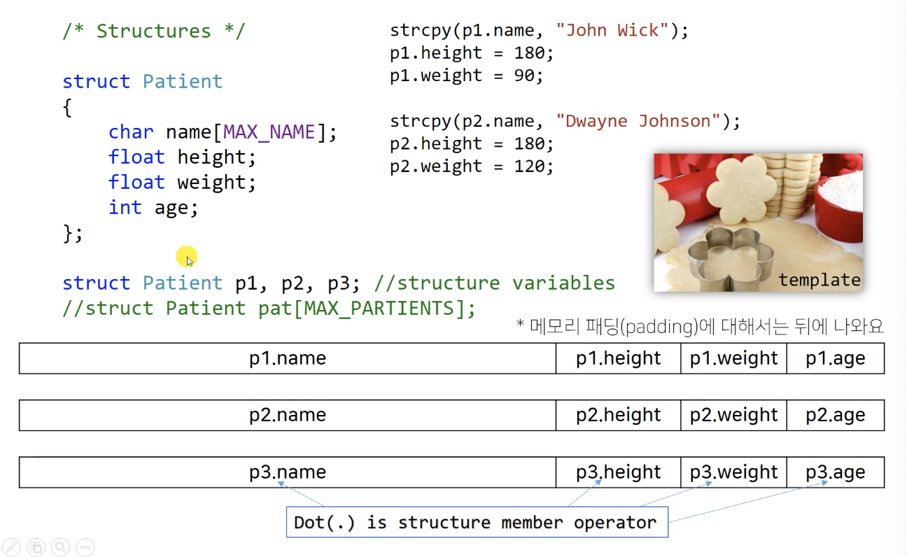

# 따배씨 - 따라하며 배우는 C언어

### 14강 구조체

14.1 구조체 Structures 가 필요한 이유

* 많은 데이터를 처리 하기 위히여 사용
  * 자료형이 다르지만 함께 사용하면 편리한 데이터 오브젝트끼리 모아둔 것
    * 배열은 자료형이 같은 데이터 오브젝트들이 나열된 형태



* 서로 자료형이 다르더라도 묶어서 하나의 새로운 자료형인 것 처럼 사용

* ```c
  struct Patient p1, p2, p3;	// structure variables
  ```

  * 새로운 자료형으로 변수/배열 을 선언할 수 있음

* Dot(.) 연산자는 구조체의 member 에 접근하는 연산자


##### 14.2 구조체 Strucutres 의 기본적인 사용법

```c
#include <stdio.h>
#include <stdlib.h>
#include <string.h>

#define MAX 41

struct person   /* person is a tag of structure */
{
    char name[MAX];
    int age;
    float height;
};

int main()
{
    int flag;   // Receives retur value of scanf()
    
    /* Structre variable */
    
    struct person genie;
    
    /* dot(.) is strucutre membership operator (member access operator, member operater) */

    strcpy(genie.name, "Will Smith");
    //strncpy(genie.name, "Will Smith", MAX);
    
    genie.age = 1000;
    
    // dot(.) has height percedence than &
    flag = scanf("%f", &genie.height);    // &(genie.height)
    printf("%f\n", genie.height);
    
    /* Initialization */
    struct person princess = {"Naomi Scott", 18, 160.0f};
    
    struct person princess2 = {
        "Naomi Scott",
        18,
        160.0f
    };
    
    strcpy(princess.name, "Naomi Scott");
    princess.age = 18;
    princess.height = 160.0f;
    
    /* Designated initializers */
    
    struct person beauty = {
        .age = 19,
        .name = "bell",
        .height = 150.0f
    };
    
    // struct person beauty = {.age = 19, name = "Bell", .height = 150.0f };
    
    /* Pointer to a strucutre variable */
    struct person* someone;
    
    someone = &genie;
    // someone = (struct Person*)malloc(sizeof(struct person)); // and free later
    
    /* Indirect member(ship) opertor (or structre pointr operator) */
    someone -> age = 1001; // arrow(->) operator
    printf("%s %d\n", someone->name, (*someone).age);
    
    /* Strucutre declarations in a function */
    
    struct book
    {
        char title[MAX];
        float price;
    };
    
    /* No tag */
    // 일회성 구조체를 생성
    struct {
        char farm[MAX];
        float price;
    } apple, apple2;
    
    strcpy(apple.farm, "Trade Jeo");
    apple.price = 1.2f;
    
    strcpy(apple2.farm, "Safeway");
    apple2.price = 5.6f;
    
    /* typeof and strucutre */
    
    typedef struct person my_person;
    //typedef 타입을 선언
    
    my_person p3;
    
    typedef  struct person person;
    
    person p4;
    
    typedef struct{
        char name[MAX];
        char nobody[MAX];
    } friend;
    
    friend f4;
    
    return 0;
}
```


##### 14.4 구조체의 메모리 할당 Memory Allocation

```c
#include <stdio.h>
#include <stdlib.h>

int main()
{
    /*
        Well aligned structure
     */
    
    struct Aligned
    {
        int a;
        float b;
        double c;
    };
    // structure 를 선언한는 것으로 메모리를 차지 하지 않음
    
    /*
        0 1 2 3 4 5 6 7|8 9 10 11 12 13 14 15|
       |int a  |float b|double c
        4 + 4 + 8 = 16
     */
    
    struct Aligned a1, a2;
    // 구조체 변수들이 만들어 질 때, 메모리가 할당 됨
    
    printf("struct Aligned a1\n");
  	// struct Aligned a1
    printf("Sizeof %zd\n", sizeof(struct Aligned));
  	// Sizeof 16
    printf("%lld\n", (long long)&a1);
  	// 140732920755328
    printf("%lld\n", (long long)&a1.a);
  	// 140732920755328
    printf("%lld\n", (long long)&a1.b);
  	// 140732920755332
    printf("%lld\n", (long long)&a1.c);
  	// 140732920755336
    
    printf("struct Aligned a2\n");
  	// struct Aligned a2
    printf("Sizeof %zd\n", sizeof(a2));
  	// Sizeof 16
    printf("%lld\n", (long long)&a2);
  	// 140732920755312
    printf("%lld\n", (long long)&a2.a);
  	// 140732920755312
    printf("%lld\n", (long long)&a2.b);
  	// 140732920755316
    printf("%lld\n", (long long)&a2.c);
  	// 140732920755320
  
  	return 0;
}
```


```c
#include <stdio.h>
#include <stdlib.h>

int main()
{
    /*
        padding (struct member alignment)
        - 1 word: 4 bytes in x86, 8 byte in x64
        메모리와 cpu가 데이터를 주고 받는 최소 단위
     */
    
    struct Padded1
    {
        char a;
        float b;
        double c;
    };
    
    /*
        Without padding
        0 1 2 3 4 5 6 7|8 9 10 11 12 13 14 15|16
       |a|float b|double c          | ? ? ?
        1 + 4 + 8 = 13
     */
    
    /*
        With padding
        0 1 2 3 4 5 6 7|8 9 10 11 12 13 14 15|16
       |char a |float b|double c             |
        4(char?) + 4 + 8 = 16
     
        1 word 단위에 맞추어, compiler 가 3byte padding 을 넣어줌
     */
    
    struct Padded1 p1;
    
    printf("struct Padded p1\n");
    // struct Padded p1
    printf("Sizeof %zd\n", sizeof(p1));
    // Sizeof 16
    printf("%lld\n", (long long)&p1);
    // 140732920755048
    printf("%lld\n", (long long)&p1.a);
    // // 140732920755048
    printf("%lld\n", (long long)&p1.b);
    // 140732920755052
    printf("%lld\n", (long long)&p1.c);
    // 140732920755056
    
    struct Padded2
    {
        float a;
        double b;
        char c;
    };
    
    /*
        |0 1 2 3 4 5 6 7|8 9 10 11 12 13 14 15|16 17 18 19 20 21 22 23|24
        |float a        |double b             |char c                 |
        8(float ?) + 8 + 8(char ?) = 24
     
        compiler 가 double 8byte 자르지 않기 위하여 float 과 char 에 padding 을 넣어 줌
     */
    
    struct Padded2 p2;
    
    printf("struct Padded p2\n");
    // struct Padded p2
    printf("Sizeof %zd\n", sizeof(p2));
    // Sizeof 24
    printf("%lld\n", (long long)&p2);
    // 140732920755024
    printf("%lld\n", (long long)&p2.a);
    // // 140732920755024
    printf("%lld\n", (long long)&p2.b);
    // 140732920755032
    printf("%lld\n", (long long)&p2.c);
    // 140732920755040
    
    
    struct Padded3
    {
        char a;
        double b;
        double c;
    };
    
    /*
        |0 1 2 3 4 5 6 7|8 9 10 11 12 13 14 15|16 17 18 19 20 21 22 23|24
        | char a        | double b            | double c              |
        8(char ?) + 8 + 8 = 24
     */
    
    struct Padded3 p3;
    
    printf("struct Padded p3\n");
    // struct Padded p3
    printf("Sizeof %zd\n", sizeof(p3));
    // Sizeof 24
    printf("%lld\n", (long long)&p3);
    // 140732920755000
    printf("%lld\n", (long long)&p3.a);
    // 140732920755000
    printf("%lld\n", (long long)&p3.b);
    // 140732920755008
    printf("%lld\n", (long long)&p3.c);
    // 140732920755016
    
    
    struct Person
    {
        char name[41];  //member
        int age;        //member
        float height;   //member
    };
    
    struct Person mommy;
    
    printf("struct Person\n");
    // struct Person
    printf("%lld\n", (long long)&mommy.name[0]);
    // 140732920755280
    printf("%lld\n", (long long)&mommy.age);
    // 140732920755324
    printf("%lld\n", (long long)&mommy.height);
    // 140732920755328
    printf("Sizeof %zd\n", sizeof(mommy));   // 41 + 4 + 4 = 49 ?
    // Sizeof 52
    
    struct Person f[4];
    
    printf("Sizeof a structure array %zd\n", sizeof(f));
    // Sizeof a structure array 208
    
    /*
        |f[0].name  |f[0].age   | f[0].height | ... |f[3].name  |f[3].age |f[3].height |
     */
    
    return 0;
}
```


##### 14.4 구조체의 배열 연습 문제

```c
#include <stdio.h>
#include <string.h>

#define MAX_TITLE 40
#define MAX_AUTHOR 40
#define MAX_BOOKS 3

char* s_gets(char* st, int n)
{
    char* ret_val;
    char * find;
    
    
    ret_val = fgets(st, n, stdin);
    //fgets(<#char *restrict#>, <#int#>, <#FILE *#>)
    //input 과 돌일한 str 매개변수 or NULL return
    
    if (ret_val)
    {
        find = strchr(st, '\n');    // look for newline
        if (find)                   // if the address is not NULL
            * find = '\0';          // place a null characgter there
        else
            while(getchar() != '\n')
                continue;;          // dispose of rest of line
    }
    
    return ret_val;
}


struct book
{
    char title[MAX_TITLE];
    char author[MAX_AUTHOR];
    float price;
};

int main(){
    
    struct book library[MAX_BOOKS] = {{"Empty", "Empty", 0.0f}, };
    // array of book structrure
    
    int count = 0;
    
    while(1){
        printf("Input a boo title or press [Enter] to stop\n>>");
        if (s_gets(library[count].title, MAX_TITLE) == NULL) break;
        if (library[count].title[0] == '\0') break;
        
        printf("Input the author.\n>>");
        s_gets(library[count].author, MAX_AUTHOR);
        
        printf("Input the price.\n>>");
        int flag = scanf("%f", &library[count].price);
      
        while (getchar() != '\n')
            continue;  /* clear input line */
        
        count ++;
        
        if (count == MAX_BOOKS)
        {
            printf("No more books.\n");
            break;
        }
    }
    
    if (count > 0){
        printf("\nThe list of books:\n");
        for (int index = 0; index < count; index++)
        printf("\"%s\" written by %s: $%.1f\n", library[index].title, library[index].author, library[index].price);
    }
    else
        printf("No books to show.\n");
    
    return 0;
}
```

* ```c
  char* s_gets(char* st, int n)
  {
      char* ret_val;
      char * find;
      
      ret_val = fgets(st, n, stdin);
      
      if (ret_val)
      {
          find = strchr(st, '\n');    // look for newline
          if (find)                   // if the address is not NULL
              * find = '\0';          // place a null characgter there
          else
              while(getchar() != '\n')
                  continue;;          // dispose of rest of line
      }
      
      return ret_val;
  }
  ```
  * 입력 처리 함수

    * ```c
      ret_val = fgets(st, n, stdin);
      //fgets(<#char *restrict#>, <#int#>, <#FILE *#>)
      ```

      * fgets(string, string length, file)
        * input 과 돌일한 str 매개변수 or NULL return
        * 입력 file 변수를 stdin 으로 console 입력 값으로 처리 가능

* ```c
    if (library[count].title[0] == '\0') break;
    ```

  * 입력한 문자열이 없을 시, 처리

* ```c
    while (getchar() != '\n')
    		continue;  /* clear input line */
    ```

    * buffer 비우기


##### 14.5 구조체를 다른 구조체의 멤버로 사용하기 

##### 		Nested Structures ; 중첩 구조체

```c
#include <stdio.h>

#define LEN 20

struct names            // A structure
{
    char given[LEN];    // first name
    char family[LEN];   // last name
};

struct reservation      // Another strucutre
{
    struct names guest; // a nested structure
    struct names host;  // none more nasted sturcture
    char food[LEN];
    char place[LEN];
    
    // time
    int year;
    int month;
    int day;
    int hours;
    int minutes;
};

int main(void)
{
    struct reservation res = {
        .guest = {"Nick", "Carraway"},
        .host = {"Jay", "Gatsby"},
        .place = {"The Gatsby mansion"},
        .food = {"Escargot"},
        .year = 1925,
        .month = 4,
        .day = 10,
        .hours = 18,
        .minutes = 30
    };
    
    /*
        Dear Nick Carraway,
        I would Like to serve you Escargot.
        Please visit the Gatsby mansion on 10/4/1925 at 18:30.
        Sinceraly,
        Jay Gatsby
     */
    
    const char* formatted = "\
    Dear %s %s,\n\
    I Would Like to serve you %s.\
    \nPlease visit the %s on %d/%d/%d at %d:%d.\n\
    Sinceraly,\n\
    %s %s\n";
    
    printf(formatted, res.guest.given, res.guest.family, res.food, res.place, res.day, res.month, res.year, res.hours, res.minutes, res.host.given, res.host.family);
    
    return 0;
}
```


##### 14.6 구조체와 포인터

```c
#include <stdio.h>
#define LEN 20

struct names
{
    char given[LEN];
    char family[LEN];
};

struct friend
{
    struct names full_name;
    char mobile[LEN];
};

int main(void)
{
    struct friend my_friend[2] = {
        { {"Ariana", "Grande"}, "1234-1234"},
        { {"Taylor", "Swift"}, "6550-8888"}
    };
    
    struct friend * girl_friend;
    
    girl_friend = &my_friend[0];
    
    printf("%zd\n", sizeof(struct friend));
    printf("%lld %s \n", (long long)girl_friend, girl_friend -> full_name.given);
    // 
    
    girl_friend++;
    
    printf("%lld %s \n", (long long)girl_friend, (*girl_friend).full_name.given);
    // .ha shigher precedence than *
    
    return 0;
}
```

* ```c
  printf("%lld %s \n", (long long)girl_friend, girl_friend -> full_name.given);
  ```

  * -> : indirect member access operator
    * girl_friend 가 my_friend[0] 의 포인터 이기 때문에, (.) dot oprator 를 사용하지 못함
    * -> arrow operator (indirect member access operator) 를 사용

* ```c
  girl_friend++;
  // 60
  ```

  * 구조체의 pointer 연산
  * my_friend[2] + 1 = my_friend[3] == 60


```c
#include <stdio.h>
#include <stdlib.h>

struct my_data
{
    int a;
    char c;
    float arr[2];
};

int main()
{
    struct my_data d1 = {123, 'A', };
    
    d1.arr[0] = 1.1f;
    d1.arr[1] = 2.2f;
    
    printf("%d %c %lld\n", d1.a, d1.c, (long long)d1.arr);
  	// 123 A 140732920755328
    printf("%f %f\n", d1.arr[0], d1.arr[1]);
  	// 1.100000 2.200000
    printf("%lld %lld\n\n", (long long)&d1.arr[0], (long long)&d1.arr[1]);
  	// 140732920755328 140732920755332
    
    struct my_data d2 = d1;
    // d1 의 메모리 값 자체를 d2 로 복사
    // d2.a = d1.1, d2.c = d1.c, d2.arr = d1.arr
    
    printf("%d %c %lld\n", d2.a, d2.c, (long long)d2.arr);
  	// 123 A 140732920755312
    printf("%f %f\n", d2.arr[0], d2.arr[1]);
  	// 1.100000 2.200000
    printf("%lld %lld\n\n", (long long)&d2.arr[0], (long long)&d2.arr[1]);
  	// 140732920755312 140732920755316
    
    return 0;
}
```

* ```c
  struct my_data d2 = d1;
      // 
  ```
  * d1 의 메모리 값 자체를 d2 로 복사
    * d2.a = d1.
    * d2.c = d1.c
    * d2.arr = d1.arr

```c
#include <stdio.h>
#include <stdlib.h>

struct my_data
{
    int a;
    char c;
    float* arr;
};

int main()
{
    struct my_data d1 = {123, 'A', NULL};
    d1.arr = (float*)malloc(sizeof(float) * 2);
    d1.arr[0] = 1.1f;
    d1.arr[1] = 2.2f;
    
    printf("%d %c %lld\n", d1.a, d1.c, (long long)d1.arr);
  	// 123 A 4301651824
    printf("%f %f\n", d1.arr[0], d1.arr[1]);
  	// 1.100000 2.200000
    printf("%lld %lld\n\n", (long long)&d1.arr[0], (long long)&d1.arr[1]);
  	// 4301651824 4301651828
    
    struct my_data d2 = d1;
    
    printf("%d %c %lld\n", d2.a, d2.c, (long long)d2.arr);
  	// 123 A 4301651824
    printf("%f %f\n", d2.arr[0], d2.arr[1]);
  	// 1.100000 2.200000
    printf("%lld %lld\n\n", (long long)&d2.arr[0], (long long)&d2.arr[1]);
  	// 4301651824 4301651828
    
    return 0;
}
```

* ```c
  struct my_data d1 = {123, 'A', NULL};
  d1.arr = (float*)malloc(sizeof(float) * 2);
  d1.arr[0] = 1.1f;
  d1.arr[1] = 2.2f;
  ```

  * arr 를 pointer 로 선언

  * ```c
    printf("%lld %lld\n\n", (long long)&d1.arr[0], (long long)&d1.arr[1]);
    // 4301651824 4301651828
    printf("%lld %lld\n\n", (long long)&d2.arr[0], (long long)&d2.arr[1]);
    // 4301651824 4301651828
    ```

    * d1 과 d2 의 arr 이 같은 주소값을 갖게 됨


##### 14.7 구조체를 함수로 전달하는 방법

```c
#include <stdio.h>
#include <string.h>

#define FUNDLEN 50

struct fortune
{
    char bank_name[FUNDLEN];
    double bank_saving;
    char fund_name[FUNDLEN];
    double fund_invest;
};

double sum_value(const double *, const double *);
double sum_struct(const struct fortune);
double sum_struct_pointer(const struct fortune *);

int main()
{
    struct  fortune my_fortune = {
        "Wells-Fargo",
        4032.27,
        "JPMorgan Chase",
        8543.94
    };
    
    printf("Total : $%.2f.\n", sum_value(&my_fortune.bank_saving, &my_fortune.fund_invest));
    
    printf("Total : $%.2f.\n", sum_struct(my_fortune));
    
    printf("Total : $%.2f.\n", sum_struct_pointer(&my_fortune));
    
    return 0;
}

double sum_value(const double * x, const double * y)
{
    return *x + *y;
}

double sum_struct(const struct fortune my_fortune)
{
    return my_fortune.bank_saving + my_fortune.fund_invest;
}

double sum_struct_pointer(const struct fortune *my_fortune)
{
    return my_fortune->bank_saving + my_fortune->fund_invest;
}
```

* ```c
  double sum_struct(struct fortune my_fortune)
  {
      return my_fortune.bank_saving + my_fortune.fund_invest;
  }
  sum_struct(my_fortune)
  ```

  * my_fortune 구조체 데이터가 sum_struct 함수에 대입될 때, 복사가 되어 전달 됨
    * 두 구조체의 주소가 다름
    * 복사하여 사용하면 새로운 메로리를 할당 받아야 하므로, C 언어에서는 권장되지 않는 사용 -> pointer 를 이용하자

* ```c
  double sum_struct_pointer(const struct fortune *my_fortune)
  {
      return my_fortune->bank_saving + my_fortune->fund_invest;
  }
  ```

  * 구조체의 pointer 로 입력받아 처리
  * 함수가 pointer 를 사용 할때, 메모리에 저장된 값을 변경하는 것인지 값을 사용만 하는것인지 구분하여 사용하자
    * const 로 표기하여 사용


##### 14.8 구조체와 함수 연습문제

```c
#include <stdio.h>
#include <string.h>

#define NLEN 30

struct name_count
{
    char first[NLEN];
    char last[NLEN];
    int num;
};

void receive_input(struct name_count*);
void count_charaters(struct name_count*);
void show_result(const struct name_count*);
char* s_gets(char* st, int n);

int main()
{
    struct name_count user_name;
    
    receive_input(&user_name);
    count_charaters(&user_name);
    show_result(&user_name);
    
    return 0;
}

void receive_input(struct name_count* user_name)
{
    int flag;
    
    printf("Input your first name :\n>> ");
    
//    s_gets(user_name->first, NLEN);
    flag = scanf("%[^\n]%*c", user_name->first); // ^ : cap operator
    // scanf 로 s_gets 를 대체
    // "%[^\n]%*c" 줄바꿈 기호 하나를 무시하고 입력 받음
    
    if (flag != 1)
        printf("Wrong input");
    
    printf("Input your last name :\n>> ");
//    s_gets(user_name->last, NLEN);
    flag = scanf("%[^\n]%*c", user_name->last);
    
    if (flag != 1)
        printf("Wrong input");
}


void count_charaters(struct name_count* user_name)
{
    user_name->num = (int)(strlen(user_name->first) + strlen(user_name->last));
}


void show_result(const struct name_count* user_name)
{
    const char* formmated = "Hi, %s %s.\nYour name has %d characters.\n";
    printf(formmated, user_name->first, user_name->last, user_name->num);
}

char* s_gets(char* st, int n)
{
    char* ret_val;
    char* find;
    
    ret_val = fgets(st, n, stdin);
    
    if (ret_val)
    {
        find = strchr(st, '\n');    // look for newline
        if (find)                   // if the address is not NULL
            * find = '\0';          // place a null characgter there
        else
            while(getchar() != '\n')
                continue;           // dispose of rest of line
    }
    
    return ret_val;
}
```

* ```c
  flag = scanf("%[^\n]%*c", user_name->first); //
  ```
  * scanf 로 s_gets 를 대체
    * [^\n]%*c 줄바꿈 기호 하나를 무시하고 입력 받음
    * ^ : cap operator


```c
#include <stdio.h>
#include <string.h>

#define NLEN 30

struct name_count
{
    char first[NLEN];
    char last[NLEN];
    int num;
};

struct name_count receive_input();
struct name_count count_characters(struct name_count);
void show_result (const struct name_count);
char* s_gets(char * st, int n);

int main()
{
    struct name_count user_name;
    
    user_name = receive_input();
    user_name = count_characters(user_name);
    show_result(user_name);
    
    return 0;
}

struct name_count receive_input()
{
    struct name_count nc;
    
    printf("Input your first name\n>>");
    s_gets(nc.first, NLEN);
    
    printf("Input your last name:\n>>");
    s_gets(nc.last, NLEN);
    
    return nc;
}
struct name_count count_characters(struct name_count nc)
{
    nc.num = (int)(strlen(nc.first) + strlen(nc.last));
    
    return nc;
}
void show_result (const struct name_count nc)
{
    printf("Hi, %s %s. Your name contains %d characters.\n", nc.first, nc.last, nc.num);
}

char* s_gets(char* st, int n)
{
    char* ret_val;
    char* find;
    
    ret_val = fgets(st, n, stdin);
    
    if (ret_val)
    {
        find = strchr(st, '\n');    // look for newline
        if (find)                   // if the address is not NULL
            * find = '\0';          // place a null characgter there
        else
            while(getchar() != '\n')
                continue;           // dispose of rest of line
    }
    
    return ret_val;
}
```


##### 14.9 구조체와 할당 메모리

