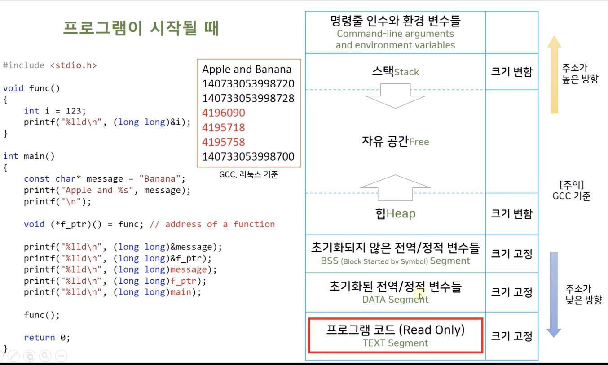

# 따배씨 - 따라하며 배우는 C언어

### 14강 구조체_2

##### 14.11 신축성 있는 배열 멤버 Flexible Array Members

```c
#include <stdio.h>
#include <stdlib.h>

int main()
{
    /*
        Flexible array member (struct hack in GCC)
        // 지금은 표준
     */
    
    struct flex
    {
        size_t count;
        double average;
        double values[];    // flexible array member (last member!)
        // 구조체가 저장되는 메모리 구조상, flexible array 변수 위치를 마지막으로 두어야 사용하기 편함
    };
    
    const size_t n = 3;
    
    struct flex* pf = (struct flex*)malloc(sizeof(struct flex) + n * sizeof(double));
    // values 의 배열 크기 n 만큼 추가 동적할당
    
    if (pf == NULL) exit(1);
    
    printf("flexible array member\n");
    printf("Sizeof struct flex %zd\n", sizeof(struct flex));
    // Sizeof struct flex 16
    printf("Sizeof *pf %zd\n", sizeof(pf));
    // Sizeof *pf 8
    printf("Sizeof malloc %zd\n", sizeof(struct flex) + n * sizeof(double));
    // Sizeof malloc 40
    printf("%lld\n", (long long)pf);
    // 4388333424
    printf("%lld\n", (long long)& pf->count);
    // 4388333424
    printf("%zd\n", sizeof(pf->count));
    // 8
    printf("%lld\n", (long long)& pf->average);
    // 4388333432
    printf("Address of pf->values %lld\n", (long long)& pf->values);
    // Address of pf->values 4388333440
    printf("Value of pf->values %lld\n", (long long)pf->values);
    // Value of pf->values 4388333440
//    printf("Sizeof pf->value %zd\n", sizeof(pf->values));
    
    pf->count = n;
    // 동적 할당을 받은 크기를 저장해 둠
    pf->values[0] = 1.1;
    pf->values[1] = 2.1;
    pf->values[2] = 3.1;
    
    pf->average = 0.0;
    for (unsigned i = 0; i < pf->count; ++i)
        pf->average += pf->values[i];
    pf->average /= (double)pf->count;
    
    printf("Average = %f\n", pf->average);
    // Average = 2.100000
    
    return 0;
}
```

* ```c
  struct flex
  {
    size_t count;
    double average;
    double values[];    // flexible array member (last member!)
  };
  ```
  * 구조체가 저장되는 메모리 구조상, flexible array 변수 위치를 마지막으로 두어야 사용하기 편함

  * ```c
    double values[];
    ```

    * 배열의 크기가 지정되지 않았기 때문에, 메모리 크기가 없는상태
    * 동적할당을 받아야지 메모리 크기가 할당 됨


```c
struct nonflex
{
  size_t count;
  double average;
  double *values; // Use malloc()
};

struct  nonflex nf;
int n = 3;
nf.values = (double *)malloc(sizeof(double) * n);
```

* ```c
  double *values;
  nf.values = (double *)malloc(sizeof(double) * n);
  ```

  * 동적 할당 배열

  * ```c
    double *values;
    ```

    * pointer 변수가 저장될 메모리 크기를 할당 받음
    * 동적 할당된 array 의 주소는 구조체의 메모리 주소와 별도로 생성
      * 연관 X

```c
struct flex* pf = (struct flex*)malloc(sizeof(struct flex) + n * sizeof(double));

if(pf == NULL) exit(1);

*pf2 = *pf1;	// Don't copy flexible members, use memcpy() instead

printf("%f %f %f\n", pf->values[0], pf->values[1], pf->values[2]);
// 1.100000 2.100000 3.100000

printf("%f %f %f\n", pf2->values[0], pf2->values[1],pf2->values[2]);
// 0.000000 0.000000 0.000000
```

* flexible array member 는 대입 하는 방법으로는 제대로 복사 되지 않음
  * compiler 입장에서 동적 할당을 받은 size 까지 알 수 없기 때문에, 기본 size 까지만 복사가 됨
  * memcpy() 를 사용하여 값을 복사해야 함


##### 14.12 익명 구조체 Anonymous Structures

```c
#include <stdio.h>

struct names
{
    char first[20];
    char last[20];
};

struct person
{
    int id;
    struct names name;  // nested strucutre member
};

struct person2
{
    int id;
    struct { char first[20]; char last[20]; };    // anomymous strucutre
};

int main()
{
    struct person ted = { 123, {"Bill", "Gates"}};
    struct person ted3 = { 125, {"Robert", "Hand"}};
    
    puts(ted.name.first);
    // Bill
    puts(ted3.name.first);
    // Robert
    
    struct person2 ted2 = { 124, {"Steve", "wozniak"}};
    // Steve
		// struct person2 ted2 = { 124, "Steve", "wozniak"};   // also works
    
    puts(ted2.first);
    
    return 0;
}
```

* ```c
  struct person2
  {
      int id;
      struct { char first[20]; char last[20]; };    // anomymous strucutre
  };
  
  struct person2 ted2 = { 124, {"Steve", "wozniak"}};
  // or //struct person2 ted2 = { 124, "Steve", "wozniak"};
  
  puts(ted2.first);
  ```
  * ```c
    puts(ted2.first);
    ```

    * 익명 구조체가 멤버일 때에는, 익명 구조체의 멤버로 바로 접근이 가능함


##### 14.13 구조체의 배열을 사용하는 함수

```c
#include <stdio.h>

#define SLEN 101

struct book
{
    char name[SLEN];
    char author[SLEN];
};

void print_books(const struct book books[], int n);

int main()
{
    struct book my_books[3];    // = {"The Great Gatsby", "F. Scott Fitzgerald"},...};
    
    my_books[0] = (struct book){"The Great Gatsby", "F. Scott Fitzgerald"};
    my_books[1] = (struct book){"Hamlet", "William Shakespeare"};
    my_books[2] = (struct book){"The Odyssey", "Homer"};
    
    print_books(my_books, 3);
    
    return 0;
}

void print_books(const struct book books[], int n)
{
    for (int i = 0; i < n; i++)
    {
        printf("Book %d :\"%s\" written by \"%s\"\n", i + 1, books[i].name, books[i].author);
    }
}
```

* 구조체 배열 사용


```c
#include <stdio.h>
#include <stdlib.h>

#define SLEN 101

struct book
{
    char name[SLEN];
    char author[SLEN];
};

void print_books(const struct book books[], int n);

int main()
{
    struct book* my_books = (struct book*)malloc(sizeof(struct book) * 3);
    
    if (!my_books) exit(1);
    
    my_books[0] = (struct book){"The Great Gatsby", "F. Scott Fitzgerald"};
    my_books[1] = (struct book){"Hamlet", "William Shakespeare"};
    my_books[2] = (struct book){"The Odyssey", "Homer"};
    
    print_books(my_books, 3);
    
    return 0;
}

void print_books(const struct book* books, int n)
{
    for (int i = 0; i < n; i++)
    {
        printf("Book %d :\"%s\" written by \"%s\"\n", i + 1, books[i].name, books[i].author);
    }
}
```

* 구조체 배열을 pointer 로 구현


 ##### 14.14 구조체 파일 입출력 연습문제

``` c
#include <stdio.h>
#include <stdlib.h>

#define SLEN 101

struct book
{
    char name[SLEN];
    char author[SLEN];
};

void print_books(const struct book * books, int n);
void write_books(const char * filename, const struct book* books, int n);
struct book* read_books(const char* filename, int* n);
void read_books2(const char* filename,struct book **books_dptr, int* n);

int main()
{
    int temp;
    int n = 3;
    
    struct book* my_books = (struct book*)malloc(sizeof(struct book) * n);
    
    if (!my_books)
    {
        printf("Malloc failed");
        exit(1);
    }
    
    my_books[0] = (struct book){"The Grat Gatsby", "F. Scott Fitzgerald"};
    my_books[1] = (struct book){"Hamlet", "William Shakespeare"};
    my_books[2] = (struct book){"The Odyssey", "Homer"};
    
    print_books(my_books, n);
    
    printf("\nWriting to a file.\n");
    write_books("books.txt", my_books, n);
    free(my_books);
    my_books = NULL;
    n = 0;
    printf("Done.\n");
    
    printf("\nPress any key to read data from a file.\n\n");
    temp = getchar();
    
//    my_books = read_books("books.txt", &n);
    read_books2("books.txt", &my_books, &n);
    
    print_books(my_books, n);
    free(my_books);
    my_books = NULL;
    n = 0;
    
    return 0;
}

void print_books(const struct book * books, int n)
{
    for (int i  = 0; i < n; ++i)
        printf("Book %d : \"%s\" wrriten by \"%s\"\n", i, books[i].name, books[i].author);
}

void write_books(const char * filename, const struct book* books, int n)
{
    FILE* file = fopen(filename, "w");
    
    if (file == NULL)
    {
        fputs("Can't open file", stderr);
        exit(1);
    }
    
    fprintf(file, "%d\n", n);   // number of books
    
    for (int i = 0; i < n; ++i)
    {
        fprintf(file, "%s\n%s\n", books[i].name, books[i].author);
    }
    
    fclose(file);
}

struct book* read_books(const char* filename, int* n_ptr)
{
    FILE* file = fopen(filename, "r");
    
    if(file==NULL)
    {
        fputs("Can't open file", stderr);
        exit(1);
    }
    
    int flag;
    flag = fscanf(file, "%d%*c", n_ptr);    // Remove last '\n'
    if (flag != 1)
    {
        printf("File read failed");
        exit(1);
    }
    
    struct book* books = (struct book*)calloc(sizeof(struct book), *n_ptr);
    
    if (!books)
    {
        printf("Malloc() Fail.");
        exit(1);
    }
    
    for (int i = 0; i < *n_ptr; ++i)
    {
        flag = fscanf(file, "%[^\n]%*c%[^\n]%*c", books[i].name, books[i].author);
        
        if (flag != 2)
        {
            printf("File read failed");
            exit(1);
        }
    }
    
    return books;
};

void read_books2(const char* filename,struct book **books_dptr, int* n_ptr)
{
    FILE* file = fopen(filename, "r");
    
    if (file==NULL)
    {
        fputs("Can't open file", stderr);
        exit(1);
    }
    
    int flag;
    flag = fscanf(file, "%d%*c", n_ptr);    // Remove last '\n'
    if (flag != 1)
    {
        printf("File read failed");
        exit(1);
    }
    
    struct book* books = (struct book*)calloc(sizeof(struct book), *n_ptr);
    
    if(!books)
    {
        printf("Malloc() failed.");
        exit(1);
    }
    
    for (int i = 0; i < *n_ptr; ++i)
    {
        flag = fscanf(file, "%[^\n]%*c%[^\n]%*c", books[i].name, books[i].author);
        
        if (flag != 2)
        {
            printf("File read failed");
            exit(1);
        }
    }
    fclose(file);
    
    *books_dptr = books;
}
```


```c
// binary format 으로 처리
void write_books(const char * filename, const struct book* books, int n)
{
    FILE* file = fopen(filename, "wb");
    
    if (file == NULL)
    {
        fputs("Can't open file", stderr);
        exit(1);
    }
    
    fwrite(&n, sizeof(n), 1, file); // number of books
    fwrite(books, sizeof(struct book), n, file);
    
    fclose(file);
}


void read_books2(const char* filename,struct book **books_dptr, int* n_ptr)
{
    FILE* file = fopen(filename, "r");
    
    if (file==NULL)
    {
        fputs("Can't open file", stderr);
        exit(1);
    }
    
    fread(n_ptr, sizeof(*n_ptr), 1, file);
    
    struct book* books = (struct book*)calloc(sizeof(struct book), *n_ptr);
    
    if(!books)
    {
        printf("Malloc() failed.");
        exit(1);
    }
    
    fread(books, sizeof(struct book), *n_ptr, file);
    
    fclose(file);
    
    *books_dptr = books;
}
```

* 데이터 양이 많고 속도가 중요할 경우 binary format이 유리함


##### 14.15 공용체 Union 의 원리

```c
#include <stdio.h>

int main()
{
    /*
        Union
        - Store different data types in the same momory space
        - Strucutre vs Union
     */
    
    union my_union
    {
        int i;
        double d;
        char c;
    };
    
    union my_union uni;
    
    printf("%zd\n", sizeof(union my_union));
  	// 8
    printf("%lld\n", (long long)&uni);
  	// 140732920755232
    printf("%lld %lld %lld\n", (long long)&uni.i, (long long)&uni.d, (long long)&uni.c);
  	// 140732920755232 140732920755232 140732920755232
    
    union my_union save[10];
    
    printf("%zd\n", sizeof(save));
  	// 80
    
    return 0;
}

```

* 공용체 union 은 구조체 structure 와 사용법이 유사하나 메모리 공간의 사용에 차이가 있다
  * Union 은 같은 메모리 공간을 다른 type 들이 공유하게 됨
    * 가장 큰 type 의 메모리로 할당 됨


```c
#include <stdio.h>

int main()
{
    /*
        Union of different types
     */
    
    union my_union
    {
        int i;
        double d;
        char c;
    };
    
    union my_union uni1;
    
    uni1.c = 'A';
    printf("%c %x %d\n", uni1.c, (int)uni1.c, uni1.i);
  	// A 41 -272632767
    
    uni1.i = 0;
    uni1.c = 'A';
    printf("%c %x %d\n", uni1.c, (int)uni1.c, uni1.i);
  	// A 41 65
    
    uni1.d = 1.2;
    printf("%d %f %d %c\n", uni1.i, uni1.d, (int)uni1.c, uni1.c);
  	// 858993459 1.200000 51 3
    
    return 0;
}
```

* 메모리를 공유하기 때문에, 덮어쓰는 현상이 발생


```c
#include <stdio.h>

int main()
{
    /*
        Initializing unions
     */
    
    union my_union
    {
        int i;
        double d;
        char c;
    };
    union my_union uni1;
    uni1.i = 0;
    uni1.c = 'A';
    uni1.d = 1.2;
    
    union my_union uni2 = uni1;         // Copy another union
    union my_union uni3 = { 10 };       // First element (member) only
    union my_union uni4 = { .c = 'A' };  // Designated initializer
    union my_union uni5 = { .d = 1.23, .i = 100 };  // Do NOT recommend
    
    printf("%d %f %c\n", uni5.i, uni5.d, uni5.c);
    // 100 0.000000 d
    
    uni1.i = 123;
    uni1.d = 1.2;
    uni1.c = 'k';
    // uni1 = 'k' 로 사용하기 위한 의도가 됨
    
    return 0;
}
```

* 공용체의 선언은 여러 type 을 포함 하지만, 메모리를 공유하기 때문에 초기화는 한가지  type 만 가능


```c
#include <stdio.h>

int main()
{
    /*
        Initializing unions
     */
    
    union my_union
    {
        int i;
        double d;
        char c;
    };
    union my_union uni1;
    uni1.i = 0;
    uni1.c = 'A';
    uni1.d = 1.2;
    
    union my_union* pu = &uni1; // Pointer union
    int x = pu->i;  // -> operator, same as x = fit.digit
    
    uni1.c = 'A';
    double real = 3.14 * uni1.d;    // do NOT recommend
    
    return 0;
}
```

* 공용체 union 은 편리하나, 실수할 가능성이 높으니 유의해야 함


##### 14.16 공용체와 구조체를 함께 사용하기

```c
#include <stdio.h>

/*
    Unions And Structures
 */

struct personal_owner
{
    char rrn1[7];       //Resident Registration Number
    char rrn2[8];       //ex: 830422-1185600
};

struct company_owner
{
    char crn1[4];       //Company Registraton Number
    char crn2[3];       //ex: 111-22-33333
    char crn3[6];
};

union data
{
    struct personal_owner po;
    struct company_owner co;
};

struct car_data
{
    char model[15];
    int status; /* 0 = personal, 1 = company */
    union data ownerinfo;
};

void print_car(struct car_data car)
{
    printf("---------------------------------------\n");
    printf("Car model : %s\n", car.model);
    
    if (car.status == 0) /* 0 = personal, 1 = company */
    {
        printf("Personal owner : %s-%s\n", car.ownerinfo.po.rrn1, car.ownerinfo.po.rrn2);
    }
    else
    {
        printf("Company owner : %s-%s-%s\n", car.ownerinfo.co.crn1, car.ownerinfo.co.crn2, car.ownerinfo.co.crn3);
    }
    printf("---------------------------------------\n");
}

int main()
{
    struct car_data my_car = {.model = "Avante", .status = 0, .ownerinfo.po = {"830422", "1185600"}};
    struct  car_data company_car = {.model = "Sonata", .status = 0, .ownerinfo.co = {"111", "22", "333"}};
    
    print_car(my_car);
    print_car(company_car);
    
    return 0;
}
```

* ```c
  union data
  {
      struct personal_owner po;
      struct company_owner co;
  };
  ```

  * personal_owner 와 company_onwer 구조체를 공용체로 묶어서 처리

* ``` c
  struct car_data
  {
      char model[15];
      int status; /* 0 = personal, 1 = company */
      union data ownerinfo;
  };
  ```
  * status 에 따라 다른 ownerinfo 를 받아 오게 되는데,  union 을 사용하므로써 메모리의 효용을 높임


##### 14.17 익명 공용체  Anonymous Unions

```c
#include <stdio.h>

/*
    Unions And Structures
 */

struct personal_owner
{
    char rrn1[7];       //Resident Registration Number
    char rrn2[8];       //ex: 830422-1185600
};

struct company_owner
{
    char crn1[4];       //Company Registraton Number
    char crn2[3];       //ex: 111-22-33333
    char crn3[6];
};


struct car_data
{
    char model[15];
    int status; /* 0 = personal, 1 = company */
    union
    {
        struct personal_owner po;
        struct company_owner co;
    };
};

void print_car(struct car_data car)
{
    printf("---------------------------------------\n");
    printf("Car model : %s\n", car.model);
    
    if (car.status == 0) /* 0 = personal, 1 = company */
    {
        printf("Personal owner : %s-%s\n", car.po.rrn1, car.po.rrn2);
    }
    else
    {
        printf("Company owner : %s-%s-%s\n", car.co.crn1, car.co.crn2, car.co.crn3);
    }
    printf("---------------------------------------\n");
}

int main()
{
    struct car_data my_car = {.model = "Avante", .status = 0, .po = {"830422", "1185600"}};
    struct  car_data company_car = {.model = "Sonata", .status = 0, .co = {"111", "22", "333"}};
    
    print_car(my_car);
    print_car(company_car);
    
    return 0;
}
```

* ownerinfo union 을 Anonymous Union 으로 변경


```c
#include <stdio.h>
int main(){
    
    struct Vector2D{
        union{
            struct { double x, y; };
            struct { double i, j; };
            struct { double arr[2]; };
        };
    };
    
    typedef struct Vector2D vec2;
    
    vec2 v = { 3.14, 2.99 };
    
    printf("%.2f %.2f\n", v.x, v.y);
  	// 3.14 2.99
    printf("%.2f %.2f\n", v.i, v.j);
  	// 3.14 2.99
    printf("%.2f %.2f\n", v.arr[0], v.arr[1]);
  	// 3.14 2.99
    
    return 0;
}
```

* 좌표값을 x, y / i, j / arr[0], arr[1] 의 형태로 모두 사용가능 하게 된다


##### 14.18 열거형 Enumerated Types

* 정수형 상수가 마치 이름이 있는 것 처럼 사용 할 수 있게 도와줌


```c
#include <stdio.h>

/*
    int c = 0; // red: 0, orange: 1, yellow:2, green:3, ..
    if (c == 2)
        printf("yellow");
    else if (c == 1)
        printf("orange");
    ...
 */

/*
    #define RED     1
    #define ORANGE  2
    #define YELLOW  3
 
    int c = YELLOW;
    if (c == YELLOW)
        printf("yellow");
    else if (c == ORANGE)
        printf("orange");
    ...
 */

int main(){
    
    /*
        Enumerated type
        - Symbolic names to represent integer constants
        - Improve readability and make it easy to maintain
        - enum-specifier (struct-specifier, union-specifier)
     
        Enumerators
        - The symolic constants
     */
    
    enum spectrum { red, orange, yellow, green, blue, violet };
    //              0    1       2       3      4     5
    // 나열되어 있는 정수들에게 이름을 붙여 줌
    
    enum spectrum color;
    color = blue;
    
    if (color == yellow)
        printf("yellow"); //Note: enumerators are not strings
    
    for (color = red; color <= violet; color++) //Note: ++ operator doesn't allow in C++, use type int.
        printf("%d\n", color);
    
    printf("red = %d, orange = %d\n", red, orange);
    
    enum kids { jackjack, dash, snoopy, nano, pitz };
    // nina has a value of 3
    
    enum kids my_kids = nano;
    printf("nano %d %d\n", my_kids, nano);
 	 	
  	return  0;
}
```


```c
#include <stdio.h>

int main(){
    
    enum levels {low = 100, medium = 500, high = 2000};
    
    int score = 800;
    
    if (score > high)
        printf("High score!\n");
    else if (score > medium)
        printf("Good job\n");
        // Good job
    else if (score > low)
        printf("Not bad\n");
    else
        printf("Do your best\n");
    
    
    enum pet { cat, dog = 10, lion, tiger };
    // puma has a value of 11
    
    printf("Cat %d\n", cat);
    // Cat 0
    printf("Lion %d\n", lion);
    // Lion 11
    
    return  0;
}
```

* ```c
  enum pet { cat, dog = 10, lion, tiger };
  ```

  * 숫자를 지정 할 수 있고, 지정된 값을 이어서 증가하여 지정 됨


##### 14.19 열거형 연습문제

```c
#include <stdio.h>
#include <string.h>
#include <stdbool.h>

enum spectrum { red, orange, yellow, green, blue };
const char* colors[] = { "red", "orange", "yellow", "green", "blue" };

#define LEN 30

int main(){
    char choice[LEN] = { 0, };
    enum spectrum color;
    bool color_is_found = false;
    
    while(1)
    {
        printf("Input a color name (empty line to quit):\n");
        
        if (scanf("%[^\n]%*c", choice) != 1)
            break;
        
        for (color = red; color <= blue; color++){
            if (strcmp(choice, colors[color]) == 0){
                color_is_found = true;
                break;
            }
        }
        
        if (color_is_found){
            switch (color) {
                case red:
                    puts("Red roses");
                    break;
                    
                case orange:
                    puts("Oranges are delicious");
                    break;
                    
                case yellow:
                    puts("Yellow sunflowers");
                    break;
                    
                case green:
                    puts("Green apples");
                    break;
            
                case blue:
                    puts("Blue ocean");
                    break;
            }
        }
        else{
            printf("Please try differenct color %s.\n", choice);
        }
        color_is_found = false;
    };
    
    puts("Good bye!");
    
    return 0;
}
```


##### 14.20 이름 공간 공유하기 Namespace

```c
#include <stdio.h>

int iamfunction(){
    return 0;
}

int main(){
    /*
        namespace
        - Identify parts of a program in wich a name is recognized
        - You an use the same name for one variable and one tag.
        - C++: use 'namespace; to use the same identifiers in the duplicated scopes
     */
    
    int myname = 123;
    
    {
        int myname = 345;
        //double myname = 3.14; //ERROR
    }
    
    struct rect {double x; double y;};
    
    // int rect = 123;   // OK in C (Not OK in C++), 권장하지 않음
    struct rect rect = { 1.1, 2.2 };    // struct rect and rect are in different categories, struct 의  name & struct rect 의 name
    
    /*
        typedef struct rect rect;
        rect rect = { 1.1, 2.2 };   //Not OK
     */
    
    //int iamfunction = iamfunction(); //ERROR
    
    return 0;
}
```

* 같은 이름을 다른 용도로 사용하는것은 좋지 않음


##### 14.21 함수 포인터의 원리 Function Pointers

```c
#include <stdio.h>

void f1(){
    return;
}

int f2(char i){
    return i+1;
}

int main(){
    void (*pf1)() = f1;
    //void (*pf1)() = &f1;
    
    int (*pf2)(char) = f2;
    
    (*pf1)();   //call f1 via pf1
    //pf1();
    
    int a = pf2('A');
    //int a = (*pf2)('A');
    
    printf("%d\n", a); // 66;
    
    return 0;
}
```

* 내부적으로는 함수의 이름 자체가 'pointer'
  * '&' 가 없어도, 주소값이 됨




* 함수는 text segment 저장되어 있음
  * 함수를 실행시킨다는 것은 메모리에서 함수의 주소 위치에 저장되어 있는 명령어들을 순차적으로 수행한다는 의미


##### 14.22 함수 포인터 Function Pointer 의 사용 방법

```c
#include <stdio.h>
#include <ctype.h>  // toupper(), tolower()

void ToUpper(char* str){
    while(*str){
        *str = toupper(*str);
        str++;
    }
}

void ToLower(char* str){
    while (*str) {
        *str = tolower(*str);
        str++;
    }
}

int main(){
    char str[] = "Hello, World";
    
    void (*pf)(char*);
    
    pf = ToUpper;   // Name of a function is a pointer
    // pf = &ToUpper;   //Acceptable
    // pf = ToUpper(str); // Not acceptible in C
    
    printf("String literal %lld\n", (long long)("Hello World!"));
    // String literal 4294983546
    printf("Function pointr %lld\n", (long long)ToUpper);
    // Function pointr 4294983056
    printf("Variable %lld\n", (long long)str);
    // Variable 140732920755323
    
    (*pf)(str);
    //pf(str);  //K&R X, ANSI OK
    
    printf("ToUpper %s\n", str);
    // ToUpper HELLO, WORLD
    
    pf = ToLower;
    
    pf(str);
    
    printf("ToLower %s\n", str);
    // ToLower hello, world
    
    return 0;
}
```

* ```c
  void (*pf)(char*);
  ```

  * 함수 포인터를 통해서 함수를 실행하기 위하여, 함수 포인터의 선언에서 parameter 와 return type 이 필요함


```c
#include <stdio.h>
#include <ctype.h>  // toupper(), tolower()

void UpdateString(char * str, int(*pf)(int)){
    while(*str){
        *str = (*pf)(*str);
        str++;
    }
}

int main(){
    char str[] = "Hello, World";
    
    UpdateString(str, toupper);
    
    printf("ToUpper %s\n", str);
    //ToUpper HELLO, WORLD
    
    UpdateString(str, tolower);
    
    printf("ToLower %s\n", str);
    //ToLower hello, world
    
    return 0;
}
```

* ```c
  void UpdateString(char * str, int(*pf)(int)){
      while(*str){
          *str = (*pf)(*str);
          str++;
      }
  }
  ```

  * 함수 포인터를 함수의 parameter 로 사용


##### 14.23 자료형에게 별명을 붙여주는 typedef

``` c
#include <stdio.h>
#include <time.h>   // time()

int main(){
    /*
        typedef specifier
        - Give symbolic names (or aliases) to types
        - Does not create new types.
     */
    
    typedef unsigned char BYTE; //Note the scope of BYTE
    
    BYTE x, y[10] = { 0, }, *z = &x;
    
    {
        typedef unsigned char byte;
        
        /* Portable data types */
        
        size_t s = sizeof(byte);
        // sizeof 의 결과값 데이터 형: unsigned int (x86), unsigned long long (x64)
        // 운영체제에 따라 sizeof 의 결과값 데이터형이 바뀜, 전처리기가 처리
        
        // unsigned int s = sizeof(byte); // x86
        // unsigned long long s = sizeof(byte); // x64
    }
    
    
    /*
        This function returns the time since 00:00:00 UTC, January 1, 1970 (Unix timestamp) in seconds
     */
    
    time_t t = time(NULL);
    
    printf("%ld\n", t);
    // 1618665612
  
    return 0;
}

```


```c
#include <stdio.h>

int main(){
    
    /*
        typedef vs #define
     */
    
    typedef char* STRING;
    
    STRING name = "John Wick", sign = "World";
    
    /*
        - typedef interpretation is performed by the compiler, not the preprocessor
        - More flexible than #define
     
        #define STRING char*
     
        STRING name, sign;
        char *name, sign;   //Note the type of sign
     */
    
    typedef struct complex{
        float real;
        float imag;
    } COMPLEX; // typedef struct complex COMPLEX
    
    typedef struct {double width; double height;} rect; // No tag
    rect r1 = {1.1, 2.2};
    rect r2 = r1;
    
    printf("%f %f\n", r2.width, r2.height);
    // 1.100000 2.200000
    
    return 0;
}
```

* '#define' 과 'typedef' 중 typedef 를 권장
  * #define 은 전처리기, compile 하기 전에 처리됨
    * 단순히 내부적으로 복사해서 붙여넣는 형태
  * typedef 는 compiler 가 처리


```c
#include <stdio.h>

/* Complicated function Declarations */

char char3[3] = { 'A', 'B', 'C' };

char (*complicated_function1())[3]{ // Function Return Pointer To Char[3]
    return &char3;  // Returns a pointer to char[3]
}

typedef char (*FRPTC3())[3];    // Function Returns Pointer To Char[3]
typedef char (*(*PTFRPTC3)())[3];

char(*(*fptr1)())[3] = complicated_function1;

FRPTC3 *fptr2 = complicated_function1;
PTFRPTC3 *fptr3 = complicated_function1;

/* Use typedef to make declarations simplier */

typedef char c3[3];

c3* complicated_function2(){
    return &char3;  // Returns a pointer to char[3]
}

int main(){
    char(*ret_val)[3] = fptr1();
    
    printf("%c %c %c\n", (*ret_val)[0], (*ret_val)[1], (*ret_val)[2]);
    // A B C
    
    c3 * my_c3 = fptr2();
    
    printf("%c %c %c\n", (*my_c3)[0], (*my_c3)[1], (*my_c3)[2]);
    // A B C
    
    return 0;
}
```

* typedef 의 활용 예시


##### 14.24 복잡한 선언 Declaration 을 해석하는 요령

* 실무에서는 직관적이지 않은 선언을 사용하지 않음
* typedef 를 사용해서 이해하기 쉬운 형태로 사용


```c
#include <stdio.h>

int temp(int a){
    return 0;
}

int (*g(int a))(int){
    return temp;
}

int main(){
    
    /*
        *   indicates a pointer
        ()  indicates a function
        []  indicates a array
     */
    
    
    /*
        Deciphering Complex Declarations
        - Always read declarations from the inside out.
        - When there's a choice, always favor [] and () over *(asterisk).
     */
    
    int* ap[10];    // Identifier ap is an array of pointers
    // int 포인터의 배열
    
    typedef int* pint;
    pint ap2[10];
    
    
    float* fp(float);   // fp is a function that returns a pointer
    // float을 매개변수를 갖고 return 값을 float 의 포인터로 갖는 함수의 포인터
    
    typedef float* pfloat;
    pfloat fp2(float);
    
    void (*pf)(int);
    /*
        void (*pf)(int);
               1            1. pointer to
                    2       2. function with int argument
          3                 3. returning void
     */
    // 정수형을 매개변수로 갖고 return 값이 없는 함수에 대한 포인터
    
    int* (*x[10])(void);
    /*
        int* (*x[10])(void);
                 1              1. array of
              2                 2. pointers to
                        3       3. functions with no arguments
        4                       4. returning pointer to int
     */
    // 매개변수가 없고 return 값이 int 의 포인터 값인 함수에 대한 포인터의 배열
    
    
    
    /* A Function can't return an array */
    
    // int f(int)[];    //Wrong
    
    /* BUT it can return a pointer to an array */
    
    int(*f(int))[];
    // ??
    
    
    
    /* A function can't return an function */
    
    //int g(int)(int);  //Wrong
    
    /* BUT it can return a pointer to a function */
    
    int (*g(int))(int);
    // 함수의 포인터 리턴 가능
    
    
    
    
    /* An array of functions aren't possible */
    
    //int a[10](int);   //Wrong
    
    /* BUT an array of function pointers are possible */
    
    int* (*x2[10])(int);
    // 함수의 포인터의 배열은 리턴 가능
    
    
    
    /* Using typedef to simplify declarations */
    
    typedef int* FCN(int);
    typedef FCN* FCN_PTR;
    typedef FCN_PTR FNC_PTR_ARRAY[10];
   FNC_PTR_ARRAY x3;
    
    return 0;
}
```


```c
// More Examples
int board[6][4];    // an array of arrays of int
int** ptr;
    
int* risks[10];     // A 10-element array of pointers to int
int(*rusk)[10];     // A pointer to an array of 10 ints

int* off[3][4];     // A 4X3 array of pointers to int
// int pointer 들의 [3][4] 배열
int(*uff)[3][4];    // a pointer to a 3X4 array of ints
// int [3][4] 배열에 대한 포인터
int(*uof[3])[4];    // a 3-element array of pointers to 4-element arrays of int


char* fump(int);        // function returning pointer to char
char (*frump)(int);     // pointer to a function that returns type char
char(*flump[3])(int);   // array of 3 pointers to functions that return type char

typedef int arr5[5];
typedef arr5* p_arr5;
typedef p_arr5 arrp10[10];

arr5 togs;
p_arr5 p2;
arrp10 arp;
```


##### 14.25 qsort() 함수 포인터 연습문제

```c
#include <stdio.h>
#include <stdlib.h>

int compare(const void* first, const void* second){
    // void type pointer 는 어떤 타입이든 가리킬 수 있다
    
    if (*(int*)first > *(int*)second)
        return 1;
    else if (*(int*)first < *(int*)second)
        return -1;
    else
        return 0;
}

int main(){
    int arr[] = {8, 2, 5, 3, 6, 11};
    int n = sizeof(arr) / sizeof(arr[0]);
    
    qsort(arr, n, sizeof(int), compare);
    
    for (int i = 0; i < n; i++)
        printf("%d ", arr[i]);
    

    return 0;
}
```

* quick sort 예제


```c
#include <stdio.h>
#include <stdlib.h>

struct kid
{
    char name[100];
    int height;
};

int compare(const void* first, const void* second)
{
    if (((struct kid*)first)->height > ((struct kid*)second)->height)
        return  1;
    else if (((struct kid*)first)->height < ((struct kid*)second)->height)
        return -1;
    else
        return 0;
}

int main()
{
    struct kid my_friends[] = {
        "Jack Jack", 40, "Geenie", 300, "Aladin", 170, "Piona", 150
    };
    
    const int n = sizeof(my_friends) / sizeof(struct kid);
    
    qsort(my_friends, n, sizeof(struct kid), compare);
    
    for (int i = 0; i < n; i++)
    {
        printf("%s  \t%d\n", my_friends[i].name, my_friends[i].height);
    }
    
    return 0;
}
```

* ````c
  int compare(const void* first, const void* second)
  {
      if (((struct kid*)first)->height > ((struct kid*)second)->height)
          return  1;
      else if (((struct kid*)first)->height < ((struct kid*)second)->height)
          return -1;
      else
          return 0;
  }
  ````

  * 함수의 입력을 pointer 로 받아서 structure 의 내부 조건으로 정렬


##### 4.26 함수 포인터의 배열 연습문제

```c
#include <stdio.h>
#include <ctype.h>
#include <stdlib.h>
#include <stdbool.h>

void update_string(char* str, int(*pf)(int));
void ToUpper(char* str);
void ToLower(char* str);
void Transpose(char* str);

int main()
{
    char options[] = {'u', 'l', 't'};
    int n = sizeof(options) / sizeof(char);
    
    typedef void (*FUNC_TYPE)(char*);
    FUNC_TYPE operations[] = {ToUpper, ToLower, Transpose};
    
    printf("Enter a string\n>> ");
    
    char input[100];
    
    while (scanf("%[^\n]%*c", input) != 1)
        printf("Please try again.\n>> ");
    
    while (true)
    {
        printf("Choose an option:\n");
        printf("u) to Upper\n");
        printf("l) to Lower\n");
        printf("t) to Transpose\n");
        
        char c;
        while (scanf("%c%*[^\n]%*c", &c) != 1)
            printf("Please try again.\n>> ");
        
        bool found = false;
        
        for (int i = 0; i < n; i++)
        {
            if (options[i] == c)
            {
                (*(operations[i]))(input);
                found = true;
                break;
            }
        }
        
        if (found)
            break;
        else
            printf("Wrong input, try again\n");
        
    }
    
    printf("%s\n", input);
    
    return 0;
}

void update_string(char* str, int(*pf)(int))
{
    while (*str)
    {
        *str = (*pf)(*str);
        str++;
    }
}


void ToUpper(char* str)
{
    update_string(str, toupper);
}

void ToLower(char* str)
{
    update_string(str, tolower);
}

void Transpose(char* str)
{
    while (*str)
    {
        if (islower(*str))
            * str = toupper(*str);
        else if (isupper(*str))
            *str = tolower(*str);
        str++;
    }
}
```

* ```c
  char options[] = {'u', 'l', 't'};
  int n = sizeof(options) / sizeof(char);
  
  typedef void (*FUNC_TYPE)(char*);
  FUNC_TYPE operations[] = {ToUpper, ToLower, Transpose};
  
  //////////////////
  
  for (int i = 0; i < n; i++)
  {
    if (options[i] == c)
    {
      (*(operations[i]))(input);
      found = true;
      break;
    }
  }
  ```

  * 함수 포인터의 배열을 활용하여, 메뉴 선택 구현
  * 확장성 있는 코드 패턴

* ```c
  scanf("%c%*[^\n]%*c", &c)
  ```

  * % 뒤의 * 은 입력받고 무시한다는 의미
  * '[]' 안의 문자가 아닌 문자를 만났을때 까지 입력 받음
  * '[^]' 안의 문자를 만났을때 까지 입력 받음
  * -> char 하나를 입력 받음 & \n 을 만날때까지 입력 받지만 무시 & 그뒤 입력 무시