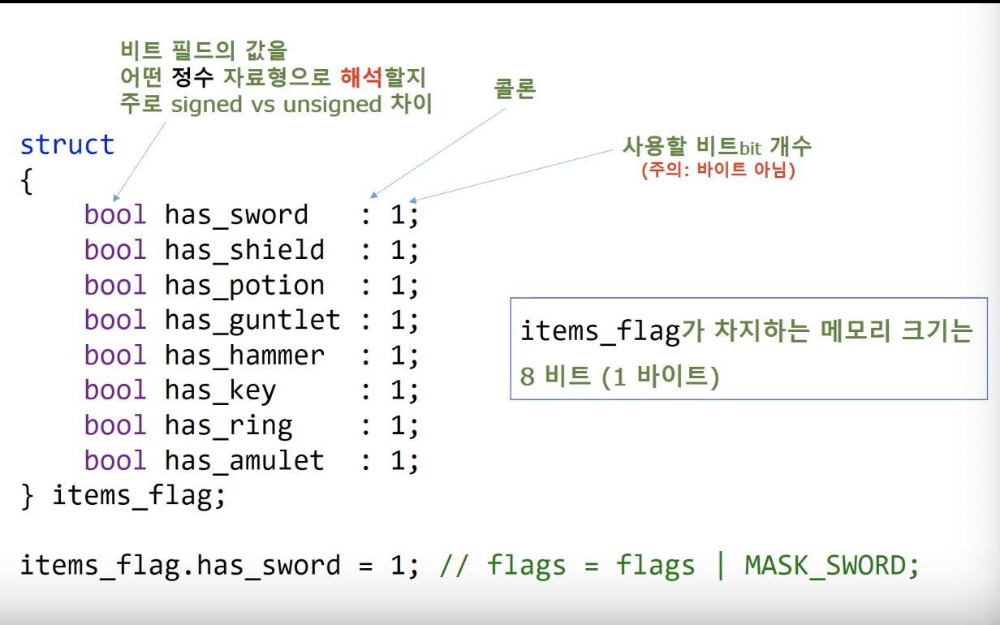

# 따배씨 - 따라하며 배우는 C언어

### 15강 비트 다루기

##### 15.1 비트단위 Bitwise 논리 연산자 Logical Operators

* Regular Logical Operators : &&, ||, and !

  ```c
  bool have_apple = true;
  bool like_apple = true;
  
  if (have_apple && like_apple)
    	eat_apple();
  ```

* Bitwise Logical Operators
  * Bitwise NOT: ~ (Tilde)
    * ~1 = 0
    * ~0 = 1
  * Bitwise AND: & (Ampersand)
    * 1&1 = 1
    * 1&0 = 0
    * 0&1 = 0
    * 0&0 = 0
  * Bitwise OR: | (Vertical bar)
    * 1|1 = 1
    * 1|0 = 1
    * 0|1 = 1
    * 0|0 = 0
  * Bitwise EXCLUSIVE OR: ^ (Caret)
    * 1 ^ 1 = 0
    * 1 ^ 0 = 1
    * 0 ^ 1 = 1
    * 0 ^ 0 = 0


* 가장 작은 자료형인 char 를 사용하더라도 8개의 자료를 표기하려면 8bytes == 64bits 가 필요함
  * bit 연산자를 사용하면 8bit 로 표현 가능


##### 15.2 이진수를 십진수로 바꾸기 연습문제

```c
#include <stdio.h>
#include <math.h>   // pow()
#include <string.h> // strlen()
#include <stdlib.h> // exit()

unsigned int to_decimal(const char bi[]);

int main()
{
    printf("Binary (string) to Decimal conversion\n");
    
    printf("%d\n", to_decimal("00000110"));
    printf("%d\n", to_decimal("00010110"));
    
    printf("%d\n", to_decimal("10010100"));
    
    return 0;
}

unsigned int to_decimal(const char bi[]) // unsigned char 범위 0~255
{
    const size_t bits = strlen(bi);
    // size_t : 시스템에서 값이 포함 할 수 있는 최대 크기의 데이터를 표현하는 타입
    
    unsigned int sum = 0;
    for (size_t i = 0; i < bits; i++)
    {
        if (bi[i] == '1')
            sum += (int)pow(2, bits - 1 - i);
        else if(bi[i] != '0')
        {
            printf("Wrong character : %c", bi[i]);
            exit(1);
        }
    }
    
    
    return sum;
}
```


##### 15.3 &를 이용하는 십진수 -> 이진수 연습 문제

```c
#include <stdio.h>
#include <math.h>   // pow()
#include <string.h> // strlen()
#include <stdlib.h> // exit()
#include <stdbool.h>

unsigned char to_decimal(const char bi[]);
void print_binary(const unsigned char num);

int main()
{
    unsigned char i = to_decimal("01000110");
    unsigned char mask = to_decimal("00000101");
    
    print_binary(i);
  	// Decimal  70 	== Bianry 01000110
    print_binary(mask);
  	// Decimal   5 	== Bianry 00000101
    print_binary(i & mask);
  	// Decimal   4 	== Bianry 00000100
    
    return 0;
}


unsigned char to_decimal(const char bi[])
{
    const size_t L = strlen(bi);
    unsigned sum = 0;
    for (size_t i = 0; i < L; i++)
    {
        if (bi[i] == '1')
            sum += (int)pow(2, L - 1 - i);
    }
    
    return sum;
}


void print_binary(const unsigned char num)
{
    printf("Decimal %3d \t== Bianry ", num);
    
    const size_t bits = sizeof(num) * 8;
    
    for (size_t i = 0; i < bits; i++)
    {
        const unsigned char mask = (unsigned char)pow((double)2, (double)(bits - 1 - i));
        
        if ((num & mask) == mask)
            // 2진 수의 자리수를 검사하는 mask 변수를 만들어 이진수의 자리수 bit 연산
            printf("%d", 1);
        else
            printf("%d", 0);
    }
    printf("\n");
    
}
```


##### 15.4 비트 단위 논리 연산자 확인해보기

```c
#include <stdio.h>
#include <math.h>
#include <string.h>
#include <stdlib.h>
#include <stdlib.h>

unsigned char to_decimal(const char bi[]);
void print_binary(const unsigned char num);

int main()
{
    /*
        Regular Logical Operators : &&, ||, and !
     
        bool have_apple = true;
        bool like_apple = true;
        if (have_apple && like_apple)
            eat_apple();
     
        Bitwise Logical Operators :
            - Bitwise NOT ~
            - Bitwise AND &
            - Bitwise OR |
            - Bitwise EXCLUSIVE OR ^
     */
    
    unsigned char a = 6;
    unsigned char b = 5;
    
    printf("%hhu\n", a);
    print_binary(a);
  	// 6
		// Decimal   6 	== Bianry 00000110
    
    printf("%hhu\n", b);
    print_binary(b);
  	// 5
		// Decimal   5 	== Bianry 00000101
    
    printf("%hhu\n", a & b);
    print_binary(a & b);
  	// 4
		// Decimal   4 	== Bianry 00000100
    
    printf("%hhu\n", a | b);
    print_binary(a | b);
  	// 7
		// Decimal   7 	== Bianry 00000111
    
    printf("%hhu\n", a ^ b);
    print_binary(a ^ b);
  	// 3
		// Decimal   3 	== Bianry 00000011
    
    printf("%hhu\n", ~a);
    print_binary(~a);
  	// 249
		// Decimal 249 	== Bianry 11111001
    
    return  0;
}

unsigned char to_decimal(const char bi[])
{
    const size_t L = strlen(bi);
    unsigned char sum = 0;
    for (size_t i = 0; i < L; i++)
    {
        if (bi[i] == '1')
            sum += (int)pow(2, L - 1 - i);
    }
    
    return sum;
}


void print_binary(const unsigned char num)
{
    printf("Decimal %3d \t== Bianry ", num);
    
    const size_t bits = sizeof(num) * 8;
    
    for (size_t i = 0; i < bits; i++)
    {
        const unsigned char mask = (unsigned char)pow((double)2, (double)(bits - 1 - i));
        
        if ((num & mask) == mask)
            // 2진 수의 자리수를 검사하는 mask 변수를 만들어 이진수의 자리수 bit 연산
            printf("%d", 1);
        else
            printf("%d", 0);
    }
    printf("\n");
}
```


##### 15.5 2의 보수 2's Complement 표현법 확인해보기

```c
#include <stdio.h>
#include <math.h>
#include <string.h>
#include <stdlib.h>


void print_binary(const char num);
int main()
{
    /*
        Signed Integers
     
        - Sign-magnitude representation
        00000001 is 1 and 10000001 is -1
        00000000 is +0, 10000000 is -0
        Two zeros +0, -0, from -127 to +127
     
        - One's complement method
        To reverse the sign, invert each bit.
        00000001 is 1 and 11111110 is -1.
        11111111 is -0
        from -127 to +127
     */
    
    print_binary(127);
  	// Decimal 127 	== Bianry 01111111
    print_binary(-127);
  	// Decimal -127 	== Bianry 10000001
    print_binary(~127 + 1);
  	// Decimal -127 	== Bianry 10000001
  
    print_binary(12);
  	// Decimal  12 	== Bianry 00001100
    print_binary(-12);
  	// Decimal -12 	== Bianry 11110100
    print_binary(~12 + 1);
  	// Decimal -12 	== Bianry 11110100
    
    return  0;
}

void print_binary(const char num)
{
    printf("Decimal %3d \t== Bianry ", num);
    
    const size_t bits = sizeof(num) * 8;
    
    for (size_t i = 0; i < bits; i++)
    {
        const char mask = (char)pow((double)2, (double)(bits - 1 - i));
        
        if ((num & mask) == mask)
            printf("%d", 1);
        else
            printf("%d", 0);
    }
    printf("\n");
    
}
```


##### 15.6 비트단위 쉬프트 Shift 연산자

```c
#include <stdio.h>
#include <math.h>
#include <string.h>
#include <stdlib.h>


void int_binary(const int num);
int main()
{
    /*
        Bitwise shift operators
     
        - Left shift
        number << n : multiply number by 2^n
     
        - Right shift
        number >> n : divede by 2^n (for non-negative numbers)
     */
    
    // 8 bit integer cases
    //
    
    printf("%hhd\n", 1 << 3);
  	// 00000001 -> 00000001??? -> 00001000
  	// 8
  
    printf("%hhd\n", 8 >> 1);
  	// 00001000 -> ?00001000 -> 00000100
    // 4
  
    printf("%hhd\n", -119 >> 3);
  	// 10001001 -> ???10001001 -> 11110001
  	// -15
      
    printf("%hhd\n", -119 << 4);
  	// 10001001 -> 10001001???? -> 10010000
  	// -112
    
    // unsigned
    printf("%hhd\n", 137 >> 3);
  	// 10001001 -> ???10001001 -> 00010001
  	// 17
  
    printf("%hhd\n", 137 << 4);
  	// 10001001 -> 10001001???? -> 10010000
  	// -112
    
    
    // singed 인 경우 right shift 의 경우 기계마다 다르지만, 주로 1로 채우게 됨
    
    int a = 1;
    
    a <<= 3;
    a >>= 2;
    
    printf("Unsigned int %u\n", 0xffffffff);
    // Unsigned int 4294967295
    printf("Signed int %d\n", 0xffffffff);
    // Signed int -1
    
    int_binary(0xffffffff);
  	// Decimal  -1 	== Bianry 11111111111111111111111111111111
    
    printf("Right shift by 3\n");
  	// Right shift by 3
    int_binary((signed)0xffffffff >> 3);
  	// Decimal  -1 	== Bianry 11111111111111111111111111111111
    int_binary((unsigned)0xffffffff >> 3);
  	// Decimal  -1 	== Bianry 11111111111111111111111111111111
    
    printf("\nUnsigned int %u\n", 0x00ffffff);
  	// Unsigned int 16777215
    int_binary(0x00ffffff);
  	// Decimal 16777215 	== Bianry 00000000111111111111111111111111
    
    printf("Right shift by 3\n");
  	// Right shift by 3
    int_binary((signed)0x00ffffff >> 3);
  	// Decimal 2097151 	== Bianry 00000000000111111111111111111111
    int_binary((unsigned)0x00ffffff >> 3);
  	// Decimal 2097151 	== Bianry 00000000000111111111111111111111

    return  0;
}

void int_binary(const int num)
{
    printf("Decimal %3d \t== Bianry ", num);
    
    const size_t bits = sizeof(num) * 8;
    
    for (size_t i = 0; i < bits; i++)
    {
        const int mask = 1 << (bits - 1 - i);
        // bit 연산자를 이용하여 mask 를 만듬, 더 효율적
        
        if ((num & mask) == mask)
            printf("%d", 1);
        else
            printf("%d", 0);
    }
    printf("\n");
}
```


##### 15.7 비트단위 연산자의 다양한 사용법

* 비트단위 연산자는 메모리와 CPU 를 잘 사용해야 하는 큰 프로그램을 작성할때 유용하게 사용 가능


```c
#include <stdio.h>
#include <math.h>

//                      shift     Decimal   Binary      Hex     Octet
#define MASK_SWORD      (1<<0) // 2^0       00000001    0X01    01
#define MASK_SHIELD     (1<<1) // 2^1       00000010    0X02    02
#define MASK_POTION     (1<<2) // 2^2       00000100    0X04    04
#define MASK_GUNTLET    (1<<3) // 2^3       00001000    0X08    010
#define MASK_HAMMER     (1<<4) // 2^4       00010000    0X10    020
#define MASK_KEY        (1<<5) // 2^5       00100000    0X20    040
#define MASK_RING       (1<<6) // 2^6       01000000    0X40    0100
#define MASK_AMULET     (1<<7) // 2^7       10000000    0X80    0200

void char_binary(const char num);
void int_binary(const int num);

/*
    flag            01011010
    mask            00000011
    mask & flag =   00000010
 */

int main()
{
    /*
        bool has_sword = false;
        bool has_shield = false;
        bool has_potion = false;
        bool has_guntlet = false;
        bool has_hammel = false;
        bool has_key = false;
        bool has_ring = false;
        bool has_amulet = false;
     */
    
    char flags = 0; // MASK flags
    char_binary(flags);
    // Decimal   0     == Bianry 00000000
    
    printf("\nTurning Bits On (Setting Bits)\n");
    flags = flags | MASK_SWORD; // flag != MASK_SWORD;
    char_binary(flags);
    // Decimal   1     == Bianry 00000001
    flags |= MASK_AMULET;
    char_binary(flags);
    // Decimal -127     == Bianry 10000001
    
    printf("\nTurning Biys Off (Clearning Bits)\n");
    flags = flags | MASK_POTION;
    char_binary(flags);
    // Decimal -123     == Bianry 10000101
    flags = flags & ~MASK_POTION;   // flags &= ~MASK_POTION;
    char_binary(flags);
    // Decimal -127     == Bianry 10000001
    
    
    printf("\nToggling Bits\n");
    flags = flags ^ MASK_HAMMER;
    char_binary(flags);
    // Decimal -111     == Bianry 10010001
    flags = flags ^ MASK_HAMMER;
    char_binary(flags);
    // Decimal -127     == Bianry 10000001
    flags = flags ^ MASK_HAMMER;
    char_binary(flags);
    // Decimal -111     == Bianry 10010001
    
    printf("\nChecking the Value of a Bit\n");
    if ((flags & MASK_KEY) == MASK_KEY)
        printf(">> You can enter.\n");
    else
        printf(">> You can not enter.\n");
    // >> You can not enter.
    
    flags |= MASK_KEY;
    
    if ((flags & MASK_KEY) == MASK_KEY)
        printf(">> You can enter.\n");
    else
        printf(">> You can not enter.\n");
    // >> You can enter.
    
    printf("\nTrimming\n");
    int int_flag = 0xffffffff;
    // 11111111111111111111111111111111
    int_binary(int_flag);
    // Decimal  -1     == Bianry 11111111111111111111111111111111
    int_flag &= 0xff;
    // Trim by 11111111
    int_binary(int_flag);
    // Decimal 255     == Bianry 00000000000000000000000011111111
    
    return 0;
}

void int_binary(const int num)
{
    printf("Decimal %3d \t== Bianry ", num);
    
    const size_t bits = sizeof(num) * 8;
    
    for (size_t i = 0; i < bits; i++)
    {
        const int mask = 1 << (bits - 1 - i);
        // bit 연산자를 이용하여 mask 를 만듬, 더 효율적
        
        if ((num & mask) == mask)
            printf("%d", 1);
        else
            printf("%d", 0);
    }
    printf("\n");
}

void char_binary(const char num)
{
    printf("Decimal %3d \t== Bianry ", num);
    
    const size_t bits = sizeof(num) * 8;
    
    for (size_t i = 0; i < bits; i++)
    {
        const int mask = 1 << (bits - 1 - i);
        // bit 연산자를 이용하여 mask 를 만듬, 더 효율적
        
        if ((num & mask) == mask)
            printf("%d", 1);
        else
            printf("%d", 0);
    }
    printf("\n");
}
```

* mask 는 보고싶은 (확인 하고 싶은 부분) 만 보기위한 선언

  ```c
  flag = 01011010;
  mask = 00000011;
  // mask & flag =   00000010;
  ```
  * flag 는 현재 상태, mask 는 확인하고 싶은 데이터
  * & 비트 연산을 통해 확인하고 싶은 부분의 데이터 확인 가능


##### 15.8 RGBA 색상 비트 마스크 연습문제

* 컴퓨터에서 색을 표현하는 방법 중 하나

```c
#include <stdio.h>

#define BYTE_MASK 0xff  // 0xff - 8비트로 표현가능한 16진수 중 가장 큰 수 == 11111111
void int_binary(const int num);
int main()
{
    unsigned int rgba_color = 0x66CDAAFF;
    // 4 bytes, medium aqua marine (102, 205, 170, 255) , unsigned char type
    
    unsigned char red, green, blue, alpha;
    
    // Use right shifg >> operator
    red     = (rgba_color >> 24 & BYTE_MASK);
	  green   = (rgba_color >> 16 & BYTE_MASK);
  	blue    = (rgba_color >> 8 & BYTE_MASK);
    alpha   = rgba_color & BYTE_MASK;
    
    

    
    printf("(R, G, B, A) = (%hhu, %hhu, %hhu, %hhu)\n", red, green, blue, alpha);
    // (R, G, B, A) = (102, 205, 170, 255)
    
    return 0;
}
```

* ```c
  unsigned int rgba_color = 0x66CDAAFF;
  ```

  * Bianry : 01100110  11001101  10101010  11111111
    * red : 01100110 == 102
    * green : 11001101 == 205
    * blue : 10101010 == 170
    * alpha : 11111111 == 255
  * 4byte 를 1byte(8bits) 씩 R, G, B, A 를 표현 / 각 색상당 0~255 까지 표현가능


##### 15.9 구조체 안의 비트필드 Bit-Fields

* Bit-Fields : 비트가 연속적으로 나열되어 있는 형태

  * C 언어에서는 구조체를 사용

  
  * ' : ' 뒤의 숫자는 몇 bit 를 사용 할지를 선언하는 방법 
  * Bit-Fields 와 Bit-Masking 은 혼용되어 사용됨


##### 15.10 비트필드 Bit-Fields 의 사용방법

```c
#include <stdio.h>
#include <limits.h>
#include <stdbool.h>

void char_to_binary(unsigned char uc)
{
    const int bits = CHAR_BIT * sizeof(unsigned char);
    
    for (int i = bits - 1; i >= 0; i--)
    {
        printf("%d", (uc >> i & 1));
    }
}

void print_binary(char* data, int bytes)
{
    for (int i = 0; i < bytes; i++)
    {
        char_to_binary(data[i]);
    }
    printf("\n");
}

int main()
{
    struct items {
        bool has_sword      : 1;    // : number means bits to use!
        bool has_shield     : 1;    // 1bit 크기의 bool type
        bool has_potion     : 1;
        bool has_guntlet    : 1;
        bool has_hammer     : 1;
        bool has_key        : 1;
        bool has_ring       : 1;
        bool has_amulet     : 1;
    } items_flag;
    
    items_flag.has_sword    = 1;    // flags = flags | MASK_SWORD;
    items_flag.has_shield   = 1;
    items_flag.has_potion   = 0;
    items_flag.has_guntlet  = 1;
    items_flag.has_hammer   = 0;
    items_flag.has_key      = 1;
    items_flag.has_ring     = 1;
    items_flag.has_amulet   = 1;
    
    printf("Size = %zd\n", sizeof(items_flag));
    // Size = 1
    
    print_binary((char *)&items_flag, sizeof(items_flag));
    // 11001011
    
    if (items_flag.has_key == 1)
        printf(">> You can enter.\n");
        // >> You can enter.
    
    
    
    union{
        struct items bf;
        unsigned char uc;
    } uni_flag;
    
    uni_flag.uc = 0;
    uni_flag.bf.has_amulet = true;
    uni_flag.uc |= (1 << 5);
    print_binary((char*)&uni_flag, sizeof(uni_flag));
    // 10100000
    
    uni_flag.bf.has_key = false;
    print_binary((char*)&uni_flag, sizeof(uni_flag));
    // 10000000
    
    return  0;
}
```

* structure 를 이용하여 bit-fields 로 사용

  * union 을 이용하여 초기화를 쉽게 함

    ```c
    union{
      struct items bf;
      unsigned char uc;
    } uni_flag;
    
    uni_flag.uc = 0;
    ```


```c
#include <stdio.h>
#include <limits.h>
#include <stdbool.h>

int main()
{
    struct file_time {
        unsigned int seconds    : 5;   // 2^5 = 32, 0 ~ 30*2 seconds
        unsigned int minutes    : 6;   // 2^6 = 64, 0 ~ 60 minutes
        unsigned int hours      : 5;   // 2^5 = 32, 0 ~ 23 hours
    };
    
    struct file_date {
        unsigned int day        : 5;   // 2^5 = 32, 1 ~ 31 day
        unsigned int month      : 4;   // 2^4 = 16, 1 ~ 12 month
        unsigned int year       : 7;   // 2^7 = 128, 1980 ~ years
    } fd;
    
    /* 1988 12 28 */
    fd.day = 28;
    fd.month = 12;
    fd.year = 8;
    
    printf("Day %u, Month %u Year %u,\n", fd.day, fd.month, fd.year);
    
    // scanf("%d", &fd.day);    /* Warning */
    return  0;
}

```

* 파일이 생성 될때, 시간 / 날짜를 Bits-Fields 를 이용하여 최적화 표기 가능

  * ```c
    struct file_time {
            unsigned int seconds    : 5;   // 2^5 = 32, 0 ~ 30*2 seconds
            unsigned int minutes    : 6;   // 2^6 = 64, 0 ~ 60 minutes
            unsigned int hours      : 5;   // 2^5 = 32, 0 ~ 23 hours
        };
    ```

  * ```c
    struct file_date {
            unsigned int day        : 5;   // 2^5 = 32, 1 ~ 31 day
            unsigned int month      : 4;   // 2^4 = 16, 1 ~ 12 month
            unsigned int year       : 7;   // 2^7 = 128, 1980 ~ years
        };
    ```

* ```c
  // scanf("%d", &fd.day);    /* WRONG */
  ```
  * Bits-Fields 는 bit 단위로 메모리를 사용하기 때문에, 주소의 최소 단위인 1Byte 의 연산이 불가능 함
    * scanf 는 입력 값이 저장될 공간 위치를 주소값으로 지정