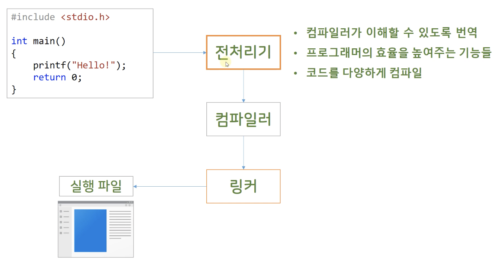

# 따배씨 - 따라하며 배우는 C언어

### 16강 전처리기와 라이브러리

##### 16.1 전처리기 Pre-processor 가 해주는 일들



* Compiler 한다 : 코드를 입력하고 실행파일을 만드는 일 -> Build
* 명확하게는 전처리기는 Compiler 는 아님
  * Complier 가 어떤 일을 하는지에 따라 전처리기의 역할이 다름
    * Compiler 는 코드의 중요한 문법들을 해석해서 실행 할 수 있는 형태로 바꾸어주는 역할
    * Linker 는 파일들을 연결 시켜 주는 역할
* 전처리기
  * Code 와 Compiler 를 연결해 주는 역할
  * 프로그래머의 반복적인 작업을 도와주는 역할
  * 조건적으로 compiler 하는 기능


##### 16.2 전처리기를 준비하는 번역 단계 Translation phase

```c
#include <stdio.h>

int main()
{
    /*
        Program written in C
        
        Translating - 전처리기의 앞에서 이루어 지거나 전처리기에 포함된 과정으로 혼용하여 봄
        Preprocessing
        Compiling - Compiler 가 모두 처리한다는 표현으로 사용하기도 함
        Linking
     
        Executable
     */
    
    
    /*
        International characters
     */
    puts("안녕하세요? 한글입니다.\n");
    // 국제 다국어로 작성된 코드를 내부적으로 Translating 단계에서 이해 할 수 있는 문자 집합으로 처리
    
    
    /*
        Trigraph Sequences
        - Some keyboards don't provide all the symbols used in C.
        - Three-character sequences
     
        Trigraph        Replacement
        ??=             #
        ??/             \
        ??'             ^
        ??(             [
        ??)             ]
        ??!             |
        ??<             {
        ??>             }
        ??-             ~
     
        /Zc: trigraphs
     */
    int arr[3] = {1, 2, 3};
    printf("arr[0] == %d\n", arr[0]);
    // printf("arr??(0??) == %d\n", arr??(0??));
    
    /*
        Digraphs
        - Two-Character sequences
     
        Digrapsh        Equivalent
        <:              [
        :>              ]
        <%              {
        %>              }
        %:              #
     */
    printf("arr[1] == %d\n", arr[1]);
    //printf("arr<:1:> == %d\n", arr<:1:>);
    
    /* Two physical lines vs One logical line */
    printf("This is a very very very very very very very very\
 long long long\n");
    
    
    /*
        Tokens
        - Groups separated from each other by spaces, tabs, or lines breaks
        Whitespace charaters -> a single space
     */
    int /* a variable to count a number*/ n = 1;
    // int n = 1;
    // 권장하지 않음
    
    return 0;
}
```


##### 16.3 #define 매크로

```c
#include <stdio.h>


/*
    Preprocessor directives begins with # simbol at the beginning of a line.
 */

/*
    Macro
    - An instruction that represents a sequence of instructions in abbreviated form.
 */

/*
    #define         SAY_HELLO       printf("Hello, World!");
    
    preprocessor    Macro (name)    body (or replacement list)
    directive
 
    Macro expansion - macro 가 body 의 내용으로 교체되는 것을 의미
 */

/*
    Object-like macros vs Function-like macros
 
    #define ONE 1
    // 전처리기가 ONE 에 해당하는 부분을 1 로 교체, complier 입장에서는 변수는 아님
 
    #define SQUARE(X) X*X
    // compiler 입장에서는 함수가 아님, cpp 에서는 함수형 메크로 사용을 지양함
 */

#define PI 3.141592     /* Symbolic, or manifest, constans */
#define GRAVITY 9.8

#define THREE 3
#define MESSAGE "The greatst glory in living lies not in never falling, \
but in rising every time we fall."

#define NINE THREE*THREE
#define SAY_HELLO for(int i = 0; i < 10; i++) printf("Hello, World!\n");
#define FORMAT "Number is %d\n"

 # define WITH_BLANK 1

#define MY_CH 'Z'
#define MY_ST "Z"   // Z\0

#define LIMIT 20
const int LIM = 50;
static int arr1[LIMIT];
const int LIM2 = 2 * LIMIT;

/*
    Tokens
    
    #define SIX 3*2
    #define SIX 3 * 2
    #define SIX 3       *       2
 */

/* Redefining Constants */
#define SIX 2*3
#define SIX 2*3
// 한 file 안에서, define 을 여러번 선언 가능
// define 은 기본적으로 file scope

#define SIX 2 * 3 // Warning

#undef SIX
#define SIX 2 * 3
// undef 로 define 해제 후, 새롭게 define 하면 token 문제 해결 가능

int main()
{
    int n = THREE;
    SAY_HELLO
    n = NINE;
    
    printf(FORMAT, n);
    printf("%s\n", MESSAGE);    // replaced
    printf("SAY_HELLO NINE\n"); // Not replaced
    return 0;
}
```

* Macro 는 기본적으로 복사해서 붙여넣기 수준으로 교체해주는 것은 맞지만, 그렇지 않는 경우도 있으니 유의
* Compiler 는 Macro 의 내용을 알지 못함, 전처리기가 처리 하기 때문

* ```c
  #define SAY_HELLO for(int i = 0; i < 10; i++) printf("Hello, World!\n");
  ```

  * SAY_HELLO 를 선언 할때, ';' (세미콜론) 을 붙였기 때문에, main 에서 SAY_HELLO 뒤에 ';' 을 붙이지 않아도 문제가 없다.
  * 세미콜론이 두개가 붙여진다고 해서 문제가 생기는 것은 아님
  * 오픈소스에서는 세미콜론을 안쓰는 경우가 많으므로 주의하자

* Macro 는 문자열 안에 있는 경우는 교체되지 않음


##### 16.4 함수 같은 매크로

```c
#include <stdio.h>

/*
    Function-like macros
 
    #define     ADD(X,Y)    ((X) + (Y))
    
    X and Y : macro arguments
 */

#define ADD1(X,Y)   X+Y
#define ADD2(X,Y)   ((X)+(Y))
#define SQUARE(X)   X*X         // ((X)*(X))

int main()
{
    int sqr = SQUARE(3);
    
    int a = 1;
    
    printf("%d\n", 2 * ADD1(1, 3)); // 2 * X + Y = 2 * 1 + 3 = 5    //WRONG!!
    printf("%d\n", 2 * ADD2(1, 3)); // 2 * (1 + 3) = 8
    
    printf("%d\n", SQUARE(1 + 2));  // 1+2*1+2 = 1 + 2 + 2 = 5  //WRONG!!
    printf("%d\n", 100 / SQUARE(3 + 1)); // 100 / 3 + 1 * 3 + 1 = 33 + 3 + 1 = 37 // WRONG!!
    printf("%d\n", SQUARE(++a));    // ++a * ++a = 2 * 3 = 6 //DANGEROUS!
    
    return 0;
}
```

* Function-like Macros 는 연산의 순서가 예상과 다를 경우가 발생할 수 있으므로 주의


```c
#include <stdio.h>

/*
    Stringizing operator #
    - converts macro parameters to string literals
 */

#define SQUARE(X)   (X)*(X)
#define PRINT_SQR1(x)   printf("The square of %d is %d\n", x, SQUARE(x))
#define PRINT_SQR2(x)   printf("The square of " #x " is %d\n", SQUARE(x))

/*
    ## operator combines two tokens into a single token
 */

#define XNAME(n) x ## n
#define PRT_XN(n) printf("x" #n " = %d\n", x ## n);
int main()
{
    PRINT_SQR1(10);
    // The square of 10 is 100
    PRINT_SQR2(10);
    // The square of 10 is 100
    
    printf("\n");
    
    int XNAME(1) = 1;   // int x1 = 1;
    int XNAME(2) = 2;   // int x2 = 2;
    
    PRT_XN(1);          // printf("x1 " = %d\n", x1);
    // x1 = 1
    PRT_XN(2);          // printf("x2 " = %d\n", x2);
    // x2 = 2
    
    return 0;
}
```

* ```c
  #define PRINT_SQR2(x)   printf("The square of " #x " is %d\n", SQUARE(x))
  
  PRINT_SQR2(10);
  // The square of 10 is 100
  ```

  * 입력받은 x 를 프로그래머가 타이핑 한 것처럼 문자열 처리

* ```c
  #define XNAME(n) x ## n
  
  int XNAME(1) = 1;
  // int x1 = 1
  // XNAME(1) == x1
  ```

  * x 는 유저가 타이핑 한 것, n 은 입력받은 것으로 처리


```c
/*
    Macro or Function ?
    - no space in the macro name
    - Use parentheses
    - Use captital letters for macro function names
    - Speed up?
 */

#define MAX(X, Y)   ((X) > Y ? (X) : (Y))
#define MIN(X, Y)   ((X) < Y ? (X) : (Y))
#define ABS(X)      ((X) < 0 ? -(X) : (X))
```


##### 16.5 가변 인수 매크로 Variadic Macros

```c
#include <stdio.h>
#include <math.h>

/*
    Variadic Macros accept a variable number of arguments.
 */

#define PRINT(X, ...) printf("Message " #X ": " __VA_ARGS__)
// ... : ellipes
// __VA_ARGS : one of the predefined macros

/*
    printf(...)
    stdvar.h Variadic arguments
 */


int main()
{
    double x = 48;
    double y;
    
    y = sqrt(x);
    PRINT(1, "x = %g\n", x);
    // Message 1: x = 48
    PRINT(2, "x = %.2f, y = %.4f\n", x, y);
    // Message 2: x = 48.00, y = 6.9282
    
    return 0;
}
```


##### 16.6 #include 와 헤더파일

```c
// my_functions.h
#pragma once

extern int status;

static int si = 0;

extern int add(int a, int b);

static int multiply(int a, int b)
{
    return a * b;
}

//int substract(int a, int b)
inline int subtract(int a, int b)
{
    return a - b;
}

void print_status(void);
void print_address(void);
```

* ```c
  #pragma once
  ```

  * hader file 이 한번만 include 되도록 설정

    * ```c
      #ifndef __MY_FUNCTIONS__
      #define __MY_FUNCTIONS__
      // header code
      #endif
      ```

      * 같은 방법

* extern - 모든 파일에서 사용 가능한 전역 선언

  * ```c
    extern int a = 1;
    // 전역번수 선언 및 초기화
    ```

    * 다른 file 에서도 변수 사용 가능
    * file scope 에서 전역변수 선언도 extern 을 default 로 한다

  * ```c
    extern int a;
    ```

    * 다른 file 에서 선언된 전역변수에 대한 '참조선언'
    * extern 참조 선언은 함수 내에서도 가능한데, 이 경우에는 Compiler 가 다른 파일에서 extern 변수 선언을 검사하지 않음으로 Compile Error 가 발생하지 않음으로 주의

  * extern 함수의 경우, 모든 함수는 기본적으로 extern 으로 선언됨

* static - 한 파일 내에서만 사용가능한 전역 선언

  * ```c
    static int b = 2;
    ```


```c
// my_functions.c
#include "my_functions.h"

#include <stdio.h>

int status = 0;

int add(int a, int b)
{
    return a + b;
}

void print_status()
{
    printf("my_functions header status address, value: %p, %d\n", &status, status);
}

void print_address()
{
    printf("print_address()\n");
    printf("Static function address %p\n", multiply);
    printf("Static valiable address %p\n", &si);
}
```


```c
// my_structures.h
#pragma once

typedef struct
{
    char name[100];
    int age;
} patient_info;

```


```c
// my_headers/my_macros.h
#pragma once

#define MAX(X, Y)   ((X) > (Y) ? (X) : (Y))
#define MIN(X, Y)   ((X) < (Y) ? (X) : (Y))
#define ABS(X)   ((X) < 0 ? -(X) : (X))

#define GRAVITY 9.8
#define PI      3.141592

```


```c
// main.c
#include <stdio.h>  // 공식직원, 표준 라이브러리
#include "my_functions.h"
#include "my_structures.h"
#include "my_headers/my_macros.h"   //path

extern int status;

int main()
{
    printf("PI = %f\n", PI);
  	// PI = 3.141592

    printf("main status address, value: %p, %d\n", &status, status);
  	// main status address, value: 0x100008018, 0
    
  	print_status();
	  // my_functions header status address, value: 0x100008018, 0

    printf("%d\n", multiply(51, 2));
		// 102
  
    printf("\nmain()\n");
  	// main()
    printf("Static function address %p\n", multiply);
  	// Static function address 0x100003de0
    printf("Static variable address %p\n", &si);
    // Static variable address 0x100008010

	  print_address();
  	// print_address()
  	// Static function address 0x100003ea0
  	// Static valiable address 0x100008014
    
    return 0;
}
```

* ``` c
  printf("\nmain()\n");
  // main()
  printf("Static function address %p\n", multiply);
  // Static function address 0x100003de0
  printf("Static variable address %p\n", &si);
  // Static variable address 0x100008010
  
  print_address();
  // print_address()
  // Static function address 0x100003ea0
  // Static valiable address 0x100008014
  ```

  * my_functions.h 에서 static 으로 선언한 변수 si 와 함수 multiply 호출 시, 호출 방법에 따라 다른 메모리 주소에 할당되는 것을 확인 할 수 있음
  * static 으로 선언 시, 함수가 끝나도 메모리에서 사라지지 않고 유지 됨


##### 16.7 조건에 따라 다르게 컴파일하기 Conditional Compilation

```c
#include <stdio.h>

/*
    #define, #undef, #if, #ifdef, #ifndef, #else, #elif, #endif
 */

/*
    #undef
 */

#define LIMIT 400
//#undef LIMIT // It's ok to undefine previously NOT defined macro.

#undef  NON_DEFINED

int main()
{
    printf("%d\n", LIMIT);
    
    return 0;
}
```

* ```c
  #undef  NON_DEFINED
  ```

  * NON_DEFINED 를 define 해주지 않았지만, 문제 없음


```c
// my_function_1.h
#ifndef MY_FUNCTION_1
#define MY_FUNCTION_1

#include <stdio.h>

static void my_function()
{
    printf("my_function_1.h\n");
}
#endif


// main.c
#include <stdio.h>

#define TYPE 1

#if TYPE == 1
#include "my_function_1.h"
#elif TYPE == 2
#include "my_function_2.h"
#else
static void my_function()
{
    printf("Wrong complie option!\n");
}
#endif


int main()
{
    my_function();
    
    return 0;
}
```

* TYPE 조건에 따라 다른 header 를 include 하여 compile


```c
#include <stdio.h>

#define REPORT  // empty Macro

int sum(int i, int j)
{
    int s = 0;
    for (int k = i; k <= j; k++)
    {
        s += k;
    
#ifdef REPORT
    printf("%d %d\n", s, k);
#endif
    }
    
    return s;
}


int main()
{
    printf("\n%d \n", sum(1, 10));
    
    return 0;
}
```

* ```c
  #define REPORT
  ```

  *  REPORT 는 Macro 이름만 선언 된, empty Macro

* ```c
  #ifdef REPORT
      printf("%d %d\n", s, k);
  #endif
  ```

  * REPORT 가 macro 로 선언 되어 있는지 여부에 따라 판단

* 개발 환경의 Mode (RELEASE , DEBUG) 에 따라 전처리기가 다른 결과를 보여주도록 개발 가능

  * DEBUG Mode 는 전처리 지시자에서 DEBUG 명령이 들어가게 됨

* ```c
  #include <stdio.h>
  
  void say_hello()
  {
  #ifdef _WIN64
      printf("Hello, WIN64");
  #elif _WIN32
      printf("Hello, WIN32");
  #elif __linux__
      printf("Hello, linux");
  #elif __APPLE__
      printf("Hello, APPle");
  #endif
  }
  
  int main()
  {
      say_hello();
      
      return 0;
  }
  ```

  * 플랫폼에 따라 코드의 일부를 바꾸어 Complie 가능

  * 플랫폼에 대한 정의는 Complier 가 미리 정의를 해서 넣어둠

  * ```c
    #ifdef == #if defined(조건)
    ```

    * 같은 표현


##### 16.8 미리 정의된 매크로들 #line, #error

```c
#include <stdio.h>

#include "DifferentFile.h"

void different_function(void);

int main()
{
    printf("__FILE__ : %s\n", __FILE__);
    // __FILE__ : /Users/leejuho/Desktop/studyC/studyC/main.c
    printf("__DATE__ : %s\n", __DATE__);
    // __DATE__ : May  3 2021
    printf("__TIME__ : %s\n", __TIME__);
    // __TIME__ : 16:31:12
    printf("__LINE__ : %d\n", __LINE__);
    // __LINE__ : 15
    printf("__func__ : %s\n", __func__);
    // __func__ : main
    
    different_function();
    // This function is different_function
    // This is line 34
    
    different_func_in_different_file();
    // __FILE__ : /Users/leejuho/Desktop/studyC/studyC/DifferentFile.h
    // __func__ : different_func_in_different_file
    
    return 0;
}

void different_function()
{
    printf("This function is %s\n", __func__);
    printf("This is line %d\n", __LINE__);
}
```

* 그 외

  * `__STDC__` : C 언어 표준 만족 여부

  * `__STDC_HOSTED__` :  표준을 더 엄격하게 따르는지 여부

  * `__STDC_VERSION__` : 현재 사용하는 C 표준 버전

    * ```c
      #if __STDC_VERSION__ != 201112L
      #error Not C11
      #endif
      ```

      * 버전을 확인하고, 아니라면 Error 발생

  * `#line 7` : 강제로 Line number 를 7로 변경

  * `#line 1 "hello.txt"` : 강제로 Line number 와 File 이름을 변경

  * `#error 조건` : 강제로 Error 발생

    * ```c
      #if __LINE__ != 33
      #error Not line 33
      #endif
      ```

      * 현재 33번 줄이 아니라면, 33번 줄이 아니라는 Error 발생 시킴


##### 16.9 #pragma 지시자

* Compiler 에게  Complie 에 대한 지시를 내리는 전처리 지시자

* ```c
  #pragma once
  ```

  * include header guard : 중복으로 header 를 include 하는것을 방지

  * ```c
    #ifndef SAMPLE_HEADER
    #define SAMPLE_HEADER
    
    // header 내용
    
    #endif
    ```

    * 같은 동작을 정의, #pragma once 와 함께 사용 가능

* ```c
  #pragma pack(1)
  ```

  * 구조체의 padding size 를 설정

* ```c
  #pragma warning( disable : 4477)
  ```

  * Warning 을 disable

* ```c
  #pragma warning( error : 4477)
  ```

  * Warning 을 Error 처리


##### 16.10  _Generic 표현식

```c
#include <stdio.h>

/*
    Generic selection expression
    - Generic programing : code is not specific to a particular type
    
    _Generic : C11 keyword
 */

#define MYPYPE(X) _Generic((X), \
    int : "int", \
    float: "float", \
    double : "double", \
    default: "other" \
)

int main()
{
    int d = 5;
    
    printf("%s\n", MYPYPE(d));
    // int
    printf("%s\n", MYPYPE(2.0 * d));
    // double
    printf("%s\n", MYPYPE(3L));
    // other
    printf("%s\n", MYPYPE(&d));
    // other
    
    return 0;
}
```

* C++ 에서 활용도가 높은 표현

* Generic programing : 코드가 특정한 자료형에 대해서만 작동하지 않고, 각각의 자료형대해 동작하도록 하는  programing

  * ```c
    #define MYPYPE(X) _Generic((X), \
        int : "int", \
        float: "float", \
        double : "double", \
        default: "other" \
    )
    ```

    * 각각의 자료형에 대해 다른 출력

  * ```c
    #define MYPYPE(X) _Generic((X), \
        int : (x + 123)
    )
    ```

    * 표현식을 넣는 것도 가능


##### 16.11 inline 함수

* 작은 함수가 반복하여 사용 될 때, 실행 속도를 높일 수 있는 방법

```c
#include <stdio.h>

/*
    Function call has overhead
    - set up the call, pass arguments, jump to the function code, end return.
 
    inline function spectifier (함수 특성 지정자)
    - suggets inline replacements. (제안을 함)
    - function call overhead 가 없어짐
 
    Inline functions should be short.
    A function with internal linkage can be made inline.
    You can't take its address. -> 함수의 내용을 복사 붙여넣기 처럼 동작하기 때문
 */

inline static int foo()
// internal linkage
{
    return 5;
}

int main()
{
    int ret;
    // inline function call
    
    ret = foo();
    
    printf("Output is : %d\n", ret);
    
    return 0;
}

* ```c
  inline static int foo()
  // internal linkage
  {
      return 5;
  }
```

  * gcc 나 clang 의 경우는 static 으로 선언하여 internal linkage 처리를 해주어야함
    * 함수의 기본 선언은 external 이기 때문

* Compiler 가 자동으로 inline 으로 compile 하거나, function call 로 compile 하기도 함

* inline 은 주로 header 정의하여 사용


##### 16.12 라이브러리

* Library : 필요한 책들이 잔뜩 모여있는 도서관
  * 참고  Compile : 책을 출판하기 위해 ''편집하다'' 라는 의미
* Library 는 Main 함수가 없음
* Library 의 종류
  * Static Library : 프로그램에 Library 가 포함되어 있음
  * Dynamic Library : 프로그램의 실행 도중 필요 할때, 동적으로  Library 를 가져다 사용함
* 확장자별 종류
  * `.a` : 리눅스/정적 라이브러리
  * `.so` : 리눅스/동적라이브러리
  * `.lib` : 윈도우/정적라이브러리
  * `.dll` : 윈도우/동적라이브러리
* Library 와 Header 의 차이
  * 라이브러리 : 기계어로 번역된 것
  * 헤더파일은 : 컴파일 하기 전, 프로그래머가 이해할 수 있고 문법에 맞게 작성되어 있는 선언들의 집합.
  * 헤더가 여러개 모이는 것 != 라이브러리
  * 컴파일된 산물인 *.o(오브젝트)파일을 여러개 모아 놓은 것 == 라이브러리
  * 라이브러리를 사용하기 위해서 해당 라이브러리의 헤더파일이 있어야함
  * 컴파일러가 헤더파일을 가지고 심볼네임을 만들어서 오브젝트 파일에 넣어주면, 링커가 해당 심볼네임을 가지고 라이브러리를 뒤져서 링크를 하게 됨.


##### 16.13 표준 수학 라이브러리

```c
#include <stdio.h>

#include <math.h>

int main()
{
    printf("%f\n", cos(3.141592));
    
    double c = 5.0, b = 4.0, a;
    a = sqrt(c * c - b * b);
    printf("a = %f\n", a);
    
    float cf = 5.0f, bf = 4.0f, af;
    af = sqrtf(cf * cf - bf * bf);
    printf("af = %f\n", af);
    
    return 0;
}
```


```c
#include <stdio.h>

#include <tgmath.h>   // type generic macros

#define SQRT(X) _Generic((X),\
long double: sqrtl, \
default: sqrt, \
float: sqrtf)(X)

int main()
{
    double t1 = SQRT(2.0f);
    double t2 = SQRT(2.0);
    
    if (t1 == t2)
        printf("Identical\n");
    else
        printf("Not identical\n");
    // Not identical
    
    /*
        tgmath.h Library
     */
    
    double a1 = sqrt(2.0f);
    double a2 = sqrt(2.0);
    
    if (a1 == a2)
        printf("Identical\n");
    else
        printf("Not identical\n");
    // Not identical
    
    return 0;
}
```

* math 라이브러리와 tgmath 라이브러리의 sqrt 정밀도 차이가 발생


##### 16.14 표준 유틸리티 Utilities 라이브러리

```c
#include <stdio.h>
#include <stdlib.h>

/*
    rand(), srand(), malloc(), free(), ...
 */

void goodbye(void)
{
    printf("GoodBye\n");
}

void thankyou(void)
{
    printf("Thankyou\n");
}

int main()
{
    printf("Purchased?\n");
    if (getchar() == 'y')
        atexit(thankyou);
        // 프로그램이 종료 될 때, 런타임에서 실행 시킬 함수를 등록
    
    while (getchar() != '\n') {};
    
    printf("Goobye message?\n");
    
    if (getchar() == 'y')
        atexit(goodbye);
    
    return 0;
}
```


```c
#include <stdio.h>
#include <stdlib.h>
#include <stdnoreturn.h>

_Noreturn void stop_now(int i)
// 함수가 실행되고, 프로그램이 끝나는 함수
{
    if (i > 0) exit(i);
}

int main()
{
    puts("Preparing to stop...");
    stop_now(0);
    puts("This code is never executed.");
}
```


##### 16.15 assert 라이브러리

* 디버깅 할 때 유용하게 사용 가능


```c
#include <stdio.h>

int divide(int a, int b);

int main()
{
    int a, b;
    int f = scanf("%d%d", &a, &b);
    
    printf("a / b = %d\n", divide(a, b) );
    
    return 0;
}

int divide(int a, int b)
{
    assert(b != 0);
  	// b == 0 일때, assert 동작
    
    return a / b;
}
```

* assert 는 Release Mode 에서는 compile 시 포함되지 않음
  * Debug Mode Runtime 에서 동작
* static assert 는  compile time 에서 동작


##### 16.16 memcpy() 와 memmove()

```c
#include <stdio.h>
#include <stdlib.h>
#include <string.h> // memcpy(), memmove()

#define LEN 6

void prt(int *arr, int n)
{
    for (int i = 0; i < n; i++)
    {
        printf("%d ", arr[i]);
    }
    printf("\n");
}

int main()
{
    /*
        - overlapping region
        - pointer-to-void (datatype is unknown)
     */
    
    int arr1[LEN] = { 1, 3, 5, 7, 9, 11};
    
    int* arr2 = (int*)malloc(LEN * sizeof(int));
    if (arr2 == NULL) exit(1);
    for (int i = 0; i < LEN; i++)
        arr2[i] = arr1[i];
    
    memcpy(arr2, arr1, sizeof(int) * LEN);
    prt(arr2, LEN);
    
    
    memmove(arr1, &arr1[2], sizeof(int) * 4);
    /*
        {1, 3, 5, 7, 9, 11}
        {5, 7, 9, 11, 9, 11}
     */
    // 겹치는 메모리 주소가 있으면, memcopy() 는 동작하지 않음
    // memmove()는 복사할 내용을 따로 저장하여 사용, memcpy()는 바로 복사
    
    prt(arr1, LEN);
    
    return 0;
}
```

* memcpy() 와 mcmmove() 는 string 뿐만 아니라 일반적인 메모리 복사에 사용
  * 다른 string method 와 달리 문자열 끝의 null character 조건에 맞추지 않고 메모리에 대해서만 동작
  * 배열 뿐만 아니라 동적 할당 메모리를 배열처럼 사용 할 때에도 사용 가능

* memcpy()

  * 겹치는 메모리 주소가 있으면, memcopy() 는 동작하지 않음

* memmove()

  * memmove()는 복사할 내용을 따로 저장하여 사용, memcpy()는 바로 복사


##### 16.17 가변 인수 Variable Arguments

```c
#include <stdio.h>
#include <string.h>
#include <stdarg.h> // Variable Arguments

/*
    Variable Arguments
    - int printf(char const * const _Format, ...);
 
    1. Provide a function prototype using an ellipsis
    
    void    vaf1(int n, ...);  // OK
    int     vaf2(const char * s, int k, ...);  // OK
    char    vaf3(char c1, ..., char c2); // Not OK, ellipsis should be the last.
    double  vaf4(...);  // Not OK, no parameter.
 
    2. Create a va_list type variable in the function definition
    3. Use a macro to initialize the variable to an argument list
    4. Use a macro to access the argument list.
 */

double average(int, ...);
double average2(char* format_string, ...);

int main()
{
    double a, b;
    
    a = average(3, 1.1, 2.2, 3.3);
    b = average(6, 1.1, 2.2, 3.3, 4.4, 5.5, 6.6);
    
    printf("%lf\n", a);
    printf("%lf\n", b);
    
    return 0;
}

double average(int num, ...)
{
    va_list ap;
    double sum = 0.0;
    int i;
    
    va_start(ap, num);
    // 마지막 변수를 두번째 argument 로 넣어줌
    
    for (i = 0; i < num; i++)
        sum += va_arg(ap, double);
    va_end(ap);
    
    return sum / (double)num;
}

double average2(char * format_string, ...)
{
    int num = (int)strlen(format_string);
    
    va_list ap;
    double sum = 0.0;
    int i;
    
    va_start(ap, format_string);
    for (i = 0; i < num; i++)
    {
        sum += va_arg(ap, double);
    }
    
    va_end(ap);
    
    return sum / (double)num;
}

```

