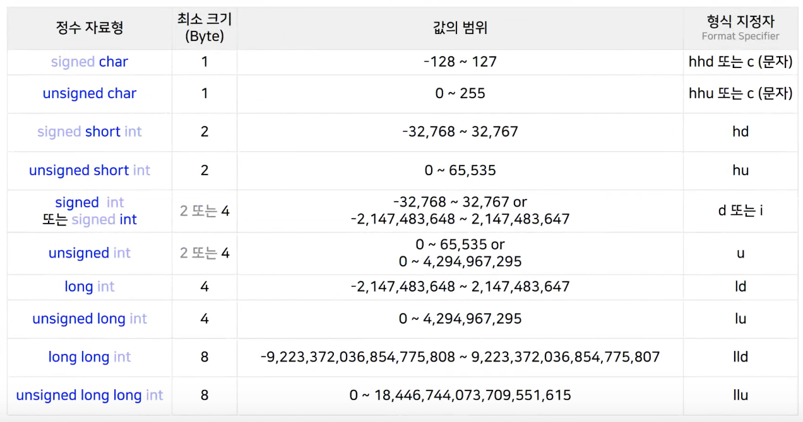
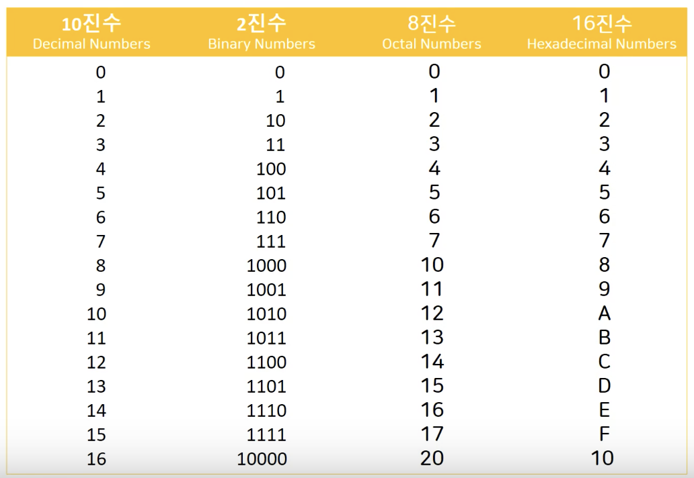

# 따배씨 - 따라하며 배우는 C언어

### 3강 데이터와 C 언어

##### 3.1 데이터와 자료형

* 입력 데이터 -> 컴퓨터  -> 결과 데이터
  * 내부적으로 데이터를 다루고 처리하기 위해 다양한 자료형을 사용
  * 프로그래머들은 다양한 자료형을 이용해서 데이터를 처리하는 여러가지 프로그램을 만듬


* 자료형 - 정수 자료형/실수 자료형

  
  * 문자도 정수로 처리
  * 실수 자료형의 사용에는 용도에 따라 범위가 크게 달라짐
    * 자료형의 사이즈가 크면 속도가 느려지기 때문에 프로그래머의 선택으로 결정하는것이 유리


##### 3.2 변수와 상수

* 변수

  ```c
  int angel = 1004;
  ```

  * 자료형 + 변수(Variable) + 리터럴 상수(Literal constant)
  * int - 자료형
  * angle - 변수
  * 1004 - 리터럴 상수
    * 그대로의 의미를 가지고 그 의미가 변하지 않는 상수


* 상수

  ```c
  const int angel = 1004;
  ```

  * 한정자,제한자(Qualifier) + 자료형 + 기호적상수(Symbolic Constant) + 리터럴상수(Literal Constant)
  * const - 한정자,제한자(Qualifier)
    * 값을 바꾸지 못하는 변수로 선언 == 상수 선언
  * int - 자료형
  * angle - 기호적 상수
    * 변수의 이름
  * 1004 - 리터럴 상수
    * 그대로의 의미를 가지고 그 의미가 변하지 않는 상수


##### 3.3 scanf() 함수의 기본적인 사용법

* scanf() - 입력을 받는 함수

  ```c
  scanf("%d", &i); // & : ampersand
  ```

  * Microsoft 의 경우 Compile 에서 Error가 발생

    * 해결

      ```c
      #define _CRT_SECURE_NO_WARNINGS
      ```

      * 상위에 작성하여 에러 해결
      * gcc compiler 를 사용하면 해결 됨

* &(ampersand)
  * 변수명 앞에 & 를 붙이게 되면 주소를 받아 오게 됨
  * scanf("%d", &i)
    * i 의 주소값에 입력으로 받아온 값을 직접 접근하여 대입
      * Microsoft 의 경우 보안의 위험이 있다고 판단하여 Error 발생
      * scanf_s() 함수를 사용하는것을 권장함


##### 3.4 간단한 입출력 프로그램 만들기

```c
#include <stdio.h>

int main()
{
    int i = 0, j = 0;
    int sum = 0;
    
    printf("Input Two intergers\n");
    scanf("%d%d", &i, &j);
    
    sum = i+j;
    
    printf("Your numbers are %d and %d\n", i, j);
    printf("%d plus %d is = %d\n", i, j, sum);
    return 0;
}
```


```c
#include <stdio.h>

int main()
{
    float won = 0;
    float dollar = 0;
    
    printf("Input Won\n");
    scanf("%f", &won);
    
    dollar  = won * 0.00089f;
    
    printf("Dollar = %f\n", dollar);
    
    return 0;
}

```


* 형식 지정자

  
  
  * 형식 지정자의 사용으로 다양한 자료형의 데이터를 입/출력 받을 수 있음


##### 3.5 정수와 실수

* 정수 Intergers
  * 음의 정수, 0, 양의 정수
  * 내부적으로 2진수 binary
* 실수 Real numbers
  * 소수점과 함께 표현되는 수
  * 내부적으로 '부동 소수점 floating point' 표현법 사용
    * 지수 Exponent 를 이용
    * 3.14 = 3.14E0 = 0.314E1 = 31.4E-1
  * 내부적으로 2진수 binary


* 8비트 / 32비트 부호 없는 정수 Unsigned
  * 전체 비트를 숫자 표현에 사용
* 8비트 / 32비트 부호 있는 정수 Signed
  * 한비트를 ±부호 표현에 사용
    * 0 : 양수 / 1: 음수
  * '2의 보수' 표현법이 일반적
    * Tow's Complement
  * 부호 있는 정수와 범위가 다름


* 부동 소수점 수
  * ±부호 Sign + 지수 Exponent + 분수 Fraction
    * ᛭ | -1 | 0.3141592 -> 0.3141592 X 10E-1 = 0.03141592
    * ᛭ |  1 | 0.3141592 -> 0.3141592 X 10E1 = 3.141592
    * ᛭ |  2 | 0.3141592 -> 0.3141592 X 10E2 = 31.41592
  * 32bit Single Precision
    * float a = 1.234f;
      * sing - 1bit
        * 31번
      * exonent (8 bits)
        * 23~30번
      * fraction (23 bits)
        * 0 ~ 22번
  * 64bit Double Precision
    * double pi = 3.141592;
      * sign - 1bit
        * 63번
      * exponent (11 bits)
        * 52 ~ 62번
      * fraction (52 bits)
        * 0 ~ 51번
  * Floating Point 연산은 메모리 구조가 정수형 대비 복잡하여 느리게 동작
    * 하드웨어의 발전으로 64bit Double Precision의 동작도 빨라지는 추세
    * but, 복잡한 프로그램 개발시 Double의 남용은 위험


##### 3.6 정수의 오버플로우

```c
#include <stdio.h>

int main()
{
    unsigned int i = 0;
    
    printf("%u\n", sizeof(unsigned int));	// 4
    printf("%u", sizeof(i));	// 4

    return 0;
}
```

* 출력하려는 데이터가 unsigned 라서 %u 를 사용하여 출력


```c
#include <stdio.h>
#include <limits.h>

int main()
{
    unsigned int i = 0b11111111111111111111111111111111;
//    이진수 입력법, C언어의 표준은 아니지만 대부분의 프로그래머들이 사용하기 때문에 지원
    unsigned int u = UINT_MAX;
    
    printf("%u\n", i);  // 4294967295
    printf("%u\n", u);  // 4294967295
    
    printf("%d", i); // -1
    
    return 0;
}
```

* unsigned int i의 최대값, 2진수 32bit = 0b11111111111111111111111111111111
* limits Header를 이용하여 자료값의 최대값 호출  = UNIT_MAX
* %u 가 아닌 %d 로 최대값을 출력시 "-1" 출력으로 오류발생
  * signed int 값과 unsigned int 값의 최대값 범위가 다르기 때문


```c
#include <stdio.h>
#include <limits.h>

int main()
{
    unsigned int u_max = UINT_MAX;
    unsigned int u_min = 0;
    
    signed int i_max = INT_MAX;
    signed int i_min = INT_MIN;
    
    printf("max of unit = %u\n", u_max);  // 4294967295
    printf("max of int =  %d\n", i_max);  // 2147483647
    
    printf("min of unit = %u\n", u_min);  // 0
    printf("min of int =  %d\n", i_min);  // -2147483648
    
    return 0;
}
```

* unsigned int 의 범위: 0 <= u <= 4294967295
* signed int 의 범위: -2147483648 <= i <= 2147483647


```c
#include <stdio.h>
#include <limits.h>

int main()
{
    unsigned int u_max = UINT_MAX+1;
    unsigned int u_min = 0 - 1;
    
    printf("max + 1: %u\n", u_max);	// 0
    printf("min - 1: %u\n", u_min); // 4294967295
    
    return 0;
}
```

* Overflow 상황 발생
  * max + 1 -> 0b11111111111111111111111111111111 + 1
    * 32bit를 초과한 숫자인 0b100000000000000000000000000000000 가 됨
    * 초과한 자리수인 33bit는 제외되어 남은 수인 0이 됨
  * min - 1 -> 0b00000000000000000000000000000000 - 1
    * 33bit 자리 수 1이 있다고 가정을 하고 -1 연산 진행
    * 그 결과 32bit의 가장 큰 수가 됨


##### 3.7 다양한 정수형들



* 4byte Int 형이 기본
  * 4byte int 형의 범위는 long과 같아서 int를 많이 사용하고 long의 사용빈도가 줄어듬
* 1byte = 8bit
* short: 절반
* long: 두배
* 큰 자료형의 값을 작은 자료형의 형식 지정자로 호출하면 문제 발생


```c
#include <stdio.h>
#include <limits.h>

int main()
{
  char c = 65;
  short s = 200;
  unsigned ui = 3000000000U;
  // 3'000'000'000U
  long l = 65537L;
  long long ll = 12345678908642LL;
  // 12'345'678'908'642ll;
  
  printf("char = %hhd, %d, %c\n", c, c, c);
  //	char = 65, 65, A

  printf("short = %hhd, %hd, %d\n", s, s, s);
  // short = -56, 200, 200

  printf("unsigned int = %u, %d\n", ui, ui);
  // unsigned int = 3000000000, -1294967296

  printf("long = %ld, %hd\n", l, l);
  // long = 65537, 1

  printf("long long = %lld, %d\n", ll, ll);
  // long long = 12345678908642, 1942899938
    
    return 0;
}
```

* 자료형과 형식지정자를 맞춰 사용햐지 않으면 정확하게 출력되지 않음


##### 3.8 8진수와 16진수




```c
#include <stdio.h>
#include <limits.h>

int main()
{
  unsigned int decimal = 4294967295;\
    unsigned int binary = 0b11111111111111111111111111111111;
  unsigned int oct = 037777777777;
  unsigned int hex = 0xffffffff;
    
	printf("%u\n", decimal); // 4294967295
	printf("%u\n", binary);	// 4294967295
	printf("%u\n", oct);	// 4294967295
	printf("%u\n", hex);	// 4294967295	
    
	printf("%o\n", decimal);
  // 37777777777
  printf("%x\n", decimal);
  // ffffffff
	printf("%#o\n", decimal);
  // 037777777777
	printf("%#x\n", decimal);
  // 0xffffffff
	printf("%#X\n", decimal);
  //	0XFFFFFFFF
    return 0;
}
```

* %#
  * prefix
  * 출력 시 입력할 때와 같이 명확히 진수를 표현해주는 방법
  * 대문를 사용하면 대문자로 출력


##### 3.9 이식성이 높은 고정 너비 정수

* C 언어는 각 자료형의 최소 메모리 크기만을 규정
  * 여러 시스템에서 자료형의 사이즈가 모두 다를 수 있다
  * 이식성이 낮음: 다른 시스템에서 작동하지 않을 가능성이 있음
* 고정 너비 정수형: 변수, 자료형의 사이즈를 명확하게 고정하여 사용


```c
#include <stdio.h>
#include <limits.h>
#include <inttypes.h>

int main()
{
	int i;
	int32_t i32;        // 32 bit interger
	int_least8_t i8;    // smallest 8 bit
	int_fast8_t f8;     // fastest minimum
	intmax_t imax;      // biggest signed intergers
	uintmax_t uimax;    // biggest unsigned integers
    
  i32 = 1004;
    
	printf("me32 = %d\n", i32);
  // me32 = 1004
	printf("me32 = %" "d" "\n", i32);
  // me32 = 1004
	printf("me32 = %" PRId32 "\n", i32);
  // me32 = 1004
    
	return 0;
}
```

* 고정 너비 정수형들은 새로운 자료형을 만드는것이 아니라 명확히 정의하는 것

* printf() 함수를 사용 할때 형식 지정자에 문제 발생

  * printf("me32 = %d\n", i32);

    -> "me32 = %d\n"

    -> "me32 = %"	"d"	"\n"

    -> "me32 = %"	PRId32	"\n"

  * PRId32 - 32bit 정수형을 printf로 출력 할때, 메크로를 사용하여 고정 넓이 정수를 편하게 출력 가능

    * PRI - print
    * d - decimal
    * 32 - 32bit


##### 3.10 문자형

* ASCII Chart
  * 컴퓨터 내부적으로 문자를 2진수로 바꿔서 저장하고 처리
  * 문자형도 정수형의 일부인것 처럼 분류를 하는것이 일반적
  * 숫자와 문자의 대응을 나타낸 표를 ASCII Chart 라고 함


```c
#include <stdio.h>

int main()
{
    char c = 'A';
    char d = 65; // d = 'A'
    
    printf("%c %hhd\n", c, c);
    printf("%c %hhd\n", d, d);
    
    char a = '\a';
    printf("%c", a); // == printf("\07"); == printf("x7");
    
    
    return 0;
}
```

* escape Sequence
  * \a - 소리 출력
  * \b - 커서 왼쪽으로 한칸
  * \t - 탭 입력
  * \ \ - 백슬러쉬 출력
  * \ ? - 물음표 출력


##### 3.11 부동소수점형

- 과학적 표기법  Scientific Notations

  - m X 10^n
    - m: significand
    - n: exponent
  - 123.45 = 12345 X 10^-2 = 1.2345 X 10^2
  - 유효숫자 5개: 1.2345 X 10^2
  - 유효숫자 6개: 1.23450 X 10^2

- 4 byte (32 bit) 부동소수점수

  - sign + exponent (8 bits) + fraction (23 bits)

    - sign: 31번째
    - exponent: 23~30번째
    - fraction: 0~22번째 ; Sgnificand 중에서 소수점 아래 부분

  - 0.15625 = 0b0111110001000000000000000000000

    - (+1) X 2^(124-127) X (1 + 2^-2)

      = +0.125 X 1.25

      = +0.15625

- 범위 비교

  - 4 byte 정수 범위

    - -2,147,438,648 ~ 2,147,438,647

      대략 -2.14 X 10^9 ~ 2.14 X 10^9

  - 4 byte 부동 소수점수 범위

    - 대략 -3.4 X 10^38 ~ 3.4 X 10^38

      10진수 유효숫자 6개 - 정확도를 보장 할 수 있는 자리수가 6개


```c
#include <stdio.h>
#include <float.h>

int main()
{
    printf("%u \n", sizeof(float));
    printf("%u \n", sizeof(double));
    printf("%u \n", sizeof(long double));
    
    float f = 123.456f;
    double d = 123.456;
    
    float f2 = 123.456;
    double d2 = 123.456f;
    
    int i = 3;
    float f3 = 3.f; // 3.0f
    double d3 = 3;  // 3.0

    float f4 = 1.234e10f;
    
    float f5 = 0xb.aP1;
    double d5 = 1.0625e0;
    
    printf("%f %F %e %E\n", f, f, f, f);
    printf("%f %F %e %E\n", d, d, d, d);
//    %f, %F: 실수 출력 // %e, %E: 과학적 표기법 출력
    printf("%a %A\n", f5, f5);
    printf("%a %A\n", d5, d5);
//    %a, %A: 16진수 출력
    
    return 0;
}
```

* long double
  * long double 은 windows 에서 8byte, 64bit Linux, OS X 에서는 16byte
* float f = 123.456f;
  * float 형은 literal f 를 붙여주는게 좋다
* double d = 123.456;
  * double 형은 기본형이라서 literal 이 붙이 않아도 됨
* float f2 = 123.456;
  * 8byte 메모리의 double 을 float 에 대입하므로 정밀도 문제로 warning 발생    
* 1.234e10f == 1.234 X 10^10 - 과학적 표기법


##### 3.12 부동소수점형의 한계

```c
#include <stdio.h>
#include <float.h>
#include <math.h>

int main()
{
    // round-off errors (ex1) - 너무 큰숫자와 상대적으로 작은 숫자의 합의 계산이 되지 않음
    float a, b;
    a = 1.0E20f + 1.0f;
    b = a - 1.0E20f;
    printf("%f\n", b);  // 0.000000
    
    // round-off errors (ex2) - 2진수를 사용하는 부동 소수점 표현법에서는 0.01 을 표기 하지 못함
    float c = 0.0f;
    for (int i = 0 ; i < 100; i++){
        c = c + 0.01f;
    }
    printf("%f\n", c);  // 0.999999
    
    
    // overflow
    float max = 3.042823466e+38f;
    printf("%f\n", max);
    max = max * 100.0f;
    printf("%f\n", max);    // inf 출력, infinite: 표현 할 수 없는 큰 숫자
    
    
    // underflow
    float min = 1.401298464e-45f;
    printf("%e\n", min);
    min = min / 2.0f;
    printf("%e\n", min);    // 0.000000e+00 출력, subnormal: 부동 소숫점 형의 정밀도로 표현할수 없는 작은 숫자
    
    float f = 104.0f;
    f = f/0.0f;
    printf("%f\n", f); // inf 출력
    
    f = asinf(2.0f);    // arc sin
    printf("%f\n", f);  // nan 출력, Not A Number: 수학적으로 존재하지 않는 값
    
    return 0;
}
```


##### 3.13 불리언형 Boolean Type

* 고전적인 C 문법에는 Bool type이 존재하지 않음.

  * 최근 Bool type이 추가 됨: _Bool
  * 1byte - 메모리 주소를 배정 받을 수 있는 최소 단위

  ```c
  
  int main(){
    _Bool b1;
    
    b = 0;	// false
    b = 1;	// true
    
    return 0;
  }
  ```

  

* Header를 추가하여 사용 가능, <stdbool.h>

  * Bool type을 bool 로 사용 가능

  ```c
  #include <stdbool.h>
  
  int main(){
    bool b2, b3;
    
    b2 = true;	// true: 예약어 == 1
    b3 = false;	// false: 예약어 == 0
    
    return 0;
  }
  ```

  

##### 3.14 복소수형 Complex Types

```c
#include <stdio.h>
#include <complex.h>

int main(){
    double _Complex z = 1 + 2*I;
    
    z = 1 / z;
    
    printf("1 / (1.0 + 2.0i) = %.1f%+.1fi\n", creal(z), cimag(z));
    
    return 0;
}
```

* gcc Compiler 기준 표현법
* complex 의 경우 사용자의 편의에 따라 만들어 사용하는게 보편적

