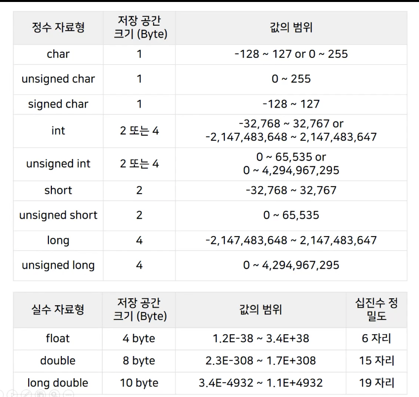
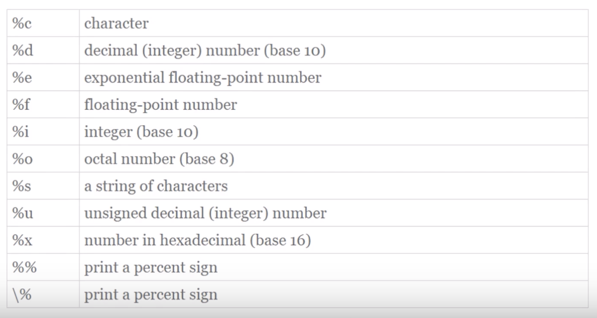

# 따배씨 - 따라하며 배우는 C언어

### 3강 데이터와 C 언어

##### 3.1 데이터와 자료형

* 입력 데이터 -> 컴퓨터  -> 결과 데이터
  * 내부적으로 데이터를 다루고 처리하기 위해 다양한 자료형을 사용
  * 프로그래머들은 다양한 자료형을 이용해서 데이터를 처리하는 여러가지 프로그램을 만듬


* 자료형 - 정수 자료형/실수 자료형

  
  * 문자도 정수로 처리
  * 실수 자료형의 사용에는 용도에 따라 범위가 크게 달라짐
    * 자료형의 사이즈가 크면 속도가 느려지기 때문에 프로그래머의 선택으로 결정하는것이 유리


##### 3.2 변수와 상수

* 변수

  ```c
  int angel = 1004;
  ```

  * 자료형 + 변수(Variable) + 리터럴 상수(Literal constant)
  * int - 자료형
  * angle - 변수
  * 1004 - 리터럴 상수
    * 그대로의 의미를 가지고 그 의미가 변하지 않는 상수


* 상수

  ```c
  const int angel = 1004;
  ```

  * 한정자,제한자(Qualifier) + 자료형 + 기호적상수(Symbolic Constant) + 리터럴상수(Literal Constant)
  * const - 한정자,제한자(Qualifier)
    * 값을 바꾸지 못하는 변수로 선언 == 상수 선언
  * int - 자료형
  * angle - 기호적 상수
    * 변수의 이름
  * 1004 - 리터럴 상수
    * 그대로의 의미를 가지고 그 의미가 변하지 않는 상수


##### 3.3 scanf() 함수의 기본적인 사용법

* scanf() - 입력을 받는 함수

  ```c
  scanf("%d", &i); // & : ampersand
  ```

  * Microsoft 의 경우 Compile 에서 Error가 발생

    * 해결

      ```c
      #define _CRT_SECURE_NO_WARNINGS
      ```

      * 상위에 작성하여 에러 해결
      * gcc compiler 를 사용하면 해결 됨

* &(ampersand)
  * 변수명 앞에 & 를 붙이게 되면 주소를 받아 오게 됨
  * scanf("%d", &i)
    * i 의 주소값에 입력으로 받아온 값을 직접 접근하여 대입
      * Microsoft 의 경우 보안의 위험이 있다고 판단하여 Error 발생
      * scanf_s() 함수를 사용하는것을 권장함


##### 3.4 간단한 입출력 프로그램 만들기

```c
#include <stdio.h>

int main()
{
    int i = 0, j = 0;
    int sum = 0;
    
    printf("Input Two intergers\n");
    scanf("%d%d", &i, &j);
    
    sum = i+j;
    
    printf("Your numbers are %d and %d\n", i, j);
    printf("%d plus %d is = %d\n", i, j, sum);
    return 0;
}
```


```c
#include <stdio.h>

int main()
{
    float won = 0;
    float dollar = 0;
    
    printf("Input Won\n");
    scanf("%f", &won);
    
    dollar  = won * 0.00089f;
    
    printf("Dollar = %f\n", dollar);
    
    return 0;
}

```


* 형식 지정자

  
  
  * 형식 지정자의 사용으로 다양한 자료형의 데이터를 입/출력 받을 수 있음


##### 3.5 정수와 실수

* 정수 Intergers
  * 음의 정수, 0, 양의 정수
  * 내부적으로 2진수 binary
* 실수 Real numbers
  * 소수점과 함께 표현되는 수
  * 내부적으로 '부동 소수점 floating point' 표현법 사용
    * 지수 Exponent 를 이용
    * 3.14 = 3.14E0 = 0.314E1 = 31.4E-1
  * 내부적으로 2진수 binary


* 8비트 / 32비트 부호 없는 정수 Unsigned
  * 전체 비트를 숫자 표현에 사용
* 8비트 / 32비트 부호 있는 정수 Signed
  * 한비트를 ±부호 표현에 사용
    * 0 : 양수 / 1: 음수
  * '2의 보수' 표현법이 일반적
    * Tow's Complement
  * 부호 있는 정수와 범위가 다름


* 부동 소수점 수
  * ±부호 Sign + 지수 Exponent + 분수 Fraction
    * ᛭ | -1 | 0.3141592 -> 0.3141592 X 10E-1 = 0.03141592
    * ᛭ |  1 | 0.3141592 -> 0.3141592 X 10E1 = 3.141592
    * ᛭ |  2 | 0.3141592 -> 0.3141592 X 10E2 = 31.41592
  * 32bit Single Precision
    * float a = 1.234f;
      * sing - 1bit
        * 31번
      * exonent (8 bits)
        * 23~30번
      * fraction (23 bits)
        * 0 ~ 22번
  * 64bit Double Precision
    * double pi = 3.141592;
      * sign - 1bit
        * 63번
      * exponent (11 bits)
        * 52 ~ 62번
      * fraction (52 bits)
        * 0 ~ 51번
  * Floating Point 연산은 메모리 구조가 정수형 대비 복잡하여 느리게 동작
    * 하드웨어의 발전으로 64bit Double Precision의 동작도 빨라지는 추세
    * but, 복잡한 프로그램 개발시 Double의 남용은 위험

