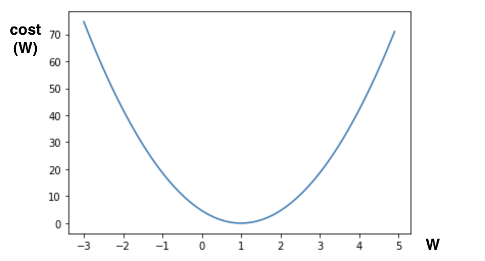
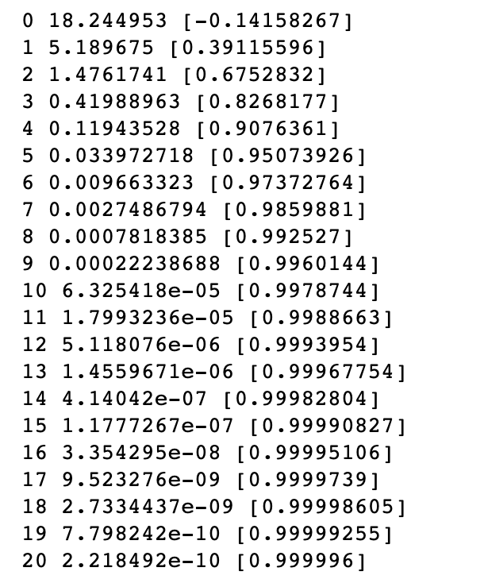
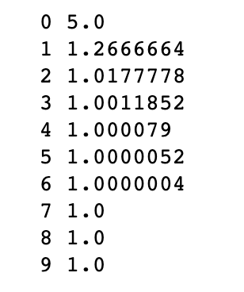
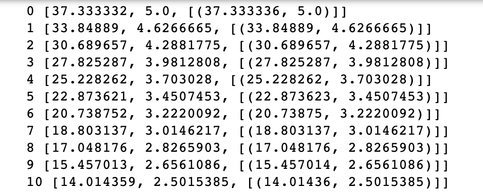

# 03. How to minimize cost

* Hypothesis and Cost

  * $$
  H(x) = Wx + b
    $$
  
    
  
  * $$
  cost (W, b)= \frac{1}{m} \sum_{i=1}^m(H(x^{(i)})-y^{(i)})^2
    $$

* Simplified hypothesis

  * cost의 공식을 간단히 하기 위해 H(x)를 단순화
  
  * $$
  H(x) = Wx
    $$
  
  * $$
    cost (W)= \frac{1}{m} \sum_{i=1}^m(Wx^{(i)}-y^{(i)})^2
    $$
  
    * cost(W) 가 2차 함수 형태를 가지게 됨
  
* Gradient descent algorithm

  * Minimize cost function

  * Gradient descent is used many minimmization problems

  * For a given cost function, cost(W, b), it will find W, b to minimize cost

  * It can be applied to more general function : cost(w1, w2, ...)

    * 많은 값들을 가진 cos function 도 minimize 가 가능함

  * 2차 함수의 경사도(기울기)가 0인 점 : 미분 값이 0인 점을 찾음 -> 최소값 위치

    * Formal definition

      * $$
        W:= W -⍺{⍬\over ⍬W}cost(W)
        $$

        

        * ⍺ : 상수

      * 미분 결과

        * $$
          W:= W -⍺{1 \over m} \sum_{i=1}^m (Wx^{(i)} - y^{(i)})x^{(i)}
          $$

          * Gradient Descent Algorithm

* 정리

  * cost(W, b) 는 W와 b 를 인자로 갖는 3차원 함수이므로 기울기가 0이 되는 구간이 여러군데 나타 날 수 있다.

  * 하지만 다행히도 Convex function 형태로 cost(W, b) 가 나타나기 때문에, Gradient descent algorithm이 항상 답을 찾게 해 준다

    * convex function : 볼록함수, 임의의 두 점에 대해 그 함수값보다 크거나 같은 점들의 집합이 항상 [볼록 집합](https://ko.wikipedia.org/wiki/볼록_집합)인 경우 그 함수를 볼록함수라고 정의

    

* Linear Regression의 TensorFlow 구현

  * Simplified hypothesis

    ```python
    import tensorflow as tf
    import matplotlib.pyplot as plt
    
    X = [1, 2, 3]
    Y = [1, 2, 3]
    W = tf.placeholder(tf.float32)
    
    # our hypothesis for linear model X * W
    hypothesis = X * W
    # H(x) = Wx <- H(x) = Wx + b 의 간략 모델
    
    # cost/loss function
    cost = tf.reduce_mean(tf.square(hypothesis - Y))
    
    # Launch the graph in an session
    sess = tf.Session()
    
    # Variables for plotting cost function
    W_val = []
    cost_val = []
    for i in range(-30, 50):
        feed_W = i * 0.1
        curr_cost, curr_W = sess.run([cost, W], feed_dict={W: feed_W})
        W_val.append(curr_W)
        cost_val.append(curr_cost)
        
    # show the cost function
    plt.plot(W_val, cost_val)
    plt.show()
    ```

    

  * Grandient descent

    ```python
    import tensorflow as tf
    
    x_data = [1,2, 3]
    y_data = [1,2, 3]
    
    W = tf.Variable(tf.random_normal([1]), name = 'weight')
    # W는 random 값으로 할당
    
    X = tf.placeholder(tf.float32)
    Y = tf.placeholder(tf.float32)
    
    # Our hypothesis for linear model X * W
    # 단순화 한 모델
    
    hypothesis = X * W
    
    # Cost/Loss function
    cost = tf.reduce_sum(tf.square(hypothesis - Y))
    
    
    # ---------------------------------
    # 미리 미분한 cost 함수를 code로 입력
    
    # Minimize : Gradient descent using derivative : W -= Learning_rage * derivative
    learning_rate = 0.1
    # 식에서의 ⍺ 값, 학습 rate, 작은 값으로 설정
    
    gradient = tf.reduce_mean((W * X - Y) * X)
    # reduce_mean() - 평균값
    
    descent = W - learning_rate * gradient
    
    update = W.assign(descent)
    # assign() - 세션 속에서 변수의 값을 변경 할 때 사용
    # 연산 결과를 W 값에 재 할당하고, update에도 할당
    # ---------------------------------
    
    
    # Launch the graph in a session
    sess = tf.Session()
    
    # Initializes global variables in the graph
    # 변수 초기화
    sess.run(tf.global_variables_initializer())
    
    
    for step in range(21):
        sess.run(update, feed_dict = {X: x_data, Y: y_data})
        print(step, sess.run(cost, feed_dict = {X: x_data, Y: y_data}), sess.run(W))
    ```

    * 결과
      * step, cost, W
      * cost 값이 작아지고
      * W 가 1에 가까워지는것을 확인 할수 있다.

     

    * cost(W) 함수를 미분한 cost 함수를 사용하지 않는 code (미분을 해주는 함수 이용)

      ```python
      import tensorflow as tf
      
      # tf Graph Input
      X = [1, 2, 3]
      Y = [1, 2, 3]
      
      # Set wrong model weights
      W = tf.Variable(5.0)
      # 차이가 큰 값을 setting
      
      # Linear model
      hypothesis = X * W
      
      # Cost/Losss function
      cost = tf.reduce_mean(tf.square(hypothesis - Y))
      
      # Minimize : Gradient Descent Magic
      optimizer = tf.train.GradientDescentOptimizer(learning_rate = 0.1)
      train = optimizer.minimize(cost)
      
      # Launch the graph in a session
      sess = tf.Session()
      
      # Initializes global variables in the graph
      sess.run(tf.global_variables_initializer())
      
      for step in range(100):
          print(step, sess.run(W))
          sess.run(train)
      ```

      * 결과

        * W 값이 5에서 1로 수렴해 가는것을 확인 할 수 있다

        


* 추가 : compute_gradient and apply_gradient

  ```python
  import tensorflow as tf
  
  X = [1, 2, 3]
  Y = [1, 2, 3]
  
  # Set wrong model weights
  # 기본 값을 5.0 으로 설정
  W = tf.Variable(5.)
  
  # Linear model
  hypothesis = X * X
  
  # Manual gradient
  gradient = tf.reduce_mean((W * X - Y) * X) * 2
  
  # cost/loss function
  cost  = tf.reduce_mean(tf.square(hypothesis - Y))
  optimizer = tf.train.GradientDescentOptimizer(learning_rate=0.01)
  
  # Get gradients, cost에 맞는 Gradient(기울기)를 계산
  gvs = optimizer.compute_gradients(cost)
  
  # Apply_gradients
  # optimizer 에 gvs 값을 gradient로 입력
  apply_gradients = optimizer.apply_gradients(gvs)
  
  # Launch the graph in a session
  sess = tf.Session()
  sess.run(tf.global_variables_initializer())
  
  for step in range(100):
      print(step, sess.run([gradient, W, gvs]))
      sess.run(apply_gradients)
  ```

  * 결과

    * 미분을 통해 수식으로 계산한 gradient => gradient 값

    * learning_rate 0.1 으로 자동계산된 gradient => optimizer 값

    * gradient 값과 optimizer 값이 거의 같다는 것을 알 수 있다.

    * step, [ gradient, W, [ optimizer, ->결과 W] ]

      

    