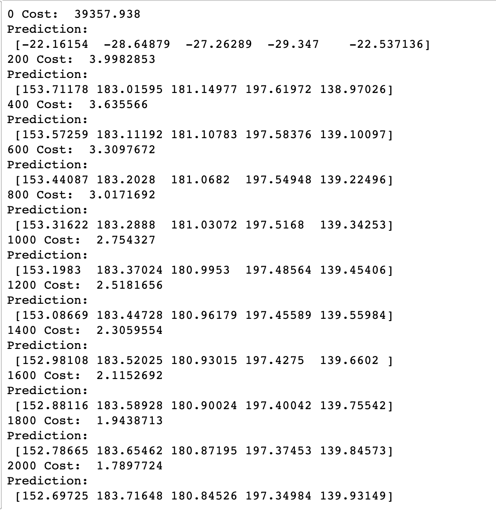
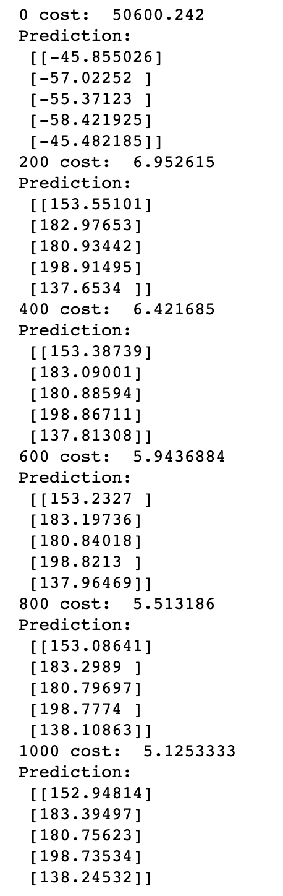
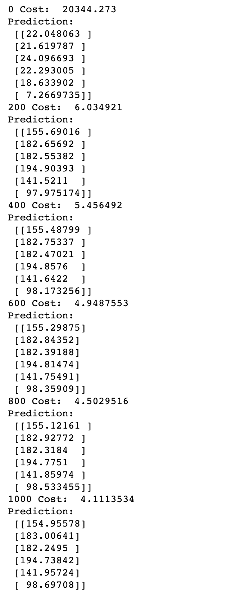
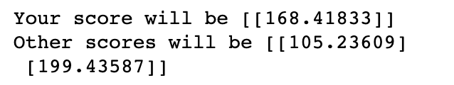

# 04. Multivariable Linear Regression

* Recap

  * Hypothesis - 가설

    * $$
      H(x) = Wx + b
      $$

  * Cost function - 가설에 대한 타당성 확인 방법

    * 실제 값(True) 과 예측값(Prediction) 의 차이의 평균

    * cost 값이 작을수록 좋은 예측 값이라 판단

    * $$
      cost (W, b)= \frac{1}{m} \sum_{i=1}^m(H(x^{(i)})-y^{(i)})^2
      $$

  * Gradient Descent algorithm

    * 2차 함수의 포물선 문제에서 기울기가 낮은 곳으로 이동하여 최소값을 찾아내는 방법
    * gradient의 반대 방향으로 이동하는 것을 반복하여 최소화하는 값을 찾아냄


* Predicting exam score

  * regression using three inpus (x1, x2, x3)

    | x1 (quiz 1) | x2 (quiz 2) | x3 (midterm 1) | Y (final) |
    | :---------: | :---------: | :------------: | :-------: |
    |     73      |     80      |       75       |    152    |
    |     93      |     88      |       93       |    185    |
    |     89      |     91      |       90       |    180    |
    |     96      |     98      |      100       |    196    |
    |     73      |     66      |       70       |    142    |

  * Hypohesis

    * $$
      H(x1, x2, x3) = w1x1 + w2x2 + w3x3 + b
      $$

  * Cost function

    * $$
      cost (W, b)= \frac{1}{m} \sum_{i=1}^m(H(x1^{(i)}, x2^{(i)}, x3^{(i)})-y^{(i)})^2
      $$


* Matrix Multiplication

  * $$
    w1x1 + w2x2 + w3x3 
    $$

  * $$
    (x1w1 + x2w2+x3w3) = \begin{pmatrix} x1 & x2 & x3 \end{pmatrix} \begin{pmatrix} w1 \\ w2 \\ w3 \end{pmatrix}
    $$

  * $$
    H(X) = XW
    $$


* Hypothesis using matrix

  * 표의 x 의 여러 값들을 instance 라고 함

    | x1 (quiz 1) | x2 (quiz 2) | x3 (midterm 1) | Y (final) |
    | :---------: | :---------: | :------------: | :-------: |
    |     73      |     80      |       75       |    152    |
    |     93      |     88      |       93       |    185    |
    |     89      |     91      |       90       |    180    |
    |     96      |     98      |      100       |    196    |
    |     73      |     66      |       70       |    142    |

  * $$
    \begin{pmatrix} x11 & x12 & x13 \\ x21 & x22 & x23 \\ x31 & x32 & x33 \\ x41 & x42 & x43 \\ x51 & x52 & x53 \end{pmatrix} \begin{pmatrix} w1 \\ w2 \\ w3 \end{pmatrix} = \begin{pmatrix} x11w1 + x12w2 + x13w3 \\x21w1 + x22w2 + x23w3 \\x31w1 + x32w2 + x33w3 \\ x41w1 + x42w2 + x43w3 \\ x51w1 + x52w2 + x53w3 \end{pmatrix}
    $$

  * ​		         [5, 3]           *        [3, 1]  =                     [5, 1]

    *  [instance 갯수, variable 갯수] * [? ,?] = [instance 갯수, Y]
    * Weight의 행렬 항수는 X 와 H(X)의 행렬 항으로 유추 가능

  * $$
    H(X) = XW
    $$


* Hypothesis using matrix (n output)
  * [n , 3] * [? , ?] = [n , 2]
    * [3 , 2] 로 유추 가능


* WX vs XW - 구분에 유의

  * Lecture(theory):

    * $$
      H(x) = Wx + b
      $$

  * Implementation (TensorFlow)

    * $$
      H(X) = XW
      $$

      


* Tensorflow 구현

  * Multi-variable Linear Regression

    ```python
    import tensorflow as tf
    
    x1_data = [73., 93., 89., 96., 73.]
    x2_data = [80., 88., 91., 98., 66.]
    x3_data = [75., 93., 90., 100., 70.]
    y_data = [152., 185., 180., 196., 142.]
    
    # Placeholders for a tensor that will be always fed.
    x1 = tf.placeholder(tf.float32)
    x2 = tf.placeholder(tf.float32)
    x3 = tf.placeholder(tf.float32)
    Y = tf.placeholder(tf.float32)
    
    w1 = tf.Variable(tf.random_normal([1]), name="weight1")
    w2 = tf.Variable(tf.random_normal([1]), name="weight2")
    w3 = tf.Variable(tf.random_normal([1]), name="weight3")
    b = tf.Variable(tf.random_normal([1]), name="bias")
    hypothesis = x1 * w1 + x2 * w2 + x3 * w3 + b
    
    # cost/loss function
    cost = tf.reduce_mean(tf.square(hypothesis - Y))
    
    # Minimize. Need a very small Learning rate for this data set
    optimizer = tf.train.GradientDescentOptimizer(learning_rate = 1e-5)
    train = optimizer.minimize(cost)
    
    # Launch the graph in a session
    sess = tf.Session()
    
    # Initializes global variables in the graph
    sess.run(tf.global_variables_initializer())
    
    for step in range(2001):
        cost_val, hy_val, _ = sess.run([cost, hypothesis, train], feed_dict={x1: x1_data, x2: x2_data, x3: x3_data, Y: y_data})
        if not step % 200:
            print(step, "Cost: ", cost_val, "\nPrediction:\n", hy_val) 
    ```

    * 결과
      * 많이 실행을 킬수록 cost가 낮아짐
      * Y 값에 수렴하며 유사해 지는것을 확인 할 수 있다

    

    

    

* Multi-variable Linear Regression - Matrix

  * Matrix 연산을 사용하여 계산

    ```python
    import tensorflow as tf
    
    # Matrix 표현에 유의
    x_data = [[73., 80., 75.], [93., 88., 93.], [89., 91., 90.], [96., 98., 100.], [73., 66., 70.]]
    y_data = [[152.], [185.], [180.], [196.], [142.]]
    
    # Placeholders for a tensor that will be aloways fed
    # tensorflow 의 해렬 크기의 None은 N개를 의미
    X =  tf.placeholder(tf.float32, shape=[None, 3])
    Y =  tf.placeholder(tf.float32, shape=[None, 1])
    
    W = tf.Variable(tf.random_normal([3, 1]), name="weight")
    b = tf.Variable(tf.random_normal([1]), name="bias")
    
    # Hypothesis
    # Matrix 연산 식
    hypothesis = tf.matmul(X, W) + b
    
    # Simplified cost/loss function
    cost = tf.reduce_mean(tf.square(hypothesis - Y))
    
    # Minimize
    optimizer = tf.train.GradientDescentOptimizer(learning_rate = 1e-5)
    train = optimizer.minimize(cost)
    
    # Launch the graph in a session
    sess = tf.Session()
    
    # Initializes global variables in the graph
    sess.run(tf.global_variables_initializer())
    
    for step in range(2001):
        cost_val, hy_val, _ = sess.run([cost, hypothesis, train], feed_dict={X: x_data, Y: y_data})
        
        if not step % 200:
            print(step, "cost: ", cost_val, "\nPrediction: \n", hy_val)
    ```

    * 결과

      ]

  

  

* Lading Data From File

  ```python
  import tensorflow as tf
  import numpy as np
  
  # for reproducibility
  # 재현성??
  tf.set_random_seed(777) 
  
  # numpy 를 이용하여 csv 파일을 읽어옴
  # "," 를 기준으로 slicing
  # data type 은 float32
  xy = np.loadtxt('04_data-01-test-score.csv', delimiter=",", dtype=np.float32)
  
  # xy 의 전체 항에 대해 [0: -1] slicing
  x_data = xy[:, 0:-1]
  
  # xy 의 전체 항에 대해 [-1] index 값만 slicing
  y_data = xy[:, [-1]]
  
  # Placeholders for a tensor that will always fed.
  X = tf.placeholder(tf.float32, shape=[None, 3])
  Y = tf.placeholder(tf.float32, shape=[None, 1])
  
  W = tf.Variable(tf.random_normal([3, 1]), name="weight")
  b = tf.Variable(tf.random_normal([1]), name="bias")
  
  # Hypothesis
  hypothesis = tf.matmul(X, W) + b
  
  # Simplified cost/loss function
  cost = tf.reduce_mean(tf.square(hypothesis - Y))
  
  # Minimize
  optimizer = tf.train.GradientDescentOptimizer(learning_rate=1e-5)
  train = optimizer.minimize(cost)
  
  # Launch the graph in a session
  sess = tf.Session()
  
  # Initializes global variables in the graph
  sess.run(tf.global_variables_initializer())
  
  for step in range(2001):
      cost_val, hy_val, _ = sess.run([cost, hypothesis, train], feed_dict={X: x_data, Y: y_data})
      
      if not step % 200:
          print(step, "Cost: ", cost_val, "\nPrediction:\n", hy_val)
  ```

  * 결과

    

  * 학습된 hypothesis 사용하여 예측값 받아보기

    ```python
    # Ask my score
    print("Your score will be", sess.run(hypothesis, feed_dict={X:[[100, 70, 101]]}))
    
    print("Other scores will be", sess.run(hypothesis, feed_dict={X:[[60, 70, 110], [90, 100, 80]]}))
    ```

    

  

  

* Queue Runners

  * 읽어오는 파일들이 너무 큰 경우 numpy를 사용하였을때 메모리 부족 현상이 발생 가능

  * Queue Runners 가 해결

    1. 여러개의 파일 읽기 (Random Shuffle T/F)
    2. Queue에 file을 쌓음

    ```python
    filename_queue = tf.train.string_input_producer(['file1.csv', 'file2.scv', '...'], shuffle=False, name="filename_queue")
    ```

    3. Reader에 연결

    ```python
    reader = tf.TextLineReader()
    key, value = reader.read(filename_queue)
    ```

    4. Data 양식에 맞게 Decoder 에서 Decoding

    ```python
    # default data type 지정
    record_defaults = [[0.], [0.], [0.],[0,]]
    xy = tf.decode_scv(value, record_defaults=record_defaults)
    ```

    5. 읽어온 값을 Queue에 쌓아 학습시 batch 만큼 꺼내와서 사용

    ```python
    # collect batches of csv in
    train_x_batch, train_y_batch = tf.train.batch([xy[0:-1], xy[-1:]], batch_size=10)
    # xy[0:-1] : x_data
    # xy[-1:] : y_data
    # batch_size : 가져올 데이터 갯수
    
    
    sess = tf.Session()
    
    # Start populating the filename queue
    # queue의 복잡한 부분을 tensorflow에게 맞김
    # 통상적인 사용
    coord = tf.train.Coordinator()
    threads = tftrain.start_queue_runners(sess=sess, coord=coord)
    
    for step in range(2001):
      x_batch, y_batch = sess.run([train_x_batch, train_y_batch])
      
    coord.request_stop()
    coord.join(threads)
    ```

    

    

  * 구현

    ```python
    import tensorflow as tf
    
    filename_queue = tf.train.string_input_producer(["04_data-01-test-score.scv"], shuffle=False, name="filename_queue")
    
    reader = tf.TextLineReader()
    key, value = reader.read(filename_queue)
    
    # Dafault values, in case of empty colums. Also specifies the type of the decorded result
    record_defaults = [[0.], [0.], [0.], [0.]]
    xy = tf.decode_csv(value, record_defaults=record_defaults)
    
    # collect batches of csv in
    train_x_batch, train_y_batch = tf.train.batch([xy[0:-1], xy[-1:]], batch_size=10)
    
    # placeholders for a tensor that will be always fed
    X = tf.placeholder(tf.float32, shape=[None, 3])
    Y = tf.placeholder(tf.float32, shape=[None, 1])
    
    W = tf.Variable(tf.random_normal([3, 1]), name='weight')
    b = tf.Variable(tf.random_normal([1]), name='bias')
    
    # Hypothesis
    hypothesis = tf.matmul(X, W) + b
    
    # Simplified cost/loss function
    cost = tf.reduce_mean(tf.square(hypothesis - Y))
    
    # Minimize
    optimizer = tf.train.GradientDescentOptimizer(learning_rate=1e-5)
    train = optimizer.minimize(cost)
    
    # Launch the graph in a session
    sess = tf.Session()
    
    # Initialize global variables in the graph
    sess.run(tf.global_variables_initializer())
    
    # Start populating the filename queue
    coord = tf.train.Coordinator()
    threads = tf.train.start_queue_runners(sess=sess, coord=coord)
    
    for step in range(1001):
        x_batch, y_batch = sess.run([train_x_batch, train_y_batch])
        cost_val, hy_val,  _ = sess.run([cost, hypothesis, train], feed_dict={X: x_batch, Y: y_batch})
        
        if not step % 200:
            print(step, "Cost ", cost_val, "\nPrediction:\n", hy_val)
            
    coord.request_stop()
    coord.join(threads)
    ```

    

