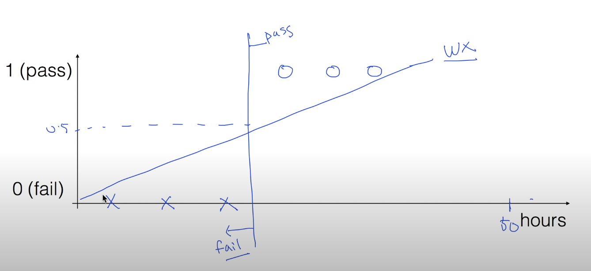
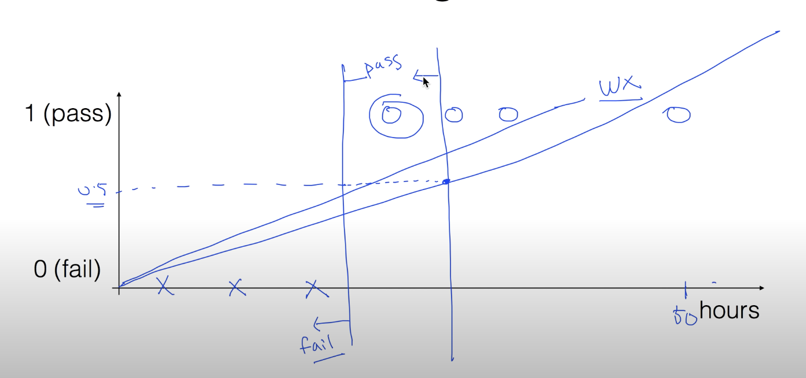
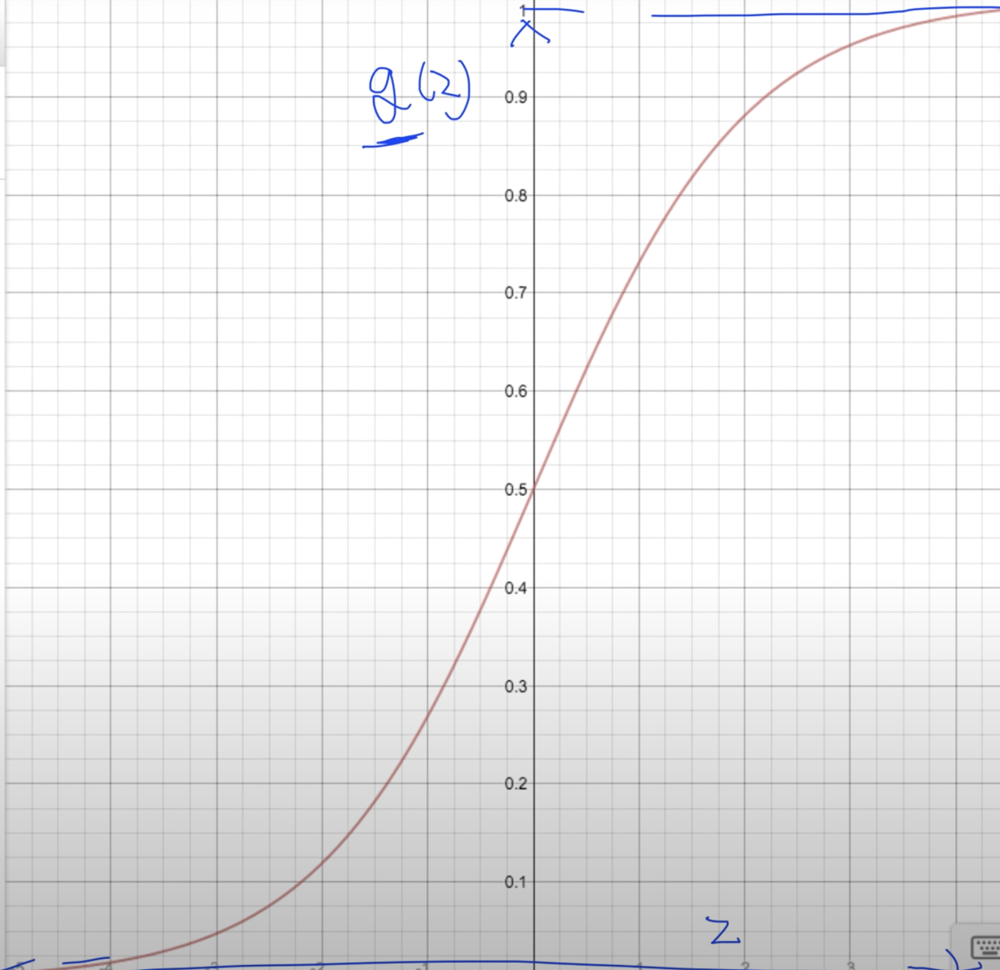
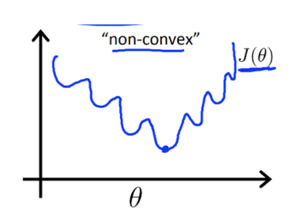
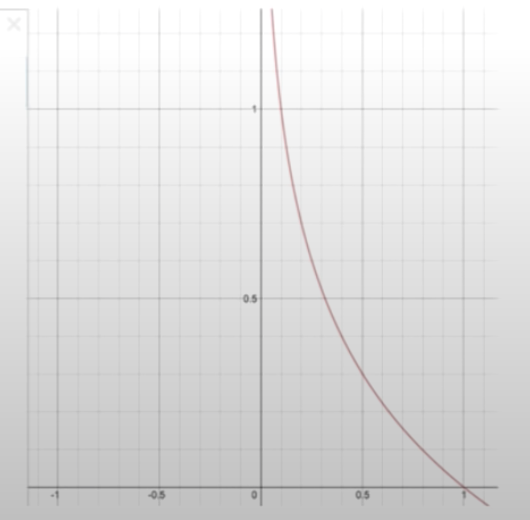
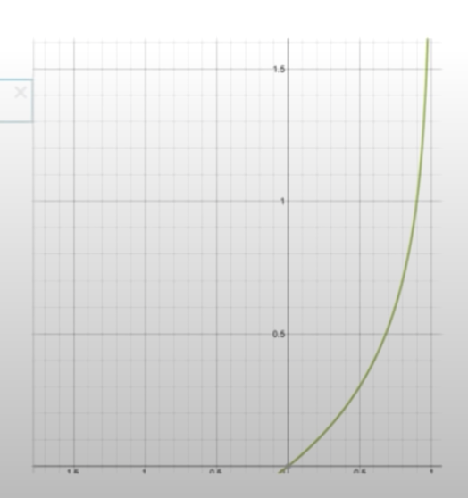
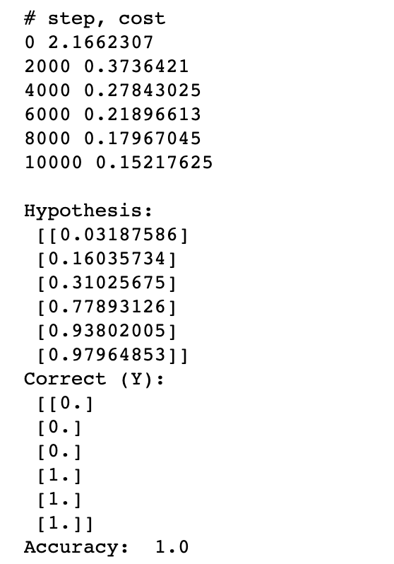

# 5. Logistic (regression) classification

* Logistic Classification
  * Classification 중 가장 정확도가 높은것으로 알려져 있다.
  * 뉴럴 네크워크와 DeepLearning 에 중요한 Component


* Classification - Binary : 0, 1 Encoding
  * Spam Detection : Spam (1)  or Ham (0)
  * Facebook feed : Show (1) or Hide (0)
  * Credit Card Fraudulent Transaction detection : legitimate (1) / fraud (0)


* Pass (1) / Fail (0) based on study hours
  * 시간에 따른 합격 결과가 Pass/Fail 로 나뉨


* Linear Regression 을 이용

  * Pass 와 Fail을 나뉘는 시간을 잡아 Linear Model 의 가설 설정 가능

    

  * 문제점

    1. 50시간 과 같은 큰 입력값에 대해서도 1의 값으로 결과가 나와야함으로 기울기에 의해 합/불 판단의 기준이 변화하여 합격 데이터가 불합격으로 판단 될 수 있다.

       

    2. 'H(x) = Wx + b' 모델은 1 이상의 값이 결과로 나올 수 있다. 
       - 학습 데이터 x = [1, 2, 5, 10] => 모델 W=0.5
       - x = 100 -> y = 50 >>>> 1


* Logistic/Sigmoid fucntion
	
  * 0과 1의 값을 갖는 함수형이 필요함
  	
* $$
    g(z)= \frac{1}{1+e^{-z}}
  $$
  
    
  
    * Sigmod : Curvered in two directions, like the letter 'S', or the Greek sigma
  
    * 1 과 0 사이의 값만 가지게 됨
  
  * $$
    H(x) = g(z)
    $$
  
  * $$
    z = Wx
    $$
  
  * $$
    then, H(X) = \frac{1}{1+e^{-W^{T}X}}
    $$


* Cost function

  * $$
    cost(W, b) = \frac{1}{m} \sum _{i=1}^{m}(H(x^{i})-y^{i})^{2}\ when\ H(x) = Wx + b
    $$

    * Linear regression 의 경우 cost function 은 convex 형태

  * 하지만, 
    $$
    then, H(X) = \frac{1}{1+e^{-W^{T}X}}
    $$
    의 경우, 기울기가 일정한 경향성을 보이지 않기때문에 convex 형태가 아님

    * 기울기가 0인 부분으로 최저점을 찾을 시, 여러 구간이 나타나게 됨

      

    * Gradient decsent algorithm 사용 불가능


* New cost function for logistic

  * $$
    cost(W) = \frac{1}{m} \sum c(H(x), y)
    $$

  * $$
    c(H(x), y) = \begin{Bmatrix} -log(H(x)) : y = 1\\-log(1-H(x)) :y=0\end{Bmatrix}
    $$

    * c(H(x), y) 함수는 y의 경우에 따라 함수를 정의
  
  
  
* Understanding cost function

  * $$
    H(x) = \frac {1}{1+e^{-z}}
    $$

    * Sigmod function 의 모양으로 두었을때, exponential term 이 포함됨
    * 이를 해결하기 위하여 log 함수를 이용

  * log fucntion

    * $$
      g(z) = -log(z)
      $$

      

      * z = 0 -> g(0) = ∞
      * z = 1 -> g(1) = 0

    * $$
      g(z) = -log(1-z)
      $$

      

      * z = 0 -> g(0) = 0
      * z = 1 -> g(1) = ∞

  * log function 적용

    * y = 1

      * $$
        H(x) = 0, \ ➝\ cost(1) = ∞
        $$

      * $$
        H(x) = 1, \ ➝\ cost(1) = 0
        $$

    * y = 0
    
      * $$
        H(x) = 0, \ ➝\ cost(1) = 0
        $$
    
      * $$
        H(x) = 1, \ ➝\ cost(1) = ∞
        $$
      
    * 두 그래프를 합쳤을 경우, convex function 형태로 이상적이게 된다


* Cost Function 정리

  * $$
    cost(W) = \frac{1}{m} \sum{} c(H(x), y)
    $$

    

  * $$
    c(H(x), y) = \begin{Bmatrix} -log(H(x)) : y = 1\\-log(1-H(x)) :y=0\end{Bmatrix}
    $$

  

  * 최종

  * $$
    c(H(x), y) = y \ log(H(x)) - (1-y)log(1-H(x))
    $$

    


* Minimize cost - Gradient Decent Algorithm

  * $$
    cost(W) = -\frac {1}{m}\sum y\ log(H(x))+(1-y)log(1-H(x))
    $$

    

  * $$
    W := W - ꭤ\frac{𝜕}{𝜕W}cost(W)
    $$

    


* Logistic (regression) classifier 의 Tensorflow 구현

  * Logistic Regression

    * $$
      H(x) = \frac{1}{1+e^{-W^{T}}X}
      $$

    * $$
      cost(W) = -\frac{1}{m}\sum y \ log(H(x))+(1-y)(log(1-H(x)))
      $$

    * $$
      W := W - ꭤ\frac{𝜕}{𝜕W}cost(W)
      $$

      * cost 값을 작게 만들어주는 W 를 구하는것이 학습과정

  ```python
  import tensorflow as tf
  
  x_data = [[1, 2], [2, 3], [3, 1], [4, 3], [5, 3], [6, 2]]
  y_data = [[0], [0], [0], [1], [1], [1]]
  
  # placeholders for a tensor that will be always fed.
  X = tf.placeholder(tf.float32, shape=[None, 2])
  Y = tf.placeholder(tf.float32, shape=[None, 1])
  
  W = tf.Variable(tf.random_normal([2, 1]), name='weight')
  b = tf.Variable(tf.random_normal([1]), name='bias')
  
  # Hypothesis using sigmod: tf.div(1., 1. + tf.exp(tf.matmul(X, W) + b))
  # H(x) = Wx + b 형태를 tensorflow 내장 sigmoid 함수에 도움을 받아 sigmoid 모양으로 번형
  hypothesis = tf.sigmoid(tf.matmul(X, W)+b)
  
  # cost/Loss function
  # tf.reduce_mean() : 평균값
  cost = -tf.reduce_mean(Y * tf.log(hypothesis) + (1 - Y) * tf.log(1 - hypothesis))
  
  # cost의 최저값을 찾기위해 학습하는 그래프
  train = tf.train.GradientDescentOptimizer(learning_rate=0.01).minimize(cost)
  
  # Accuracy computation
  # True if hypothesis > 0.5 else False
  # tf.cast(): True 면 1, Fasle 면 0 return
  predicted = tf.cast(hypothesis > 0.5, dtype=tf.float32)
  
  # 예측된 값과 실제 Y 값을 비교
  accuracy = tf.reduce_mean(tf.cast(tf.equal(predicted, Y), dtype=tf.float32))
  
  # Launch graph
  with tf.Session() as sess:
      
      # initialize TensorFlow variables
      sess.run(tf.global_variables_initializer())
      
      print("# step, cost")
      for step in range(10001):
          cost_val, _ = sess.run([cost, train], feed_dict={X: x_data, Y:y_data})
          
  
          if step % 2000 == 0:
              print(step, cost_val)
      
      # Accuracy report
      h, c, a = sess.run([hypothesis, predicted, accuracy], feed_dict={X: x_data, Y: y_data})
      print("\nHypothesis:\n", h, "\nCorrect (Y):\n", c, "\nAccuracy: ", a)
  ```

  * 결과

    

    

    

    

* Numpy 이용 예제

  ```python
  import tensorflow as tf
  import numpy as np
  
  xy = np.loadtxt('05_data-03-diabetes.csv', delimiter=",", dtype=np.float32)
  
  x_data = xy[:, 0:-1]
  y_data = xy[:, [-1]]
  
  # placeholder for a tensor that will be always fed.
  X = tf.placeholder(tf.float32, shape=[None, 8])
  Y = tf.placeholder(tf.float32, shape=[None, 1])
  
  W = tf.Variable(tf.random_normal([8, 1]), name="weight")
  b = tf.Variable(tf.random_normal([1]), name="bias")
  
  # Hypothesis using sigmoid: tf.div(1., 1. + tf.exp(tf.matmul(X, W)))
  hypothesis = tf.sigmoid(tf.matmul(X, W)+b)
  
  # cost/loss function
  cost = -tf.reduce_mean(Y * tf.log(hypothesis) + (1 - Y) * tf.log(1 - hypothesis))
  train = tf.train.GradientDescentOptimizer(learning_rate=0.01).minimize(cost)
  
  # Accuracy computation
  # True if hypothesis > 0.5 else False
  predicted = tf.cast(hypothesis > 0.5, dtype=tf.float32)
  accuracy = tf.reduce_mean(tf.cast(tf.equal(predicted, Y), dtype=tf.float32))
  
  # Launch graph
  with tf.Session() as sess:
      sess.run(tf.global_variables_initializer())
      
      feed = {X: x_data, Y: y_data}
      
      for step in range(10001):
          sess.run(train, feed_dict = feed)
          
          if step % 2000 == 0:
              print(step, sess.run(cost, feed_dict=feed))
              
      # Accuracy report
      h, c, a = sess.run([hypothesis, predicted, accuracy] ,feed_dict=feed)
      print("\nHypothesis:\n", h, "\nCorrect (Y):\n", c, "\nAccuracy: \n", a)
  ```

  * 결과
    * Accuracy :  0.7641634