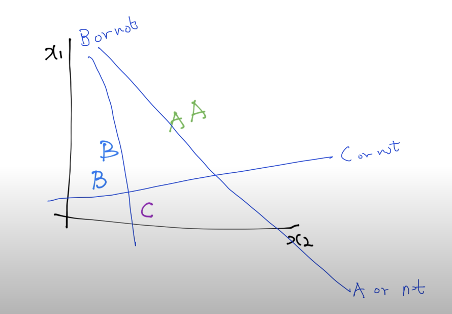

#  6-1. Softmax Classification

* Logistic Regression

  * $$
    H_L(x)  = Wx
    $$

    * Binary classification (0이냐 1이냐 의 문제 해결) 에는 적합하지 않음

  * $$
    z = H_L(X),  \ g(z) = \frac{1}{1+e^{-z}}
    $$

    * 0과 1로 수렴하는 Sigmoid Function을 이용하여 Binary classification 해결
    
  * $$
    H_R(X) = g(H_L(X))
    $$

* Multinomial classification

  * class 가 여러개일때의 판단 

    | x1(hours) | x2(attendance) | y(grade) |
    | :-------: | :------------: | :------: |
    |    10     |       5        |    A     |
    |     9     |       5        |    A     |
    |     3     |       2        |    B     |
    |     2     |       4        |    B     |
    |    11     |       1        |    C     |

  * Binary Classification 으로 구현 가능

    

    * / B or Not / C or Not  - 3개의 Binary classify 를 이용할수 있음

      * A or Not
        $$
        \begin{vmatrix} w_a1 & w_a2 & w_a3 \end{vmatrix} \begin{vmatrix} x1 \\x2\\x3\end{vmatrix} = \begin{vmatrix} w_a1x1 + w_a2x2 +w_a3x3 \end{vmatrix}
        $$

      * B or Not
        $$
        \begin{vmatrix} w_b1 & w_b2 & w_b3 \end{vmatrix} \begin{vmatrix} x1 \\x2\\x3\end{vmatrix} = \begin{vmatrix} w_b1x1 + w_b2x2 +w_b3x3 \end{vmatrix}
        $$

      * C or Not

        * $$
          \begin{vmatrix} w_c1 & w_c2 & w_c3 \end{vmatrix} \begin{vmatrix} x1 \\x2\\x3\end{vmatrix} = \begin{vmatrix} w_c1x1 + w_c2x2 +w_c3x3 \end{vmatrix}
          $$

    * but, 복잡함

  * Matrix multiplication
    $$
    \begin{vmatrix}  w_a1 & w_a2 & w_a3 \\ w_b1 & w_b2 & w_b3 \\ w_c1 & w_c2 & w_c3  \end{vmatrix} \begin{vmatrix} x1 \\x2\\x3\end{vmatrix} = \begin{vmatrix} w_a1x1 + w_a2x2 +w_a3x3 \\ w_b1x1 + w_b2x2 +w_b3x3 \\ w_c1x1 + w_c2x2 +w_c3x3 \end{vmatrix} = \begin{vmatrix} \vec{y_a} \\ \vec{y_b} \\ \vec{y_c} \end{vmatrix}
    $$

    * 결과는 간단해 졌지만 classificatioin 을 위해 Sigmoid 함수 처리가 필요함

    

  * Logistic classifier -> probablity
    $$
    WX =\begin{vmatrix} Y_a = 2.0 \\ Y_b = 1.0 \\ Y_c = 0.1\end{vmatrix} -> \begin{matrix} p_a=0.7 \\ p_b = 0.2 \\ p_c = 0.1  \end{matrix}
    $$

    * Softmax 를 사용
      $$
      \begin{matrix} y_a = 2.0\\ y_b = 1.0 \\ y_c=.01 \end{matrix} \ <- \ S(y_i) = \frac {e^{y_i}}{\sum_{j=1}^n  e^{y_j}} \ -> \ \begin{matrix} p_a = 0.7 \\ p_b = 0.2 \\ p_c=0.1  \end{matrix}
      $$

​    

* One-Hot Encoding

  * $$
    \begin{matrix} p_a = 0.7 & & 1.0 = a \\ p_b = 0.2 & <-  \ "One-Hot Encoding" \ -> & 0.0 = b \\ p_c=0.1 & & 0.0 = c \end{matrix}
    $$

    * probability 가 가장 높은 a 만 1.0 으로 선택하는 결과가
    * 나머지는 0.0 으로 결과가 나옴
  
  
  
* Cost function
    * Cross-entropy
      $$
      \begin{vmatrix} S(y) \\ 0.7 \\ 0.2 \\ 0.1 \end{vmatrix} \ \  D(S, L) = -\sum_{i} L_i log(S_i) \ \ \begin{vmatrix} L = y \\ 1.0 \\ 0.0 \\ 0.0  \end{vmatrix}
      $$
      
      * S(y) - 시스템에서 예측한 값
        
      * L - Lable, 실제 값
        
      * Cross-entropy cost function
        $$
        -\sum_{i}L_ilog(S_i) = -\sum_{i}L_ilog(y_i) = \sum_{i}(L_i)*(-log(y_i))
  $$
      
        * $$
          -log(y_i) \text{의 값은 0과 1 사이의 값을 갖게 된다}
    $$
      
        * $$
          L  = \begin{vmatrix} 0 \\ 1 \end{vmatrix} \\
          \vec{Y_{t1}} = \begin{vmatrix} 0 \\ 1 \end{vmatrix} \ \text{(B is OK)}, \ \begin{vmatrix} 0 \\ 1 \end{vmatrix} ⊙ -log\begin{vmatrix} 0 \\ 1 \end{vmatrix} = \ \begin{vmatrix} 0 \\ 1 \end{vmatrix} ⊙ \begin{vmatrix} ∞ \\ 0 \end{vmatrix} = \begin{vmatrix} 0 \\ 0 \end{vmatrix}  -> 0\\
          \vec{Y_{t2}} = \begin{vmatrix} 0 \\ 1 \end{vmatrix} \ \text{(A is Not)}, \ \begin{vmatrix} 0 \\ 1 \end{vmatrix} ⊙ -log\begin{vmatrix} 1 \\ 0 \end{vmatrix} = \ \begin{vmatrix} 0 \\ 1 \end{vmatrix} ⊙ \begin{vmatrix} 0 \\ ∞ \end{vmatrix} = \begin{vmatrix} 0 \\ ∞\end{vmatrix} -> ∞
    $$
      
          * Yt1 의 예측값의 cost 는 0 으로 수렴
    * Yt2 의 예측값의 cost 는 1 로 발산하게 된다
      
* Cost function
    
  * L - Loss
    
      $$
      L =\frac{1}{N} \sum_{i} D(S(WX_i+b), L_i)
      $$

--------------------------

* Logistic cost VS cross entropy

    * 두 식은 다른 모양으로 보이나, 실제로는 같다
    
    * Logistic cost
        $$
        C:(H(x), y) = ylog(H(x)) -(1-y)log(1-H(x))
        $$
    
    * Cross entropy
        $$
        D(S, L) = -\sum_{i} L_ilog(S_i)
        $$

-----------------------

* Gradient descent
  * 같은 방법 (기울기를 타고 내려오는 방법) 을 사용
  * cost function 이 너무 복잡해져버려서 계산한 미분 값을 사용하지 않고, 컴퓨터에게 맡기자