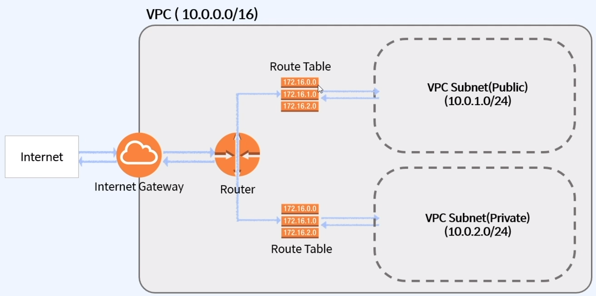
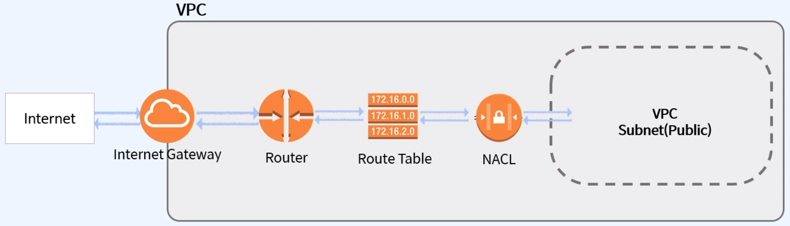

# 패스트캠퍼스 - AWS 인프라 구축과 DevOps 운영 초격차 패키지

## Part2. AWS 기반 소규모 & 중규모 아키텍트 설계

### 01. AWS 기초와 VPC

#### 05_(VPC) 네트워킹의 동작원리 2

##### Internet Gateway (IGW)

* 인터넷으로 나가는 통료
* Private Subnet 은 IGW 로 연결되어 있지 않다.

##### Route Table

* 트래픽이 어디로 가야 할지 알려주는 테이블

* VPC 생성 시 자동으로 만들어 줌

* 예시

  | Destination | Target |
  | ----------- | ------ |
  | 10.0.0.0/16 | Local  |
  | 0.0.0.0/0   | igw-id |
  | ::/0        | igw-id |

  * 10.0.0.0/16 (10.0.0.0 ~ 10.0.255.255 까지) -> Local
  * 나머지는 IGW (인터넷)
  * Private Table 의 경우에는 Local Target 만 존재
    * 그 외의 주소의 경우에서는 목적지가 없으므로 Route Table 에서 막히게 됨

##### NACL (Network Access Control List) / Security Group

* 보안검문소

* NACL -> Stateless

* SG  -> Stateful

* Access Block 은 NACL 에서만 가능

  

