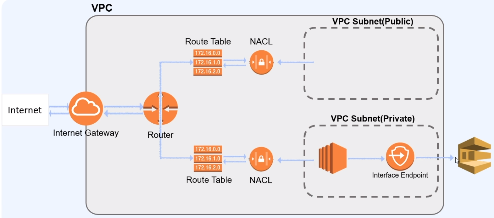
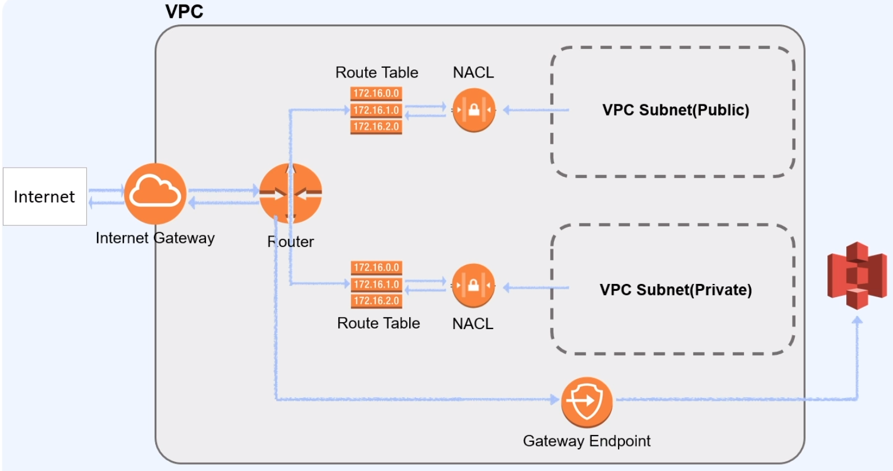

# 패스트캠퍼스 - AWS 인프라 구축과 DevOps 운영 초격차 패키지

## Part2. AWS 기반 소규모 & 중규모 아키텍트 설계

### 01. AWS 기초와 VPC

#### 05_(VPC) 네트워킹의 동작원리 3

##### NAT (Network Address Translation) instance / gateway

* Private Subnet 안에 있는 Private instance 가 외부의 인터넷과 통신하기 위한 방법
  * NAT Instance 는 단일 Instance(EC2)
  * NAT Gateway 는 AWS 에서 제공하는 서비스
* NAT Instance 는 Public Subnet 에 있어야 함

* Private Subnet 에서 종종 외부 인터넷과의 연결이 필요한데, 이때 같은 PVC 안에 있는 Public Subnet 을 통해 우회 하여 통신 할 수 있다,
  * 이러한 우회 접근에 NAT instance / gateway 가 활용 된다.

##### Private Subnet 의 우회 경로

* NAT gateway
  * AWS 에서 제공하는 우회 서비스

* NAT instance
  * Public Subnet 에 있는 EC2
  * NAT gateway 가 간편하기 때문에, 많이 사용하지 않음

* 명확히는 Private 에서 Public 으로 요청하는 것이 아님
  * Private Subnet -> Private Subnet Route Table -> Public Subnet Route Table -> Public Subnet -> NAT gateway -> ..... -> Internet Gateway -> Internet

##### Bastion host

* VPC 외부 (Internet) 에서 Private Subnet 에 접근하기 위한 방법

  * Public Subnet 내에 위치하는 EC2

* Bastion host 는 Public Subnet 에서 대리인 역할 수행

  

  * Console 을 통해 Public Subnet 의 Bastion Host 접근 -> Bastion Host 에서 Private Subnet 의 Instance 접근

##### VPC endpoint

* AWS 의 여러 서비스들과 VPC를 연결시켜주는 중간 매개체

  * AWS 에서 VPC 바깥으로 트래픽이 나가지 않고 AWS 의 여러 서비스를 사용하게끔 만들어주는 서비스
  * Private Subnet 같은 경우는 격리된 공간인데, 그 상황에서도 AWS 의 다양한 서비스들을 연결 할수 있도록 지원하는 서비스
    * S3
    * DynamoDB
    * Athena emd
  * VPC 엔드포인트를 통해 인터넷 게이트웨이, NAT 디바이스, VPN 연결 또는 AWS Direct Connect 연결을 필요로 하지 않고 AWS Private Link 구동 지원 AWS 서비스 및 VPC 엔트포인트 서비스에 비공개로 연결 할수 있음.
  * VPC 인스턴스는 서비스의 리소스와 통신하는데 퍼블릭 IP 주소를 필요로 하지 않음.
  * VPC와 기타 서비스 간의 트래픽은 Amazon 네트워크를 벗어나지 않음.

* Interface Endpoint - Private IP 를 만들어 서비스로 연결해줌 (SQS, SNS, Kinesis, Sagemaker 등 지원)

  

  * VPC Private Subnet 내에서 Interface Endpoint 이용하여 외부 서비스 접근
    * Interface Endpoint 를 통해 Private IP 를 할당 받아 서비스에 연결

* Gateway Endpoint - 라우팅 테이블에서 경로의 대상으로 지정하여 사용 (S3, Dynamodb 지원)

  

  * VPC Private Subnet 내에서 Gateway Endpoint 이용하여  외부 서비스 접근
    * Rotue Table 에서 Gateway Endpoint 를 통해 외부 서비스 접근

