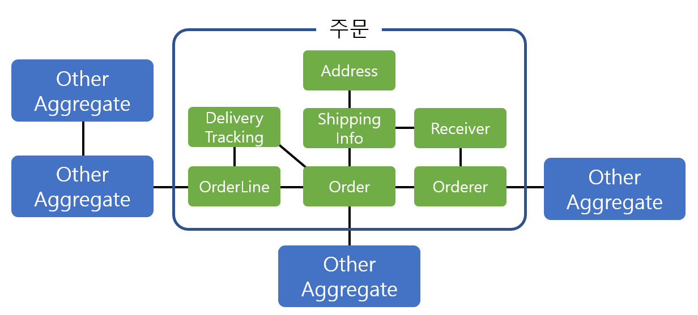

# 패스트캠퍼스 - AWS 인프라 구축과 DevOps 운영 초격차 패키지

## Part2. AWS 기반 소규모 & 중규모 아키텍트 설계

### 02. 소규모 아키텍트

#### 03_(설계) 도메인 주도 설계 개요

##### 기존 프로세스 - 역할

* 기획자
  * 사업 기획
  * 서비스 기획
  * 요구사항 정의
* 마케터
  * 사업 기획
  * 지표 관리
  * 아이디어 제안
* 개발자
  * 설계
  * 구현
  * 유지보수
* 디자이너
  * 페이지 디자인
  * 배너 디자인
* PM
  * 죠율
  * 일정관리

##### 기존 프로세스 - 프로세스

* 비즈니스 프로세스
  1. 시장조사
  2. 서비스 기획
  3. 베타서비스 개발
  4. 마케팅(소규모)
  5. 수정기획
  6. 서비스 개발
  7. 마케팅
  8. 수정기획 - 반복
* 개발 프로세스
  1. 요구사항 분석
  2. 설계
  3. 구현

##### 기존 프로세스 - 문제점

* 소프트웨어 개발과 도메인, 모델과의 불일치 발생 (도메인이 복잡하기 때문)
* 기획과 개발의 불일치 발생
* 소통 어려움

##### 해결방안

* 보편 언어
  * 도메인에 대한 어휘를 이해관계자 (기획자, 개발자, 분석가 등) 들이 공통적으로 이해할 수 있도록 정의
* 모델 주도 설계
  * 도메인 분석과 설계의 간극을 최소화
  * 분석/설계/구현의 모든 단계를 관통하는 하나의 모델을 유지
  * 모델=코드

##### 도메인 주도 설계(DDD)

* 도메인 주도 설계
  * 소프트웨어가 복잡한 이유는 도메인이 복잡하기 때문이다.
    * 도메인 전문가(기획자)와 개발자가 어떻게 협업할 것인지가 중요
    * 보편언어, 모델 주도 디자인
* 도메인 이란?
  * 영역, 집합
  * 비즈니스 Domain 을 의미
  * 예를 들어 주문, 고객, 주소관리 등등과 같이 분리

##### DDD의 2가지 종류

* 전략적 설계
  * 설계 방법
    * 비즈니스의 상황 (Context: 대상자, 상황) 에 맞게 설계
      * Context : 비즈니스 내에서 일어나는 상황
    * 모든 Context 를 이벤트 스토밍을 통해 공유
      * 브레인스토밍과 유사
    * 각 Context를 그륩핑(Bounded Context)
      * 추상화(Model 화) 를 위함
    * 컨텍스트 매핑을 통해 Bounded Context 간의 관계를 정의
  * 전략적 설계의 결과물: 도메일 모델 (서비스를 추상화한 설계도, 분리 & 연결)
* 전술적 설계
  * 더 상세한 부분 (Bounded Context 내부) 모델링
  * Model driven design
    * 모델 주도 설계
  * Aggregate pattern
    * 관련 도메인을 하나의 군집으로 묶은 것
  * 계층형 아키텍처를 통한 도메인 모델 분리
  * 도메인 이벤트를 통해 도메인을 보다 명확히 모델링

##### % Aggregate Pattern 애그리거트 패턴 %

* 관련 도메인을 하나의 군집으로 묶은 것
* 애그리거트를 사용하면 연관 도메인을 묶어서 이해하기 때문에 모델 관계를 파악하기가 더 쉽다.
* 애그리거트 단위로 일관성을 관리하면 코드도 일목조연하게 작성할 수 있다.
* 코드의 복잡도가 낮아지기 때문에 유지보수 및 확장, 변경에 들이는 노력이 줄어든다.
