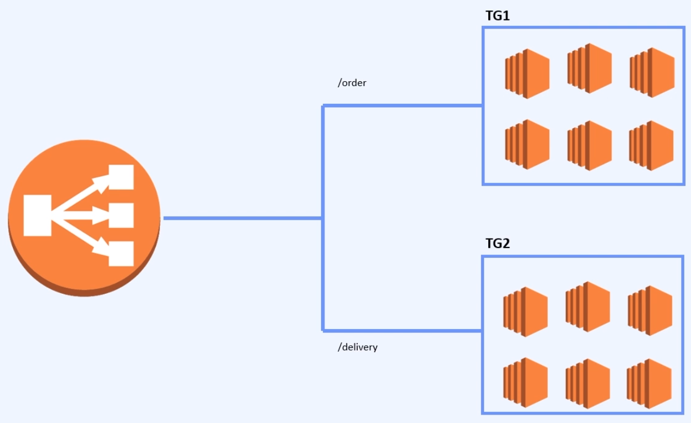
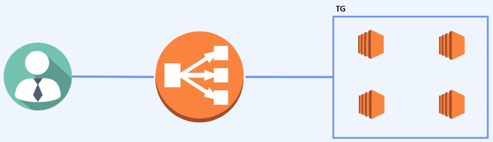

# 패스트캠퍼스 - AWS 인프라 구축과 DevOps 운영 초격차 패키지

## Part2. AWS 기반 소규모 & 중규모 아키텍트 설계

### 02. 소규모 아키텍트

#### 20_(인프라) ALB Rule 설정하여 인스턴스 분기하기

##### ALB Rule

* Target Group 분산
  * TG1 - /order
  * TG2 - /delivery
* ALB Rule
  * 설정한 규칙에 따라 분산
  * Header 값 등을 기준으로 분기 가능하지만 url 을 이용하는것이 가장 보편적

##### Sticky Session

* AWS Loadbalancer 의 경우 traffic 에 따라 인스턴스에서 http request 를 분산하여 전달하기 때문에, 서버가 옮겨지면서 세션 정보가 공유되지 않는 상황이 발생
  * 하나의 서버 인스턴스에만 연결되어 있는 세션 문제
* Loadbalance 의 Sticky Session
  * 세션을 로드벨런스에서 관리
  * 셋션이 기록된 서버로 트래픽 연결

##### ALB Rule 생성

* ALB Rule 생성
  * 로드벨렁싱
  * 로드벨런서
  * 로드벨런서 생성
  * 리스너
    * '그룹이름' 규칙 보기/편집
    * 규칙 삽입
    * 조건 추가
      * 조건 1
        * IF - /deliver
        * then - '그룹1'
      * 조건 2
        * IF - /order
        * then - '그룹2'

