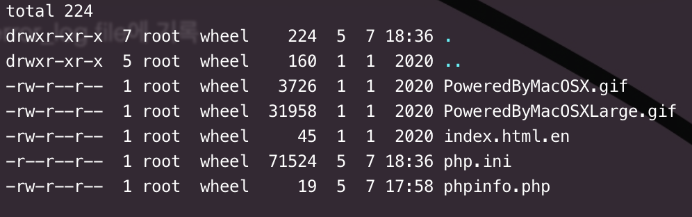

# 생활코딩 php 강좌

### 1. 설정

1.1 php 설정

* 설정 - Configuration
  * php 의 설정 파일 : `php.ini`
    * 실제 서버 환경이 setting 되어 있음
    * 개발환경에서 사용 할 수 있는 설정 방법도 template 형식으로 제공
      * php.ini-development - 개발 서버 권장 사항
      * php.ini-production - 서비스 서버 권장 사항
  * php 는 error 발생시, error 를 출력 해줌
    * 기본 설정은 보안상의 문제로 출력되지 않도록 되어 있음
    * 출력된 내용에는 시스템상 중요한 내용이 포함되어 있기 때문
    * 실제 서비스 - error 출력 off // 개발환경 - error 출력 on

* php.ini

  * display_errors = On
    * 브라우저에 error 를 표시
  * log_errors = On
    * error_log file에 기록

* 파일 권한

  
  * ```shell
    drwxr-xr-x 7 root wheel
    ```

    * `drwxr-xr-x` : 권한 표기
      * `d`: directory 표기
      * `rwx`: 소유자의 권한
      * `r-x`: 그룹의 권한
      * `r-x`: other 의 권한
      * r: read
      * w: write
      * x: excute (실행)
    * `root`: 소유자 표기
    * `wheel`: 그룹

  * 권한이 없는 접근을 할때의 방법

    1. sudo
       * 일시적으로 root 권한을로 명령 실행
    2. 소유 권한을 넘겨 받는 방법
       * sudo chown "Accounts" "file or Directory"
         * `chown`
           * `ch`: change
           * `own`: owner

  