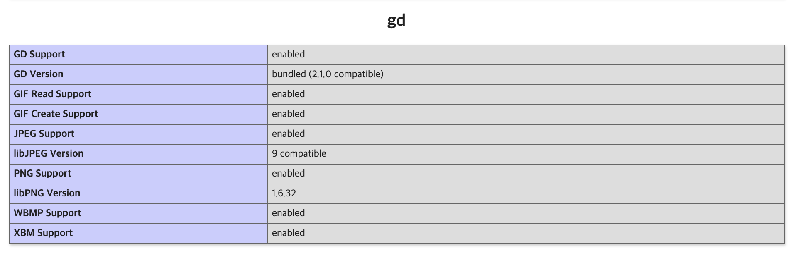
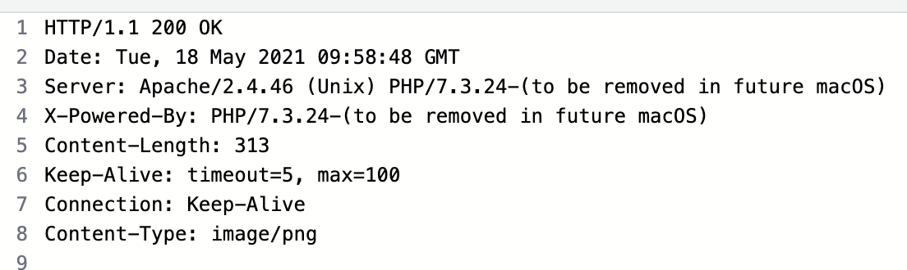

# 생활코딩 php 강좌

### 12. 이미지 다루기

##### 12.1 GD Lib 소개 및 설치

* php 에서 이미지를 처리하는 기능은 포함되어 있지 않기 때문에, 외부 라이브러리가 필요
  * 가장 대표적인 것이 GD Library
  * GD Lib 가 포함되 있는 상태로 php 가 설치 되거나, 기본적으로 제공하는 경우가 많음
  * 하지만, 기본 제공 프로그램이 아니기 때문에 확인이 필요




* phpinfo 를 통해 GD Lib 설치 여부를 확인 할 수 있음
* 각각의 img file format 의 지원 여부를 확인 가능


* 설치되어 있지 않은 경우, GD Lib 를 설치 후 php.ini 에 경로를 설정해 주면 됨


##### 12.2 이미지에 글 쓰기 1

```php
// button.php
<?php
header("Content-type: image/png");
$string = $_GET['text'];
$im     = imagecreatefrompng("button.png");
$blue = imagecolorallocate($im, 60, 87, 156);
$px     = (imagesx($im) - 7.5 * strlen($string)) / 2;
imagestring($im, 4, $px, 9, $string, $blue);
imagepng($im);
imagedestroy($im);
?>
```

* header()
  * Content-type: image/png 
    * server 가 client 로 전송하는 내용은 png image 인것을 browser 에게 전달
  * button.php 파일의 결과를 Web Server 로 보여줄때, 작성된 header 기준으로 Server 가 Client 로 전송하는 header 에 포함되어 작성됨
  * header 는 php 문서의 가장 상단에 작성 되어야 함
* $string
  * url 에 포함된 text 정보를 저장
* imagecreatefrompng(image file)
  * png 형식의 image 를 가져옴
* imagecolorallocate(image, R, G, B)
  * image 에 색을 할당
* imagesx(image)
  * image 의 가로 길이(폭)
  * $px : text 가 이미지 공간 내 가운데 정렬로 쓰여지기 위한 계산값
* imagestring(작성공간, font,  x 좌표, y 좌표, text, color )
  * image 에 text 를 작성
* imagepng(image)
  * png 형식의 image 를 전송
* imagedestroy(image)
  * image 파일에 대한 정보를 소거




* http 통신의 응답 결과
* button.php 파일에 작성된 header 기준으로 응답


##### 12.3 이미지에 글 쓰기 2


```php
// button.php
<?php
header("Content-type: image/png");
$string = $_GET['text'];
$im     = imagecreatefrompng("button.png");
$orange = imagecolorallocate($im, 60, 87, 156);
$px     = (imagesx($im) - 7.5 * strlen($string)) / 2;
imagestring($im, 4, $px, 9, $string, $orange);
imagepng($im);
imagedestroy($im);
?>
```


```php
<html>
    <body>
        
        
        
        
    </body>
</html>
```


* 결과


* 위의 결과처럼 GD Lib 를 이용하여 php 에서 Image 를 다를 수 있지만, Server 의 resource 를 매우 많이 사용하므로 권장하지 않음
* Image 는 정적인 Image 를 사용하거나, 동적인 결과는 다른 기법을 사용하는게 좋음
  * Server 에서 image 를 직접 수정하지 말자


##### 12.4 워터마크 만들기

```php
<?php
$stamp = imagecreatefrompng('text.png');
$im = imagecreatefrompng('original.png');

$margin_right = 10;
$margin_bottom = 10;

$X = imagesx($im) - imagesx($stamp) - $margin_right;
$Y = imagesy($im) - imagesy($stamp) - $margin_bottom;

imagecopy($im, $stamp, $X, $Y, 0, 0, imagesx($stamp), imagesy($stamp));

header('Content-type: image/png');
imagepng($im);
imagedestroy($im);
?>
```

* imagecopy(source, destination, 복사 위치 x 좌표, 복사 위치 y 좌표, source 구간 x, source 구간 y, destination 구간 x, destination 구간 y)
  * source : 복사될 image
  * destinatin : source 가 덮어질 image


