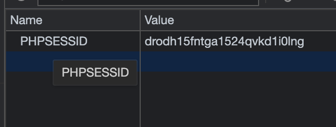
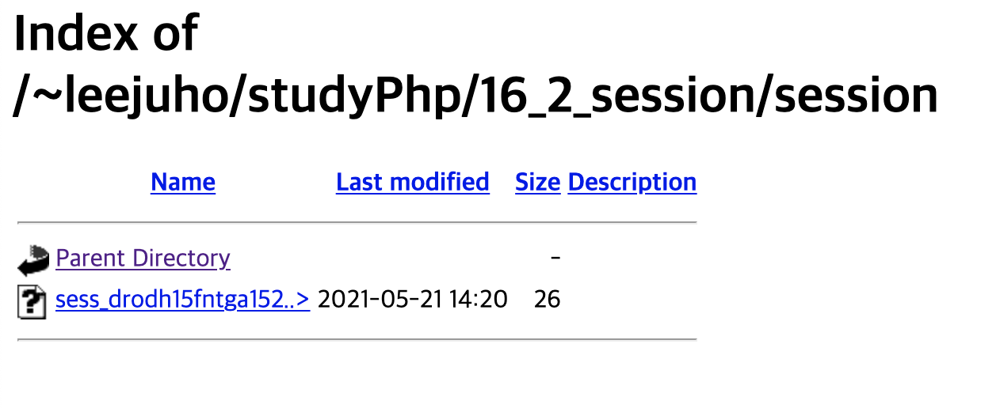

# 생활코딩 php 강좌

### 16. 쿠키와 세션

##### 16.1 PHP 쿠키

* cookie 와 session 은 사용자의 데이터를 저장하기 위해 사용
* cookie 는 Client (Browser) 에 데이터를 저장
  * setCookie()
  * $_COOKIE


```php
// cookie1.php
<?php
setcookie('cookie1', '생활코딩');
setcookie('cookie2', time(), time()+60);
?>
```

* 사용자의 Browser 에 cookie 로 값을 저장
  * setcookie(name, value, expire, path, domain)
  * expire : 만료
  * path : 유효 경로, 해당 경로에서만 사용 가능 
  * domain : 유효 도메인


```php
// cookie1.php
<?php
echo $_COOKIE['cookie1'].'<br/>';
echo time()-$_COOKIE['cookie2'];
?>
  
// 생활코딩
// 10 (현재 시간 - cookie1.php 를 열었을 때 시간)
```

* browser 에 저장된 cookie 를 $_COOKIE 를 통해 호출
  * $_COOKIE[name]


* http 통신 방식은 상태가 없기 때문에, 이를 보안해 주기 위해서 Cookie 와 Session 이 사용됨
* Cookie 는 신뢰할 수 없는 Data, 유출 위험
  * Login 정보등의 보안이 중요한 정보는 Cookie 가 아닌 Session 으로 처리 해야함


##### 16.2 PHP 에서 세션 사용하기 - 1

* Cookie 와 Session 의 차이
  * Cookie 와 Session 은 사용자의 상태를 유지 시킨다는 것은 같음
  * Cookie 는 모든 데이터를 Browser 에 Cookie 의 형태로 저장
    * 접근이 쉬워, 정보가 유출될 위험이 있음
  * Session 은 현재 사용자를 구분하기 위한 식별자만 Browser 에 저장, 실질 데이터는 Server 에 File 이나DB 로 저장
    * Server 에 저장된 Data 는 접근이 어려움


* Session
  * SID(session ID) 를 식별자로 서버에 데이터를 저장
  * SID 로는 쿠키나 도메인 파라미터를 사용
  * session_start(); 로 시작, 스크립트의 최상당에 위치해야 함
  * $_SESSION
  * 데이터는 서버 내에 파일이나 DB에 저장
  * 주로 사용자 인증에서 사용함


```php
// session_basic.php
<?php
session_save_path('./session');
session_start();
$_SESSION['title'] = '생활코딩';
?>
```

* session_save_path()
  * session 이 저장 될 path 설정
* session_start()
  * session 을 사용하는 경우, logic 의 최상단에 작성
    * session 에 관련된 설정함수 제외
  * seesion 에 대한 것은 header 로 전달 됨으로, 최상단이 아니면 Protocol 위반






* browser 에서 PHPSSESSID cookie 가 생성된 것을 확인
* session_basic.php 페이지의 접속 결과로, session 폴더 안에 "sess_*" 파일이 생성 된것을 확인
  * 저장될 경로는 session_save_path('./session') 로 지정


* session_start(); 함수가 호출 될 때마다, session 이 발급
  * browser 에 SID cookie 가 없으면, SID 값을 만들어서 Cookie 형태로 browser 에 저장
  * Cookie 의 SID 값과 일치하는 "SESS_~SID~" 파일을 서버에 생성
  * SESS 파일 안에는 $_SESSION 받아온 값을 저장


```php
// session_basic2.php
<?php
ini_set('display_errors', '1');
session_save_path('./session');
session_start();
echo $_SESSION['title'];
echo "<br/>";
echo file_get_contents('./session/sess_'.session_id());
?>
  
// 생활코딩
// title|s:12:"생활코딩";
```

* session_basic.php 에서 session 에 저장한 title 값이 출력되는 것을 확인
  * 다른 Page 에서도 같은 사용자일 경우 session 이 유지 됨


* SID 를 Cookie 에 저장 할 수 없을 때, php 의 경우 url에 인자로 SID 를 넣어 사용자의 상태를 유지 할 수 있음
  * ~/url?PHPSESSID=*
  * Page 를 이동 할 때마다, PHPSESSID 를 넘겨주면 됨


##### 16.3 PHP 에서 세션 사용하기 - 2

* Session 의 사용
  * 사용자 인증
  * 인증된 사용자에 대한 Login 상태 유지 등


```html
// login.html
<html>
  <head>
    <meta http-equiv="Content-Type" content="text/html;charset=utf-8" >
  </head>
  <body>
    <form action="login_process.php" method="POST">
      <p><label>아이디</label><input type="text" name="id" /></p>
      <p><label>비밀번호</label><input type="text" name="pwd" /></p>
      <input type="submit" />
    </form>
  </body>
</html>
```

* POST 방식으로 login 정보를 전송


```php+HTML
// login_proecess.php
<?php
session_start();
$id = 'egoing';
$pwd = 'codingeverybody';
if(!empty($_POST['id']) && !empty($_POST['pwd'])){
  if($_POST['id'] == $id && $_POST['pwd'] == $pwd){
    $_SESSION['is_login'] = true;
    $_SESSION['nickname'] = '이고잉';
    header('Location: ./session.php');
    exit;
  }
}
echo '로그인 하지 못했습니다.';
?>
```


```php
session_start();
```

* session 시작


```php
if(!empty($_POST['id']) && !empty($_POST['pwd'])){
  if($_POST['id'] == $id && $_POST['pwd'] == $pwd){
    $_SESSION['is_login'] = true;
    $_SESSION['nickname'] = '이고잉';
    header('Location: ./session.php');
    exit;
  }
```

* ID 와 Password 검증 후, session 에 정보 저장
  * is_login : login 상태 정보
  * nickname : 유저 정보
* session.php Page 로 전달 및 이동


```php+HTML
// session.php
<?php
session_start();
if(!isset($_SESSION['is_login'])){
  header('Location: ./login.html');
}
?>

<html>
  <body>
    <?php echo $_SESSION['nickname'];?>님 환영합니다<br />
    <a href="./logout.php">로그아웃</a>    
  </body>
</html>
```


```php
<?php
session_start();
if(!isset($_SESSION['is_login'])){
  header('Location: ./login.html');
}
?>
```

* session 시작 후, session 에 저장된 login 상태 정보 확인
  * isset(value) : value 의  존재 여부를 확인, 변수가 존재하면 true
    * login 을 하지 않았다면, is_login 값이 없음
    * login 을 해야지만, true 로 선언 및 초기화
  * empty(value) : value 가 0 또는 null 일때 (변수가 존재하지 않아도) true


```php+HTML
// logout.php
<?php
ini_set("display_errors", "1");
session_start();
session_destroy();
header('Location: ./login.html');
?>
```

* session_destroy()
  * logout 시 모든 session Data 삭제
  * session 초기화