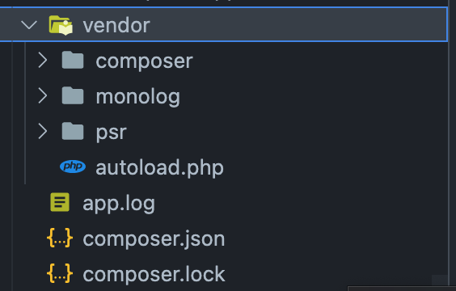

# 생활코딩 php 강좌

### 17. PHP의 객체 지향 프로그래밍

##### 17.1 객체 지향 프로그래밍이란?

* Procedural Programming
  * 명령이 순차적으로 실행
  * 기능 단위로 구성하여 프로그램을 만들어 가는 패러다임
    * Procedural
    * functions
    * routine
    * subroutine


* Object Oriented Programming (OOP)
  * Procedural Programming 와 반대인 패러다임이 아님
  * 기능 보다 더 큰 틀인 객체를 이용하여 프로그램을 만들어 가는 패러다임
    * 연관된 함수들을 관리하는 객체를 만들어 구성


##### 17.2 함수와 객체의 비교

* 파일의 제어


```php
// file_compare.php
<?php
var_dump(is_file('data.txt'));
var_dump(is_dir('data.txt'));
var_dump(file_get_contents('data.txt'));
file_put_contents('data.txt', rand(1, 100));
?>
```

* 함수를 이용한 file 제어
  * php 의 기본 제공 내장 함수 : api
  * php 가 oop 를 채택하지 않았을 때 만들어 졌기 때문에,  함수의 형태로 제공 됨


```php
// file_oop.php
<?php
$file = new SplFileObject('data.txt', 'rw+');
var_dump($file->isFile());
var_dump($file->isDir());
var_dump($file->fread($file->getSize()));
$file->rewind();
$file->fwrite(rand(1, 100));
?>
```

* SPL File Object Class
  * SPL : Standard PHP Library
    * 객체 지향 방식으로 php 를 제어 하는 새로운 Library
  * 객체 지향 방식으로 File 을 제어 할 수 있음
* data.txt File 을 객체로 만들어 $file 에 초기화
  * File Object 의 Method 를 사용하여 File 제어
* Object 의 구성
  * Class : SplFileObject
  * Instance : $file
  * Method(function) : isFile, isDir, fread
  * state : 'data.txt'


* 함수 중심 코드
  * 함수가 각각 독립적이기 때문에 입력값의 중복이 발생
  * 여러 함수들의 연관성을 파악하기 힘듬
* 객체 중심 코드
  * 여러가지 함수 들이 하나의 파일에 대해 동작하므로 입력값이 발생하지 않음
  * 특정 객체와 연관된 함수들임을 파악하기 쉬움


##### 17.3 함수와 객체의 비교 2

* 배열의 제어


```php
// array_compare.php
<?php
$adata = array('a', 'b', 'c');
array_push($adata, 'd');
foreach ($adata as $item){
    echo $item."<br/>";
}
var_dump(count($adata));
?>
```


```php
// array_oop.php
<?php
$odata = new ArrayObject(array('a', 'b', 'c'));
$odata->append('d');
foreach($odata as $item){
    echo $item.'<br/>';
}
var_dump($odata->count());
?>
```


##### 17.4 클래스와 인스턴스 그리고 메소드 만들기


```php
<?php
class MyFileObject{
  function isFile(){
    return is_file('data.txt');
  }
}

$file = new MyFileObject();
var_dump($file->isFile());
?>

```

* class 의 선언
  * class className{ }
* class Method 선언
  * class 내부 함수 선언


##### 17.5 인스턴스 변수 만들기

```php
<?php
class MyFileObject{
    function isFile(){
        return is_file($this->filename);
    }

}

$file = new MyFileObject();
$file->filename = 'data.txt';
var_dump($file->isFile());
var_dump($file->filename);
?>
```

* $this
  * class 의 intance 에 부여된 변수에 접근하기 위한 keyword
  * instace 자체를 의미
* $file->filename = 'data.txt';
  * instance 변수 생성


##### 17.6 생성자 (인스턴스 초기화)

* Constructor: 생성자
  * class 기반으로해서 instance 를 만드는 역할


```php
<?php
class MyFileObject{
    function __construct($fname){
        $this->filename = $fname;
    }

    function isFile(){
        return is_file($this->filename);
    }
}

$file = new MyFileObject('data.txt');
var_dump($file->isFile());
var_dump($file->filename);
?>
```

* 생성자의 선언
  * function __construct(value){ }
  * MyFileObject 의 Instance 를 생성할때, 인자를 받아들여 filename 이라는 instance 변수로 할당
    * $file = new MyFileObject('data.txt');
    * $this->filename = $fname;


##### 17.7 접근 제어자 (access modifier)

* Encapsulation 캡슐화
  * 객체를 사용자에게 필요한 정보나 기능만을 노출
  * 객체를 사용하기 쉽게하고, 고장나지 않도록 하는 방법
  * 접근 제어자 (access modifier), 속성의 가시성 (property visibility) 는 캡슐화를 달성하는데 중요한 기능을 제공


```php
<?php
class Person{
    private $name;

    function sayHi(){
        print("Hi, I'm {$this->name}.");
    }

    function setName($_name){
        $this->ifEmptyDie($_name);
        $this->name = $_name;
    }

    function getName(){
        return $this->name;
    }

    private function ifEmptyDie($value){
        if(empty($value)){
            die('I need name');
        }
    }
}

$egoing = new Person();
// $egoing->name = 'egoing';
$egoing->setName("egoing");
$egoing->sayHi();

printf($egoing->name);

print($egoing->getName());
?>
```

* private $name;
  * $instanceName -> name 으로 접근 하지 못함
  * instance 내부에서 만 사용 가능 하도록 선언
  * private 접근 제어
* function setName($name){ }
  * setName() method 로 instance 변수인 $name 을 할당
* function getName(){ }
  * instance 변수인 name 을 instance 외부에서 사용 하기 위해 getName mehod 를 선언하여 사용
* private function ifEmptyDie($value){}
  * insgance 내부에서 사용하는 입력값 확인 함수
  * private 로 접근 제어


 ##### 17.8 상속 기본 (inheritance)

* 상속의 장점
  * 중복된 코드 제거
  * 재사용성
  * 가독성


* 상속
  * Original Object 인 Parent (부모) Object 의 Method 의 기능을 상속 받아 새로운 객체를 만들 수 있음
  * 상속받은 객체: Child Object
* Child Object는 Parent Object 에 영향을 주지 않고 새로운 Method 를 추가 가능


* Standard PHP Library 의 File Handling 객체 세 가지
  * SplFileInfo Class
    * 파일의 정보를 알려주는 Class
  * SplFileObejct Class: SplFileInfo Class 의 Child Object
    * SplFileInfo Class 를 상속 받음
    * File R/W Method 기능을 가지고 있음
  * SplTempFileObejct: SplFILEObejct 의 Child Object
    * SplFileObject Class 를 상속 받음


```php
<?php
class Animal{
    function run(){
        print('running..<br/>');
    }
    function breathe(){
        print('breating...<br/>');
    }
}

class Human extends Animal{
    // function run(){
    //     print('running...<br/>');
    // }
    // function breathe(){
    //     print('breating...<br/>');
    // }

    function think(){
        print('thinking...<br/>');
    }
    function talk(){
        print('talking...<br/>');
    }
}

$human = new Human();
$human->run();
$human->think();
?>
  
// running..
// thinking...
```

* Human Object 는 Animal 을 상속받음
  * Animal 에 정의된 run method 와 breate method 를 사용 가능


```php
<?php
$file = new SplFileObject('lorem.txt');
var_dump($file->fread($file->getSize()));
// file 을 읽으면서 cursor 가 file 의 끝으로 이동
$file->rewind();
// cursor 를 file 의 처음으로 이동
var_dump($file->fread($file->getSize()));
?>
```

* SplFileObject 의 fread() method 는 cursor의 위치에서 부터 file 을 읽음
  * 한번 동작후 cursor 의 위치를 파일의 앞으로 돌려 놓지 않으면, cursor 가 file 의 마지막에 위치함으로 읽을 내용이 없는 상태가 됨
  * rewind() : cursor 를 file 의 처음으로 이동

```php
<?php
class MyFileObject extends SplFileObject{
    function getContents(){
        $content = $this->fread($this->getSize());
        $this->rewind();
        return $content;
    }
}

$myFile = new MyFileObject('lorem.txt');
var_dump($myFile->getContents());
var_dump($myFile->getContents());
?>
```

* SplFileObject 를 상속받은 새로운 객체 정의
  * rewind() 기능과 함께 동작하는 getContents Method 를 추가


##### 17.9 클래스 멤버 만들기 (static)

* Member : Instance 에 소속된 속성(변수)과 Method 를 의미


```php
<?php
class Person{
    private $name;
    private $count = 0;
    private static $staticCount = 0;
    function __construct($name)
    {
        $this->name = $name;
        $this->count = $this->count+1;
        self::$staticCount = self::$staticCount + 1;
    }
    function enter(){
        echo "<h1>Enter ".$this->name." privageCount:
        {$this->count}th</h1>";
        // 각각의 instance 내부에서만 유효하기 때문에, count 가 증가하지 않음
    }

    function staticEnter(){
        echo "<h1>Enter ".$this->name." staticCount:"
        .self::$staticCount."th</h1>";
    }

    static function getCount(){
        return self::$staticCount;
    }
}

$p1 = new Person('egoing');
$p1->enter();
$p1->staticEnter();

$p2 = new Person('leezche');
$p2->enter();
$p2->staticEnter();

$p3 = new Person('duru');
$p3->enter();
$p3->staticEnter();

$p4 = new Person('taiho');
$p4->enter();
$p4->staticEnter();

echo Person::getCount();
?>
$p1 = new Person('egoing');
$p1->enter();
$p1->staticEnter();

$p2 = new Person('leezche');
$p2->enter();
$p2->staticEnter();

$p3 = new Person('duru');
$p3->enter();
$p3->staticEnter();

$p4 = new Person('taiho');
$p4->enter();
$p4->staticEnter();

echo Person::getCount();
?>
  
  
// Enter egoing privageCount: 1th
// Enter egoing staticCount:1th
  
// Enter leezche privageCount: 1th
// Enter leezche staticCount:2th
  
// Enter duru privageCount: 1th
// Enter duru staticCount:3th
  
// Enter taiho privageCount: 1th
// Enter taiho staticCount:4th
  
// 4
```

* private 로 선언한 $count 는 instance 내부에서만 유효 하므로, 값이 증가하지 않음
  * 각각의 생성된 instance 에 소속 되어 있는 instance property
  * instance 내부의 변수 각각의 instance 가 생성 될 때, 동적(dynamic) 으로 생성 됨
* private static 으로 선언한 $staticCount 는 모든 instance 가 상태를 공유하므로, instance 가 생성 될 때마다 값이 증가
  * Person class 에 소속되어 있는 class property
  * 모든 instance 가 상태를 공유
* static function 은 class 에 소속됨 method 로 instnace 생성하지 않고, class 를 통해 직접 호출 가능
  * echo Person::getCount();


* static 은 class 소속의 member (변수 + 함수) 를 정의할 때 사용
  * static 이 없는 경우는 instance 의 member 를 정의
* class 내에서 자기 자신을 의미하는 것은 self
  * instance 내에서 자기 자신을 의미하는 것은 $this
* class member 는 :: 사용
  * instance member 는 -> 사용


##### 17.10 클래스 로딩

* class 의 정의부분과 사용부분을 분리해서 class 를 쉽게 사용할 수 있도록 하는 방법

* 서로 연관된 Object 를 Namespace 로 분류


```php
// 01_greeting.php
<?php
class Hi{
    function __construct(){
        echo "Hi";
    }
}
?>
```


```php
// require_once
<?php
require_once "01_greeting.php";
new Hi();
?>
```

* required_once 로 다른 File 에 정의된 Hi class 를 사용 가능

```php
// spl_autoload_register
<?php
function autoloader(){
    var_dump("here");
    require_once "01_greeting.php";
}
spl_autoload_register('autoloader');

new Hi();
//
?>
```

* spl_autoload_registe() 함수를 사용하여 require_once 와 같이 다른 File 에 정의된 Hi class 를 사용 가능
*  php 는 class 의 정의가 없을 때, spl_autoload_register() 를 통해 전달된 함수의 이름에 해당되는 함수를 호출하도록 약속 되어 있음
  * autoloader


* autoloader
  * 존재하지 않는 class 의 정의부 (구현체) 를 자동으로 loading 해 주는 역할을 함


```php
<?php
function autoloader($path){
    var_dump("path : ($path}");
    require_once "01_greeting.php";
}

spl_autoload_register('autoloader');
new Hi();
?>
  
// string(11) "path : (Hi}" Hi
```

* spl_autoload_register() 에 실행될 함수에 특정한 이름을 주고 실행을 시키면, php 는 그 함수의 이름을 기억하고 있음
* 특정한 class 를 instance 화 하려고 했을때, instance 의 class 가 존재하지 않는다면, php 는 autoloader 의 이름에 해당하는 함수를 호출하면서 첫번째 인자로 호출하는 class 의 이름을 가짐


```php
// Hi.php
<?php
class Hi
{
    function __construct()
    {
        echo "<h1>Hi</h1>";
    }
}
```

```php
// Bye.php
<?php
class Bye
{
    function __construct()
    {
        echo "<h1>Bye</h1>";
    }
}
```

```php
<?php
function autoloader($path){
    $path = $path.'.php';
    var_dump($path);
    require_once $path;
}
spl_autoload_register("autoloader");
new Hi();
new Bye();
?>
  
// string(6) "Hi.php"
// Hi
// string(7) "Bye.php"
// Bye
```

* autolader 의 성질을 활용하여, 훨씬더 편리하게 우리가 필요한 코드를 동적으로 loading 할 수 있다.
* 복잡하다면 require_once 와 같은 동작이니 require_once 를 사용해도 된다.


##### 17.11 네임스페이스

```php
<?php
namespace ko;
class Hi
{
    function __construct()
    {
        echo "<h1>안녕</h1>";
    }
}

namespace en;
class Hi
{
    function __construct()
    {
        echo "<h1>Hi</h1>";
    }
}

new \en\Hi();
new \ko\Hi();
?>
  
// 안녕
// Hi
```

* namespace 로 같은 이름의 class 를 구분하여 사용 가능


```php
<?php
namespace greeting\ko;
class Hi
{
    function __construct()
    {
        echo "<h1>안녕</h1>";
    }
}

namespace greeting\en;
class Hi
{
    function __construct()
    {
        echo "<h1>Hi</h1>";
    }
}
use \greeting\en\Hi as HiEn;
use \greeting\ko\Hi as HiKo;
new HiEn();
new HiKo();

// 안녕
// Hi
?>
```

* namespace greeting\en, namespace greeting\ko
  * greeting 을 부모 namespace 로 지정
* namesapce 와 class 명까지 as 를 이용하여 단축어로 사용


```php
// greeting/en/hi.php

<?php
namespace greeting\en;
class Hi
{
    function __construct()
    {
        echo "<h1>Hi</h1>";
    }
}
?>
```

```php
// greeting/ko/hi.php

<?php
namespace greeting\ko;
class Hi
{
    function __construct()
    {
        echo "<h1>안녕</h1>";
    }
}
?>
```

```php
// autoload.php

<?php
spl_autoload_register(
    function($path){
    $path = str_replace('\\', '/', $path);
    $path = $path.".php";
    var_dump($path);
    require_once $path;
});
?>
```

```php
// main.php

<?php
require_once 'autoload.php';
use \greeting\en\Hi as HiEn;
use \greeting\ko\Hi as HiKo;
new HiEn();
new HiKo();
?>
  
// string(18) "greeting/en/Hi.php"
// Hi
// string(18) "greeting/ko/Hi.php"
// 안녕
```

* autoloader 와 namespace 를 이용하여 객체별로 file 을 나누고, main.php 에서 간략하게 처리


##### 17.12 컴포저 (composer)

* Composer : Package Manager
  * 현대적인 php 라이브러리들은 대체로 객체지향 형식으로 개발
  * 컴포저를 활용하면 다른 사람이 만들어둔 라이브러리를 부품처럼 사용 할 수 있음
  * php 파트에 대한 관리자 역할


* composer 설치후, php Project 폴더에서 
  * composer init
  * composer.json 파일 생성


```json
// composer.json
{
  "name": "study/composer",
  "description": "forStudy",
  "authors": [
    {
      "name": "user name",
      "email": "user@email.com"
    }
  ],
  "require": {}
}

```

* require
  * 사용하고 있는 (의존, 요구하는) Library 가 기록됨


```php
// composer.json
{
  "name": "study/composer",
  "description": "forStudy",
  "authors": [
    {
      "name": "user name",
      "email": "user@email.com"
    }
  ],
  "require": {
    "monolog/monolog": "^2.2"
      // monolog package installed
  }
}
```

* composer require monolog/monolog

  * monolog Library 설치 명령어

  

* vendor 폴더가 생성됨




```php
<?php
// require_once __DIR__.'/bandor/monolog/monolog/src/Monolog/Logger.php';
// require_once __DIR__.'/bandor/monolog/monolog/src/Monolog/Handler/StreamHandler/Logger.php';
require_once __DIR__.'/vendor/autoload.php';

use Monolog\Logger;
use Monolog\Handler\StreamHandler;

// create a log channel
$log = new Logger('name');
$log->pushHandler(new StreamHandler(__DIR__.'/app.log', Logger::WARNING));

// add records to the log
$log->warning('EGO');
$log->error('ING');
?>
```

* 설치된 monolog Library 를 사용
* 사용할 Library 를 각각 include 할 필요 없이, vendor 폴더에 생성된 autoloader.php 를 통해 한번에 처리 가능
* composer 를 이용하면, 복잡한 의존성 문제와 파일  include 문제를 autoloader 로 편하게 해결


```json
// composer.json
{
  "name": "study/composer",
  "description": "forStudy",
  "authors": [
    {
      "name": "user name",
      "email": "user@email.com"
    }
  ],
  "require": {
    "monolog/monolog": "^2.2"
  },
  "autoload": {
    "psr-4": {"Greeting\\":"source/Greeting/"}
  }
}
```

* 생성한 file을 composer 를 이용하여 library 처럼 사용하기위해서는 composer.json 의  autoload 에 추가한 뒤, composer install 명령어를 사용한다.


```php
// ~project/vendor/composer/autoload_psr4.php

<?php
// autoload_psr4.php @generated by Composer

$vendorDir = dirname(dirname(__FILE__));
$baseDir = dirname($vendorDir);

return array(
    'Greeting\\' => array($baseDir . '/source/Greeting'),
);
?>

```

* 추가한 composer 의  autoload 에 추가한 Greeting 이 autoload 에 정상되어 있는 것을 확인 할 수 있다


##### 17.13 상속 - Override 와 Parent

* 부모  클래스와 같은 이름의 메소드를 사용 하고 싶을때, 자식 메소드에 새롭게 정의 하면 덮어쓰는 효과가 발생
* 부모 메소드를 호출하고 싶다면 parent 키워드로 호출 가능


```php
<?php
class ParentClass{
    function callMethod($param){
        echo "<h2>Parent {$param}</h2>";
    }
}

class ChildClass extends ParentClass{
    function callMethod($param){
        parent::callMethod($param);
        echo "<h2>Child {$param}</h2>";
    }
}

$obj = new ChildClass();
$obj->callMethod('method');
?>
```

* 자식 클래스에서 부모클래스의 method override (재정의) 가능
* 자식 클래스에서 부모클래스의 method 호출 가능
  * parent::


##### 17.14 상속 - 접근제어자 protected

* 변수에 대해 상속 관계에 있는 메소드에서는 접근할 수 있지만, 인스턴스를 통해서는 직접적으로 접근하는 것을 막고 싶을 때  protected 를 사용


```php
<?php

use ParentClass as GlobalParentClass;
class ParentClass{
    public $_public = '<h1>public</h1>';
    protected $_protected = '<h1>protected</h1>';
    private $_private = '<h1>private</h1>';
}

class ClidClass extends ParentClass{}

$obj = new ChildClass();
echo $obj->_public;
echo $obj->_private;
?>
  
// public

// Notice: Undefined property: ChildClass::$_private in
```

* 자식 클래에 없는 멤버 변수는, 부모 클래스에서 호출
* private 변수는 자식 클래스에서 호출 불가


```php
<?php
class ParentClass{
    public $_public = '<h1>public</h1>';
    protected $_protected = '<h1>protected</h1>';
    private $_private = '<h1>private</h1>';
}

class ChildClass extends ParentClass{
    function callPublic(){
        echo $this->_public;
    }
    function callPrivate(){
        echo $this->_private;
    }
}

$obj = new ChildClass();
echo $obj->callPublic();
echo $obj->callPrivate();
?>
```

* 자식 클래에 없는 멤버 변수는, 부모 클래스에서 호출
* private 변수는 자식 클래스에서 호출 불가


* public 은 부모/자식 모두 접근 가능
* private 은 instance 내부에서만 접근 가능하여 상속받은 자식 클래스에서 접근 불가


```php
<?php
class ParentClass{
    protected $_protected = '<h1>protected</h1>';
}

class ChildClass extends ParentClass{
    function callProtected(){
        echo $this->_protected;
    }
}

$obj = new ChildClass();
$obj->callProtected();
echo $obj->_protected;
?>
```

* protected 로 선언
  * 부모 멤버에 대해 자식 클래스 instance method 로 접근 가능
  * 무모 멤버에 대해 자식 클래스 instance 의 직접 접근 불가


* class 의 멤버 선언 기초
  * 초심자이면  public/private 를 두고 결정
    * 기본적으로 instance 변수는  private 로 선언
    * 변수가 노출될 가능성이 있을때, public 으로 선언
  * 자식 class 에서 method 를 통해 내부적으로 접근이 가능 해야 하지만, 외부에서 접근을 통제 하고 싶을때  protected


##### 17.15 상속 - 상속금지 (final)

* 메소드나 클래스에 대해 상속을 금지 할 때, final 키워드를 사용


```php
<?php
class ParentClass{
    function a(){
        echo 'Parent';
    }
    final function b(){
        echo 'Parent B';
    }
}

class ChildClass extends ParentClass{
    function a(){
        echo 'Child';
    }

    function b(){
        echo 'Child B';
    }
}

$obj = new ChildClass();
$obj->a();
$obj->b();
?>
  
// Fatal error: Cannot override final method ParentClass::b() in ...
```

* final 로 선언한 ParentClass 의  b() method 는 상속되지 않음


```php
<?php
final class ParentClass{}

class ChildClass extends ParentClass{}

$obj = new ChildClass();
?>

// Fatal error: Class ChildClass may not inherit from final class (ParentClass) in ...
```

* final 로 선언한 ParentClass 는 상속이 불가


##### 17.16 Interface

* 서로다른 시스템이 결합되는 접점을 의미


```php
<?php
interface ContractInterface
{
    public function promiseMethod(array $param):int;
}

class ConcreateClass implements ContractInterface{
    public function promiseMethod(array $param):int{
        return 1;
    }
}

$obj = new ConcreateClass();
$obj->promiseMethod([1, 2]);
?>
```

* interface 로 class 의 format 을 만들어 class 를 선언할때 implements 하여 사용
  * method 의 parameter 와 retrun 형식도 정의 가능


```php
<?php
interface ContractInterface
{
    public function compare(string $str1, string $str2):bool;
}

// class Dummy implements ContractInterface
// {
//     public function compare(string $str1, string $str2):bool
//     {
//         return true;
//     }
// }


class Concreate implements ContractInterface
{
    public function compare(string $str1, string $str2):bool
    {
        if($str1 === $str2)
        {
            return true;
        }
        return false;
    }
}

$obj = new Concreate();
if ($obj->compare('test1', 'test2')) {
    echo '<h1>same</h1>';
} else {
    echo '<h1>different</h1>';
}
```

* 협업 시 활용도가 높다


##### 17.17 Abstract

* 클래스의 메소드를 하위 클래스가 반드시 오버라이드 하도록 하는 것
  * 부모 클래스의 일부 기능을 하위 클래스가 구현하도록 강제 할 수 있다


* 상속
  * parentClass - ChildClass
  * 자식 클래스가 부모 클래스를 extends 하게 되면  method 를 상속받게 됨
* 구현
  * ConcreateClass - Interface 
  * class 가 구현 할 때 interface 를 implements 하게 되면, interface에 정의된 method 를 반드시 정의 해야함


* Absctract
  * 상속과 동시에 구현을 강제함


```php
<?php
abstract class ParentClass{
    public function a(){
        echo 'a';
    }

    public abstract function b();
}

class ChildClass extends ParentClass{}
?>

// Fatal error: Class ChildClass contains 1 abstract method and must therefore be declared abstract or implement the remaining methods (ParentClass::b) in ...
```

* abstract method 인 b 가 구현되지 않아 Error
* 하나 이상의 abstract method 를 멤버로 가진 class 도 선언 시  abstract 로 선언 해 주어야 한다
* abscract method 는 자식이 구현하는것을 강제하므로,  부모 클래스에서는 정의하지 않는다


