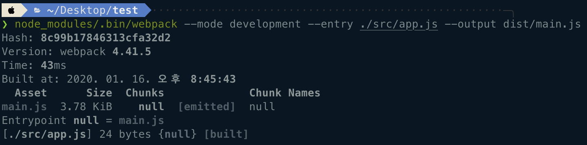
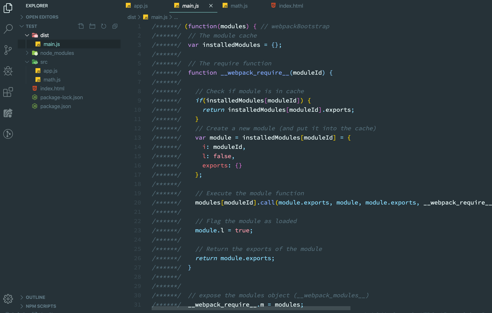
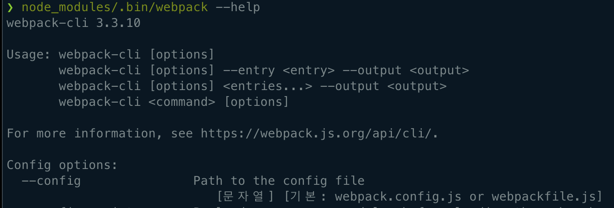

# WebPack - 기본

------------

[김정환 개발자님의 블로그](http://jeonghwan-kim.github.io) 글을 재구성&추가한 글 입니다.

---------

### 1. 배경

* ES2015 이전 - `import`/`export` 구문이 없었던 모듈 이전 상황

  * ./src/math.js:
  
    ```javascript
    function sum(a, b) {
      return a+b;
    }
    ```
    
    * 전역 공간에 sum이 노출
    
  * ./src/app.js:
  
    ```javascript
    console.log(sum(1, 2)); //3
    ```
  
  * 위 코드는 모두 하나의 `html` 파일 안에서 로딩해야만 실행 됨
  
    * ./index.html
  
      ```html
      <body>
      		<script src="./src/math.js"></script>
      		<script src="./src/app.js"></script>
      </body>
      ```
  
      
  
      * `math.js` 가 로딩 되면 `app.js` 는 이름 공간에서 `sum` 을 찾은 뒤 실행
      * `sum` 이 전역 공간에 노출되며 다른 파일에서도 같은 이름을 사용한다면 충돌 한다.
  
    * ./src/math2.js
  
      ```javascript
      function sum(a, b){
        return a+b+1;
      }
      ```
  
    * ./index.html
  
      ```html
      <body>
      		<script src="./src/math.js"></script>
        	<script src="./src/math2.js"></script>
      		<script src="./src/app.js"></script>
      </body>
      ```
  
    * console
  
      ```
      4
      4
      ```
  
      * `math2.js` 에서 작성된 `sum` 함수( `a+b+1`)의 결과인 `4`만 두번 출력 된다


##### 1.1 IIFE (Immediately Invoked Function Expression) 방식의 모듈

* 전역 공간의 충돌 문제를 해결하기 위해 `스코프` 를 사용

  * 외부에서 안으로 접근하지 못하도록 공간을 격리


* `스코프` 안에서는 자신만의 `Namespace (이름공간)` 이 존재하므로 스코프 외부와 이름 충돌을 막을 수 있음
* `Namespace` - 개체를 구분할 수 있는 범위를 나타내는 말로 일반적으로 하나의 이름 공간에서는 하나의 이름이 단 하나의 개체만을 가르키게 됨


* ./src/math.js:

  ```javascript
  var math = math || {}; // math Namespace ; 전역함수
  
  (function() {
    function sum(a, b) {
      return a+b;
    }
    math.sum = sum; // Namespace에 추가
  })();
  ```

* ./src/math2.js:
  
  ```javascript
  function sum(a, b) {
  	return a + b + 1;
  }
  ```
  
* ./src/app.js:

  ```javascript
  console.log(math.sum(1, 2));
  console.log(sum(1, 2));
  ```

* ./index.html

  ```html
  <body>
  		<script src="./src/math.js"></script>
    	<script src="./src/math2.js"></script>
  		<script src="./src/app.js"></script>
  </body>
  ```

* console

  ```
  3
  4
  ```

  * `math.js` 와 `math2.js` 의 `sum` 함수가 각각 호출 된다 


* Javascript  스코프의 특징
  * 같은 코드를 즉시실행함수로 감싸서 다른 파일에서 이 안으로 접근 할수 없음
  * `sum` 은 `Immediately-invoked Function` (즉시 실행 함수) 안에 감추어졌기 때문에 외부에서는 같은 이름을 사용 할 수 있다.
    * 즉시 실행 함수
      * 즉시 실행 함수는 함수를 정의하고 바로 실행하여 함수를 정의하고, 변수에 함수를 저장하고 실행하는 과정을 거치지 않음
      * `함수를 정의하자마자 바로 호출`


##### 1.2 다양한 모듈 스펙

* `CommonJS` / `AMD` / `UMD`  - 자바스크립트 모듈을 구현하는 대표적인 프로젝트

  * `CommonJS` 는 자바스크립트를 사용하는 모든 환경에서 모듈을 하는것이 목표

    * `export` 키워드로 모듈을 만들고 `require()` 함수로 불러들임

    * 대표적으로 `Nodejs` 에서 사용

    * ./src/math.js:

      ```javascript
      exports function sum(a, b){
        return a+b;
      }
      ```

    * ./src/app.js:

      ```javascript
      const sum = require('./math.js');
      sum(1, 2);
      ```
      
    
  *  `AMD`(Asynchronous Module Definition)

     * 비동기로 로딩되는 환경에서 모듈을 사용하는 것이 목표
     * 주로 브라우저 환경

  *  `UMD` (Universal Module Definition) 

     * `AMD` 기반으로 `CommonJS` 방식으로 지원하는 통합 형태


* ES2015 표준 모델 시스템`

  * 현재는 `바벨` 과 `웹팩` 을 이용해 모듈시스템을 사용하는것이 일반적

  * ./src/math.js:

    ```javascript
    export function sum(a, b){
      return a+b;
    }
    ```

  * ./src/app.js:

    ```javascript
    import * as math from './math.js';
    math.sum(1, 2)
    ```

  * `export` 구문으로 모듈을 만들고 `import` 구문으로 받아올 수 있다


##### 1.3 브라우저의 모듈 지원

* 대표적으로 익스플로러를 포함한 몇몇 브라우저에서는 여전히 모듈을 사용하지 못한다.

* 모듈 시스템을 지원하는 대표적 브라우저 `크롬` 의 사용방식

  * ./index.html:

    ```html
    <script type="module" src="app.js"></script>
    ```


### 2. 엔트리 / 아웃풋

* `Webpack` 은 여러개 파일을 하나의 파일로 합쳐주는 `Bundler`(번들러) 이다
* `Entry point`(하나의 시작점) 으로 부터 의존적인 모듈을 전부 찾아내서 하나의 결과물을 만들어 낸다
* app.js 부터 math.js 파일을 찾은 뒤 하나의 파일로 만드는 방식


##### 2.1 웹팩 설치

* `Bundle` 작업을 하는 `Webpack package` 와 `Webpack teminer tool` 인 `webpack-clil` 를 설치한다

  * `Bundle` - 분리되어있는 JavaScript 소스코드를 `하나의 소스 코드로 만듬`

  ```bash
  $ npm install -D webpack webpack-cli
  ```


* 설치가 완료되면 `node_module/.bin` 폴더에 실행 가능한 명령어가 생성 된다

  ```bash
  $ node_modules/.bin/webpack --help
  
    --mode                 Enable production optimizations or development hints.
                                       [선택: "development", "production", "none"]
    --entry      The entry point(s) of the compilation.                   [문자열]
    --output, -o                  The output path and file for compilation assets
    ....
  ```


* `--mode`, `--entry`, `--output` 세 개의 옵션으로 번들링 할 수 있다.

  ```bash
  $ node_modules/.bin/webpack --mode development --entry ./src/app.js --output dist/main.js 
  ```

  * `--mode` : 웹팩의 실행 모드 설정, 개발 버전인 `develpment`를 지정한다
  * `--entry` : 시작점 경로를 지정하는 옵션
  * `--output` : 번들링 결과물을 위치할 경로


* 명령어의 결과로 `./dist/main.js` 에 번들된 결과가 저장됨

  

  


* `main.js` 를 `index.html` 에 로드

  * ./index.html

    ```html
    <script src="dist/main.js"></script>
    ```

  * console

    ```
    3
    ```


##### 2.2 웹팩 설정

* `config`

  

  * 웹팩의 설정 파일의 기본 파일명은 `webpack.config.js` 혹은 `webpackfile.js` 이다


* ./webpack.config.js:

  ```javascript
  const path = require('path');
  
  module.exports = {
    mode: 'development',
    entry: {
      main: './src/app.js'
    },
    output: {
      filename: '[name].js',
      path: path.resolve('./dist'),
    },
  }
  ```

  * 터미널에서 사용한 옵션인 `mode`, `entry`, `output`
    * mode : development
    * entry : 어플리케이션 진입점인 `src/app.js` 로 설정
    * output : `[name]` 은 entry에 추가한 main이 문자열로 들어온다
      * `output.path`는 절대 경로를 사용하기 때문에 `path` 모듈의 `resolve()` 함수를 사용해서 계산
      * `path` : `node core module` 중 하나로 경로를 처리하는 기능을 제공


* 웹팩 실행을 위한 `NPM 커스텀 명령어` 를 추가

  * package.json:

    ```javascript
    {
      "scripts": {
        "build": "./node_modules/.bin/webpack"
      }
    }
    ```

    * `scripts` 에 추가한 `build` 명령어로 `bundling` 이 가능해 진다.
      * `build` 명령어는 `webpack` 의 기본 명령어가 아니때문에 `npm run build` 로 실행 시킨다.


