# WebPack - Loader

------------

[김정환 개발자님의 블로그](http://jeonghwan-kim.github.io) 글을 재구성&추가한 글 입니다.

---------

### 1. 로더

##### 1.1 로더의 역할

* `webpack` 은  모든 파일을 모듈로 본다

  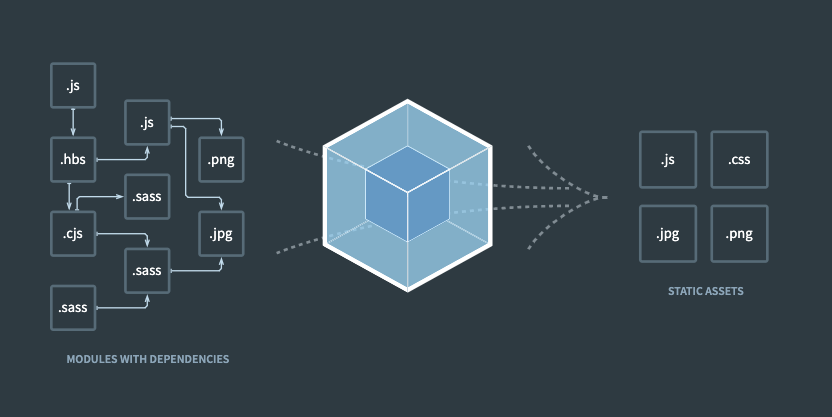


* `Loader` (로더)
  * 로더는 타입스크립트 같은 다른 언어를 자바 스크립트 문법으로 변환해 주거나 이미지를 `data URL`  형식의 문자열로 변환한다.
  * 자바스크립트로 만든 모듈 뿐 만 아니라 스타일시트, 이미지, 폰트까지도 전부 모듈로 보기 때문에 `import` 구문을 사용하면 자바스크립트 코드 안으로 가져올수 있다.
  * `CSS` 파일을 자바스크립트에서 직접 로딩 할수 있도록 해 준다.


##### 1.2 커스텀로더 만들기

* ./myloader.js:

  ```javascript
  module.exports = function myloader (content) {
    console.log('myloader가 동작함');
    return content;
  };
  ```

  * 로더가 읽은 파일의 내용이 함수 인자 `content` 로 전달


* ./webpack.config.js:

  ```javascript
  module: {
    rules: [{
      test: /\.js$/, // .js 확장자로 끝나는 모든 파일
      use: [path.resolve('./myloader.js')] // 방금 만든 로더를 적용한다 
    }],
  }
  ```

  * 로더를 사용하기 위해 웹팩의 설정파일의 `module` 에 추가
    * `module.rules` 배열에 `test`, `use` 객체로 구성된 모듈을 추가함
      * `test`
        * 로딩에 적용할 파일을 지정
        * 파일 패턴을 정규표현식으로 지정할수 있는데 위의 코드는 `.js` 확장자를 갖는 모든 파일을 처리하겠다는 의미
      * `use`
        * 설정한 패턴에 적용 할 로더를 설정

* 로더 실행

  ```bash
  npm run build
  ```

  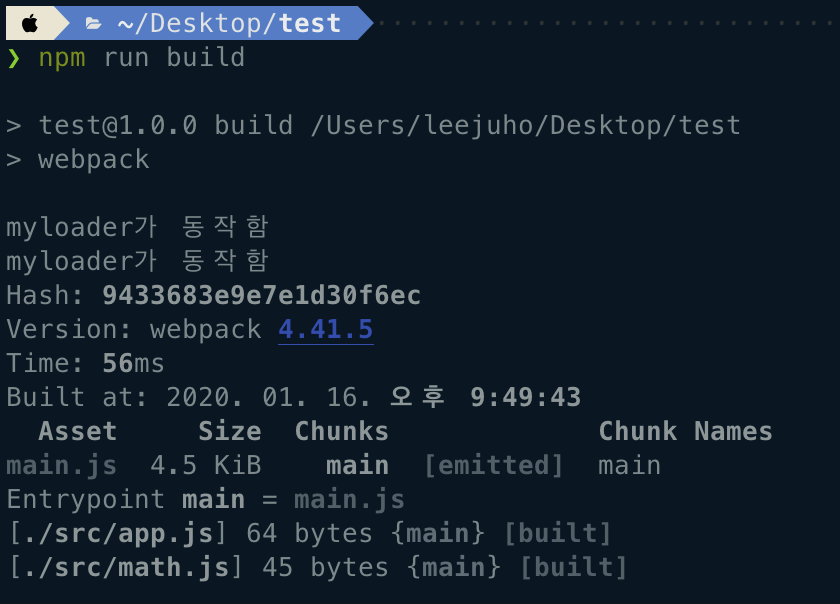

  * 각각의 파일이 load 될 때 loader 가 동작
    * app.js load - loader 동작 - "myloader가 동작함" 출력
    * math.js load - loader 동작 - "myloader가 동작함" 출력


### 2. 자주 사용되는 로더

##### 2.1 css-loader

* `css-loader` 를 사용하면 `css 파일` 을 모듈로 변환하여 자바스크립트에서 불러와 사용 할 수 있다.


* 설치

  ```bash
  $ npm install -D css-loader
  ```


* 웹팩 설정에 로더 추가

  * ./webpack.config.js:

    ```javascript
    module.exports = {
      module: {
        rules: [{
          test: /\.css$/, // .css 확장자로 끝나는 모든 파일 
          use: ['css-loader'], // css-loader를 적용한다 
        }]
      }
    }
    ```

    * 웹팩은 엔트리 포인트로부터 시작하여 모듈을 검색하다가 css 파일을 찾으면 css-loader로 처리하게 된다.

  * ./src/app.js:

    ```java
    import './style.css'
    ```

  * ./src/style.css:

    ```css
    body {
      background-color: green;
    }
    ```

    

* 빌드 결과

  * 터미널

    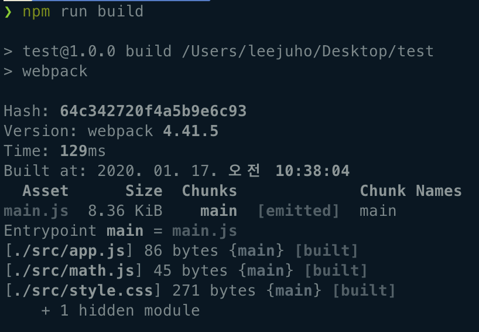

  * ./dist/main.js - 빌드 결과

    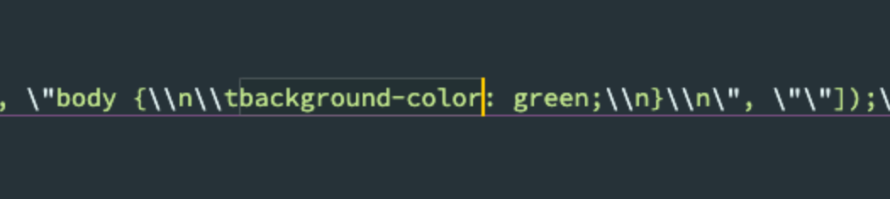


##### 2.2 style-loader

* `css-loader` 를 통해 모듈로 변경된 스타일 시트는 돔에 추가되어야만 브라우저가 해석 할 수 있다.
  * `css-loader` 로 처리하면 자바스크립트 코드로만 변경되었을 뿐, 돔에 적용되지 않았기 때문에 스타일시트가 적용되지 않았다.
* `style-loader` 는 자바스크립트로 변경된 스타일스트를 동적으로 돔에 추가하는 로더이다.
* `CSS` 를 번들링 하기 위해서는 `css-loader` 와 `style-loader` 를 함께 사용해야 한다.


* 설치

  ```bash
  $ npm install -D style-loader
  ```


* 웹팩설정에 로더 추가

  * ./webpack.config.js:

    ```javascript
    module.exports = {
      module: {
        rules: [{
          test: /\.css$/,
          use: ['style-loader', 'css-loader'], 
        }]
      }
    }
    ```

    * `style-loader`를 `css-loader` 앞에 추가한다
      * 로더가 뒤에서 앞의 순서로 실행이 된다.

* 빌드 결과

  * 터미널

    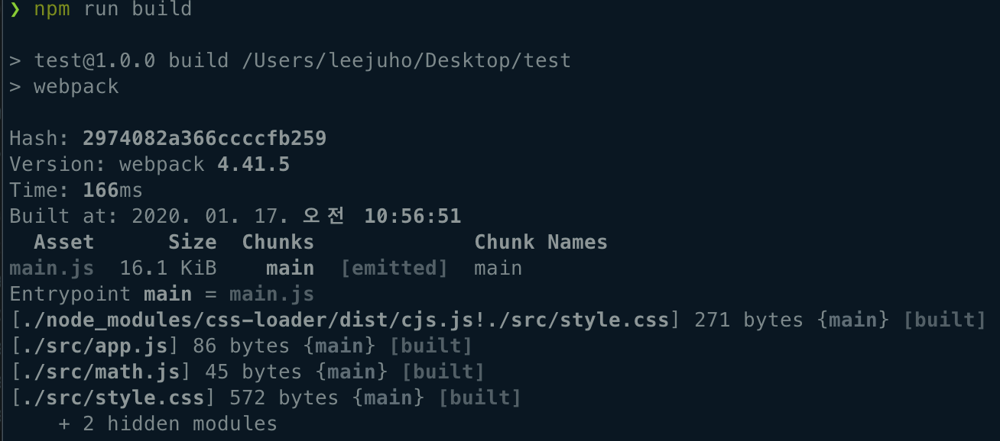

  * 결과

    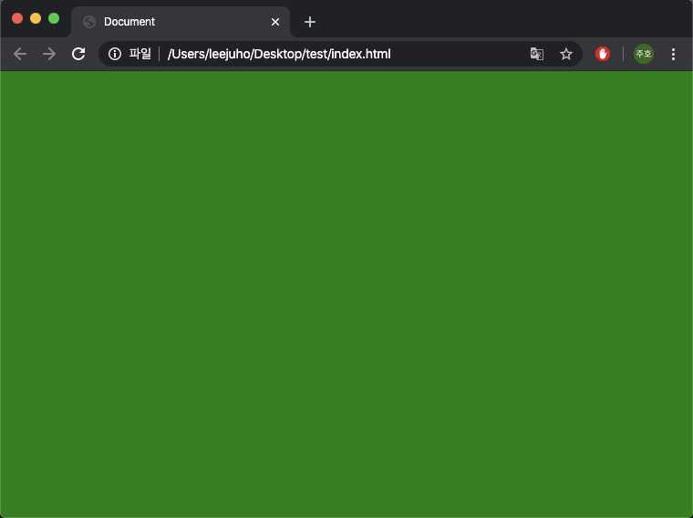

    

##### 2.3 file-loader

* `CSS` 뿐 만 아니라 소스코드에서 사용하는 모든 `file` 을 모듈로 사용 할 수 있다.
* 파일을 모듈 형태로 지원하고 `webpack output`에 파일을 옮겨 주는것이 `file-loader` 가 하는 일이다.
  * `CSS` 에서 `url()` 함수에 이미지 파일 경로를 지정 할 수 있는데, 웹팩은 `file-loader` 를 이용해서 처리한다.


* 설치

  ```bash
  $ npm install -D file-loader
  ```

  


* ./src/style.css:

  ```css
  body {
    background-image: url(./img/bg.jpg);
  }
  ```

  * 배경 이미지를 지정 하였다,
  * 웹팩에서 엔트리 포인트로 설정한 `app.js` 가 로딩하는 `style.css` 파일을 읽어 온다.
  * `url()` 함수로 `bg.png` 를 사용하는데 이때 로더를 동작 시킨다.


* ./webpack.config.js:

  ```javascript
  module.export = {
    module: {
      rules: [{
        test: /\.jpg$/, // .jpg 확장자로 마치는 모든 파일
        loader: 'file-loader', // 파일 로더를 적용한다
      }]
    }
  }
  ```

  

* 빌드 결과

  * 터미널

    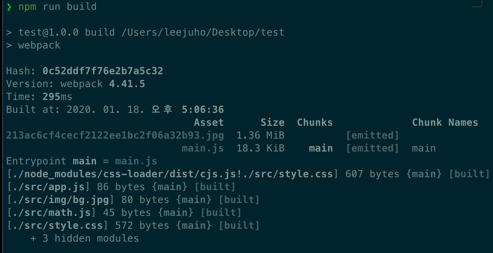

    * 웹팩이 `.png` 파일을 발견하면 `file-loader` 를 실행

    * 로더가 동작하고 나면 output에 설정한 경로로 이미지 파일을 복사

    * 파일명이 해쉬코드로 변경

      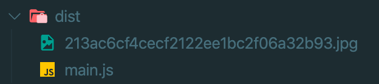

      * 웹팩을 빌드 할 때 마다 `Hash 값`이 변경되면서 output파일 명이 변경된 `Hash 값` 으로 계속 변한다.
      * 캐시 갱신을 위한 처리로 보인다고 한다.

  * 결과

    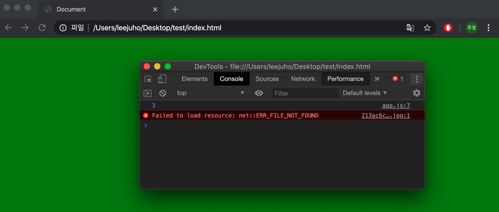

    * `index.html` 파일을 로딩하면 이미지를 제대로 로딩하지 못한다.

    * `CSS` 를 로딩하면

      ```css
      backgroun-image: rul(./img/bg.jpg)
      ```

      코드에 의해 동일 폴더에서 이미지를 찾으려 시도하기 때문에 경로를 바로 잡아주는것이 필요하다.


* ./webpack.config.js - 수정:

  ```javascript
  module.exports = {
    module: {
      rules: [{
        test: /\.jpg$/,
        loader: 'file-loader',
        
      	// options 추가  
        options: {
          publicPath: './dist/', // prefix를 아웃풋 경로로 지정 
          name: '[name].[ext]?[hash]', // 파일명 형식 
        }
      }]
    }
  }
  ```

  * `options` 로 추가 설정
    * `publicPath` 옵션 : `file-loader` 가 처리하는 파일을 모듈로 사용할 때 경로 앞에 추가되는 문자열
      * 파일측에서 사용 될때 `./img/bg.jpg` 를 `./dist/bg.jpg` 로 변경하여 사용
    * `name` 옵션 : 로더가 파일을 아웃풋에 복사할때 사용하는 파일이름을 변경
      * 기본적으로 설정된 해쉬값을 쿼리스트링으로 변경하도록 설정
      * `원본파일명.파일확장자?hash` 형식


* 수정후 빌드 결과

  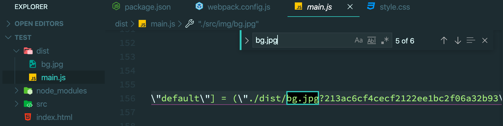


##### 2.4 url-loader

* 사용하는 이미지 갯수가 많다면 `네트워크 리소스 부담`과 `사이트 성능 이슈`가 발생 할수 있다.
* 만약 한 페이지에서 작은 이미지를 여러개 사용한다면 `Data URI Scheme`를 사용하는 방법이 더 낫다.
  * 이미지를 `Base64` 로 인코딩하여 문자열 형태로 소스코드에 넣는 형식
* `url-loader` 는 이러한 처리를 자동화 해준다.


* 설치

  ```bash
  $ npm install -D url-loader
  ```


* ./webpack.config.js:

  ```javascript
  module.exports = {
    module: {
      rules: [{
        test: /\.jpg$/,
        use: {
          loader: 'url-loader', // url 로더를 설정한다
          options: {
            publicPath: './dist/', // file-loader와 동일
            name: '[name].[ext]?[hash]', // file-loader와 동일
            limit: 100000000 // 100Mb 미만 파일만 data url로 처리
          }
        }
      }]
    }
  }
  ```

  * `file-loader`와 설정이 거의 비슷하고 마지막 `limit` 속성만 추가 되었다.
  * 모듈로 사용한 파일중 크기가 `100Mb` 미만 파일만 `url-loader` 를 적용


* 빌드 결과

  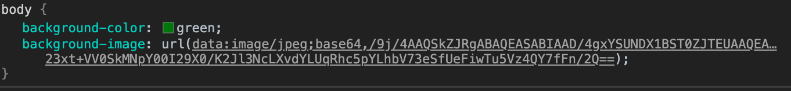

  * 스타일시트에 jpg 데이터가 `Data url` 로 변환되어 있다.
  * 아이콘처럼 용량이 작거나 사용 빈도가 높은 이미지 파일을 그대로 사용하기 보다는 `Data URI Scheme` 를 적용하기 위해 `url-loader`를 사용하는것을 추천

