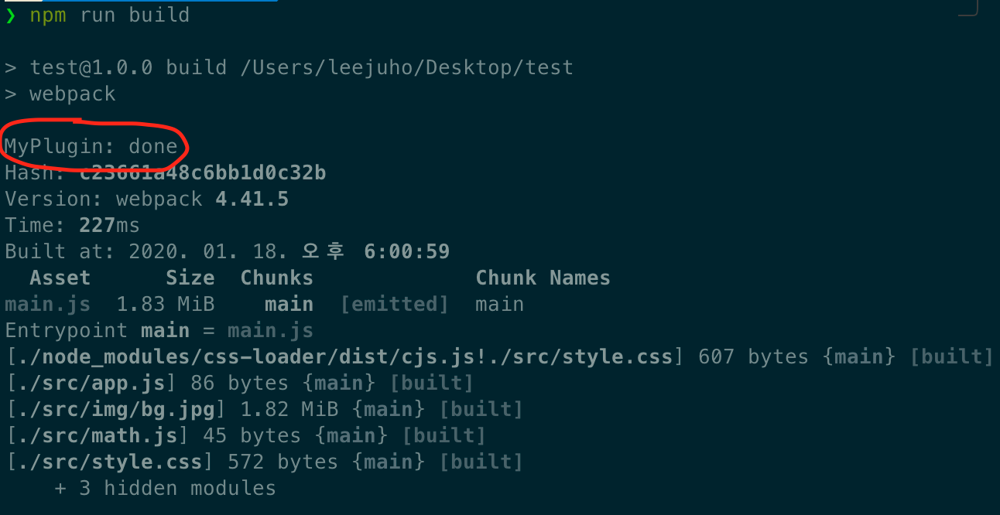
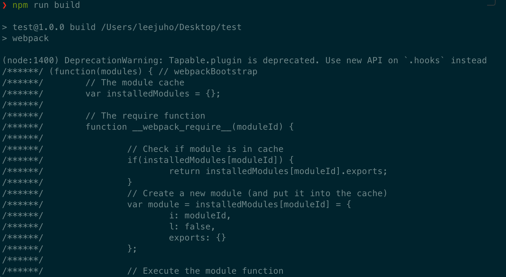
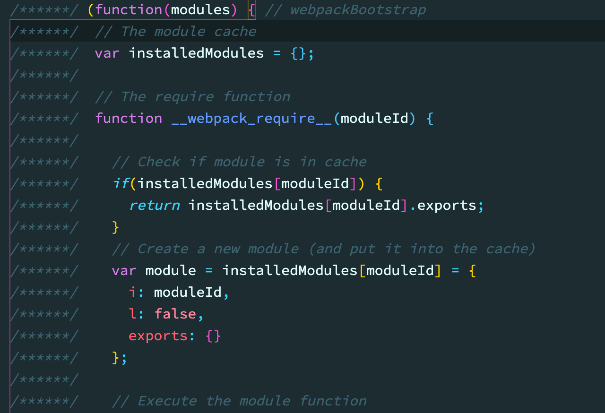
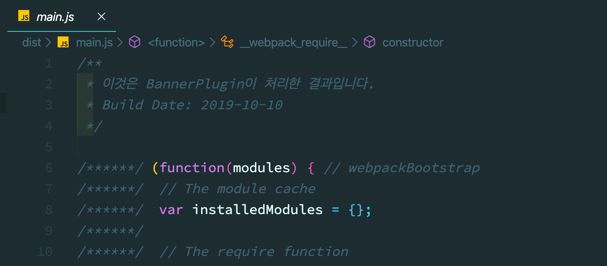
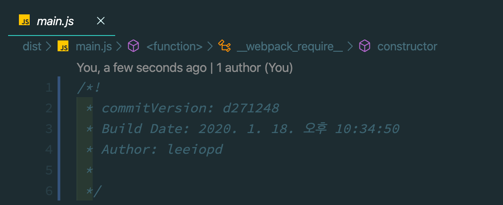
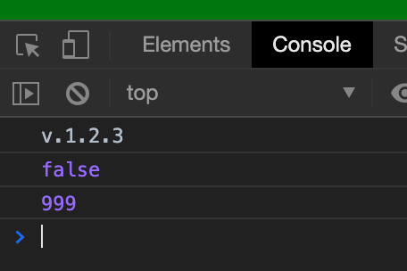
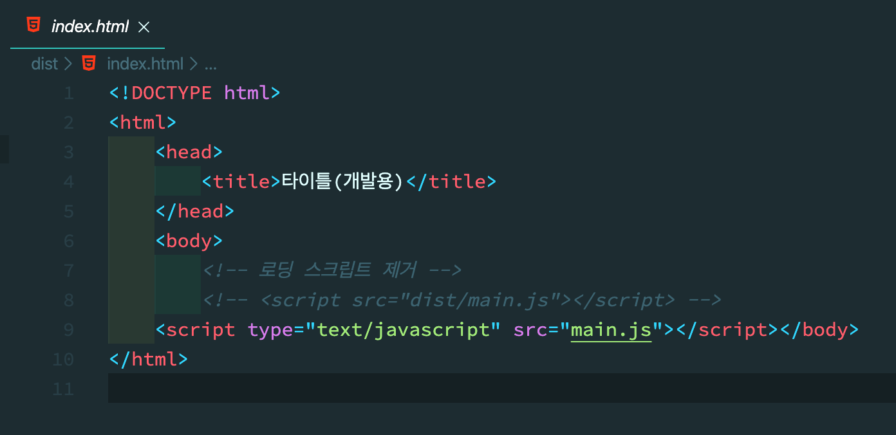
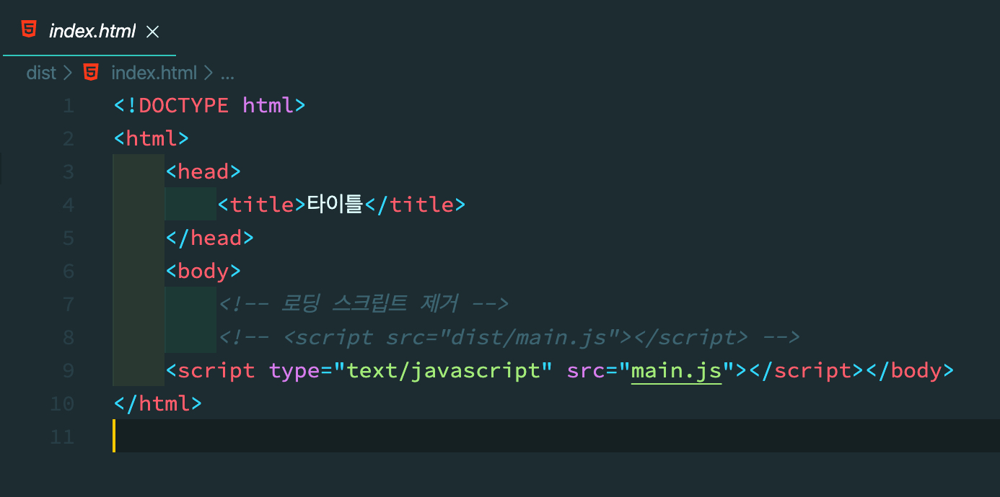
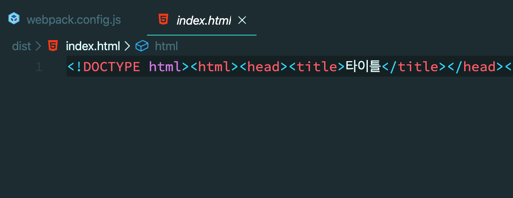
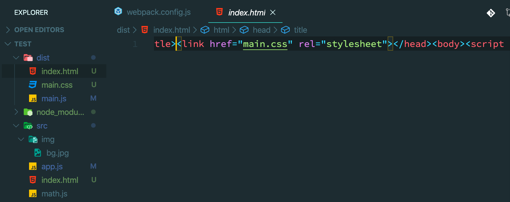

# Webpack - Plugin

------------

[김정환 개발자님의 블로그](http://jeonghwan-kim.github.io) 글을 재구성&추가한 글 입니다.

---------

### 1. Plugin

##### 1.1 플러그인의 역할

* `Loader` 는 번들 시점의 파일 단위로 처리하는 반면 `Plugin` 은 번들된 결과물을 처리한다.
* 번들된 자바 스크립트를 난독화 하거나 특정 텍스트를 추출하는 용도로 사용한다


##### 1.2 커스텀 플러그인 만들기

* 웹팩 문서의 [Writing a plugin](https://webpack.js.org/contribute/writing-a-plugin/) 에서 제공하는 코드로 예제를 작성해 보자
  * ./myplugin.js:

    ```javascript
    class MyPlugin {
      apply(compiler) {
        compiler.hooks.done.tap('My Plugin', stats => {
          console.log('MyPlugin: done');
        })
      }
    }
    
    module.exports = MyPlugin;
    ```

    * `loader` 와 다르게 `plugin` 은 `class`로 정의한다.
    * `apply` 함수를 구현하면 되는데, 이 코드에서는 인자로 받은 `compiler`의 `tap` 함수를 사용 하였다.
    * `plugin` 작업이 완료되는 시점에 로그를 출력한다.

  

  * ./webpack.config.js:

    ```javascript
    const MyPlugin = require('./myplugin');
    
    module.exports = {
      plugins: [
        new MyPlugin(),
      ]
    }
    ```

    * 웹팩 설정 객체의 `plugin` 배열에 설정한다.
    * 클래스로 제공되는 플러그인의 생성자 함수를 실행해서 넘기는 방식

  

  * 빌드결과

    

    * 번들링 결과물인 `main.js` 에 대해 한차례 동작한 것을 확인 할 수 있다.


* 번들 결과에 접근하는 예제

  * ./myplugin.js:

    ```javascript
    class MyPlugin {
      apply(compiler) {
        compiler.hooks.done.tap('My Plugin', stats => {
          console.log('MyPlugin: done');
        })
    
        compiler.plugin('emit', (compilation, callback) => { // compiler.plugin() 함수로 후처리한다
          const source = compilation.assets['main.js'].source();
          console.log(source);
          callback();
        })
      }
    }
    ```

  

  * 빌드 결과

    * `complier.plugin()` 함수의 두번째 인자 콜백함수는 `emit` 이벤트가 발생하면 실행됨

    * `compilation` 객체에 번들된 결과가 존재 하는데 `compliation.assets['main.js'].source()` 함수로 접근 할 수 있다.

    * 빌드 결과인 `main.js`의 소스코드 내용이 터미널에 출력이 된다.

      

      


##### 1.3 배너를 추가하는 플러그인 만들기

* ./myplugin.js:

  ```javascript
  class MyPlugin {
    apply(compiler) {
      compiler.plugin('emit', (compilation, callback) => {
        const source = compilation.assets['main.js'].source();
        compilation.assets['main.js'].source = () => {
          const banner = [
            '/**',
            ' * 이것은 BannerPlugin이 처리한 결과입니다.',
            ' * Build Date: 2019-10-10',
            ' */'
          ].join('\n');
          return banner + '\n\n' + source;
        }
   
        callback();
      })
    }
  }
  ```

  * 배너 문자열과 기존 소스코드를 합친 문자열을 반환하도록 정의


* 빌드 결과

  

  * 빌드 결과 `main.js` 상단네 배너 문구가 입력 되었다,


### 2. 자주 사용하는 플러그인

##### 2.1 Banner Plugin

* 웹팩에서 제공하는 `BannerPlugin` 이다.
* 결과물에 빌드 정보나 커밋 버전같은 것을 추가할 수 있다.


* banner 속성에 문자열을 직접 전달하는 방법

  * webpack.config.js:

    ```javascript
    const webpack = require('webpack');
    
    module.exports = {
      plugins: [
        new webpack.BannerPlugin({
        	// banner 입력  
          //banner: '이것은 배너 입니다',
          
        	// banner 함수로 전달
          // banner: ()=> `빌드 날짜: ${new Data().toLocaleString()}`
        })
      ]
    }
    ```

    


* 파일로 전달하는 방법

  * webpack.conifg.js:

    ```javascript
    const banner = require('./banner.js');
    
    new webpack.BannerPlugin(banner);
    ```

  * banner.js:

    ```javascript
    const childProcess = require('child_process');
    
    module.exports = function banner() {
      const commit = childProcess.execSync('git rev-parse --short HEAD')
      const user = childProcess.execSync('git config user.name')
      const date = new Date().toLocaleString();
      
      return (
        `commitVersion: ${commit}` +
        `Build Date: ${date}\n` +
        `Author: ${user}`
      );
    }
    ```

    

  * 빌드 결과

    


##### 2.2 DefinePlugin

* 같은 소스 코드를 두 환경에 배포하기 위해서는 이러한 환경 의존적인 정보를 소스가 아닌 곳에서 관리하는것이 좋다.
  * 배포할 때마다 코드를 수정하는것이 힘들기 때문
* 웹팩은 이러한 환경 정보를 제공하기 위해 [DefinePlugin](https://webpack.js.org/plugins/define-plugin/)을 제공


* ./webpack.config.js:

  ```javascript
  const webpack = require('webpack');
  
  export default {
    plugins: [
      new webpack.DefinePlugin({
        VERSION: JSON.stringify('v.1.2.3'),
        PRODUCTION: JSON.stringify(false),
        MAX_COUNT: JSON.stringify(999),
      }),
    ]
  }
  ```


* ./app.js:

  ```javascript
  console.log(VERSION) // 'v.1.2.3'
  console.log(PRODUCTION) // true
  console.log(MAX_COUNT) // 999
  ```


* 빌드 결과

  

  * 코드가 아닌 값을 입력하면 `Stirng`으로 변환되어 넘겨진다.
  * 빌드 타임에 결정된 값을 어플리케이션에 전달할 때는 `DefinePlugin`을 사용하자


##### 2.3 HtmlTemplatePlugin

* 서드 파티 패키지
  * `3rd party` : 일반적으로 하드웨어 생산자와 소프트웨어 개발자의 관계를 나타내는 용어로 사용된다.
    * `first party` : 하드웨어 생산자가 직접 소프트웨어를 개발하는 경우 
    * `second party` : 하드웨어 생산자인 모기업과 자사간의 관계에서의 소프트웨어 개발자
    * `third party` 하드웨어 생산자와 직접적인 관계없이 소프트웨어를 개발하는 회사
      * 프로그래밍을 도와주는 `plugin`, `library`, `framework` 등을 만드는 회사를 말한다.


* 패키지 설치

  ```bash
  $ npm install -D html-webpack-plugin
  ```

  * 이 플러그인으로 빌드하면 HTML파일로 아웃풋에 생성된다.


* ./src/index.html:

  ```html
  <!DOCTYPE html>
  <html>
    <head>
      <title>타이틀<%= env %></title>
    </head>
    <body>
      <!-- 로딩 스크립트 제거 -->
      <!-- <script src="dist/main.js"></script> -->
    </body>
  </html>
  ```

  

* ./webpack.config.js:

  ```javascript
  const HtmlWebpackPlugin = require('html-webpack-plugin');
  
  module.exports {
    plugins: [
      new HtmlWebpackPlugin({
        template: './src/index.html', // 템플릿 경로를 지정
        templateParameters: { // 템플리셍 주입할 파라매터 변수 지정
          env: process.env.NODE_ENV === 'development' ? '(개발용)' : '',
        },
      })
    ]
  }
  ```


* 빌드 결과

  * `NODE_ENV=development npm run build` 명령어로 빌드 시

    

  * `NODE_ENV=production npm run build`명령어로 빌드 시

    


* option

  * ./webpack.config.js:

    ```javascript
    new HtmlWebpackPlugin({
      minify: process.env.NODE_ENV ==='production' ? {
        collapseWhitespace: true, // 빈칸 제거
        removeComments: true, // 주석 제거
      } : false,
    }
    ```

    * minify 옵션을 통해 코드를 압출 할 수 있다.

      


##### 2.4 CleanWebpackPlugin

* `CleanWebpackPlugin` : 빌드 이전 결과물을 제거하는 플러그인


* 설치

  ```bash
  $ npm install -D clean-webpack-plugin
  ```


* ./webpack.config.js:

  ```javascript
  const { CleanWebpackPlugin } = require('clean-webpack-plugin');
  
  module.exports = {
    plugins: [
      new CleanWebpackPlugin(),
    ]
  }
  ```

  

##### 2.5 MiniCssExtractPlugin

* 스타일시트가 점점 많아지면 하나의 자바스크립트 결과물로 만드는 것이 부담일 수 있다.
* 번들 결과에서 스타일시트 코드만 뽑아서 별도의 CSS파일로 만들어 역할에 따라 파일을 분리하는 것이 좋다.
* 브라우져에서 큰 파일 하나를 내려받는 것 보다 여러개의 작은 파일을 동시에 다운로드하는 것이 빠르다.


* 설치

  ```bash
  $ npm install -D mini-css-extract-plugin
  ```


* ./webpack.config.js:

  ```javascript
  const MiniCssExtractPlugin = require('mini-css-extract-plugin');
  
  module.exports = {
    plugins: [
      ...(
        process.env.NODE_ENV === 'production' 
        ? [ new MiniCssExtractPlugin({filename: `[name].css`}) ]
        : []
      ),
    ],
  }
  ```

  * filename에 설정 한 값으로 아웃풋 경로에 css파일이 생성됨

  * `css-loader`에 의해 자바스크립트 모듈로 변경된 스타일시트를 적용하기 위해 `style-loader`를 사용

  * 반면 프로덕션 환경에서는 별도의 css 파일으로 추출하는 플러그인을 적용 했으므로 다른 로더가 필요하다

    * ./webpack.config.js:

      ```javascript
      module.exports = {
        module: {
          rules: [{
            test: /\.css$/,
            use: [
              process.env.NODE_ENV === 'production' 
              ? MiniCssExtractPlugin.loader  // 프로덕션 환경
              : 'style-loader',  // 개발 환경
              'css-loader'
            ],
          }]
        }
      }
      ```


* 빌드 결과

  

  * `./dist/main.css` 생성
  * `./dist/index.html` 에 파일을 로딩하는 코드가 추가 되었다.