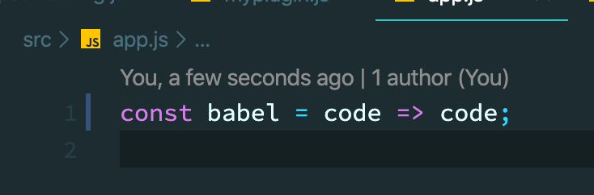
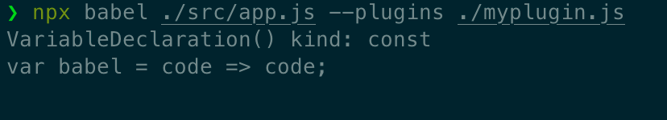

# Babel

------------

[김정환 개발자님의 블로그](http://jeonghwan-kim.github.io) 글을 재구성&추가한 글 입니다.

---------

### 1. 배경

##### 1.1 크로스 브라우징

* 브라우저마다 사용하는 언어가 달라서 프론트엔드 코드는 일관적이지 못할 때가 많다.
* 스팩과 브라우저가 개선되고 있지만, 여전히 인터넷 익스플로러는 `promise()` 이해하지 못한다.
  * 최근 까지만 해도 사파리의 최신 브라우저는  `promise.prototype,finally` 메소드를 사용 할 수 없었다.
* 프론트엔드 개발에서 `크로스 브라우징` 이슈는 코드의 일관성을 해치고 초심자를 불안하게 만든다.
  * 히브리어로 `babel`은 혼돈이란 뜻


* 크로스브라우징의 혼란을 해결해 줄 수 있는 것이 바벨이다.
  * `ECMAStript2015+`로 작성한 코드를 모든 브라우저에서 동작하도록 호환성을 지켜준다.
  * `typescript`, `JSX` 처럼 다른 언어로 분류되는 것도 포함한다.
    * `typescript` : [마이크로소프트](https://namu.wiki/w/마이크로소프트)에서 구현한 [JavaScript](https://namu.wiki/w/JavaScript)의 슈퍼셋(Superset) [프로그래밍 언어](https://namu.wiki/w/프로그래밍 언어). 확장자로는 .ts를 사용하며, 컴파일의 결과물로 JavaScript 파일인 .js를 출력한다. 최종적으로 런타임에서는 이렇게 출력된 JavaScript 코드를 구동시키게 된다.
    * `JSX` : `Javascript XML`, Javascript + XML을 합쳐서 탄생한 기존 자바스크립트의 확장 문법


##### 1.2 트랜스파일과 빌드

* `트랜스 파일` : 변환 전후의 추상화 수준이 다른 빌드와는 달리 트랜스파일은 추상화 수준을 유지한 상태로 코드를 변환한다.
  * 타입스크립트 -> 자바스크립트
  * JSX -> 자바스크립트
* 트랜스 파일 후에도 여전히 코드를 읽을 수 있다.


### 2. 바벨의 기본 동작

* `babel`은 `ECMAScript 2015` 이상의 코드를 적당한 하위버전으로 변환하는 것이 주된 역할이다.
  * `ECMAScript 2015`
    * ECMA스크립트는 Ecma 인터내셔널의 ECMA-262 기술 규격에 정의된 표준화된 스크립트 프로그래밍 언어이다. 
    * 자바스크립트를 표준화하기 위해 만들어졌고 지금도 자바스크립트가 제일 잘 알려져 있지만, 액션스크립트와 J스크립트 등 다른 구현체도 포함하고 있다. 
* 변환된 코드는 `인터넷 익스프로러`나 `구버전 브라우저`처럼 `최신 자바스크립트 코드`를 이해하지 못하는 환경에서도 잘 동작한다.


* 설치

  ```bash
  $ npm install -D @babel/core @babel/cli
  ```

  * `babel` 최신 버전과 함께 `커맨드라인 툴` 도 설치한다.


* 동작

  * `babel`은 세 단계로 빌드를 진행한다.

  1. 파싱(Parsing)
     * 코드를 읽고 `추상 구문 트리 (AST)`로 변환하는 단계
       * 추상구문 : 구문이 추상적이라는 의미는 실제 구문에서 나타나는 모든 세세한 정보를 나타내지는 않는다는 것을 의미
       * 추상 구문 트리
         * 프로그래밍 언어로 작성된 소스 코드의 추상 구문 구조의 트리
         * 트리의 각 노드는 소스코드에서 발생되는 구조체를 나타낸다.
         * 프로그램 분석과 프로그램 변환 시스템에도 사용된다.
  2. 변환(Transforming)
     * 추상구문트리를 변경하는 단계
     * 실제로 코드를 변경
  3. 출력(Printing)
     * 변경된 결과물을 출력

  

  

### 3. 바벨의 플러그인

* babel` 은 파싱과 출력만 담당하고 변환작업은 `plugin`이 처리한다.

  

  

##### 3.1 커스텀 플러그인

* [바벨 홈페이지의 예제코드](https://babeljs.io/docs/en/plugins#plugin-development) 를 통해 동작 원리를 살펴보자


* ./myplguin:js:

  ```javascript
  module.exports = function myplugin() {
    return {
      visitor: {
        VariableDeclaration(path) {
          console.log('VariableDeclaration() kind:', path.node.kind); // const
          
          if (path.node.kind === 'const') {
            path.node.kind = 'var'
          }
        },
      },
    };
  }
  ```

  * 플러그인 형식은 `visitor` 객체를 가진 함수를 반환해야 한다.
  * `path.node.kind` 가 `const` 일 경우 `var`로 변환하는 코드이다.


* 빌드

  ```bash
  $ npx babel ./src/app.js --plugins ./myplugin.js
  ```


* 빌드 결과

  * ./src/app.js:

    

  

  

  * `const` 가 `var`로 변경 되었다. 


##### 3.2 block-scoping 플러그인 사용하기

* `block-scoping plugin` : `const`, `let` 처럼 블록 스코핑을 따르는 예약어를 함수 스코핑을 사용하는 `var`로 변경하는 플러그인


* 설치

  ```bash
  $ npm install -D @babel/plugin-transform-block-scoping
  ```


* 플러그인 사용

  ```bash
  npx babel ./src/app.js --plugins @babel/plugin-transform-block-scoping
  ```

  ​	

  * 커스텀 플러그인과 같은 결과를 보여준다.


### 4. 프리셋

* `ECMAScript 2015+`로 코딩할 때 필요한 플러그인을 일일이 설정하기 힘드므로 목적에 맞게 여러가지 플러그인을 세트로 모아놓은 `프리셋` 을 사용하자.


##### 4.1 커스텀 프리셋

* ./mypreset.js

  ```javascript
  module.exports = function mypreset() {
    return {
      plugins: [
        "@babel/plugin-transform-arrow-functions",
        "@babel/plugin-transform-block-scoping",
        "@babel/plugin-transform-strict-mode",
      ],
    }
  }
  ```

  * 사용할 세개의 `plugin`을 하나의 `preset`으로 작성 하였다.


* ./babel.config.js:

  ```javascript
  module.exports = {
    presets: [
      './mypreset.js'
    ],
  }
  ```

  * `preset`을 사용하기 위하여 `babel.config.js` 파일을 작성


##### 4.2 프리셋 사용하기

* `babel`은 몇가지 `preset`을 제공한다.

  * preset-env
    * `ECMAScript 2015+` 를 변환할 때 사용

    * `babel 7` 이전 버전에는 연도별로 `preset`을 제공 하였지만

      (`babel-reset-es2015, babel-reset-es2016, babel-reset-es2017, babel-reset-latest`)

      지금은 `env` 하나로 통합 되었다.

  * preset-flow : `flow` 를 변환하기 위한 `preset`
  * preset-react : `react`를 변환하기 위한 `preset`
  * preset-typescript : `typescript` 를 변환하기 위한 `preset`


### 5. env 프리셋 설정과 폴리필

* 과거에 제공했던 연도별 `preset`에 비해 `env preset`은 매우 단순하고 직관적인 사용법을 제공한다.


##### 5.1 타겟 브라우저

* `env preset`은 옵션에 브라우저 버전만 지정하면 맞는 `plugin`들을 찾아 최적으 코드로 변환 해 준다.


* ./babel.config.js:

  ```javascript
  module.exports = {
    presets: [
      [
        '@babel/preset-env',
        {
          targets: {
            chrome: '79', // 크롬 79까지 지원하는 코드를 만든다
            ie: '11' // ie 11까지 지원하는 코드를 만든다
          }
        }
      ]
    ]
  }
  ```

  

##### 5.2 폴리필

* `babel`은  `ECMAScript2015+`를 `ECMAScript5` 버전으로 변환할 수 있는 것만 빌드한다.
* 그렇지 못한 것들은 `폴리필`이라고 부르는 코드조각을 추가해서 해결한다.
  * 새로 추가된 전역 객체들 (`promis`, `map`, `set`) 을 사용가능한 객체로 변환 해 준다.
  * `promise()`는 `ECMAScript5` 버전으로 대체할 수 없지만 구현할수 있기 때문에 `폴리필`을 추가하여 변환이 가능하다.


### 6. 웹팩으로 통합

* 실무 환경에서 `babel`을 직접 사용하는 것 보다 `webpack`으로 통합해서 사용하는 것이 일반적
  * `babel-loader` 를 사용한다.


* 설치

  ```bash
  $ npm install -D babel-loader
  ```


* ./webpack.config.js:

  ```javascript
  module.exports = {
    module: {
      rules: [
        {
          test: /\.js$/,
          exclude: /node_modules/,
          loader: 'babel-loader', // 바벨 로더를 추가한다 
        },
      ]
    },
  }
  ```

  * `.js` 확장자로 끝나는 파일을 `babel-loader`가 처리하도록 설정
  * 사용하는  `서드파티 라이브러리`가 많을수록 `babel-loader`가 느리가 동작할 수 있는데, `node-modules`폴더를 로더가 처리하지 않도록 예외처리 하였다.


* 폴리필 사용 설정과 동시에 폴리필을 지원하는 라이브러리 `core-js`도 설치 해야 한다.

  * 웹팩은 `babel-loader`가 만든 아래의 코드를 만나면 `core-js`를 찾게 된다.

    ```javascript
    require("core-js/modules/es6.promise");
    require("core-js/modules/es6.object.to-string");
    ```

  * 설치

    ```bash
    $ npm install core-js@2
    ```

    * 버전 2로 패키지 설치


* 빌드 시 `babel-loader`가 적용되어 빌드 된다.

