```python
%matplotlib inline
import pandas as pd
import matplotlib.pyplot as plt
```


```python
df=pd.read_csv('cluster2.csv')
df
```


<div>
<style scoped>
    .dataframe tbody tr th:only-of-type {
        vertical-align: middle;
    }

    .dataframe tbody tr th {
        vertical-align: top;
    }

    .dataframe thead th {
        text-align: right;
    }
</style>
<table border="1" class="dataframe">
  <thead>
    <tr style="text-align: right;">
      <th></th>
      <th>X</th>
      <th>Y</th>
    </tr>
  </thead>
  <tbody>
    <tr>
      <th>0</th>
      <td>1.070487</td>
      <td>1.328147</td>
    </tr>
    <tr>
      <th>1</th>
      <td>1.072777</td>
      <td>1.191249</td>
    </tr>
    <tr>
      <th>2</th>
      <td>0.328029</td>
      <td>1.261713</td>
    </tr>
    <tr>
      <th>3</th>
      <td>0.600926</td>
      <td>1.254465</td>
    </tr>
    <tr>
      <th>4</th>
      <td>0.759281</td>
      <td>1.284541</td>
    </tr>
    <tr>
      <th>5</th>
      <td>0.398466</td>
      <td>1.140908</td>
    </tr>
    <tr>
      <th>6</th>
      <td>0.232625</td>
      <td>1.361439</td>
    </tr>
    <tr>
      <th>7</th>
      <td>0.868427</td>
      <td>1.226005</td>
    </tr>
    <tr>
      <th>8</th>
      <td>0.397961</td>
      <td>1.241644</td>
    </tr>
    <tr>
      <th>9</th>
      <td>0.973375</td>
      <td>1.309528</td>
    </tr>
    <tr>
      <th>10</th>
      <td>1.160130</td>
      <td>1.134151</td>
    </tr>
    <tr>
      <th>11</th>
      <td>0.369908</td>
      <td>1.288148</td>
    </tr>
    <tr>
      <th>12</th>
      <td>1.191724</td>
      <td>1.251540</td>
    </tr>
    <tr>
      <th>13</th>
      <td>0.341933</td>
      <td>1.178757</td>
    </tr>
    <tr>
      <th>14</th>
      <td>1.249453</td>
      <td>1.184760</td>
    </tr>
    <tr>
      <th>15</th>
      <td>0.126836</td>
      <td>1.298181</td>
    </tr>
    <tr>
      <th>16</th>
      <td>0.280391</td>
      <td>1.176874</td>
    </tr>
    <tr>
      <th>17</th>
      <td>1.125836</td>
      <td>1.116616</td>
    </tr>
    <tr>
      <th>18</th>
      <td>0.200113</td>
      <td>1.289002</td>
    </tr>
    <tr>
      <th>19</th>
      <td>1.143258</td>
      <td>1.203407</td>
    </tr>
    <tr>
      <th>20</th>
      <td>0.193399</td>
      <td>1.332524</td>
    </tr>
    <tr>
      <th>21</th>
      <td>0.405959</td>
      <td>1.199592</td>
    </tr>
    <tr>
      <th>22</th>
      <td>1.075635</td>
      <td>1.373164</td>
    </tr>
    <tr>
      <th>23</th>
      <td>0.211091</td>
      <td>1.140855</td>
    </tr>
    <tr>
      <th>24</th>
      <td>0.109283</td>
      <td>1.286016</td>
    </tr>
    <tr>
      <th>25</th>
      <td>0.450351</td>
      <td>1.192608</td>
    </tr>
    <tr>
      <th>26</th>
      <td>1.239044</td>
      <td>1.348620</td>
    </tr>
    <tr>
      <th>27</th>
      <td>0.571226</td>
      <td>1.258096</td>
    </tr>
    <tr>
      <th>28</th>
      <td>0.605985</td>
      <td>1.229635</td>
    </tr>
    <tr>
      <th>29</th>
      <td>0.279200</td>
      <td>1.269468</td>
    </tr>
    <tr>
      <th>...</th>
      <td>...</td>
      <td>...</td>
    </tr>
    <tr>
      <th>1270</th>
      <td>1.094124</td>
      <td>0.406369</td>
    </tr>
    <tr>
      <th>1271</th>
      <td>0.957801</td>
      <td>0.617764</td>
    </tr>
    <tr>
      <th>1272</th>
      <td>0.958608</td>
      <td>0.016353</td>
    </tr>
    <tr>
      <th>1273</th>
      <td>0.910883</td>
      <td>0.758189</td>
    </tr>
    <tr>
      <th>1274</th>
      <td>1.170527</td>
      <td>0.248875</td>
    </tr>
    <tr>
      <th>1275</th>
      <td>1.184552</td>
      <td>0.626212</td>
    </tr>
    <tr>
      <th>1276</th>
      <td>0.676752</td>
      <td>0.685557</td>
    </tr>
    <tr>
      <th>1277</th>
      <td>1.345954</td>
      <td>0.338506</td>
    </tr>
    <tr>
      <th>1278</th>
      <td>0.933244</td>
      <td>0.476923</td>
    </tr>
    <tr>
      <th>1279</th>
      <td>1.340937</td>
      <td>0.604860</td>
    </tr>
    <tr>
      <th>1280</th>
      <td>1.229089</td>
      <td>0.584225</td>
    </tr>
    <tr>
      <th>1281</th>
      <td>0.580630</td>
      <td>0.611213</td>
    </tr>
    <tr>
      <th>1282</th>
      <td>0.508418</td>
      <td>0.402120</td>
    </tr>
    <tr>
      <th>1283</th>
      <td>1.134348</td>
      <td>0.253721</td>
    </tr>
    <tr>
      <th>1284</th>
      <td>0.632067</td>
      <td>0.490714</td>
    </tr>
    <tr>
      <th>1285</th>
      <td>0.447526</td>
      <td>0.338216</td>
    </tr>
    <tr>
      <th>1286</th>
      <td>0.661927</td>
      <td>0.527832</td>
    </tr>
    <tr>
      <th>1287</th>
      <td>0.626109</td>
      <td>0.525039</td>
    </tr>
    <tr>
      <th>1288</th>
      <td>0.421421</td>
      <td>0.433694</td>
    </tr>
    <tr>
      <th>1289</th>
      <td>1.157110</td>
      <td>0.378026</td>
    </tr>
    <tr>
      <th>1290</th>
      <td>1.172812</td>
      <td>0.708465</td>
    </tr>
    <tr>
      <th>1291</th>
      <td>0.885032</td>
      <td>0.858614</td>
    </tr>
    <tr>
      <th>1292</th>
      <td>1.012151</td>
      <td>0.802079</td>
    </tr>
    <tr>
      <th>1293</th>
      <td>0.977862</td>
      <td>0.342684</td>
    </tr>
    <tr>
      <th>1294</th>
      <td>1.335951</td>
      <td>0.352339</td>
    </tr>
    <tr>
      <th>1295</th>
      <td>0.596249</td>
      <td>0.673827</td>
    </tr>
    <tr>
      <th>1296</th>
      <td>0.698738</td>
      <td>0.720851</td>
    </tr>
    <tr>
      <th>1297</th>
      <td>0.798488</td>
      <td>0.442630</td>
    </tr>
    <tr>
      <th>1298</th>
      <td>0.646165</td>
      <td>0.412275</td>
    </tr>
    <tr>
      <th>1299</th>
      <td>1.245815</td>
      <td>0.799212</td>
    </tr>
  </tbody>
</table>
<p>1300 rows × 2 columns</p>
</div>


```python
X = df.values[:]
X
```


    array([[1.07048688, 1.3281469 ],
           [1.07277723, 1.19124898],
           [0.3280287 , 1.26171275],
           ...,
           [0.79848816, 0.44262997],
           [0.64616521, 0.41227532],
           [1.24581503, 0.7992118 ]])


```python
# set the size of the figure
plt.figure(figsize=(5,5))

# plot the data points
plt.scatter(X[:,0], X[:,1], s=4)

# print the figure
plt.show()
```


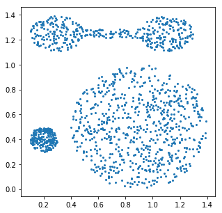


```python
cmap = "tab10"
```


```python
from sklearn.cluster import KMeans
k_means = KMeans(n_clusters=4)
```


```python
y_pred = k_means.fit_predict(X)
print(y_pred[:10])
```

    [1 1 3 3 1 3 3 1 3 1]
    


```python
print(k_means.cluster_centers_)

# 4개의 클러스터들의 센터점이 어디있는지 확인
```

    [[1.03377029 0.43895496]
     [1.01379946 1.15444051]
     [0.37933677 0.43852558]
     [0.34274065 1.2515179 ]]
    


```python
plt.figure(figsize=(5, 5))
plt.scatter(X[:, 0], X[:, 1], s=4, c=y_pred, cmap=cmap)

# 'c' : the color of each point

plt.show()
```


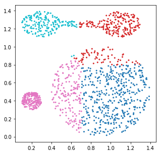


```python
for i, linkage in enumerate(("single", "complete", "average", "ward")):
    for j,n in enumerate((2, 3, 4)):
        clustering = AgglomerativeClustering(linkage = linkage, n_clusters=n)
        y_pred = clustering.fit_predict(X)
        plt.figure(i*3+j,figsize=(5,5))
        plt.scatter(X[:,0], X[:,1], c=y_pred, s=4, cmap=cmap)
        plt.title(linkage)
plt.show()
```


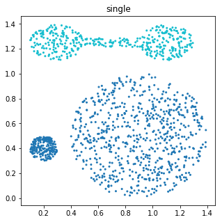


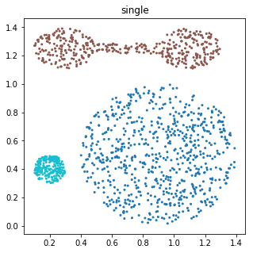


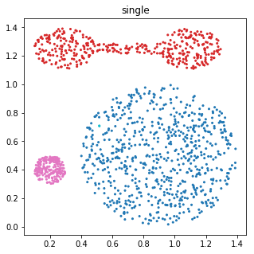


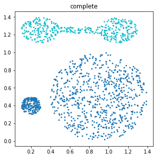


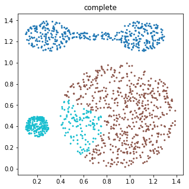


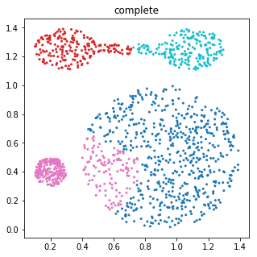


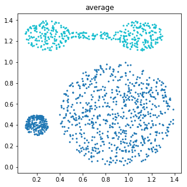


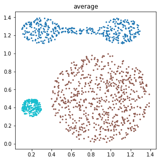


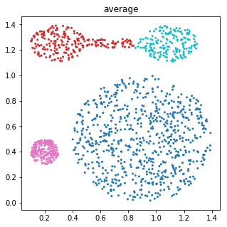


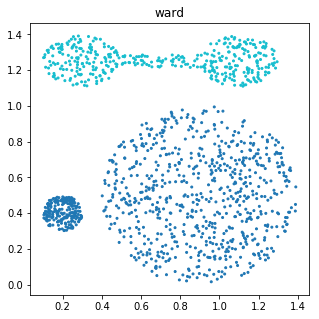


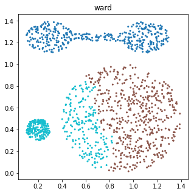


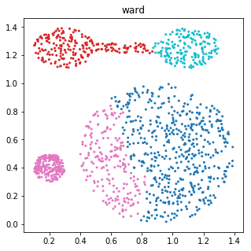


```python
from sklearn.cluster import DBSCAN
```


```python
for i, (eps, min_samples) in enumerate(((0.05, 20), (0.06, 20), (0.06, 15), (0.06, 6))):
    dbscan = DBSCAN(eps=eps, min_samples=min_samples)
    y_pred = dbscan.fit_predict(X)
    plt.figure(i + 1, figsize=(5, 5))
    plt.scatter(X[:, 0], X[:, 1], cmap=cmap, s=4, c=y_pred)
    plt.title("eps: {}, min_samples: {}".format(eps, min_samples))
plt.show()
```


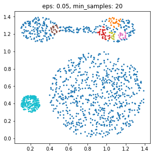


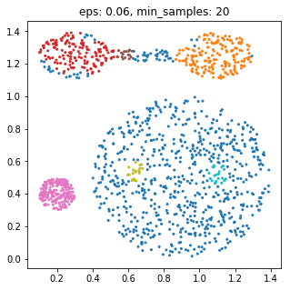


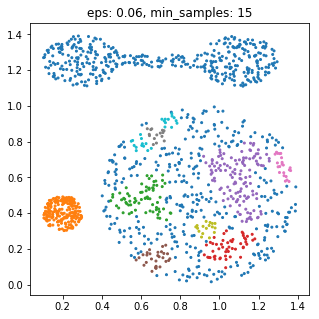


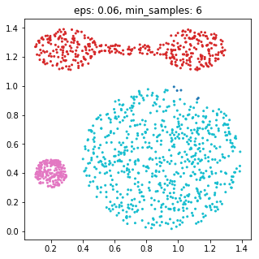


```python
from sklearn.mixture import GaussianMixture
```


```python
em = GaussianMixture(n_components=4, max_iter=20, random_state=0, coveriance_type='tied')
y_pred = em.fit_predict(X)
```


```python
print(em.weights_) # 각 클러스터를 만드는 정규분표가 선택 될 확률
```

    [0.54305501 0.15217282 0.15989176 0.14488041]
    


```python
print(em.covariances_)
```

    [[[ 6.49289207e-02 -4.78095962e-04]
      [-4.78095962e-04  6.03293794e-02]]
    
     [[ 2.73531910e-03 -7.02052996e-05]
      [-7.02052996e-05  2.51901315e-03]]
    
     [[ 3.12803346e-02 -5.83851370e-04]
      [-5.83851370e-04  4.11677639e-03]]
    
     [[ 1.44971509e-02  4.61343042e-04]
      [ 4.61343042e-04  5.12229085e-03]]]
    


```python
em = GaussianMixture(n_components=4, max_iter=20, random_state=0, covariance_type='tied')
y_pred = em.fit_predict(X)
print(em.covariances_)
plt.figure(figsize=(5, 5))
plt.scatter(X[:,0], X[:, 1], c=y_pred, cmap='tab10', s=4)

plt.show()
```

    [[0.03689517 0.01323168]
     [0.01323168 0.03045924]]
    


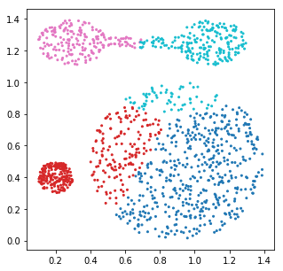


```python
em = GaussianMixture(n_components=4, max_iter=20, random_state=0, covariance_type='full')
y_pred = em.fit_predict(X)
print(em.covariances_)
plt.figure(figsize=(5, 5))
plt.scatter(X[:,0], X[:, 1], c=y_pred, cmap='tab10', s=4)

plt.show()
```

    [[[ 6.49289207e-02 -4.78095962e-04]
      [-4.78095962e-04  6.03293794e-02]]
    
     [[ 2.73531910e-03 -7.02052996e-05]
      [-7.02052996e-05  2.51901315e-03]]
    
     [[ 3.12803346e-02 -5.83851370e-04]
      [-5.83851370e-04  4.11677639e-03]]
    
     [[ 1.44971509e-02  4.61343042e-04]
      [ 4.61343042e-04  5.12229085e-03]]]
    


```python
em = GaussianMixture(n_components=4, max_iter=20, random_state=0, covariance_type='diag')
y_pred = em.fit_predict(X)
print(em.covariances_)
plt.figure(figsize=(5, 5))
plt.scatter(X[:,0], X[:, 1], c=y_pred, cmap='tab10', s=4)

plt.show()
```

    [[0.06491467 0.06045322]
     [0.00273578 0.0025189 ]
     [0.026099   0.00425443]
     [0.01748438 0.00493127]]
    


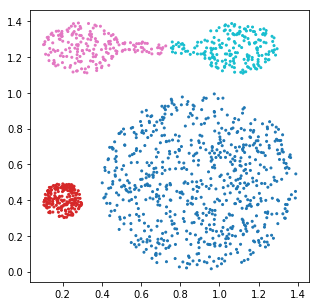


```python
em = GaussianMixture(n_components=4, max_iter=20, random_state=0, covariance_type='spherical')
y_pred = em.fit_predict(X)
print(em.covariances_)
plt.figure(figsize=(5, 5))
plt.scatter(X[:,0], X[:, 1], c=y_pred, cmap='tab10', s=4)

plt.show()
```

    [0.06504542 0.0026261  0.0122968  0.01240278]
    


```python
# 정리
# PLS 모델 : 문서 작성 시 단어를 선택하는 과정을 모델링하는 것
#            토픽에 따른 단어 결정을 반복하는 과정으로 가정
```
